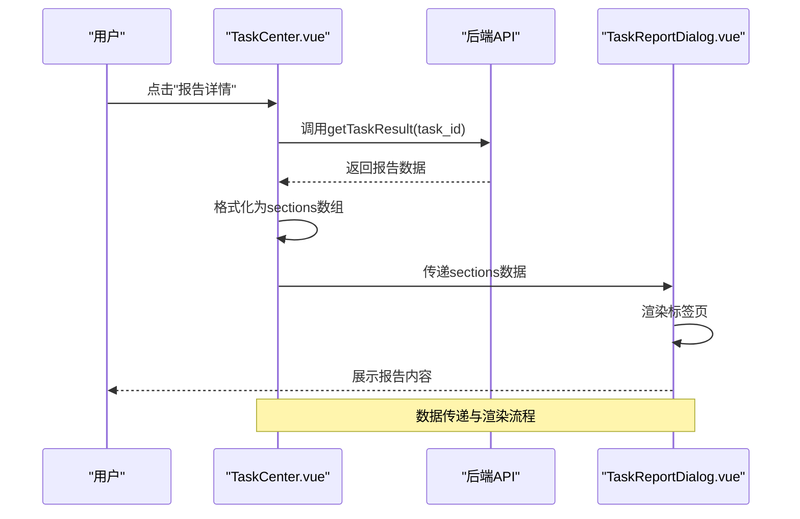
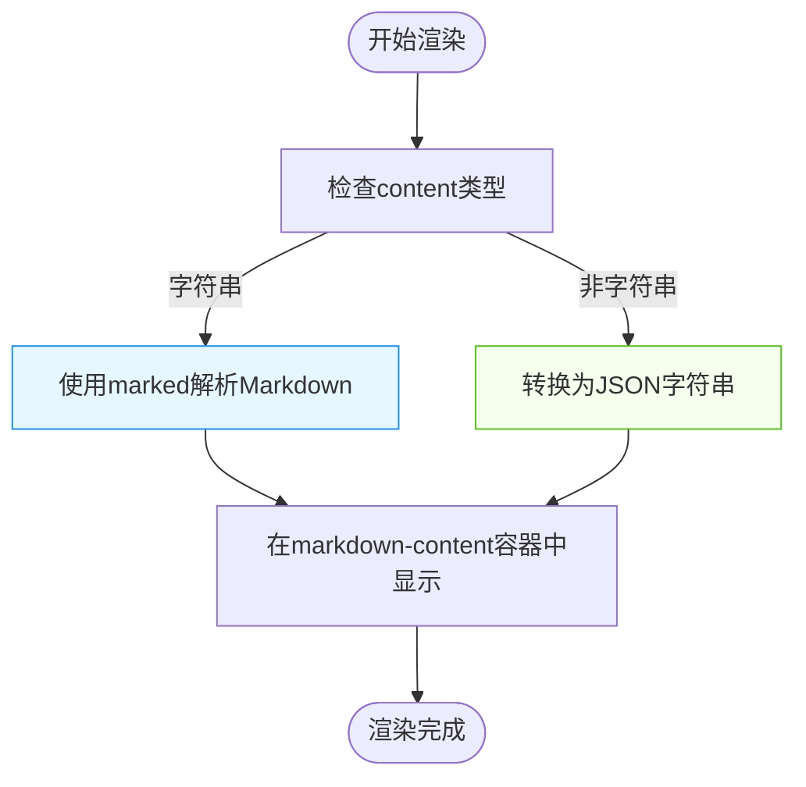
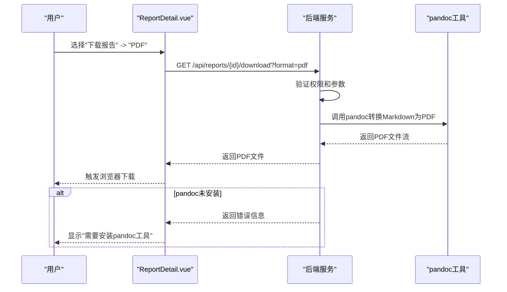
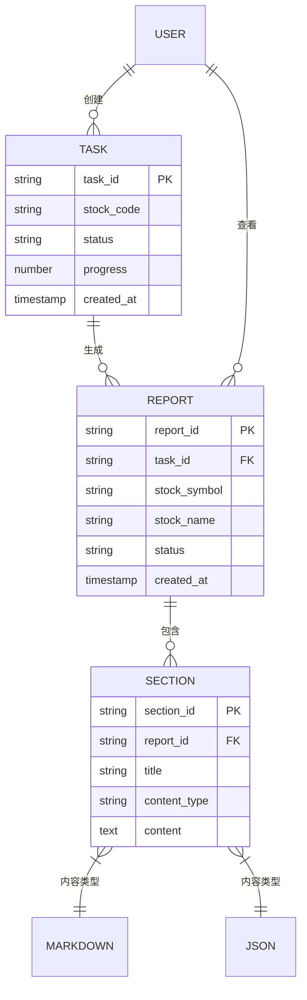
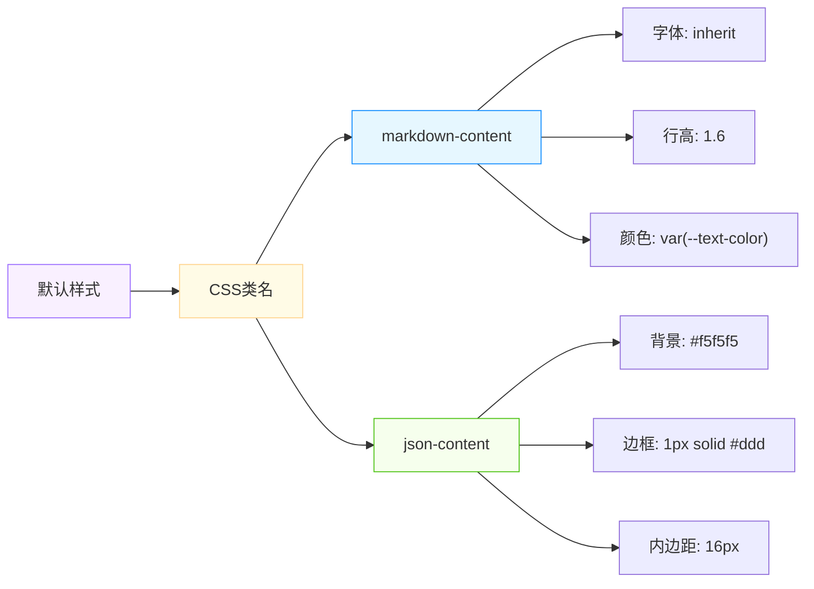
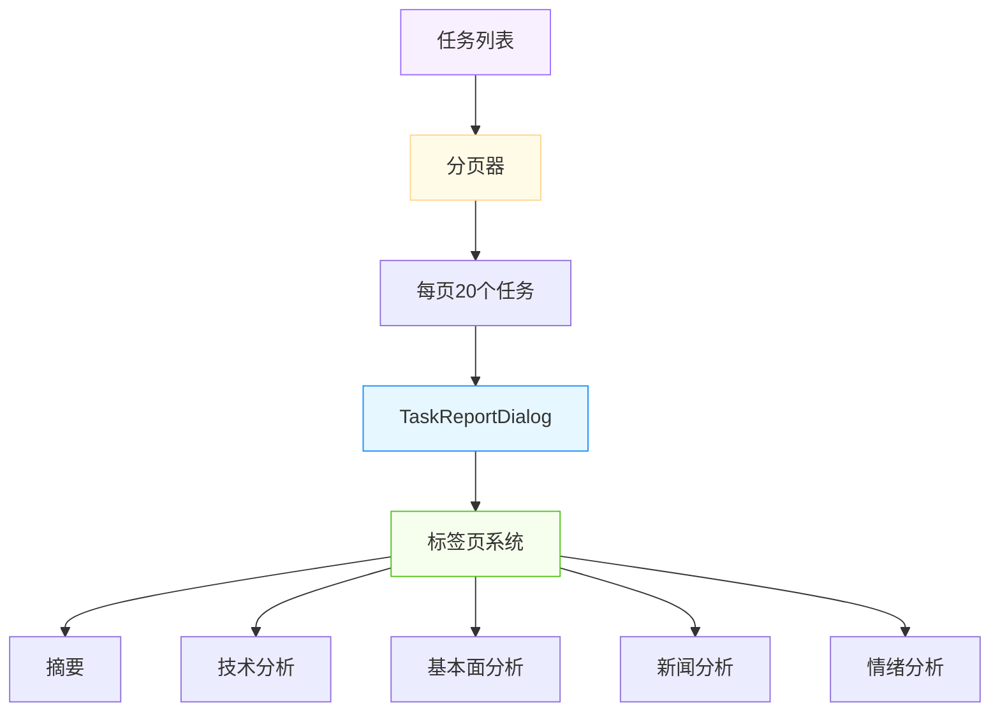

# 任务报告对话框

<cite>
**本文档引用的文件**   
- [TaskReportDialog.vue](file://frontend/src/components/Global/TaskReportDialog.vue)
- [TaskCenter.vue](file://frontend/src/views/Tasks/TaskCenter.vue)
- [Queue/index.vue](file://frontend/src/views/Queue/index.vue)
- [ReportDetail.vue](file://frontend/src/views/Reports/ReportDetail.vue)
</cite>

## 目录
1. [简介](#简介)
2. [组件结构与实现](#组件结构与实现)
3. [数据传递与解析机制](#数据传递与解析机制)
4. [内容展示与渲染](#内容展示与渲染)
5. [PDF导出功能集成](#pdf导出功能集成)
6. [使用场景示例](#使用场景示例)
7. [样式与布局自定义](#样式与布局自定义)
8. [分页与大数据处理策略](#分页与大数据处理策略)
9. [结论](#结论)

## 简介
`TaskReportDialog` 是一个用于展示任务分析报告的对话框组件，主要在任务中心和队列管理界面中使用。该组件通过 `sections` 属性接收分析报告数据，并将其以标签页的形式展示，支持 Markdown 和 JSON 两种内容格式的渲染。组件具备良好的可扩展性，能够处理不同类型的报告内容，并支持与系统其他功能（如PDF导出）的集成。

**Section sources**
- [TaskReportDialog.vue](file://frontend/src/components/Global/TaskReportDialog.vue#L1-L30)

## 组件结构与实现
`TaskReportDialog` 组件基于 Element Plus 的 `el-dialog` 和 `el-tabs` 构建，采用 Vue 3 的 `<script setup>` 语法糖实现。组件的核心结构包括一个对话框容器、一个标签页系统和一个底部操作按钮。

组件通过 `defineProps` 接收两个属性：`modelValue` 用于控制对话框的显示与隐藏，`sections` 用于接收报告数据。通过 `computed` 属性 `visible` 实现了 `v-model` 的双向绑定。标签页的激活状态由 `active` 响应式变量管理。

```mermaid
classDiagram
class TaskReportDialog {
+modelValue : boolean
+sections : Array<{ key? : string; title : string; content : any }>
-visible : computed
-active : ref
+renderMarkdown(s : string) : string
}
TaskReportDialog --> el-dialog : "使用"
TaskReportDialog --> el-tabs : "使用"
TaskReportDialog --> marked : "使用"
```

**Diagram sources**
- [TaskReportDialog.vue](file://frontend/src/components/Global/TaskReportDialog.vue#L1-L30)

**Section sources**
- [TaskReportDialog.vue](file://frontend/src/components/Global/TaskReportDialog.vue#L1-L30)

## 数据传递与解析机制
`TaskReportDialog` 组件通过 `sections` prop 接收报告数据，该数据结构为一个对象数组，每个对象包含三个属性：`key`（可选，用于唯一标识）、`title`（标签页标题）和 `content`（报告内容）。

在 `TaskCenter.vue` 和 `Queue/index.vue` 中，`reportSections` 被定义为一个响应式数组，用于存储从后端获取的报告数据。当用户点击“报告详情”按钮时，系统会通过 API 获取完整的报告数据，并将其格式化为 `sections` 数组，然后传递给 `TaskReportDialog` 组件。



**Diagram sources**
- [TaskCenter.vue](file://frontend/src/views/Tasks/TaskCenter.vue#L324-L365)
- [Queue/index.vue](file://frontend/src/views/Queue/index.vue#L233-L349)

**Section sources**
- [TaskReportDialog.vue](file://frontend/src/components/Global/TaskReportDialog.vue#L22-L23)
- [TaskCenter.vue](file://frontend/src/views/Tasks/TaskCenter.vue#L324-L325)
- [Queue/index.vue](file://frontend/src/views/Queue/index.vue#L233-L234)

## 内容展示与渲染
`TaskReportDialog` 组件根据 `content` 属性的数据类型采用不同的渲染策略。如果 `content` 是字符串类型，则使用 `marked` 库将其解析为 HTML 并通过 `v-html` 指令渲染，从而支持 Markdown 格式的富文本展示。如果 `content` 是对象或数组等非字符串类型，则将其转换为格式化的 JSON 字符串并显示在 `<pre>` 标签中。

组件通过 `renderMarkdown` 方法封装了 Markdown 解析逻辑，并设置了 `breaks: true` 和 `gfm: true` 选项，以支持换行符和 GitHub 风格的 Markdown 语法。该方法还包含了异常处理机制，当解析失败时会直接返回原始字符串，确保组件的健壮性。



**Diagram sources**
- [TaskReportDialog.vue](file://frontend/src/components/Global/TaskReportDialog.vue#L6-L7)
- [TaskReportDialog.vue](file://frontend/src/components/Global/TaskReportDialog.vue#L26-L27)

**Section sources**
- [TaskReportDialog.vue](file://frontend/src/components/Global/TaskReportDialog.vue#L6-L8)
- [TaskReportDialog.vue](file://frontend/src/components/Global/TaskReportDialog.vue#L26-L27)

## PDF导出功能集成
虽然 `TaskReportDialog` 组件本身不直接提供 PDF 导出功能，但它与系统的报告导出功能紧密集成。在 `ReportDetail.vue` 组件中，用户可以通过下拉菜单选择将报告导出为 PDF、Word、Markdown 或 JSON 格式。

PDF 导出功能依赖于后端的 `pandoc` 工具。当用户选择导出 PDF 时，前端会向 `/api/reports/{reportId}/download?format=pdf` 发起请求，后端使用 `pandoc` 将 Markdown 格式的报告转换为 PDF 文件并返回给前端下载。如果系统未安装 `pandoc`，则会提示用户需要安装该工具。



**Diagram sources**
- [ReportDetail.vue](file://frontend/src/views/Reports/ReportDetail.vue#L48-L68)
- [ReportDetail.vue](file://frontend/src/views/Reports/ReportDetail.vue#L359-L408)

**Section sources**
- [ReportDetail.vue](file://frontend/src/views/Reports/ReportDetail.vue#L48-L68)

## 使用场景示例
`TaskReportDialog` 组件主要在以下场景中使用：

1. **批量分析完成**：在任务中心，当一批股票分析任务完成后，用户可以点击任一任务的“报告详情”按钮，查看详细的分析报告。
2. **单个分析任务结束**：在队列管理界面，当单个分析任务状态变为“已完成”时，用户可以查看其报告内容。
3. **错误排查**：当任务失败时，用户可以通过报告对话框查看详细的错误信息和日志。

在 `TaskCenter.vue` 中，`openReport` 函数被注释为预留功能，目前实际使用的是路由跳转到 `ReportDetail` 页面。而在 `Queue/index.vue` 中，`TaskReportDialog` 被直接用于展示报告内容，提供了更直接的用户体验。



**Diagram sources**
- [TaskCenter.vue](file://frontend/src/views/Tasks/TaskCenter.vue#L140-L141)
- [Queue/index.vue](file://frontend/src/views/Queue/index.vue#L159-L182)

**Section sources**
- [TaskCenter.vue](file://frontend/src/views/Tasks/TaskCenter.vue#L140-L141)
- [Queue/index.vue](file://frontend/src/views/Queue/index.vue#L159-L182)

## 样式与布局自定义
`TaskReportDialog` 组件的样式主要通过 CSS 类名进行控制。组件定义了 `markdown-content` 和 `json-content` 两个类名，分别用于 Markdown 内容和 JSON 内容的样式定制。

对话框的宽度被设置为屏幕宽度的 70%，以确保在大多数设备上都能提供良好的阅读体验。标签页采用 Element Plus 的默认样式，具有清晰的视觉层次。

用户可以通过覆盖这些 CSS 类名来自定义报告的显示样式。例如，可以修改 `markdown-content` 的字体、行高、颜色等属性，以匹配应用的整体设计风格。



**Diagram sources**
- [TaskReportDialog.vue](file://frontend/src/components/Global/TaskReportDialog.vue#L6-L7)

**Section sources**
- [TaskReportDialog.vue](file://frontend/src/components/Global/TaskReportDialog.vue#L6-L7)

## 分页与大数据处理策略
`TaskReportDialog` 组件本身不直接处理分页，而是通过标签页（Tabs）机制来组织和展示报告的不同部分。这种设计有效地将大型报告分解为多个逻辑部分，如摘要、技术分析、基本面分析等，从而避免了单页内容过多导致的性能问题。

对于大数据量的处理，组件采用了以下策略：
1. **惰性渲染**：只有当用户切换到某个标签页时，其内容才会被渲染。
2. **类型判断**：对于非字符串内容，直接显示为格式化的 JSON，避免了复杂的解析过程。
3. **异常保护**：在 Markdown 解析过程中包含 try-catch 语句，防止因内容错误导致整个组件崩溃。

在父组件（如 `Queue/index.vue`）中，通过分页器（Pagination）控制任务列表的显示数量，从而间接控制了可能被查看的报告数量，进一步优化了整体性能。



**Diagram sources**
- [Queue/index.vue](file://frontend/src/views/Queue/index.vue#L217-L218)
- [TaskReportDialog.vue](file://frontend/src/components/Global/TaskReportDialog.vue#L4-L8)

**Section sources**
- [Queue/index.vue](file://frontend/src/views/Queue/index.vue#L217-L218)
- [TaskReportDialog.vue](file://frontend/src/components/Global/TaskReportDialog.vue#L4-L8)

## 结论
`TaskReportDialog` 组件是一个功能完善、设计合理的报告展示组件。它通过简洁的 API 接收报告数据，利用标签页机制组织内容，并支持多种内容格式的渲染。组件与系统的其他功能（如PDF导出）良好集成，能够在批量分析完成、单个任务结束等场景下为用户提供清晰、直观的报告查看体验。

通过 CSS 类名的合理设计，组件为样式自定义提供了便利。其基于标签页的分页策略有效处理了大数据量的展示问题，确保了良好的用户体验和系统性能。未来可以考虑增加更多内容类型的支持（如图表、表格等），并优化移动端的显示效果。