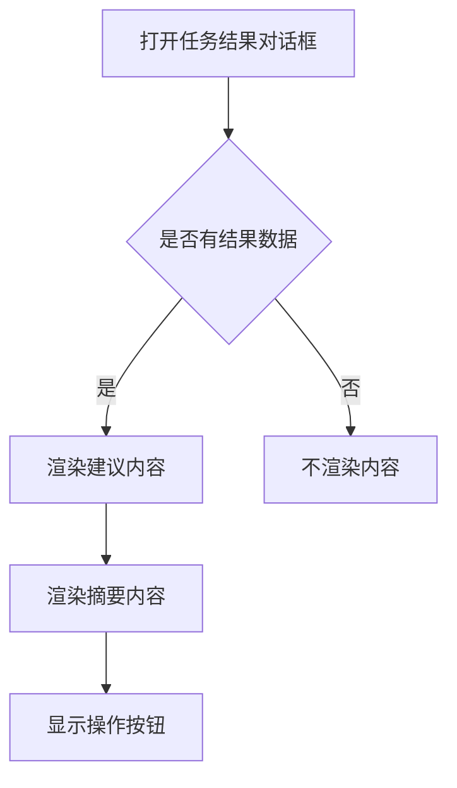
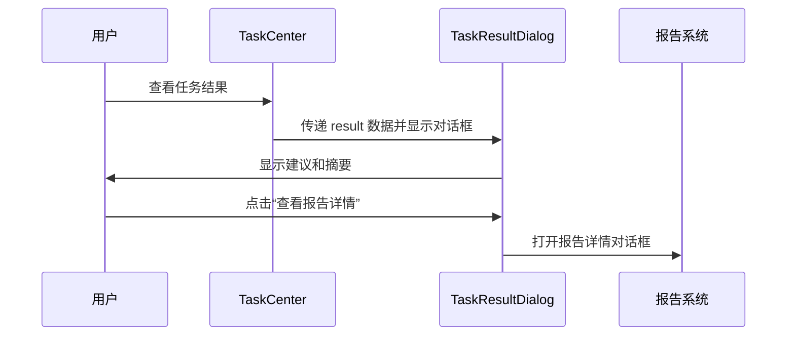

# 任务结果对话框

<cite>
**本文档引用的文件**
- [TaskResultDialog.vue](file://frontend/src/components/Global/TaskResultDialog.vue)
- [TaskCenter.vue](file://frontend/src/views/Tasks/TaskCenter.vue)
</cite>

## 目录
1. [简介](#简介)
2. [核心功能与实现](#核心功能与实现)
3. [组件属性与配置](#组件属性与配置)
4. [操作日志与详情展示](#操作日志与详情展示)
5. [使用场景示例](#使用场景示例)
6. [长时间任务结果展示](#长时间任务结果展示)
7. [可访问性与键盘导航](#可访问性与键盘导航)

## 简介
`TaskResultDialog` 是一个通用的任务结果展示组件，用于在系统中统一呈现各类任务（如数据同步、配置保存、系统操作等）的执行结果。该组件通过结构化的方式展示任务建议和摘要信息，并提供“查看报告详情”等操作入口，提升用户体验和信息可读性。

**Section sources**
- [TaskResultDialog.vue](file://frontend/src/components/Global/TaskResultDialog.vue#L1-L32)

## 核心功能与实现
`TaskResultDialog` 组件基于 Vue 3 和 Element Plus 构建，采用 `<script setup>` 语法糖实现组合式 API。其核心功能包括：
- 使用 `el-dialog` 实现模态对话框，控制显示与隐藏
- 支持 Markdown 格式的建议和摘要内容渲染
- 提供关闭和查看报告详情的操作按钮
- 通过 `v-model` 实现双向绑定，确保父组件能控制对话框状态

组件通过 `marked` 库解析 Markdown 内容，支持换行（`breaks: true`）和 GitHub 风格的 Markdown（`gfm: true`），确保富文本内容正确显示。

**Diagram sources**
- [TaskResultDialog.vue](file://frontend/src/components/Global/TaskResultDialog.vue#L1-L32)

**Section sources**
- [TaskResultDialog.vue](file://frontend/src/components/Global/TaskResultDialog.vue#L1-L32)

## 组件属性与配置
`TaskResultDialog` 接收以下 props 进行配置：

| 属性名 | 类型 | 必填 | 描述 |
|--------|------|------|------|
| modelValue | boolean | 是 | 控制对话框的显示与隐藏 |
| result | any | 是 | 包含任务结果数据的对象，包含 `recommendation` 和 `summary` 字段 |

组件通过 `computed` 属性 `visible` 实现 `v-model` 的双向绑定机制，当用户点击关闭按钮或触发其他关闭事件时，会通过 `emit` 派发 `update:modelValue` 事件，通知父组件更新状态。

**Section sources**
- [TaskResultDialog.vue](file://frontend/src/components/Global/TaskResultDialog.vue#L20-L26)

## 操作日志与详情展示
虽然 `TaskResultDialog` 本身不直接集成操作日志展示功能，但它作为结果展示的入口，常与操作日志系统配合使用。例如，在任务执行完成后，系统将任务的最终结果（包括建议和摘要）传递给 `TaskResultDialog`，而详细的操作日志则通过“查看报告详情”按钮跳转至专门的报告页面进行展示。

在 `TaskCenter.vue` 中，`TaskResultDialog` 被用于展示任务中心中已完成任务的结果，用户可通过点击“查看报告详情”进一步查看完整的分析报告。

**Diagram sources**
- [TaskResultDialog.vue](file://frontend/src/components/Global/TaskResultDialog.vue#L1-L32)
- [TaskCenter.vue](file://frontend/src/views/Tasks/TaskCenter.vue#L132-L137)

**Section sources**
- [TaskResultDialog.vue](file://frontend/src/components/Global/TaskResultDialog.vue#L1-L32)
- [TaskCenter.vue](file://frontend/src/views/Tasks/TaskCenter.vue#L132-L137)

## 使用场景示例
`TaskResultDialog` 可应用于多种场景：

### 数据同步完成
当批量股票数据同步任务完成后，系统可调用 `TaskResultDialog` 展示同步结果摘要和建议，如“共同步 100 只股票，发现 5 只异常数据”。

### 配置保存
用户修改系统配置并保存后，若涉及后台异步处理，可在处理完成后使用该对话框提示“配置已成功保存并应用”。

### 系统操作
执行系统级操作（如缓存清理、数据库优化）后，通过该组件展示操作结果和后续建议。

这些场景均通过统一的 `result` 对象传递数据，保持界面一致性。

**Section sources**
- [TaskCenter.vue](file://frontend/src/views/Tasks/TaskCenter.vue#L132-L137)

## 长时间运行任务的结果展示
对于长时间运行的任务，系统通常采用 WebSocket 实时推送进度。`TaskResultDialog` 不直接处理进度展示，而是作为任务完成后的结果展示终端。在任务执行过程中，用户界面可能显示进度条或实时日志；当任务完成时，系统获取最终结果并传递给 `TaskResultDialog` 进行展示。

这种设计分离了“过程”与“结果”的关注点，使组件职责单一且可复用。

**Section sources**
- [TaskCenter.vue](file://frontend/src/views/Tasks/TaskCenter.vue#L193-L238)

## 可访问性与键盘导航
`TaskResultDialog` 基于 Element Plus 的 `el-dialog` 和 `el-button` 组件构建，继承了这些组件的可访问性特性：
- 支持键盘导航：用户可通过 Tab 键在“关闭”和“查看报告详情”按钮间切换
- 支持 Enter 键确认操作
- 对话框打开时自动聚焦到第一个可聚焦元素
- 提供语义化的 HTML 结构，便于屏幕阅读器解析

此外，对话框标题“任务结果”清晰描述了其内容，符合 WCAG 准则。

**Section sources**
- [TaskResultDialog.vue](file://frontend/src/components/Global/TaskResultDialog.vue#L2-L12)