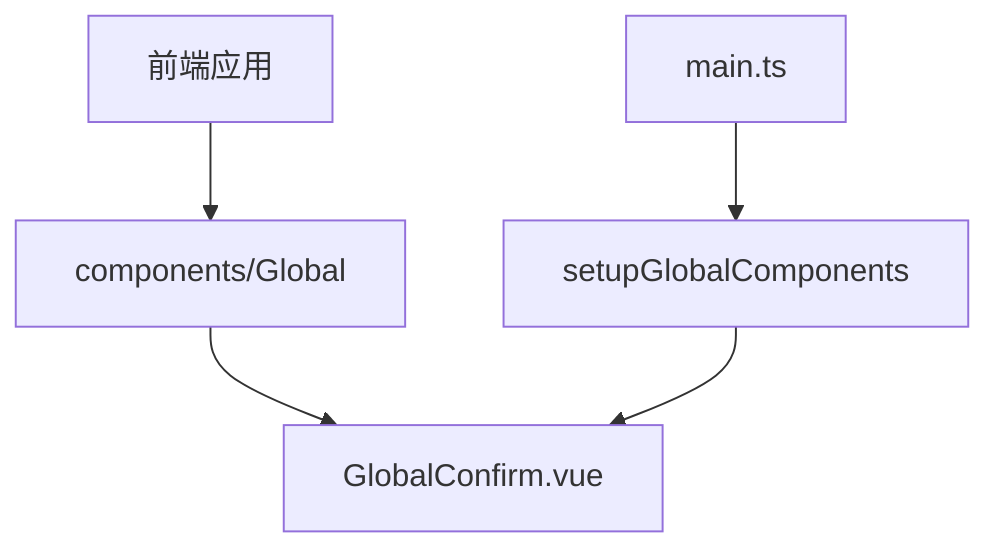
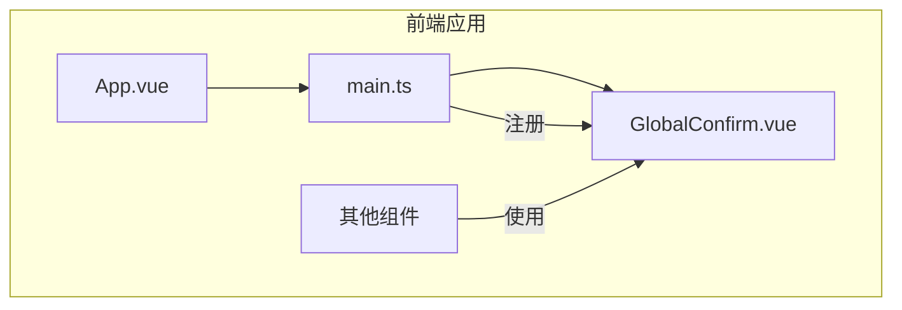
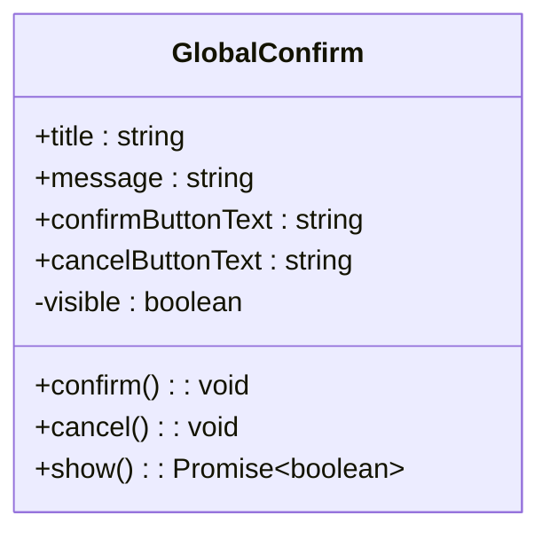
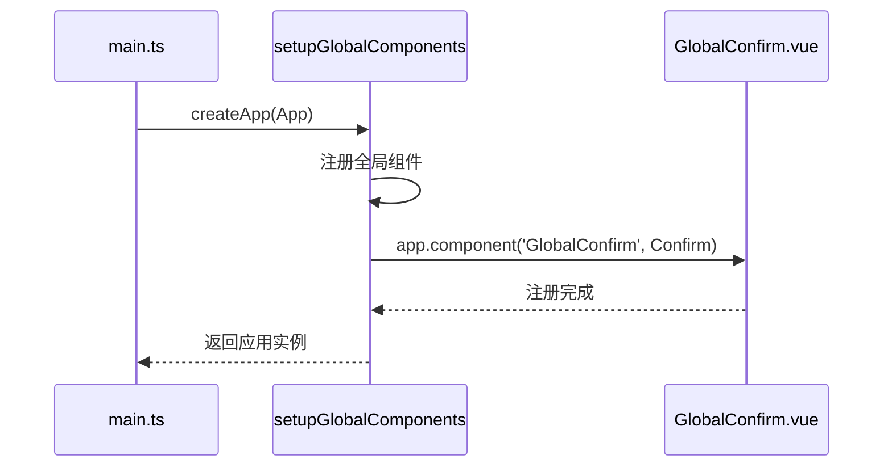
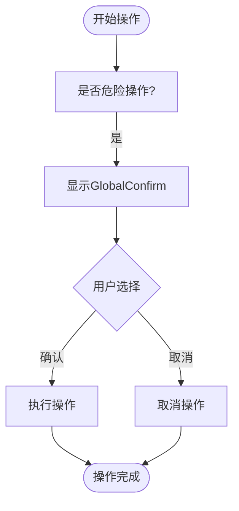
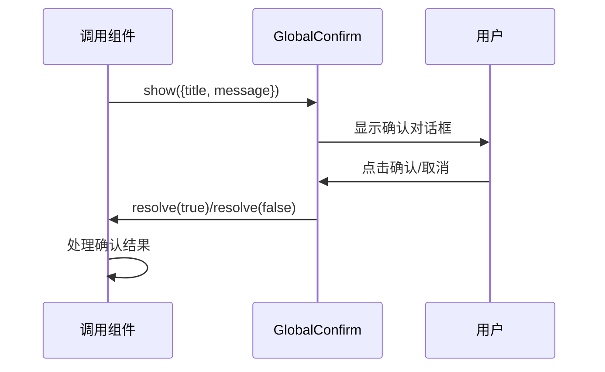
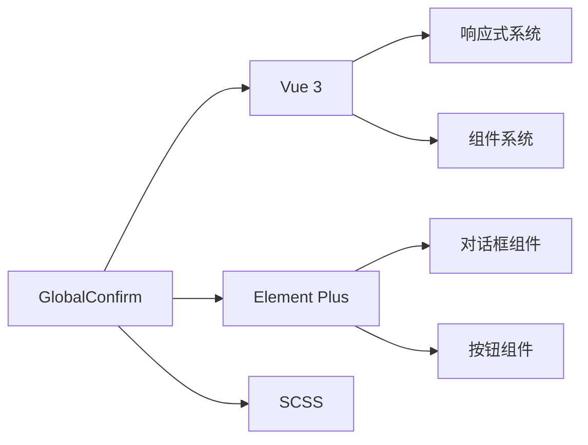

# 全局确认对话框

<cite>
**本文档引用的文件**  
- [GlobalConfirm.vue](file://frontend/src/components/Global/GlobalConfirm.vue)
- [main.ts](file://frontend/src/main.ts)
- [index.ts](file://frontend/src/components/index.ts)
- [SingleAnalysis.vue](file://frontend/src/views/Analysis/SingleAnalysis.vue)
- [batch-analysis-router-fix.md](file://docs/fixes/batch-analysis-router-fix.md)
</cite>

## 目录
1. [简介](#简介)
2. [项目结构](#项目结构)
3. [核心组件](#核心组件)
4. [架构概述](#架构概述)
5. [详细组件分析](#详细组件分析)
6. [依赖分析](#依赖分析)
7. [性能考虑](#性能考虑)
8. [故障排除指南](#故障排除指南)
9. [结论](#结论)

## 简介
GlobalConfirm 组件是系统中的全局确认对话框实现，为用户提供统一的确认交互体验。该组件设计用于在执行删除操作、危险操作等关键功能时，向用户请求确认。通过全局注册机制，该组件可在应用的任何位置调用，并与 Vue 的 provide/inject 机制集成，确保一致的用户体验。组件支持灵活的 props 配置和事件处理，能够处理异步确认逻辑并返回 Promise 结果。

## 项目结构
GlobalConfirm 组件位于前端源码的全局组件目录中，作为可复用的 UI 组件被集成到整个应用中。该组件通过主应用入口文件进行全局注册，使其在所有视图和组件中均可访问。

**Diagram sources**
- [GlobalConfirm.vue](file://frontend/src/components/Global/GlobalConfirm.vue)
- [main.ts](file://frontend/src/main.ts)

**Section sources**
- [GlobalConfirm.vue](file://frontend/src/components/Global/GlobalConfirm.vue)
- [main.ts](file://frontend/src/main.ts)

## 核心组件
GlobalConfirm 组件实现了全局确认对话框的核心功能，包括标题、消息、确认按钮文本等 props 的灵活配置，以及 confirm 和 cancel 事件的处理。组件通过 Vue 3 的 script setup 语法实现响应式逻辑，并使用 SCSS 进行样式封装。

**Section sources**
- [GlobalConfirm.vue](file://frontend/src/components/Global/GlobalConfirm.vue)

## 架构概述
GlobalConfirm 组件通过全局注册机制集成到应用架构中。在应用初始化时，通过 setupGlobalComponents 函数将组件注册为全局可用，使得任何组件都可以直接使用该对话框而无需额外导入。

**Diagram sources**
- [main.ts](file://frontend/src/main.ts)
- [GlobalConfirm.vue](file://frontend/src/components/Global/GlobalConfirm.vue)

## 详细组件分析

### GlobalConfirm 组件分析
GlobalConfirm 组件作为全局确认对话框，提供了灵活的 API 供应用各处调用。组件支持通过 props 传递标题、消息内容、确认按钮文本等配置，并通过 emit 触发 confirm 和 cancel 事件。

#### 组件实现

**Diagram sources**
- [GlobalConfirm.vue](file://frontend/src/components/Global/GlobalConfirm.vue)

#### 全局注册机制

**Diagram sources**
- [main.ts](file://frontend/src/main.ts)
- [index.ts](file://frontend/src/components/index.ts)

#### 使用示例
在删除操作或危险操作场景下，可通过调用 GlobalConfirm 组件来获取用户确认：

**Diagram sources**
- [SingleAnalysis.vue](file://frontend/src/views/Analysis/SingleAnalysis.vue)

**Section sources**
- [GlobalConfirm.vue](file://frontend/src/components/Global/GlobalConfirm.vue)
- [main.ts](file://frontend/src/main.ts)
- [index.ts](file://frontend/src/components/index.ts)

### 异步确认逻辑处理
GlobalConfirm 组件内部实现了 Promise 返回机制，使得调用方可以以异步方式处理用户确认结果。

**Diagram sources**
- [batch-analysis-router-fix.md](file://docs/fixes/batch-analysis-router-fix.md)

## 依赖分析
GlobalConfirm 组件依赖于 Vue 3 的核心功能，包括响应式系统、组件系统和事件机制。组件通过 Element Plus 提供的基础 UI 组件构建对话框界面，并遵循项目的全局样式规范。

**Diagram sources**
- [GlobalConfirm.vue](file://frontend/src/components/Global/GlobalConfirm.vue)
- [main.ts](file://frontend/src/main.ts)

**Section sources**
- [GlobalConfirm.vue](file://frontend/src/components/Global/GlobalConfirm.vue)
- [main.ts](file://frontend/src/main.ts)

## 性能考虑
GlobalConfirm 组件作为全局组件，在应用初始化时注册一次即可，避免了在每个使用位置重复导入和编译的成本。组件采用 scoped CSS 避免样式污染，同时通过 v-if 控制对话框的渲染，确保在未显示时不会影响页面性能。

## 故障排除指南
当 GlobalConfirm 组件无法正常工作时，应检查以下方面：
- 确认组件已在 main.ts 中正确注册
- 检查 props 传递是否正确
- 验证事件监听器是否正确绑定
- 确保没有样式冲突导致对话框不可见

**Section sources**
- [GlobalConfirm.vue](file://frontend/src/components/Global/GlobalConfirm.vue)
- [main.ts](file://frontend/src/main.ts)

## 结论
GlobalConfirm 组件为应用提供了统一、可靠的全局确认对话框解决方案。通过全局注册机制和 Vue 的响应式系统，该组件实现了高度的可复用性和灵活性。组件支持异步 Promise 返回机制，便于在各种业务场景中集成使用，特别是在处理删除操作和危险操作时，为用户提供清晰的确认流程。