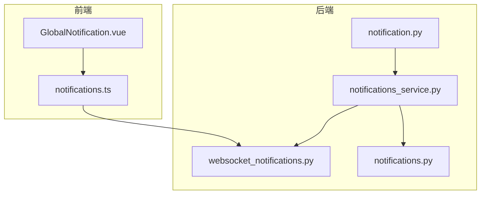
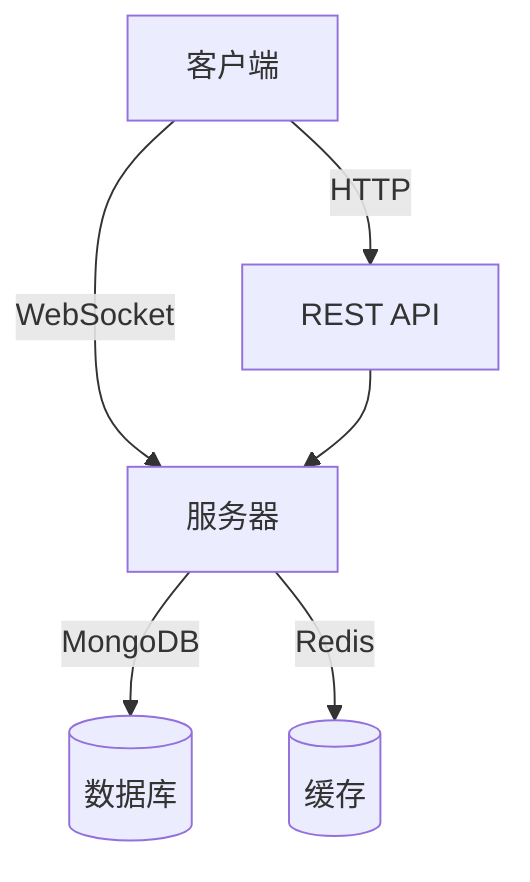
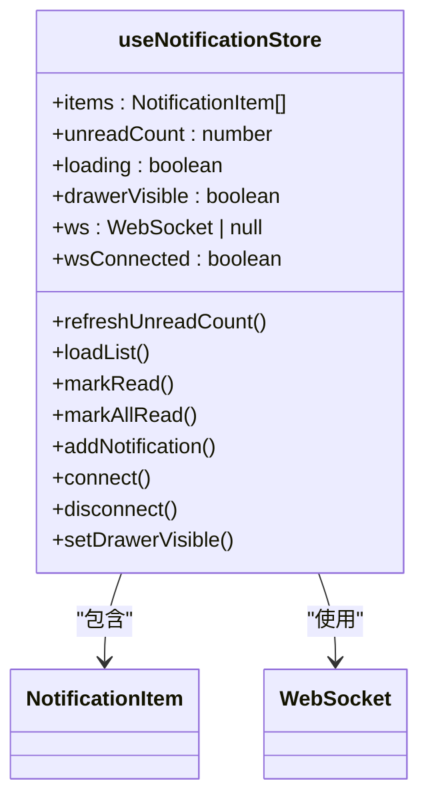
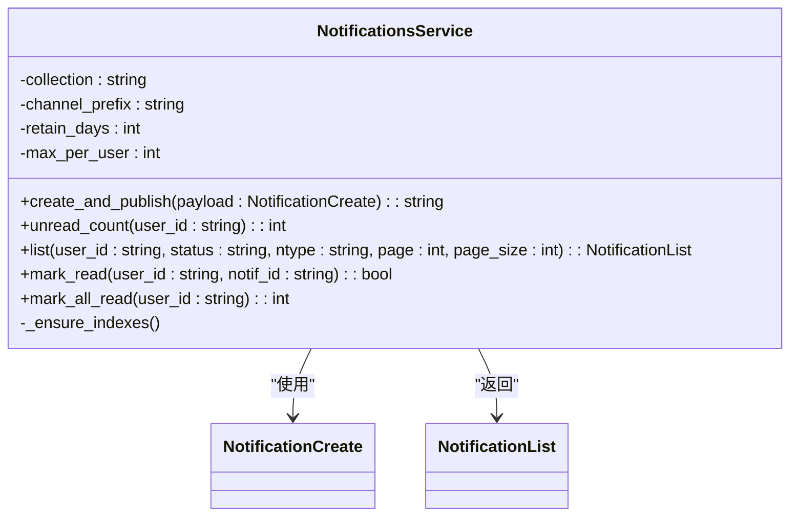
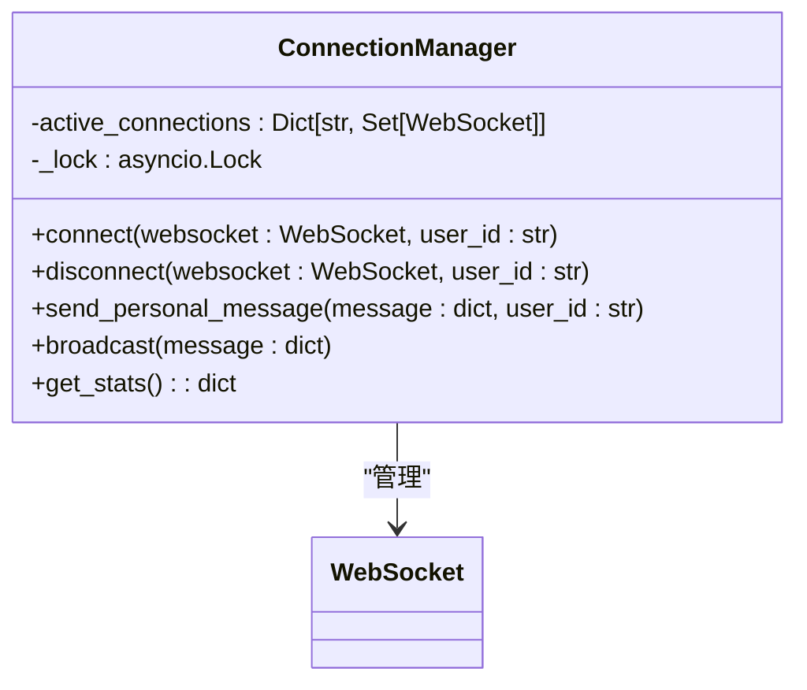
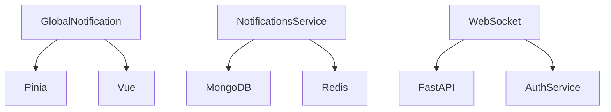

# 全局通知组件

<cite>
**本文档引用的文件**   
- [GlobalNotification.vue](file://frontend/src/components/Global/GlobalNotification.vue)
- [notifications.ts](file://frontend/src/stores/notifications.ts)
- [notification.py](file://app/models/notification.py)
- [notifications_service.py](file://app/services/notifications_service.py)
- [websocket_notifications.py](file://app/routers/websocket_notifications.py)
- [notifications.py](file://app/routers/notifications.py)
</cite>

## 目录
1. [简介](#简介)
2. [项目结构](#项目结构)
3. [核心组件](#核心组件)
4. [架构概述](#架构概述)
5. [详细组件分析](#详细组件分析)
6. [依赖分析](#依赖分析)
7. [性能考虑](#性能考虑)
8. [故障排除指南](#故障排除指南)
9. [结论](#结论)

## 简介
全局通知组件是系统中的核心消息通知系统，通过WebSocket实现实时通知推送。该组件允许在应用的任何位置触发通知，支持多种通知类型（如分析、警报、系统通知），并提供已读/未读状态管理。通知系统采用前后端分离架构，前端通过Pinia状态管理器管理通知状态，后端通过MongoDB持久化通知数据，并通过WebSocket实现实时推送。

## 项目结构
全局通知组件分布在前后端多个目录中，前端组件位于`frontend/src/components/Global/`目录下，状态管理位于`frontend/src/stores/`目录下，后端模型和路由分别位于`app/models/`和`app/routers/`目录下。

**图示来源**
- [GlobalNotification.vue](file://frontend/src/components/Global/GlobalNotification.vue)
- [notifications.ts](file://frontend/src/stores/notifications.ts)
- [notification.py](file://app/models/notification.py)
- [notifications_service.py](file://app/services/notifications_service.py)
- [websocket_notifications.py](file://app/routers/websocket_notifications.py)
- [notifications.py](file://app/routers/notifications.py)

**章节来源**
- [GlobalNotification.vue](file://frontend/src/components/Global/GlobalNotification.vue)
- [notifications.ts](file://frontend/src/stores/notifications.ts)
- [notification.py](file://app/models/notification.py)
- [notifications_service.py](file://app/services/notifications_service.py)
- [websocket_notifications.py](file://app/routers/websocket_notifications.py)
- [notifications.py](file://app/routers/notifications.py)

## 核心组件
全局通知组件的核心功能由前端的`GlobalNotification.vue`和`notifications.ts`以及后端的`notifications_service.py`和`websocket_notifications.py`共同实现。前端组件负责UI展示和用户交互，后端服务负责通知的创建、存储和推送。

**章节来源**
- [GlobalNotification.vue](file://frontend/src/components/Global/GlobalNotification.vue)
- [notifications.ts](file://frontend/src/stores/notifications.ts)
- [notifications_service.py](file://app/services/notifications_service.py)
- [websocket_notifications.py](file://app/routers/websocket_notifications.py)

## 架构概述
全局通知系统采用WebSocket实现实时通信，避免了传统SSE和Redis PubSub的连接泄漏问题。系统通过`ConnectionManager`类管理WebSocket连接，支持心跳机制和自动重连。通知数据通过MongoDB持久化存储，并通过WebSocket推送给客户端。

**图示来源**
- [websocket_notifications.py](file://app/routers/websocket_notifications.py)
- [notifications_service.py](file://app/services/notifications_service.py)
- [notification.py](file://app/models/notification.py)

## 详细组件分析

### 前端通知管理
前端通过Pinia状态管理器`useNotificationStore`管理通知状态，包括通知列表、未读计数和WebSocket连接状态。`addNotification`方法用于添加新通知，`connectWebSocket`方法用于建立WebSocket连接。

**图示来源**
- [notifications.ts](file://frontend/src/stores/notifications.ts)

**章节来源**
- [notifications.ts](file://frontend/src/stores/notifications.ts)

### 后端通知服务
后端`NotificationsService`类负责通知的创建、查询和状态更新。`create_and_publish`方法用于创建通知并推送到客户端，`unread_count`方法用于获取未读通知数量，`list`方法用于获取通知列表。

**图示来源**
- [notifications_service.py](file://app/services/notifications_service.py)

**章节来源**
- [notifications_service.py](file://app/services/notifications_service.py)

### WebSocket连接管理
`ConnectionManager`类负责管理WebSocket连接，支持多用户多连接。`connect`方法用于建立连接，`disconnect`方法用于断开连接，`send_personal_message`方法用于向指定用户发送消息。

**图示来源**
- [websocket_notifications.py](file://app/routers/websocket_notifications.py)

**章节来源**
- [websocket_notifications.py](file://app/routers/websocket_notifications.py)

## 依赖分析
全局通知组件依赖于多个核心服务，包括认证服务、数据库服务和WebSocket服务。前端依赖Pinia状态管理器和Vue框架，后端依赖FastAPI框架和MongoDB数据库。

**图示来源**
- [notifications.ts](file://frontend/src/stores/notifications.ts)
- [notifications_service.py](file://app/services/notifications_service.py)
- [websocket_notifications.py](file://app/routers/websocket_notifications.py)

**章节来源**
- [notifications.ts](file://frontend/src/stores/notifications.ts)
- [notifications_service.py](file://app/services/notifications_service.py)
- [websocket_notifications.py](file://app/routers/websocket_notifications.py)

## 性能考虑
全局通知系统在设计时考虑了性能优化，包括：
- 使用WebSocket实现实时通信，减少HTTP轮询开销
- 通过索引优化MongoDB查询性能
- 实现连接池管理，避免连接泄漏
- 支持自动重连和心跳机制，提高连接稳定性

## 故障排除指南
常见问题及解决方案：
- **WebSocket连接失败**：检查认证token是否有效，确保服务器地址正确
- **通知未收到**：检查WebSocket连接状态，确认用户ID匹配
- **性能问题**：检查MongoDB索引，优化查询语句
- **连接泄漏**：监控连接数，确保正确处理连接关闭

**章节来源**
- [websocket_notifications.py](file://app/routers/websocket_notifications.py)
- [notifications_service.py](file://app/services/notifications_service.py)

## 结论
全局通知组件通过WebSocket实现实时消息推送，提供了高效、稳定的通知系统。系统采用前后端分离架构，前端负责UI展示，后端负责数据存储和推送。通过合理的架构设计和性能优化，确保了系统的可靠性和可扩展性。