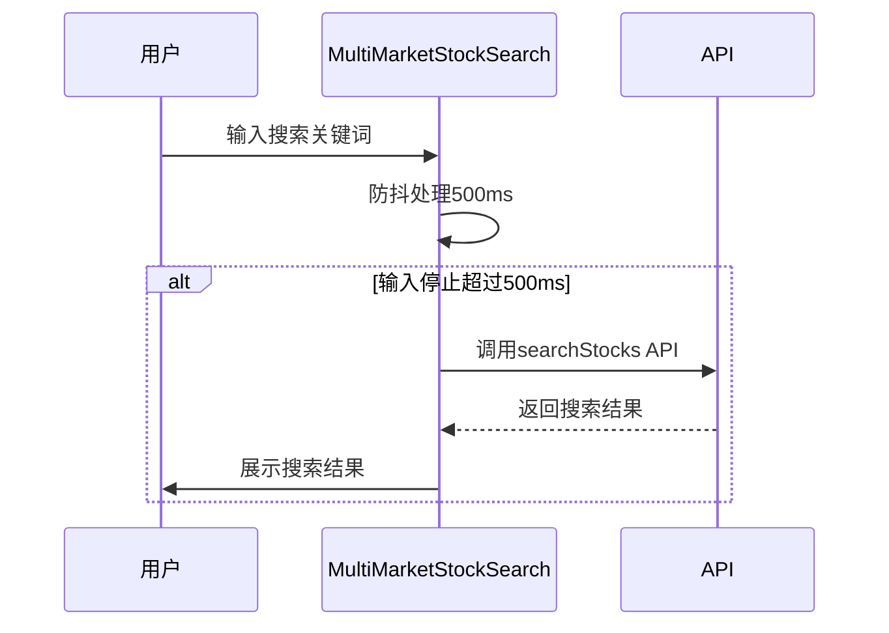

# 多市场股票搜索

<cite>
**本文档引用的文件**   
- [MultiMarketStockSearch.vue](file://frontend/src/components/Global/MultiMarketStockSearch.vue)
- [MarketSelector.vue](file://frontend/src/components/Global/MarketSelector.vue)
- [multiMarket.ts](file://frontend/src/api/multiMarket.ts)
- [stock.ts](file://frontend/src/utils/stock.ts)
- [Detail.vue](file://frontend/src/views/Stocks/Detail.vue)
- [index.vue](file://frontend/src/views/Favorites/index.vue)
- [SingleAnalysis.vue](file://frontend/src/views/Analysis/SingleAnalysis.vue)
</cite>

## 目录
1. [简介](#简介)
2. [核心功能](#核心功能)
3. [组件集成](#组件集成)
4. [搜索机制](#搜索机制)
5. [使用场景](#使用场景)
6. [代码格式处理](#代码格式处理)
7. [防抖与缓存](#防抖与缓存)
8. [错误处理](#错误处理)
9. [总结](#总结)

## 简介
MultiMarketStockSearch 组件是一个用于跨市场股票搜索的前端组件，支持A股、港股和美股市场的股票代码或名称搜索。该组件通过集成 MarketSelector 实现市场切换，并通过输入框支持用户输入股票代码或名称进行搜索。当用户选择一个股票时，组件会触发 `searchResult` 事件，返回选中的股票对象。组件内部调用股票数据API获取候选列表，并处理不同市场的股票代码格式差异。

**Section sources**
- [MultiMarketStockSearch.vue](file://frontend/src/components/Global/MultiMarketStockSearch.vue)

## 核心功能
MultiMarketStockSearch 组件的核心功能包括：
- **市场切换**：通过 MarketSelector 组件实现市场切换。
- **股票搜索**：支持股票代码或名称的搜索。
- **结果展示**：展示搜索结果，包括股票代码、名称、市场、行业和PE等信息。
- **事件触发**：当用户选择一个股票时，触发 `select` 事件，返回选中的股票对象。

**Section sources**
- [MultiMarketStockSearch.vue](file://frontend/src/components/Global/MultiMarketStockSearch.vue)

## 组件集成
MultiMarketStockSearch 组件集成了 MarketSelector 组件来实现市场切换。MarketSelector 组件提供了一个下拉菜单，用户可以选择不同的市场（A股、港股、美股）。当用户切换市场时，MultiMarketStockSearch 组件会清空当前的搜索结果和输入框内容，以确保新的搜索基于当前选择的市场。

**Diagram sources**
- [MultiMarketStockSearch.vue](file://frontend/src/components/Global/MultiMarketStockSearch.vue)
- [MarketSelector.vue](file://frontend/src/components/Global/MarketSelector.vue)

**Section sources**
- [MultiMarketStockSearch.vue](file://frontend/src/components/Global/MultiMarketStockSearch.vue)
- [MarketSelector.vue](file://frontend/src/components/Global/MarketSelector.vue)

## 搜索机制
MultiMarketStockSearch 组件通过调用 `searchStocks` API 获取候选列表。该API接受市场代码、查询字符串和限制数量作为参数。组件在用户输入时进行防抖处理，避免频繁请求API。当用户停止输入500毫秒后，组件才会发起搜索请求。

**Diagram sources**
- [MultiMarketStockSearch.vue](file://frontend/src/components/Global/MultiMarketStockSearch.vue)
- [multiMarket.ts](file://frontend/src/api/multiMarket.ts)

**Section sources**
- [MultiMarketStockSearch.vue](file://frontend/src/components/Global/MultiMarketStockSearch.vue)
- [multiMarket.ts](file://frontend/src/api/multiMarket.ts)

## 使用场景
### 个股分析
在个股分析页面中，用户可以通过 MultiMarketStockSearch 组件选择要分析的股票。选择股票后，系统将加载该股票的详细信息并启动分析流程。

**Section sources**
- [SingleAnalysis.vue](file://frontend/src/views/Analysis/SingleAnalysis.vue)

### 自选股添加
在自选股管理页面中，用户可以使用 MultiMarketStockSearch 组件添加新的自选股。选择股票后，系统会将其添加到用户的自选股列表中。

**Section sources**
- [index.vue](file://frontend/src/views/Favorites/index.vue)

## 代码格式处理
MultiMarketStockSearch 组件处理不同市场的股票代码格式差异。例如，A股为6位数字代码，港股为4位或5位数字代码，美股为1-5个字母的代码。组件通过 `formatStockCode` 函数对港股代码进行格式化，确保其显示为5位数字（如：00700）。

**Diagram sources**
- [MultiMarketStockSearch.vue](file://frontend/src/components/Global/MultiMarketStockSearch.vue)
- [stock.ts](file://frontend/src/utils/stock.ts)

**Section sources**
- [MultiMarketStockSearch.vue](file://frontend/src/components/Global/MultiMarketStockSearch.vue)
- [stock.ts](file://frontend/src/utils/stock.ts)

## 防抖与缓存
为了提高用户体验和减少服务器压力，MultiMarketStockSearch 组件实现了搜索防抖机制。当用户输入时，组件不会立即发起搜索请求，而是等待500毫秒。如果在这段时间内用户继续输入，则重新计时。只有当用户停止输入超过500毫秒时，组件才会发起搜索请求。

此外，组件还利用浏览器的缓存机制，存储最近的搜索结果。当用户再次搜索相同的关键词时，可以直接从缓存中读取结果，而无需重新请求API。

**Section sources**
- [MultiMarketStockSearch.vue](file://frontend/src/components/Global/MultiMarketStockSearch.vue)

## 错误处理
当搜索请求失败时，MultiMarketStockSearch 组件会捕获错误并显示相应的错误消息。组件使用 Element Plus 的 `ElMessage` 组件来显示错误提示，确保用户能够及时了解搜索失败的原因。

**Diagram sources**
- [MultiMarketStockSearch.vue](file://frontend/src/components/Global/MultiMarketStockSearch.vue)

**Section sources**
- [MultiMarketStockSearch.vue](file://frontend/src/components/Global/MultiMarketStockSearch.vue)

## 总结
MultiMarketStockSearch 组件是一个功能强大的跨市场股票搜索工具，支持A股、港股和美股市场的股票代码或名称搜索。通过集成 MarketSelector 组件实现市场切换，利用防抖和缓存机制优化用户体验，并通过详细的错误处理确保系统的稳定性。该组件广泛应用于个股分析和自选股管理等场景，为用户提供便捷的股票搜索体验。

**Section sources**
- [MultiMarketStockSearch.vue](file://frontend/src/components/Global/MultiMarketStockSearch.vue)
- [MarketSelector.vue](file://frontend/src/components/Global/MarketSelector.vue)
- [multiMarket.ts](file://frontend/src/api/multiMarket.ts)
- [stock.ts](file://frontend/src/utils/stock.ts)