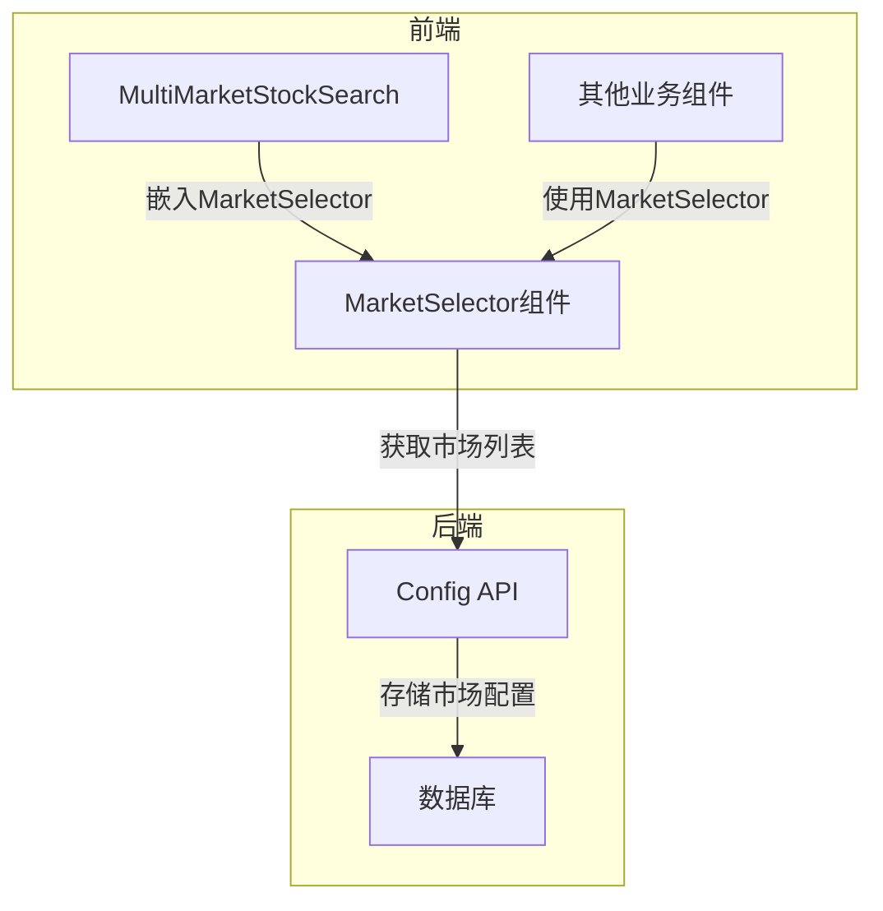
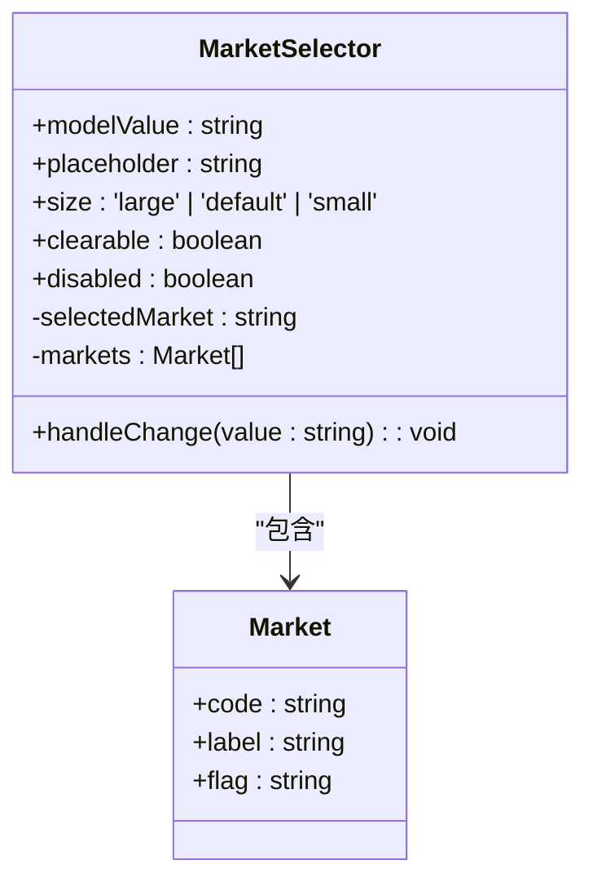
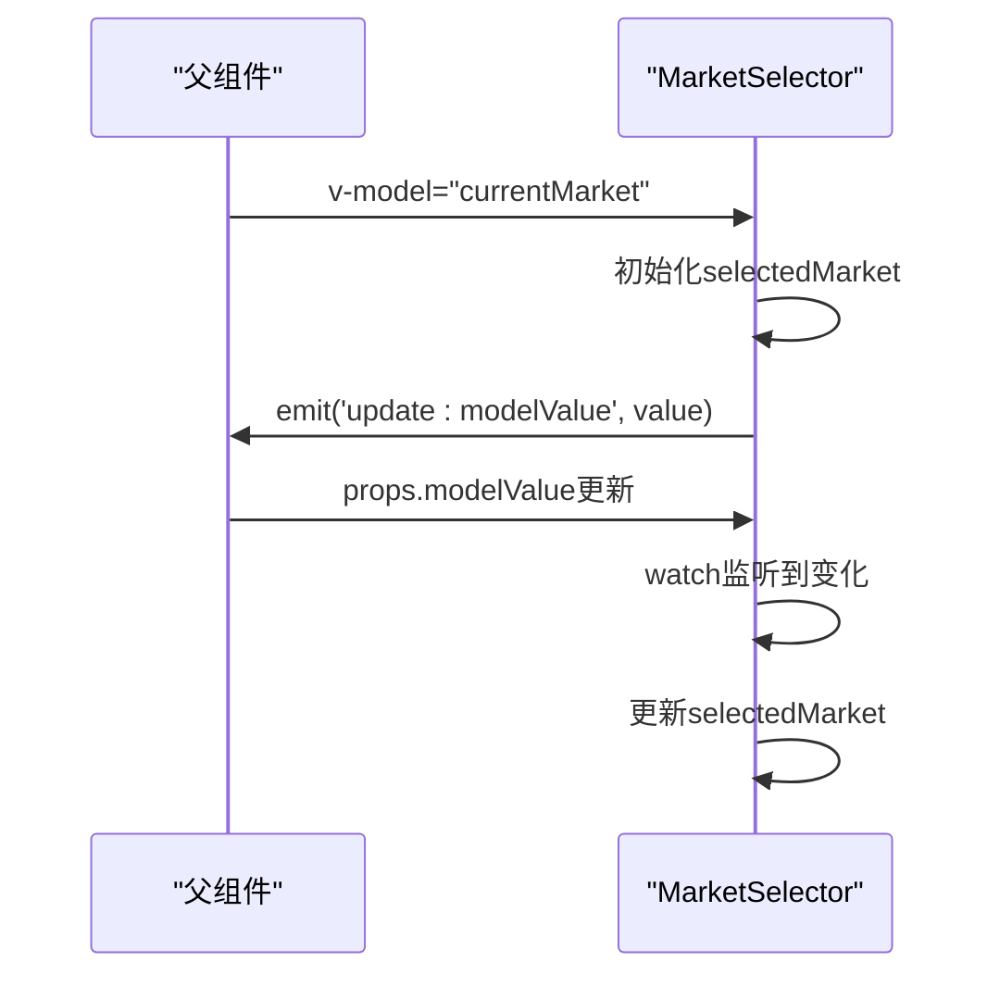
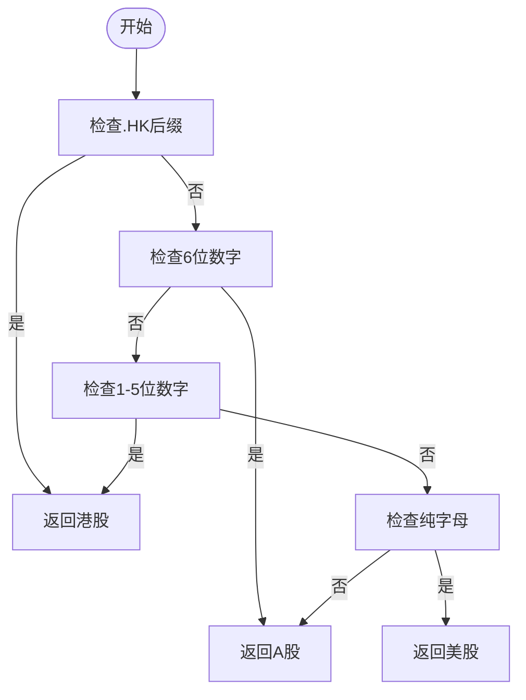
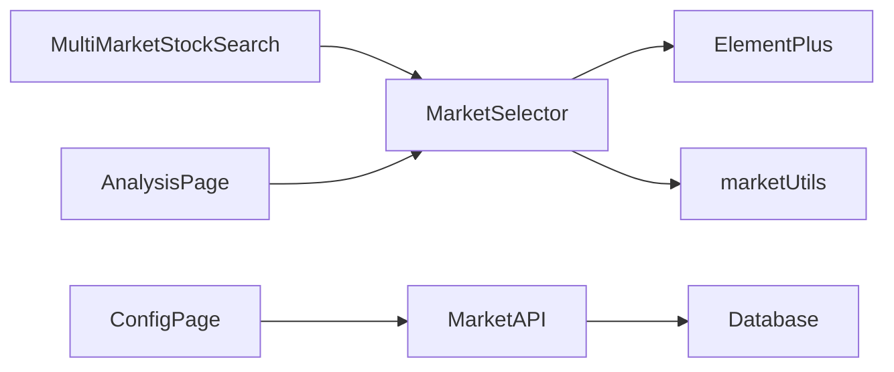

# 市场选择器

<cite>
**本文档引用文件**  
- [MarketSelector.vue](file://frontend/src/components/Global/MarketSelector.vue)
- [market.ts](file://frontend/src/utils/market.ts)
- [MultiMarketStockSearch.vue](file://frontend/src/components/Global/MultiMarketStockSearch.vue)
- [config.ts](file://frontend/src/api/config.ts)
- [config.py](file://app/routers/config.py)
</cite>

## 目录
1. [简介](#简介)
2. [核心组件](#核心组件)
3. [架构概述](#架构概述)
4. [详细组件分析](#详细组件分析)
5. [依赖分析](#依赖分析)
6. [性能考虑](#性能考虑)
7. [故障排除指南](#故障排除指南)
8. [结论](#结论)

## 简介
市场选择器（MarketSelector）是一个前端Vue组件，用于在股票分析系统中实现多市场选择功能。该组件支持A股、港股、美股等主要金融市场的切换，通过直观的下拉菜单和国旗标识提升用户体验。组件采用响应式设计，适配移动端，并通过v-model实现双向数据绑定，与系统其他部分无缝集成。本文档将详细阐述其技术实现、使用场景和扩展机制。

## 核心组件

市场选择器组件实现了多市场选择的核心功能，包括市场选项展示、用户交互处理和数据同步。组件通过v-model与父组件进行双向数据绑定，确保市场状态的一致性。其设计遵循可复用原则，可在多个业务场景中灵活使用。

**组件来源**
- [MarketSelector.vue](file://frontend/src/components/Global/MarketSelector.vue#L1-L95)

## 架构概述

市场选择器的架构设计体现了前后端分离和组件化开发的思想。前端组件负责用户界面展示和交互，后端API提供市场配置数据，两者通过标准化接口通信。

**图表来源**  
- [MarketSelector.vue](file://frontend/src/components/Global/MarketSelector.vue#L1-L95)
- [config.py](file://app/routers/config.py#L1337-L1362)

## 详细组件分析

### MarketSelector组件分析

MarketSelector组件是一个基于Element Plus的el-select封装组件，提供多市场选择功能。组件通过props接收配置参数，通过emits触发事件，实现了良好的封装性和可复用性。

#### 组件接口设计

**图表来源**  
- [MarketSelector.vue](file://frontend/src/components/Global/MarketSelector.vue#L28-L32)

#### 数据绑定流程

**图表来源**  
- [MarketSelector.vue](file://frontend/src/components/Global/MarketSelector.vue#L63-L67)

### 市场识别工具分析

系统提供了完整的市场识别工具集，用于根据股票代码、交易所代码等信息自动识别市场类型。

#### 市场识别逻辑

**图表来源**  
- [market.ts](file://frontend/src/utils/market.ts#L50-L76)

## 依赖分析

市场选择器组件与系统其他部分存在紧密的依赖关系，这些依赖确保了组件的功能完整性和数据一致性。

**图表来源**  
- [MarketSelector.vue](file://frontend/src/components/Global/MarketSelector.vue#L26)
- [market.ts](file://frontend/src/utils/market.ts#L2)
- [MultiMarketStockSearch.vue](file://frontend/src/components/Global/MultiMarketStockSearch.vue#L61)

**组件来源**
- [MarketSelector.vue](file://frontend/src/components/Global/MarketSelector.vue#L1-L95)
- [market.ts](file://frontend/src/utils/market.ts#L1-L84)
- [MultiMarketStockSearch.vue](file://frontend/src/components/Global/MultiMarketStockSearch.vue#L1-L246)

## 性能考虑

市场选择器组件在性能方面进行了优化设计，确保在各种使用场景下都能提供流畅的用户体验。

1. **轻量级设计**：组件仅包含必要的市场选项，避免加载不必要的数据
2. **防抖机制**：在相关组件中使用防抖技术，减少不必要的API调用
3. **响应式更新**：使用Vue的响应式系统，确保状态变更时的高效更新
4. **按需加载**：市场配置数据在需要时才从后端获取，减少初始加载时间

## 故障排除指南

### 常见问题及解决方案

| 问题现象 | 可能原因 | 解决方案 |
|---------|---------|---------|
| 市场选择器不显示 | 组件未正确导入 | 检查import语句和组件注册 |
| v-model绑定失效 | 父组件未正确使用 | 确保使用v-model或:value+@input组合 |
| 市场列表为空 | 后端API异常 | 检查网络连接和API服务状态 |
| 选项无法选择 | 组件被禁用 | 检查disabled属性设置 |

**组件来源**
- [MarketSelector.vue](file://frontend/src/components/Global/MarketSelector.vue#L1-L95)
- [config.py](file://app/routers/config.py#L1337-L1362)

## 结论

市场选择器组件通过简洁的设计和强大的功能，为系统提供了可靠的多市场选择能力。组件采用现代化的前端技术栈，具有良好的可维护性和扩展性。通过与系统配置的深度集成，组件能够动态适应业务需求的变化。未来可以通过增加更多金融市场支持、优化移动端体验等方式进一步提升组件价值。