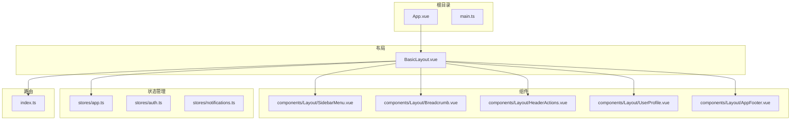
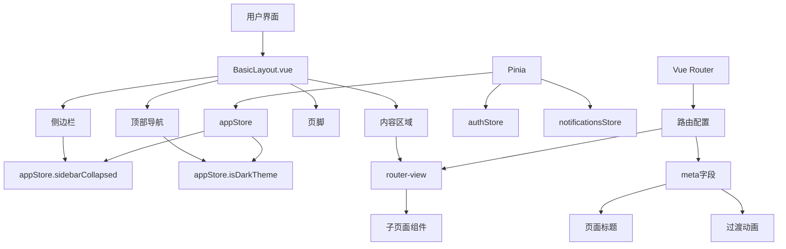
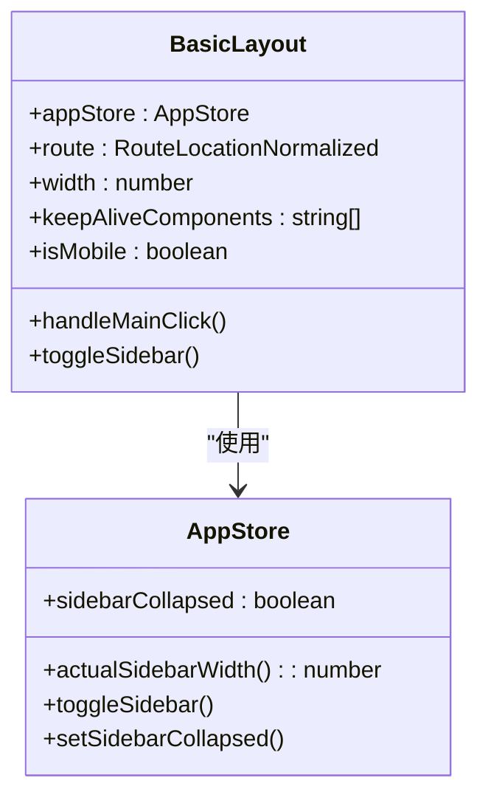
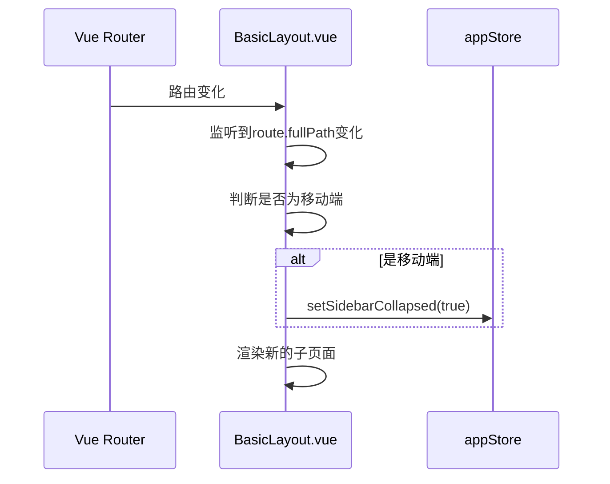
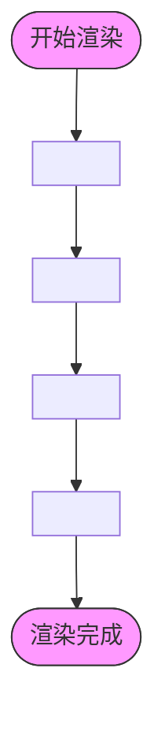
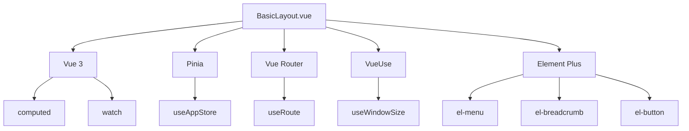

# 布局组件

<cite>
**本文档引用的文件**   
- [BasicLayout.vue](file://frontend/src/layouts/BasicLayout.vue)
- [app.ts](file://frontend/src/stores/app.ts)
- [SidebarMenu.vue](file://frontend/src/components/Layout/SidebarMenu.vue)
- [Breadcrumb.vue](file://frontend/src/components/Layout/Breadcrumb.vue)
- [HeaderActions.vue](file://frontend/src/components/Layout/HeaderActions.vue)
- [UserProfile.vue](file://frontend/src/components/Layout/UserProfile.vue)
- [AppFooter.vue](file://frontend/src/components/Layout/AppFooter.vue)
- [index.ts](file://frontend/src/router/index.ts)
</cite>

## 目录
1. [简介](#简介)
2. [项目结构](#项目结构)
3. [核心组件](#核心组件)
4. [架构概述](#架构概述)
5. [详细组件分析](#详细组件分析)
6. [依赖分析](#依赖分析)
7. [性能考虑](#性能考虑)
8. [故障排除指南](#故障排除指南)
9. [结论](#结论)
10. [附录](#附录)（如有必要）

## 简介
本项目是一个基于Vue 3和Element Plus构建的现代化股票分析平台，名为TradingAgents-CN。该平台采用前后端分离架构，前端使用TypeScript、Vue 3、Pinia和Vite构建，提供了一个功能丰富且响应式的用户界面。系统核心功能包括单股分析、批量分析、股票筛选、模拟交易等，通过AI多智能体协作实现深度股票分析。平台支持A股、美股、港股三大市场，集成了多种数据源（如Tushare、AkShare、Baostock等），并提供了灵活的配置管理、任务调度和通知系统。整体架构设计注重用户体验，实现了暗色主题、响应式布局和流畅的页面过渡动画。

## 项目结构
该项目采用典型的Vue前端项目结构，以功能模块化的方式组织代码。核心布局由BasicLayout.vue实现，通过Pinia管理全局状态，并与Vue Router深度集成实现路由导航。组件被合理地组织在components目录下，按功能分类。视图组件（views）与路由一一对应，每个主要功能模块都有独立的API服务封装。状态管理使用Pinia，将应用状态、用户认证和通知系统分离到不同的store中。整体结构清晰，便于维护和扩展。

**Diagram sources**
- [BasicLayout.vue](file://frontend/src/layouts/BasicLayout.vue)
- [app.ts](file://frontend/src/stores/app.ts)
- [index.ts](file://frontend/src/router/index.ts)

**Section sources**
- [BasicLayout.vue](file://frontend/src/layouts/BasicLayout.vue)
- [app.ts](file://frontend/src/stores/app.ts)
- [index.ts](file://frontend/src/router/index.ts)

## 核心组件
BasicLayout.vue是整个应用的核心布局组件，它定义了应用的整体框架，包括侧边栏、顶部导航栏、面包屑导航、内容区域和页脚。该组件通过Pinia的appStore管理布局状态（如侧边栏展开/折叠），并利用Vue Router的router-view实现内容区域的动态填充。布局采用了响应式设计，在移动端会自动折叠侧边栏，并通过点击蒙层实现侧边栏的收起。组件还集成了页面过渡动画，提升了用户体验。

**Section sources**
- [BasicLayout.vue](file://frontend/src/layouts/BasicLayout.vue)
- [app.ts](file://frontend/src/stores/app.ts)

## 架构概述
该应用采用现代化的前端架构，以Vue 3的Composition API为核心，结合Pinia进行状态管理，Vue Router进行路由控制。BasicLayout.vue作为应用的主布局，通过插槽（slot）机制承载所有子页面。全局状态（如主题、语言、侧边栏状态）由appStore统一管理，并持久化到localStorage中。路由系统与布局深度集成，通过meta字段控制页面标题、图标和过渡动画。整个架构层次分明，组件职责清晰，便于维护和扩展。

**Diagram sources**
- [BasicLayout.vue](file://frontend/src/layouts/BasicLayout.vue)
- [app.ts](file://frontend/src/stores/app.ts)
- [index.ts](file://frontend/src/router/index.ts)

## 详细组件分析
### BasicLayout.vue 分析
BasicLayout.vue组件是应用的主框架，它通过组合多个子组件构建了完整的用户界面。该组件使用了Vue 3的script setup语法，代码简洁高效。它通过useAppStore()从Pinia中获取appStore，从而访问和修改全局状态。组件使用了useRoute()和useWindowSize()等VueUse工具，实现了对路由和窗口大小的响应式监听。

#### 结构设计

**Diagram sources**
- [BasicLayout.vue](file://frontend/src/layouts/BasicLayout.vue)
- [app.ts](file://frontend/src/stores/app.ts)

#### 与路由系统的集成
BasicLayout.vue与Vue Router的集成主要体现在两个方面：一是通过`<router-view>`承载所有子页面，二是通过监听路由变化来更新应用状态。在组件的script部分，使用了`watch`来监听`route.fullPath`的变化，当路由改变时，如果是移动端，则自动收起侧边栏，保证了良好的移动端用户体验。

**Diagram sources**
- [BasicLayout.vue](file://frontend/src/layouts/BasicLayout.vue)
- [index.ts](file://frontend/src/router/index.ts)

#### 插槽机制与内容填充
BasicLayout.vue通过`<router-view>`实现了内容区域的动态填充。它使用了Vue的`<component :is="Component" />`语法，结合`<keep-alive>`组件，实现了页面的缓存和过渡动画。`keep-alive`的`include`属性绑定了`keepAliveComponents`，确保只有指定的组件（如Dashboard、StockScreening等）才会被缓存，从而优化了性能。

**Diagram sources**
- [BasicLayout.vue](file://frontend/src/layouts/BasicLayout.vue)

#### 全局状态与用户配置管理
BasicLayout.vue通过appStore管理全局状态，包括侧边栏状态、主题、语言、用户偏好等。这些状态不仅在组件内部使用，还通过localStorage实现了持久化。例如，`setSidebarCollapsed`方法在修改状态的同时，会调用`localStorage.setItem`将状态保存，确保用户刷新页面后仍能保持之前的设置。

#### 响应式设计与适配策略
该组件的响应式设计主要通过CSS媒体查询和JavaScript逻辑判断实现。在SCSS样式中，定义了`@media (max-width: 768px)`的规则，当屏幕宽度小于768px时，侧边栏会完全移出屏幕，主内容区的margin-left重置为0。同时，在JavaScript中，通过`useWindowSize()`获取窗口宽度，并用`computed`定义`isMobile`，在点击主内容区时，如果是移动端且侧边栏展开，则自动收起。

**Section sources**
- [BasicLayout.vue](file://frontend/src/layouts/BasicLayout.vue)
- [app.ts](file://frontend/src/stores/app.ts)

### 子组件分析
#### SidebarMenu.vue
侧边栏菜单组件，使用Element Plus的el-menu实现。它根据路由配置动态生成菜单项，并通过`appStore.sidebarCollapsed`控制菜单的折叠状态。菜单项与路由深度集成，点击后会自动导航到对应页面。

**Section sources**
- [SidebarMenu.vue](file://frontend/src/components/Layout/SidebarMenu.vue)

#### Breadcrumb.vue
面包屑导航组件，通过监听当前路由的`matched`属性，提取所有匹配的路由记录，并显示其meta.title，为用户提供清晰的导航路径。

**Section sources**
- [Breadcrumb.vue](file://frontend/src/components/Layout/Breadcrumb.vue)

#### HeaderActions.vue
顶部右侧操作区组件，包含主题切换、全屏、通知和帮助等按钮。它集成了通知系统，通过WebSocket或SSE实时接收消息，并在按钮上显示未读消息数量。

**Section sources**
- [HeaderActions.vue](file://frontend/src/components/Layout/HeaderActions.vue)

#### UserProfile.vue
用户信息组件，显示用户头像、用户名和角色，并提供设置和退出登录的下拉菜单。

**Section sources**
- [UserProfile.vue](file://frontend/src/components/Layout/UserProfile.vue)

#### AppFooter.vue
页脚组件，显示版权信息和免责声明。

**Section sources**
- [AppFooter.vue](file://frontend/src/components/Layout/AppFooter.vue)

## 依赖分析
BasicLayout.vue组件依赖于多个核心库和自定义模块。它直接依赖于Vue 3的响应式API（如computed、watch）、Vue Router的useRoute、以及VueUse的useWindowSize。状态管理依赖于Pinia的useAppStore。UI组件库为Element Plus，使用了其el-menu、el-breadcrumb、el-button等组件。这些依赖关系清晰地定义了组件的功能边界。

**Diagram sources**
- [BasicLayout.vue](file://frontend/src/layouts/BasicLayout.vue)

## 性能考虑
该布局组件在性能方面做了多项优化。首先，通过`<keep-alive>`缓存了常用的页面组件，避免了重复的组件创建和销毁开销。其次，使用了`computed`和`watch`的懒计算特性，确保状态计算只在需要时执行。响应式监听（如窗口大小变化）也通过`watch`进行了优化，避免了不必要的重复执行。此外，组件采用了按需加载（import('@/components/...')），减少了初始包体积。

## 故障排除指南
当布局组件出现问题时，可以按照以下步骤进行排查：
1. **侧边栏无法展开/折叠**：检查appStore中的`sidebarCollapsed`状态是否正确更新，以及localStorage中的`sidebar-collapsed`值。
2. **移动端适配问题**：检查`isMobile`的计算逻辑和CSS媒体查询规则。
3. **路由过渡动画失效**：检查`keepAliveComponents`的配置和`<router-view>`的使用方式。
4. **页面标题不更新**：检查路由守卫中设置document.title的逻辑。
5. **性能问题**：检查是否有不必要的响应式监听，或`<keep-alive>`缓存了过多不常用的组件。

**Section sources**
- [BasicLayout.vue](file://frontend/src/layouts/BasicLayout.vue)
- [app.ts](file://frontend/src/stores/app.ts)
- [index.ts](file://frontend/src/router/index.ts)

## 结论
BasicLayout.vue是一个设计精良、功能完整的布局组件，它成功地将应用的各个部分整合在一起，提供了一个稳定、高效且用户体验良好的基础框架。通过与Pinia和Vue Router的深度集成，实现了全局状态管理和动态内容填充。其响应式设计确保了在不同设备上都能提供一致的用户体验。该组件的模块化设计和清晰的依赖关系，使其易于维护和扩展，为整个应用的稳定运行奠定了坚实的基础。