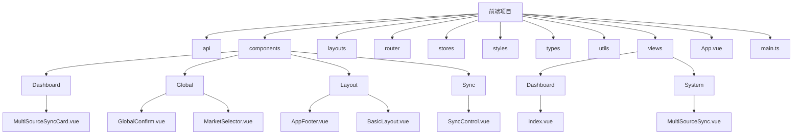
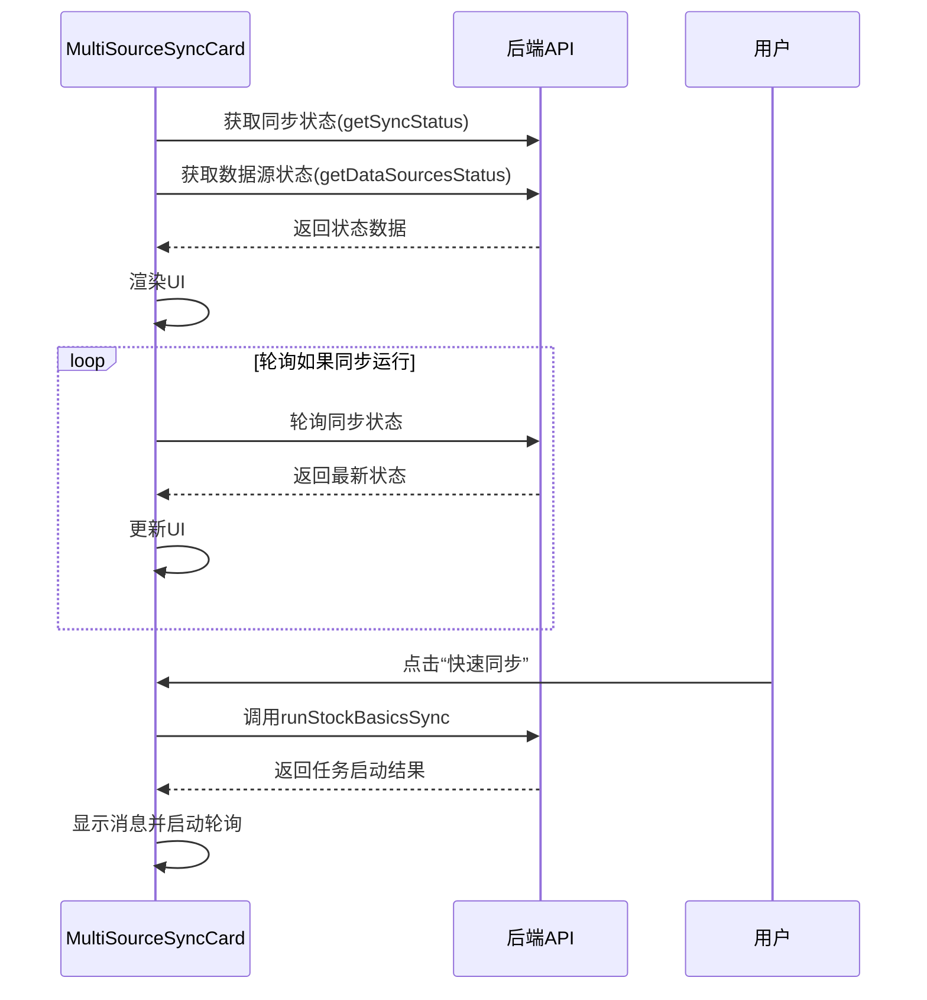
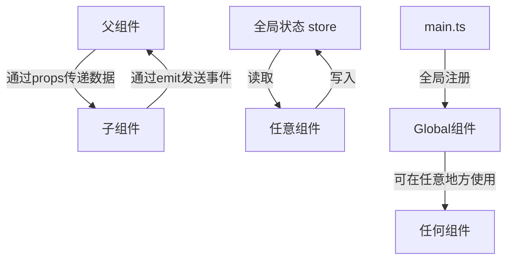

# 组件架构

<cite>
**本文档引用的文件**   
- [MultiSourceSyncCard.vue](file://frontend/src/components/Dashboard/MultiSourceSyncCard.vue)
- [ConfigWizard.vue](file://frontend/src/components/ConfigWizard.vue)
- [ModelConfig.vue](file://frontend/src/components/ModelConfig.vue)
- [App.vue](file://frontend/src/App.vue)
- [BasicLayout.vue](file://frontend/src/layouts/BasicLayout.vue)
- [AppFooter.vue](file://frontend/src/components/Layout/AppFooter.vue)
- [GlobalConfirm.vue](file://frontend/src/components/Global/GlobalConfirm.vue)
- [MarketSelector.vue](file://frontend/src/components/Global/MarketSelector.vue)
- [index.ts](file://frontend/src/components/index.ts)
- [main.ts](file://frontend/src/main.ts)
- [index.vue](file://frontend/src/views/Dashboard/index.vue)
- [SyncControl.vue](file://frontend/src/components/Sync/SyncControl.vue)
- [MultiSourceSync.vue](file://frontend/src/views/System/MultiSourceSync.vue)
- [router/index.ts](file://frontend/src/router/index.ts)
</cite>

## 目录
1. [项目结构](#项目结构)
2. [组件分类与组织](#组件分类与组织)
3. [核心业务组件分析](#核心业务组件分析)
4. [组件通信与复用策略](#组件通信与复用策略)
5. [视图组件与页面构建](#视图组件与页面构建)
6. [组件开发规范](#组件开发规范)

## 项目结构

sagacity平台的前端代码位于`frontend/src`目录下，采用基于Vue 3的组件化架构。项目结构清晰，主要分为以下几个部分：
- `api/`: 封装了与后端API交互的接口。
- `components/`: 存放所有可复用的Vue组件，按功能进一步划分为`Dashboard`、`Global`、`Layout`、`Sync`等子目录。
- `layouts/`: 定义应用的整体布局。
- `router/`: 配置应用的路由。
- `stores/`: 使用Pinia管理应用状态。
- `styles/`: 全局样式文件。
- `types/`: TypeScript类型定义。
- `utils/`: 工具函数。
- `views/`: 页面级组件，由基础组件组合而成。
- `App.vue`和`main.ts`: 应用的根组件和入口文件。

**Diagram sources**
- [MultiSourceSyncCard.vue](file://frontend/src/components/Dashboard/MultiSourceSyncCard.vue)
- [GlobalConfirm.vue](file://frontend/src/components/Global/GlobalConfirm.vue)
- [MarketSelector.vue](file://frontend/src/components/Global/MarketSelector.vue)
- [AppFooter.vue](file://frontend/src/components/Layout/AppFooter.vue)
- [BasicLayout.vue](file://frontend/src/layouts/BasicLayout.vue)
- [SyncControl.vue](file://frontend/src/components/Sync/SyncControl.vue)
- [index.vue](file://frontend/src/views/Dashboard/index.vue)
- [MultiSourceSync.vue](file://frontend/src/views/System/MultiSourceSync.vue)

## 组件分类与组织

平台的前端组件体系遵循清晰的分类与组织原则，主要分为三大类：布局组件、全局通用组件和业务功能组件。

### 布局组件 (Layout)

布局组件定义了应用的整体结构和骨架，通常包含导航、页头、页脚等跨页面共享的UI元素。它们位于`components/Layout/`目录下。
- `BasicLayout.vue`: 应用的基础布局，包含侧边栏、顶部导航栏和页脚。它通过`<router-view>`动态渲染不同的页面内容。
- `AppFooter.vue`: 页脚组件，显示版权信息和免责声明。

**Section sources**
- [BasicLayout.vue](file://frontend/src/layouts/BasicLayout.vue)
- [AppFooter.vue](file://frontend/src/components/Layout/AppFooter.vue)

### 全局通用组件 (Global)

全局通用组件是跨多个页面和功能模块复用的UI元素，通常在应用初始化时全局注册。它们位于`components/Global/`目录下。
- `GlobalConfirm.vue`: 全局确认对话框，用于统一处理用户确认操作。
- `MarketSelector.vue`: 市场选择器，提供A股、港股、美股的下拉选择，并带有国旗emoji标识。

**Section sources**
- [GlobalConfirm.vue](file://frontend/src/components/Global/GlobalConfirm.vue)
- [MarketSelector.vue](file://frontend/src/components/Global/MarketSelector.vue)

### 业务功能组件 (Dashboard, Sync等)

业务功能组件是实现特定业务逻辑的组件，它们位于`components/`下的功能子目录中。
- `Dashboard/`: 仪表盘相关的组件，如`MultiSourceSyncCard.vue`。
- `Sync/`: 数据同步相关的组件，如`SyncControl.vue`、`DataSourceStatus.vue`等。
- `ConfigWizard.vue`: 配置向导组件，引导用户完成系统配置。
- `ModelConfig.vue`: 模型配置组件，用于选择和配置AI分析模型。

**Section sources**
- [MultiSourceSyncCard.vue](file://frontend/src/components/Dashboard/MultiSourceSyncCard.vue)
- [SyncControl.vue](file://frontend/src/components/Sync/SyncControl.vue)
- [ConfigWizard.vue](file://frontend/src/components/ConfigWizard.vue)
- [ModelConfig.vue](file://frontend/src/components/ModelConfig.vue)

## 核心业务组件分析

### MultiSourceSyncCard 组件

`MultiSourceSyncCard`组件位于仪表盘页面，用于快速概览多数据源同步的状态。它是一个典型的“卡片式”设计，集成了状态显示、数据源信息和快速操作。

**功能与实现**:
- **状态显示**: 通过`<el-tag>`显示同步状态（空闲、运行中、成功等），并根据状态动态改变标签颜色。
- **进度条**: 当同步运行时，显示一个进度条，百分比由`getProgress()`方法计算得出。
- **数据源状态**: 从API获取数据源状态列表，按优先级排序并只显示前三个，用图标和颜色表示可用性。
- **快速操作**: 提供“快速同步”按钮，点击后调用`runStockBasicsSync` API。
- **自动刷新**: 组件挂载时获取状态，如果同步正在运行，则启动一个定时器（`startStatusPolling`）轮询状态，直到同步完成。

**Diagram sources**
- [MultiSourceSyncCard.vue](file://frontend/src/components/Dashboard/MultiSourceSyncCard.vue)

### ConfigWizard 组件

`ConfigWizard`组件是一个多步骤的配置向导，通过`<el-dialog>`和`<el-steps>`实现，引导用户完成数据库、大模型和数据源的配置。

**功能与实现**:
- **步骤管理**: 使用`currentStep`变量控制当前步骤，通过“上一步”、“下一步”按钮进行导航。
- **表单验证**: 在进入下一步之前，对当前步骤的表单进行简单验证（如检查是否选择了大模型提供商）。
- **动态表单**: 第二步（大模型配置）和第三步（数据源配置）的表单项根据用户的选择动态显示。例如，选择Tushare时才显示Token输入框。
- **数据模型**: 使用`wizardData`对象集中管理所有配置数据，便于在最后一步汇总并提交。
- **外部链接**: 为每个大模型提供商提供获取API密钥的帮助链接。

**Section sources**
- [ConfigWizard.vue](file://frontend/src/components/ConfigWizard.vue)

### ModelConfig 组件

`ModelConfig`组件用于配置AI分析所使用的模型，区分“快速分析模型”和“深度决策模型”。

**功能与实现**:
- **模型选择**: 使用`<el-select>`和`<el-option>`，通过`availableModels` prop接收可用模型列表。
- **信息增强**: 在选项中通过`<el-tag>`显示模型的能力等级和角色标签（如“⚡快速”、“🧠深度”），帮助用户选择。
- **模型推荐**: 组件会根据当前的分析深度，调用`recommendModels` API获取推荐配置，并以`<el-alert>`的形式展示，用户可一键应用。
- **响应式更新**: 使用`watch`监听`analysisDepth`的变化，动态更新推荐信息。

**Section sources**
- [ModelConfig.vue](file://frontend/src/components/ModelConfig.vue)

## 组件通信与复用策略

平台的组件间通信主要通过Vue的标准机制实现，包括`props`、`emit`、`v-model`和全局状态管理。

### Props 和 Emit

这是最直接的父子组件通信方式。
- `ConfigWizard`通过`modelValue` prop接收`visible`状态，并通过`update:modelValue`事件控制对话框的显隐。
- `ModelConfig`通过`quickAnalysisModel`和`deepAnalysisModel` prop接收父组件的模型选择，并通过`update:quickAnalysisModel`和`update:deepAnalysisModel`事件将用户的选择反馈给父组件。

### v-model

`v-model`是`props`和`emit`的语法糖，用于实现双向绑定。
- `MarketSelector`组件通过`modelValue` prop和`update:modelValue`事件实现了`v-model`，使其可以像原生`<input>`一样使用。

### 全局状态管理 (Pinia)

对于跨组件共享的状态，如用户认证信息和应用主题，使用Pinia进行管理。
- `useAuthStore`存储用户的登录状态和token。
- `useAppStore`存储应用的UI状态，如侧边栏展开/折叠、当前主题等。

### 全局注册

为了提高开发效率，一些高频使用的全局组件在`main.ts`中通过`setupGlobalComponents`函数全局注册，避免在每个使用它们的组件中重复导入。

**Diagram sources**
- [main.ts](file://frontend/src/main.ts)
- [ConfigWizard.vue](file://frontend/src/components/ConfigWizard.vue)
- [ModelConfig.vue](file://frontend/src/components/ModelConfig.vue)

## 视图组件与页面构建

视图组件（位于`views/`目录）是页面的顶层容器，它们通过组合和编排基础组件来构建完整的页面。

### Dashboard 页面

`views/Dashboard/index.vue`是应用的首页，它是一个典型的“聚合页面”，集成了多个功能模块。
- **组合方式**: 该组件导入了`MultiSourceSyncCard`、`favoritesApi`、`analysisApi`等，并在`onMounted`生命周期中并行加载自选股、最近分析和市场快讯等数据。
- **布局**: 使用`<el-row>`和`<el-col>`进行栅格布局，将页面分为左右两栏，左侧为快速操作和最近分析，右侧为自选股和多数据源同步卡片。
- **路由**: 通过`vue-router`配置，`/dashboard`路径映射到此组件。

**Section sources**
- [index.vue](file://frontend/src/views/Dashboard/index.vue)

### MultiSourceSync 页面

`views/System/MultiSourceSync.vue`是一个更复杂的业务页面，用于管理多数据源同步。
- **组件组合**: 该页面组合了`DataSourceStatus`、`SyncRecommendations`、`SyncControl`和`SyncHistory`四个子组件。
- **事件通信**: `SyncControl`组件通过`@sync-completed`事件向父组件`MultiSourceSync`发送同步完成的通知，父组件可以据此刷新其他组件的数据。
- **模态框**: 使用`<el-dialog>`展示全面测试的结果，并提供导出功能。

**Section sources**
- [MultiSourceSync.vue](file://frontend/src/views/System/MultiSourceSync.vue)

## 组件开发规范

为了保证代码质量和可维护性，平台遵循以下组件开发规范。

### 命名约定

- **文件名**: 采用PascalCase（大驼峰）命名法，如`MultiSourceSyncCard.vue`。
- **组件名**: 在注册时使用与文件名一致的PascalCase名称。
- **变量和函数**: 在组件内部使用camelCase（小驼峰）命名法。

### Props 设计

- **明确类型**: 所有props都应使用TypeScript定义明确的类型。
- **提供默认值**: 对于非必需的props，提供合理的默认值。
- **文档化**: 通过JSDoc或注释说明每个prop的用途。

### 事件机制

- **语义化命名**: 事件名应清晰表达其意图，如`update:modelValue`、`sync-completed`。
- **传递必要数据**: emit事件时，应传递父组件需要的最少数据。

### 插槽使用

- **默认插槽**: 用于包裹组件的主要内容。
- **具名插槽**: 用于定义组件内部的特定区域，如`<template #header>`用于自定义卡片头部。