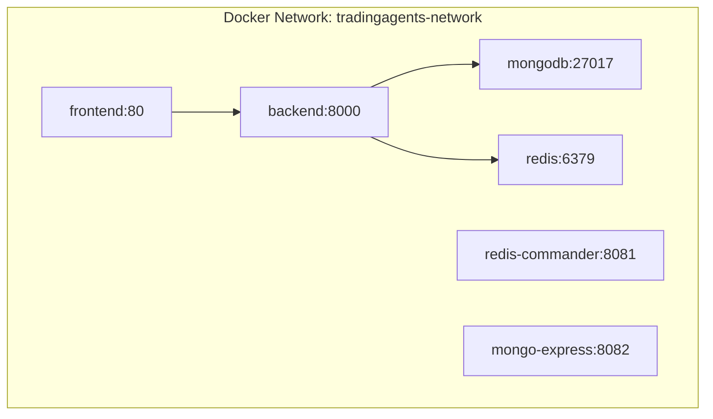
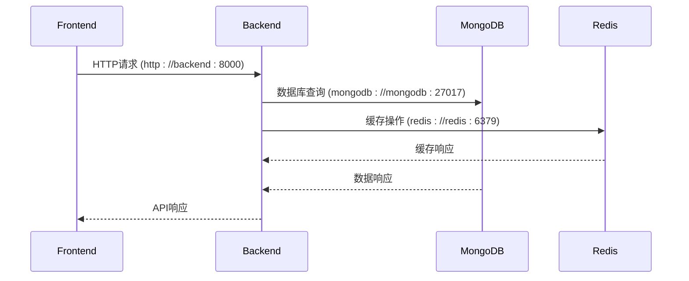
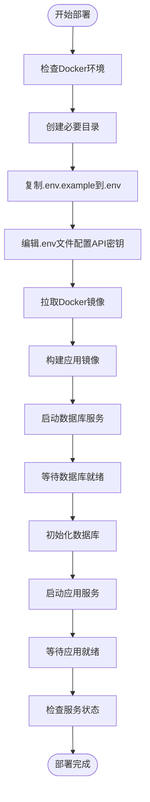

# Docker部署

<cite>
**本文档引用文件**  
- [docker-compose.yml](file://docker-compose.yml)
- [Dockerfile.backend](file://Dockerfile.backend)
- [Dockerfile.frontend](file://Dockerfile.frontend)
- [.dockerignore](file://.dockerignore)
- [docker-compose.hub.nginx.yml](file://docker-compose.hub.nginx.yml)
- [docker-compose.hub.nginx.arm.yml](file://docker-compose.hub.nginx.arm.yml)
- [docker/nginx.conf](file://docker/nginx.conf)
- [.env.example](file://.env.example)
- [scripts/docker-init.sh](file://scripts/docker-init.sh)
- [scripts/docker_deployment_init.py](file://scripts/docker_deployment_init.py)
- [scripts/start_docker.sh](file://scripts/start_docker.sh)
- [scripts/get_container_logs.py](file://scripts/get_container_logs.py)
- [docs/docker-multiarch-build.md](file://docs/docker-multiarch-build.md)
</cite>

## 目录
1. [简介](#简介)
2. [Docker Compose配置详解](#docker-compose配置详解)
3. [多架构镜像部署](#多架构镜像部署)
4. [Docker Hub镜像使用](#docker-hub镜像使用)
5. [部署启动与管理命令](#部署启动与管理命令)
6. [容器间通信与外部访问](#容器间通信与外部访问)
7. [资源限制与性能优化](#资源限制与性能优化)
8. [常见问题排查](#常见问题排查)
9. [附录](#附录)

## 简介
本文档详细说明sagacity系统的Docker容器化部署方案。系统采用前后端分离架构，通过Docker Compose进行服务编排，包含FastAPI后端、Vue 3前端、MongoDB数据库和Redis缓存服务。文档涵盖完整的部署配置、多架构支持、镜像管理、启动流程和运维监控等内容。

**Section sources**
- [docker-compose.yml](file://docker-compose.yml#L1-L209)
- [Dockerfile.backend](file://Dockerfile.backend#L1-L89)
- [Dockerfile.frontend](file://Dockerfile.frontend#L1-L47)

## Docker Compose配置详解
### 服务编排
系统通过`docker-compose.yml`文件定义了五个核心服务：

- **backend**: FastAPI后端服务，构建自`Dockerfile.backend`，暴露8000端口
- **frontend**: Vue 3前端服务，构建自`Dockerfile.frontend`，暴露80端口
- **mongodb**: MongoDB数据库服务，使用`mongo:4.4`镜像
- **redis**: Redis缓存服务，使用`redis:7-alpine`镜像
- **redis-commander**: Redis管理界面（可选）
- **mongo-express**: MongoDB管理界面（可选）

### 网络设置
所有服务通过名为`tradingagents-network`的自定义bridge网络进行通信，确保容器间安全高效的网络连接。



**Diagram sources**
- [docker-compose.yml](file://docker-compose.yml#L204-L207)

### 卷挂载
系统配置了以下卷挂载策略：

- **日志目录**: `./logs` → `/app/logs`，持久化应用日志
- **配置目录**: `./config` → `/app/config`，挂载配置文件
- **数据目录**: `./data` → `/app/data`，存储应用数据
- **数据库卷**: 使用命名卷`mongodb_data`和`redis_data`存储数据库数据

### 环境变量配置
系统通过`.env`文件和`environment`字段配置环境变量：

- **时区设置**: `TZ: "Asia/Shanghai"`
- **日志配置**: `TRADINGAGENTS_LOG_LEVEL`, `TRADINGAGENTS_LOG_DIR`
- **数据库连接**: `TRADINGAGENTS_MONGODB_URL`, `TRADINGAGENTS_REDIS_URL`
- **API配置**: `API_HOST`, `API_PORT`, `CORS_ORIGINS`
- **Docker标识**: `DOCKER_CONTAINER: "true"`

**Section sources**
- [docker-compose.yml](file://docker-compose.yml#L6-L209)
- [.env.example](file://.env.example#L1-L555)

## 多架构镜像部署
### 架构支持
系统支持amd64和arm64两种架构，通过Docker Buildx实现多平台构建。

### 构建脚本
项目提供多架构构建脚本：
- `build-amd64.sh`: 构建amd64架构镜像
- `build-arm64.sh`: 构建arm64架构镜像
- `build-multiarch.sh`: 同时构建多架构镜像

### Dockerfile架构适配
在`Dockerfile.backend`中通过`ARG TARGETARCH`参数实现架构适配：

```bash
# 根据架构设置变量
if [ "$TARGETARCH" = "arm64" ]; then \
    PANDOC_ARCH="arm64"; \
    WKHTMLTOPDF_ARCH="arm64"; \
else \
    PANDOC_ARCH="amd64"; \
    WKHTMLTOPDF_ARCH="amd64"; \
fi
```

### ARM64专用配置
对于ARM64架构，系统提供专用的`docker-compose.hub.nginx.arm.yml`文件，其中：
- 显式指定`platform: linux/arm64`
- 使用arm64专用镜像标签
- 优化了依赖包的下载源

**Section sources**
- [Dockerfile.backend](file://Dockerfile.backend#L9-L44)
- [docker-compose.hub.nginx.arm.yml](file://docker-compose.hub.nginx.arm.yml#L20-L21)
- [docs/docker-multiarch-build.md](file://docs/docker-multiarch-build.md#L1-L20)

## Docker Hub镜像使用
### 公共镜像
系统提供Docker Hub公共镜像：
- 后端镜像: `hsliup/tradingagents-backend:latest`
- 前端镜像: `hsliup/tradingagents-frontend:latest`
- ARM64后端镜像: `hsliup/tradingagents-backend-arm64:latest`
- ARM64前端镜像: `hsliup/tradingagents-frontend-arm64:latest`

### 私有仓库配置
要使用私有仓库，需修改`docker-compose.yml`中的镜像名称：

```yaml
services:
  backend:
    image: your-registry.com/tradingagents-backend:v1.0.0
  frontend:
    image: your-registry.com/tradingagents-frontend:v1.0.0
```

### 镜像拉取策略
系统提供两种部署模式：

1. **直接使用Docker Hub镜像**:
```bash
docker-compose -f docker-compose.hub.nginx.yml pull
docker-compose -f docker-compose.hub.nginx.yml up -d
```

2. **本地构建镜像**:
```bash
docker-compose -f docker-compose.hub.nginx.yml build
docker-compose -f docker-compose.hub.nginx.yml up -d
```

### Nginx反向代理配置
`docker-compose.hub.nginx.yml`文件配置了Nginx反向代理，实现：
- 统一80端口访问
- 前后端同域，避免CORS问题
- 支持HTTPS配置
- 静态资源缓存

```nginx
server {
    listen 80;
    # SPA路由支持
    location / {
        try_files $uri $uri/ /index.html;
    }
    # API代理
    location /api {
        proxy_pass http://backend:8000;
    }
}
```

**Section sources**
- [docker-compose.hub.nginx.yml](file://docker-compose.hub.nginx.yml#L1-L207)
- [docker-compose.hub.nginx.arm.yml](file://docker-compose.hub.nginx.arm.yml#L1-L196)
- [docker/nginx.conf](file://docker/nginx.conf#L1-L51)

## 部署启动与管理命令
### 初始化脚本
系统提供完整的部署初始化脚本：

- `scripts/docker-init.sh`: Docker环境初始化脚本
- `scripts/docker_deployment_init.py`: Python部署初始化脚本
- `scripts/start_docker.sh`: 启动脚本

### 启动流程
标准部署流程如下：

```bash
# 1. 检查并创建必要目录
mkdir -p logs data config

# 2. 配置环境变量
cp .env.example .env
# 编辑.env文件，配置API密钥

# 3. 初始化Docker环境
./scripts/docker-init.sh

# 4. 启动服务
docker-compose up -d

# 5. 检查状态
docker-compose ps
```

### 常用管理命令
| 命令 | 说明 |
|------|------|
| `docker-compose up -d` | 启动所有服务 |
| `docker-compose down` | 停止并删除容器 |
| `docker-compose ps` | 查看服务状态 |
| `docker-compose logs -f` | 查看实时日志 |
| `docker-compose restart` | 重启服务 |
| `docker-compose pull` | 拉取最新镜像 |

### 日志查看
系统提供多种日志查看方式：

1. **Docker标准日志**:
```bash
docker-compose logs -f backend
docker-compose logs -f frontend
```

2. **文件日志**:
```bash
tail -f logs/tradingagents.log
```

3. **日志获取脚本**:
```bash
python scripts/get_container_logs.py
```

### 监控命令
```bash
# 查看容器资源使用
docker stats

# 查看特定容器日志
docker logs tradingagents-backend

# 进入容器内部
docker exec -it tradingagents-backend bash

# 查看网络连接
docker network inspect tradingagents-network
```

**Section sources**
- [scripts/docker-init.sh](file://scripts/docker-init.sh#L1-L216)
- [scripts/docker_deployment_init.py](file://scripts/docker_deployment_init.py#L1-L407)
- [scripts/start_docker.sh](file://scripts/start_docker.sh#L1-L87)
- [scripts/get_container_logs.py](file://scripts/get_container_logs.py#L1-L274)

## 容器间通信与外部访问
### 内部通信机制
容器间通过Docker自定义网络进行通信：

- **服务发现**: 使用服务名称作为主机名（如`mongodb`, `redis`）
- **端口映射**: 服务间直接使用内部端口通信
- **环境变量**: 通过环境变量传递连接信息



**Diagram sources**
- [docker-compose.yml](file://docker-compose.yml#L44-L48)

### 外部访问配置
系统通过端口映射实现外部访问：

| 服务 | 外部端口 | 内部端口 | 访问地址 |
|------|----------|----------|----------|
| 前端 | 3000 | 80 | http://localhost:3000 |
| 后端 | 8000 | 8000 | http://localhost:8000 |
| MongoDB | 27017 | 27017 | mongodb://localhost:27017 |
| Redis | 6379 | 6379 | redis://localhost:6379 |
| Redis Commander | 8081 | 8081 | http://localhost:8081 |
| Mongo Express | 8082 | 8081 | http://localhost:8082 |

### 环境变量配置
通过环境变量控制外部访问：

```yaml
environment:
  CORS_ORIGINS: "http://localhost:3000,http://localhost:8080"
  VITE_API_BASE_URL: "http://localhost:8000"
```

**Section sources**
- [docker-compose.yml](file://docker-compose.yml#L15-L16)
- [.env.example](file://.env.example#L293-L294)

## 资源限制与性能优化
### 资源限制
在`docker-compose.yml`中可配置资源限制：

```yaml
services:
  backend:
    deploy:
      resources:
        limits:
          cpus: '2.0'
          memory: 4G
        reservations:
          cpus: '0.5'
          memory: 512M
```

### 性能优化建议
1. **日志优化**:
   - 限制日志文件大小（`max-size: "100m"`）
   - 限制日志文件数量（`max-file: "3"`）

2. **数据库优化**:
   - 使用命名卷而非绑定挂载
   - 配置适当的连接池大小

3. **构建优化**:
   - 使用`.dockerignore`减少构建上下文
   - 分层构建，利用Docker缓存

4. **网络优化**:
   - 使用自定义网络提高容器间通信效率
   - 配置适当的健康检查

### 健康检查配置
系统为所有服务配置了健康检查：

```yaml
healthcheck:
  test: ["CMD", "curl", "-f", "http://localhost:8000/api/health"]
  interval: 30s
  timeout: 10s
  retries: 3
  start_period: 60s
```

**Section sources**
- [docker-compose.yml](file://docker-compose.yml#L51-L57)
- [Dockerfile.backend](file://Dockerfile.backend#L58-L65)

## 常见问题排查
### 卷权限问题
**问题**: 容器无法写入挂载目录
**解决方案**:
```bash
# 创建目录并设置权限
mkdir -p logs data config
chmod 755 logs data config
```

### 网络连接故障
**问题**: 服务间无法通信
**排查步骤**:
1. 检查网络是否存在:
```bash
docker network ls | grep tradingagents-network
```

2. 检查容器网络:
```bash
docker inspect container_name | grep Networks
```

3. 测试容器间连接:
```bash
docker exec -it backend ping mongodb
```

### 容器启动失败
**常见原因及解决方案**:

| 问题 | 原因 | 解决方案 |
|------|------|----------|
| 后端无法启动 | 缺少API密钥 | 配置`.env`文件中的必需变量 |
| MongoDB无法启动 | 数据卷权限问题 | 清理数据卷并重启 |
| 前端无法访问后端 | CORS配置错误 | 检查`CORS_ORIGINS`配置 |
| 服务启动超时 | 依赖服务未就绪 | 增加`start_period`时间 |

### 环境变量配置错误
确保`.env`文件包含必需的环境变量：
```bash
# 检查必需变量
required_vars=("DEEPSEEK_API_KEY" "JWT_SECRET")
```

### 数据库初始化问题
使用初始化脚本确保数据库正确初始化：
```bash
python scripts/docker_deployment_init.py
```

**Section sources**
- [scripts/docker-init.sh](file://scripts/docker-init.sh#L26-L46)
- [scripts/docker_deployment_init.py](file://scripts/docker_deployment_init.py#L23-L48)

## 附录
### 不同环境配置示例
#### 开发环境
```yaml
environment:
  TRADINGAGENTS_LOG_LEVEL: "DEBUG"
  CORS_ORIGINS: "http://localhost:3000,http://localhost:5173"
  DOCKER_CONTAINER: "true"
```

#### 测试环境
```yaml
environment:
  TRADINGAGENTS_LOG_LEVEL: "INFO"
  CORS_ORIGINS: "http://test-server:3000"
  DOCKER_CONTAINER: "true"
```

#### 生产环境
```yaml
environment:
  TRADINGAGENTS_LOG_LEVEL: "WARNING"
  CORS_ORIGINS: "https://your-domain.com"
  DOCKER_CONTAINER: "true"
  JWT_SECRET: "${PROD_JWT_SECRET}"
```

### 完整部署流程图


**Diagram sources**
- [scripts/docker-init.sh](file://scripts/docker-init.sh#L16-L216)