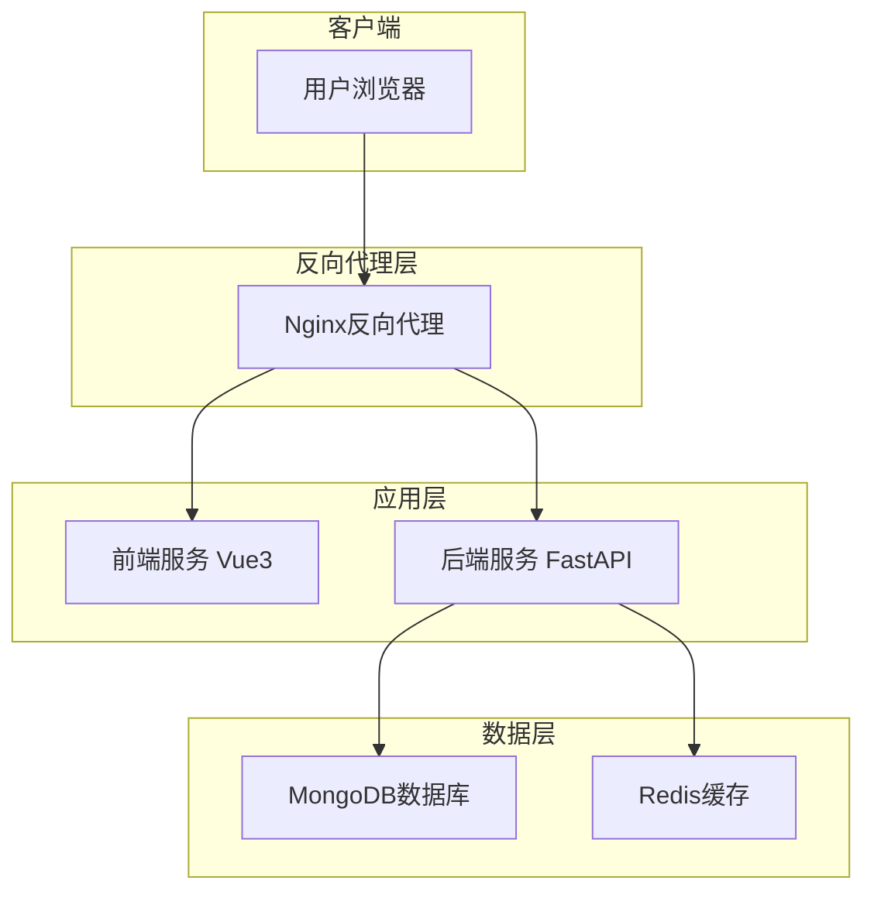
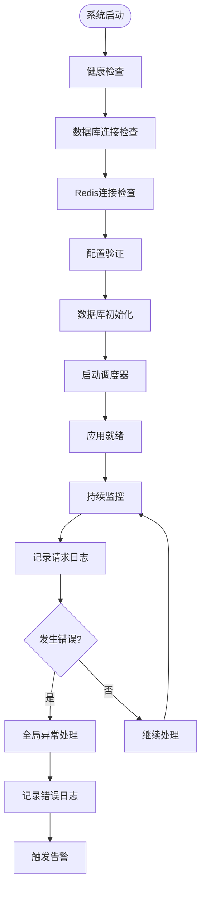

# 生产环境部署

<cite>
**本文档引用的文件**  
- [docker-compose.yml](file://docker-compose.yml)
- [Dockerfile.backend](file://Dockerfile.backend)
- [Dockerfile.frontend](file://Dockerfile.frontend)
- [nginx/nginx.conf](file://nginx/nginx.conf)
- [docker/nginx.conf](file://docker/nginx.conf)
- [app/main.py](file://app/main.py)
- [scripts/start_docker.sh](file://scripts/start_docker.sh)
- [scripts/docker-init.sh](file://scripts/docker-init.sh)
- [scripts/init-directories.sh](file://scripts/init-directories.sh)
- [scripts/mongo-init.js](file://scripts/mongo-init.js)
</cite>

## 目录
1. [高可用架构设计](#高可用架构设计)
2. [反向代理与SSL配置](#反向代理与ssl配置)
3. [监控与告警系统](#监控与告警系统)
4. [备份与恢复策略](#备份与恢复策略)
5. [安全加固措施](#安全加固措施)
6. [容量规划与性能调优](#容量规划与性能调优)
7. [应急处理与故障排查](#应急处理与故障排查)
8. [平滑升级与版本迭代](#平滑升级与版本迭代)

## 高可用架构设计

sagacity系统采用基于Docker Compose的微服务架构，实现了高可用性、服务冗余和故障转移机制。系统由前端、后端、数据库和缓存服务组成，通过Docker容器化部署，确保环境一致性。



**图示来源**  
- [docker-compose.yml](file://docker-compose.yml#L6-L209)
- [Dockerfile.backend](file://Dockerfile.backend#L1-L89)
- [Dockerfile.frontend](file://Dockerfile.frontend#L1-L47)

系统通过以下机制实现高可用性：

1. **服务冗余**：所有服务均以Docker容器形式运行，支持快速重启和横向扩展。
2. **健康检查**：每个服务都配置了健康检查机制，确保服务状态的实时监控。
   - 后端服务：通过`/api/health`端点进行健康检查
   - MongoDB：通过`db.runCommand("ping")`命令检查
   - Redis：通过`redis-cli ping`命令检查
3. **故障转移**：Docker Compose的`depends_on`配置确保服务启动顺序，后端服务依赖于数据库和缓存服务的健康状态。
4. **自动重启**：所有服务配置了`restart: unless-stopped`策略，确保服务异常退出后能自动重启。

**本节来源**  
- [docker-compose.yml](file://docker-compose.yml#L51-L57)
- [app/main.py](file://app/main.py#L604-L764)

## 反向代理与SSL配置

系统采用Nginx作为反向代理服务器，实现前后端分离架构的统一入口。Nginx配置文件位于`nginx/nginx.conf`，通过Docker Compose部署。

### Nginx配置要点

1. **上游服务定义**：配置了后端服务的上游服务器
   ```nginx
   upstream backend {
       server backend:8000;
   }
   ```

2. **API代理**：将`/api/`路径的请求代理到后端服务
   ```nginx
   location /api/ {
       proxy_pass http://backend/api/;
       proxy_set_header Host $host;
       proxy_set_header X-Real-IP $remote_addr;
       proxy_set_header X-Forwarded-For $proxy_add_x_forwarded_for;
       proxy_set_header X-Forwarded-Proto $scheme;
   }
   ```

3. **WebSocket支持**：为WebSocket连接配置了特殊的代理头
   ```nginx
   proxy_http_version 1.1;
   proxy_set_header Upgrade $http_upgrade;
   proxy_set_header Connection "upgrade";
   ```

4. **超时设置**：针对WebSocket长连接设置了较长的超时时间
   ```nginx
   proxy_connect_timeout 120s;
   proxy_send_timeout 3600s;  # 1小时
   proxy_read_timeout 3600s;  # 1小时
   ```

5. **缓存控制**：禁用API响应的缓存，确保数据实时性
   ```nginx
   add_header Cache-Control "no-store, no-cache, must-revalidate, proxy-revalidate, max-age=0";
   ```

### SSL证书部署

虽然当前配置未直接显示SSL配置，但可以通过以下方式部署SSL证书：

1. **更新Nginx配置**：在`nginx/nginx.conf`中添加SSL相关配置
2. **使用HTTPS监听**：将监听端口从80改为443
3. **配置证书路径**：指定SSL证书和私钥的文件路径
4. **重定向HTTP到HTTPS**：将HTTP请求重定向到HTTPS

建议使用Let's Encrypt等免费SSL证书服务，通过Certbot工具自动化证书申请和续期。

**本节来源**  
- [nginx/nginx.conf](file://nginx/nginx.conf#L33-L98)
- [Dockerfile.frontend](file://Dockerfile.frontend#L40-L41)

## 监控与告警系统

sagacity系统内置了完善的监控和告警机制，涵盖日志收集、性能监控和异常告警。

### 日志收集

系统采用多层级日志策略，确保各类日志的有效收集和管理：

1. **日志级别**：支持DEBUG、INFO、WARNING、ERROR、CRITICAL五个级别
2. **日志文件**：主日志文件`tradingagents.log`和错误日志文件`tradingagents_error.log`
3. **日志轮转**：主日志文件最大100MB，保留5个历史文件；错误日志文件最大50MB，保留3个历史文件
4. **日志目录**：所有日志存储在`./logs`目录，通过Docker卷映射持久化

日志配置文件`config/logging.toml`定义了详细的日志格式和处理器：

```toml
[logging.handlers.file]
class = "logging.handlers.RotatingFileHandler"
level = "DEBUG"
formatter = "detailed"
filename = "/app/logs/tradingagents.log"
maxBytes = 104857600  # 100MB
backupCount = 5
encoding = "utf8"
```

### 性能监控

系统通过以下方式实现性能监控：

1. **Docker资源监控**：通过Docker自身的资源监控功能，监控CPU、内存、网络和磁盘使用情况
2. **应用性能监控**：在`app/main.py`中实现了请求日志中间件，记录每个请求的处理时间和状态
3. **数据库性能**：通过MongoDB和Redis的内置监控功能，监控数据库性能指标

### 异常告警

系统通过以下机制实现异常告警：

1. **健康检查端点**：提供`/health`端点用于外部监控系统检查服务状态
2. **全局异常处理**：在FastAPI应用中配置了全局异常处理器，捕获未处理的异常
3. **日志告警**：通过分析日志中的ERROR和CRITICAL级别日志，触发告警



**本节来源**  
- [app/main.py](file://app/main.py#L634-L655)
- [config/logging.toml](file://config/logging.toml)
- [scripts/mongo-init.js](file://scripts/mongo-init.js)

## 备份与恢复策略

sagacity系统实施了全面的备份与恢复策略，确保数据安全和业务连续性。

### 数据库备份

系统使用MongoDB作为主数据库，备份策略包括：

1. **自动备份**：通过Docker卷持久化数据，确保容器重启后数据不丢失
2. **手动备份**：使用MongoDB的`mongodump`工具进行数据备份
3. **备份频率**：建议每日进行一次完整备份，每小时进行一次增量备份

### 配置备份

关键配置文件的备份策略：

1. **环境变量**：`.env`文件包含敏感信息，需定期备份
2. **运行时配置**：`config/`目录下的配置文件需纳入备份范围
3. **日志配置**：`config/logging.toml`等日志配置文件需备份

### 灾难恢复流程

灾难恢复流程包括以下步骤：

1. **恢复基础设施**：重新部署Docker容器环境
2. **恢复数据**：从备份中恢复MongoDB数据
3. **恢复配置**：恢复`.env`和其他配置文件
4. **验证系统**：检查系统各组件是否正常运行

系统初始化脚本`scripts/docker-init.sh`提供了完整的环境初始化流程，可用于灾难恢复：

```bash
# 停止现有容器
docker-compose down

# 拉取最新镜像
docker-compose pull

# 构建自定义镜像
docker-compose build

# 启动数据库服务
docker-compose up -d mongodb redis

# 初始化数据库
docker-compose exec -T mongodb mongo tradingagents /docker-entrypoint-initdb.d/mongo-init.js

# 启动应用服务
docker-compose up -d
```

**本节来源**  
- [scripts/docker-init.sh](file://scripts/docker-init.sh#L73-L143)
- [scripts/mongo-init.js](file://scripts/mongo-init.js)
- [docker-compose.yml](file://docker-compose.yml#L195-L201)

## 安全加固措施

sagacity系统实施了多层次的安全加固措施，包括网络隔离、访问控制和安全审计。

### 网络隔离

1. **Docker网络**：使用自定义的`tradingagents-network`桥接网络，隔离系统内部通信
2. **端口暴露**：仅暴露必要的端口（8000、3000、27017、6379），减少攻击面
3. **防火墙规则**：建议在主机层面配置防火墙，限制对数据库和缓存服务的直接访问

### 访问控制

1. **数据库认证**：MongoDB和Redis均配置了用户名和密码认证
2. **API认证**：通过JWT令牌实现API访问控制
3. **CORS配置**：限制跨域请求的来源，防止CSRF攻击
4. **环境变量保护**：敏感信息（如API密钥）通过环境变量配置，不硬编码在代码中

### 安全审计

1. **操作日志**：系统记录用户操作日志，便于安全审计
2. **登录审计**：记录用户登录活动，监控异常登录行为
3. **配置审计**：系统配置变更记录在`system_config`集合中

系统在启动时会进行安全配置检查，确保关键安全设置已正确配置：

```python
# 安全中间件
if not settings.DEBUG:
    app.add_middleware(
        TrustedHostMiddleware,
        allowed_hosts=settings.ALLOWED_HOSTS
    )
```

**本节来源**  
- [docker-compose.yml](file://docker-compose.yml#L96-L148)
- [app/main.py](file://app/main.py#L614-L618)
- [scripts/mongo-init.js](file://scripts/mongo-init.js#L9-L24)

## 容量规划与性能调优

### 容量规划

根据系统组件的资源需求，建议的容量规划如下：

| 组件 | CPU | 内存 | 存储 | 网络 |
|------|-----|------|------|------|
| 前端服务 | 1核 | 512MB | 1GB | 10Mbps |
| 后端服务 | 2核 | 2GB | 1GB | 50Mbps |
| MongoDB | 2核 | 4GB | SSD 50GB | 100Mbps |
| Redis | 1核 | 1GB | 1GB | 50Mbps |

### 性能调优建议

1. **数据库优化**：
   - 确保所有查询字段都有适当的索引
   - 定期分析查询性能，优化慢查询
   - 合理设置MongoDB的WiredTiger缓存大小

2. **缓存策略**：
   - 使用Redis缓存频繁访问的数据
   - 设置合理的缓存过期时间
   - 实现缓存穿透、缓存击穿和缓存雪崩的防护机制

3. **应用性能**：
   - 优化FastAPI中间件的执行顺序
   - 使用异步数据库操作减少I/O等待时间
   - 合理配置Gunicorn工作进程数

4. **网络优化**：
   - 启用Nginx的Gzip压缩减少传输数据量
   - 配置合理的连接超时和保持时间
   - 使用HTTP/2协议提升传输效率

**本节来源**  
- [docker-compose.yml](file://docker-compose.yml#L58-L62)
- [Dockerfile.backend](file://Dockerfile.backend#L23-L56)
- [nginx/nginx.conf](file://nginx/nginx.conf#L28-L31)

## 应急处理与故障排查

### 应急处理流程

当系统出现故障时，应按照以下流程进行应急处理：

1. **故障确认**：通过健康检查端点确认故障范围
2. **服务隔离**：如果可能，隔离故障服务，防止影响其他组件
3. **日志分析**：查看相关服务的日志文件，定位问题原因
4. **临时恢复**：尝试重启相关服务，恢复基本功能
5. **根本解决**：根据日志分析结果，实施根本性解决方案
6. **验证修复**：确认问题已解决，系统恢复正常

### 故障排查手册

常见故障及排查方法：

1. **服务无法启动**：
   - 检查Docker是否正常运行
   - 检查`.env`文件是否存在且配置正确
   - 查看Docker日志`docker-compose logs`

2. **数据库连接失败**：
   - 检查MongoDB和Redis服务是否正常运行
   - 验证数据库连接字符串是否正确
   - 检查网络连接是否正常

3. **API响应缓慢**：
   - 检查系统资源使用情况（CPU、内存）
   - 分析慢查询日志
   - 检查网络延迟

4. **前端无法访问**：
   - 检查Nginx反向代理配置
   - 验证前端服务是否正常运行
   - 检查浏览器控制台错误信息

**本节来源**  
- [scripts/start_docker.sh](file://scripts/start_docker.sh)
- [scripts/docker-init.sh](file://scripts/docker-init.sh)
- [app/main.py](file://app/main.py#L659-L675)

## 平滑升级与版本迭代

### 升级策略

系统支持平滑升级，建议采用以下策略：

1. **备份数据**：升级前备份所有重要数据
2. **测试环境验证**：在测试环境验证新版本的兼容性和稳定性
3. **灰度发布**：先在部分用户中发布新版本，观察运行情况
4. **全量发布**：确认无问题后，全面升级到新版本
5. **回滚计划**：准备回滚方案，以便在出现问题时快速恢复

### 版本迭代流程

1. **代码更新**：拉取最新代码或镜像
2. **配置检查**：检查新版本的配置要求，更新配置文件
3. **服务升级**：使用Docker Compose的`pull`和`up`命令升级服务
4. **健康检查**：确认升级后服务正常运行
5. **监控观察**：密切监控系统运行状态，及时发现并解决问题

系统提供了完整的初始化和部署脚本，简化了升级流程：

```bash
# 执行完整的部署初始化
./scripts/docker-init.sh

# 或者使用启动脚本
./scripts/start_docker.sh
```

**本节来源**  
- [scripts/docker-init.sh](file://scripts/docker-init.sh)
- [scripts/start_docker.sh](file://scripts/start_docker.sh)
- [docker-compose.yml](file://docker-compose.yml)