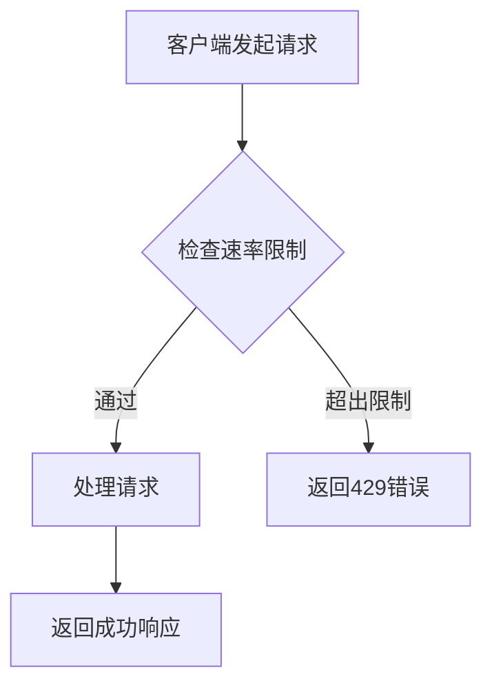
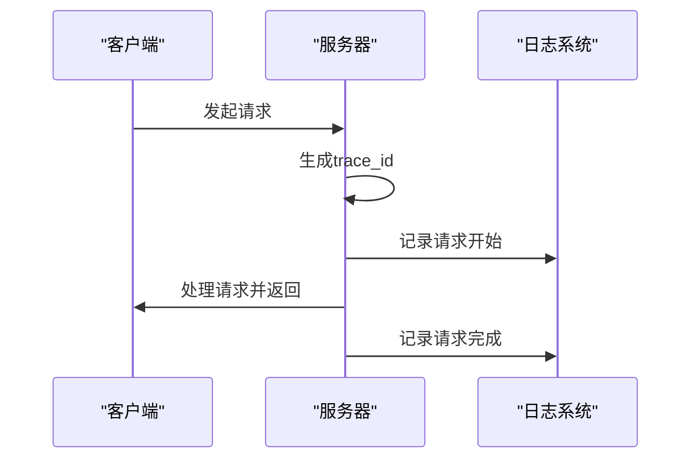

# API问题

<cite>
**本文档引用的文件**
- [request_id.py](file://app/middleware/request_id.py)
- [error_handler.py](file://app/middleware/error_handler.py)
- [config_service.py](file://app/services/config_service.py)
- [rate_limit.py](file://app/middleware/rate_limit.py)
- [main.py](file://app/main.py)
- [config.py](file://app/core/config.py)
- [logging_config.py](file://app/core/logging_config.py)
- [logging_context.py](file://app/core/logging_context.py)
- [health.py](file://app/routers/health.py)
- [API_KEY_TESTING_GUIDE.md](file://docs/API_KEY_TESTING_GUIDE.md)
- [llm-config-test-fix.md](file://docs/troubleshooting/llm-config-test-fix.md)
- [.env.docker](file://.env.docker)
</cite>

## 目录
1. [API调用失败排查](#api调用失败排查)
2. [认证错误处理](#认证错误处理)
3. [响应超时与限流](#响应超时与限流)
4. [常见错误码解析](#常见错误码解析)
5. [日志与请求ID追踪](#日志与请求id追踪)
6. [LLM配置测试失败原因](#llm配置测试失败原因)
7. [前后端通信问题](#前后端通信问题)
8. [API手动测试示例](#api手动测试示例)

## API调用失败排查

当API调用失败时，首先需要确认请求的URL是否正确。根据代码库中的配置，API端点应以`/api`为前缀。如果请求的URL不包含此前缀，可能会导致404错误。

此外，需要检查请求方法（GET、POST等）是否与API文档中定义的一致。错误的请求方法会导致服务器返回405错误。

**Section sources**
- [main.py](file://app/main.py#L685-L707)
- [health.py](file://app/routers/health.py#L1-L41)

## 认证错误处理

认证错误通常表现为401 Unauthorized状态码。这表示提供的API密钥无效或已过期。在本系统中，认证错误的处理逻辑位于`app/middleware/error_handler.py`文件中。

当发生认证错误时，系统会返回标准化的错误响应，包含错误代码、消息和请求ID。用户应检查其API密钥是否正确，并确保没有在密钥前后添加多余的空格。

**Section sources**
- [error_handler.py](file://app/middleware/error_handler.py#L1-L89)
- [config_service.py](file://app/services/config_service.py#L1045-L1051)

## 响应超时与限流

响应超时可能是由于网络问题或服务器处理时间过长导致的。系统实现了速率限制机制，以防止滥用。当用户请求过于频繁时，会触发429 Too Many Requests错误。

速率限制的配置位于`app/middleware/rate_limit.py`文件中。系统根据用户ID和请求端点来跟踪请求频率，并在Redis中存储计数。如果在60秒内请求次数超过限制，将返回429错误。



**Diagram sources**
- [rate_limit.py](file://app/middleware/rate_limit.py#L43-L95)

**Section sources**
- [rate_limit.py](file://app/middleware/rate_limit.py#L43-L95)

## 常见错误码解析

| 错误码 | 含义 | 可能原因 | 解决方案 |
|-------|------|---------|---------|
| 401 | 未授权 | API密钥无效或已过期 | 检查并更新API密钥 |
| 403 | 权限不足 | 配额已用完或权限不足 | 检查配额使用情况，联系管理员 |
| 404 | 未找到 | API端点不存在 | 检查API基础URL是否正确 |
| 429 | 请求过于频繁 | 超出速率限制 | 降低请求频率，等待重置 |
| 500 | 服务器内部错误 | 服务器端出现异常 | 检查服务器日志，联系技术支持 |

**Section sources**
- [config_service.py](file://app/services/config_service.py#L1045-L1082)

## 日志与请求ID追踪

系统为每个请求生成唯一的请求ID（trace_id），并将其写入日志和响应头中。这有助于端到端的问题排查。请求ID由`app/middleware/request_id.py`中的`RequestIDMiddleware`生成。

日志系统通过`LoggingContextFilter`将trace_id写入LogRecord，使得所有日志记录都包含该ID。用户可以在日志中搜索特定的trace_id来追踪单次调用的完整链路。



**Diagram sources**
- [request_id.py](file://app/middleware/request_id.py#L1-L75)
- [logging_context.py](file://app/core/logging_context.py#L1-L18)

**Section sources**
- [request_id.py](file://app/middleware/request_id.py#L1-L75)
- [logging_context.py](file://app/core/logging_context.py#L1-L18)
- [logging_config.py](file://app/core/logging_config.py#L361-L396)

## LLM配置测试失败原因

LLM配置测试失败可能有多种原因：

1. **API密钥无效**：提供的API密钥不正确或已过期。
2. **基础URL配置错误**：API基础URL不正确，导致无法访问API端点。
3. **模型名称不匹配**：指定的模型名称在服务提供商处不存在。
4. **网络连接问题**：服务器无法访问外部API。

在`app/services/config_service.py`中，`test_llm_config`方法会构建一个标准的OpenAI兼容API请求，并发送到指定的API基础URL。如果响应状态码不是200，或者响应内容中缺少`choices`字段，测试将失败。

**Section sources**
- [config_service.py](file://app/services/config_service.py#L884-L908)
- [llm-config-test-fix.md](file://docs/troubleshooting/llm-config-test-fix.md#L1-L89)

## 前后端通信问题

前后端通信问题通常与CORS（跨域资源共享）配置有关。在`app/main.py`中，通过`CORSMiddleware`配置了允许的源、方法和头信息。

如果前端无法访问后端，应检查`ALLOWED_ORIGINS`配置是否包含前端的URL。此外，确保后端服务正在运行，并且端口没有被其他进程占用。

**Section sources**
- [main.py](file://app/main.py#L620-L627)
- [.env.docker](file://.env.docker#L166-L169)

## API手动测试示例

可以使用Postman或curl进行API手动测试。以下是一些示例：

### 使用curl测试健康检查API
```bash
curl http://localhost:8000/api/health
```

### 使用curl测试LLM配置
```bash
curl -X POST http://localhost:8000/api/config/test-llm \
  -H "Content-Type: application/json" \
  -d '{
    "provider": "deepseek",
    "model_name": "deepseek-chat",
    "api_key": "your-api-key",
    "api_base": "https://api.deepseek.com/v1"
  }'
```

### 使用Postman测试
1. 创建一个新的POST请求
2. URL设置为`http://localhost:8000/api/config/test-llm`
3. 在Headers中添加`Content-Type: application/json`
4. 在Body中选择raw JSON，输入配置信息
5. 发送请求并查看响应

**Section sources**
- [health.py](file://app/routers/health.py#L1-L41)
- [config_service.py](file://app/services/config_service.py#L1027-L1082)