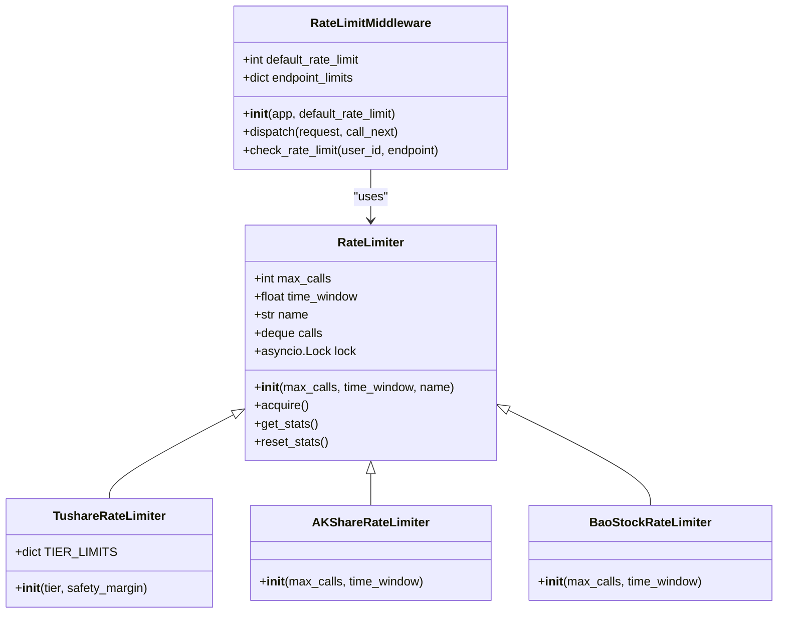
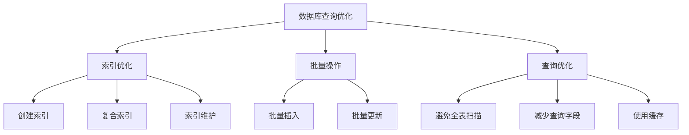
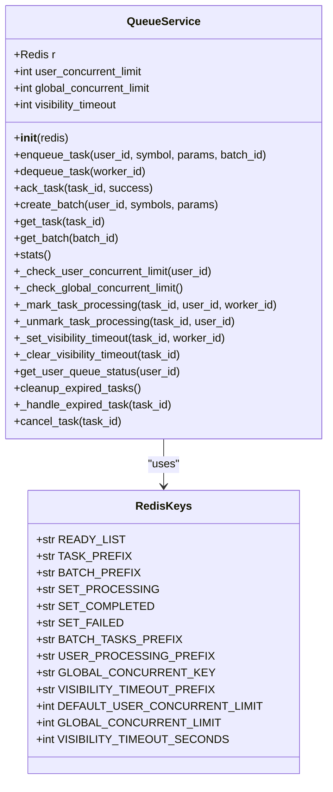
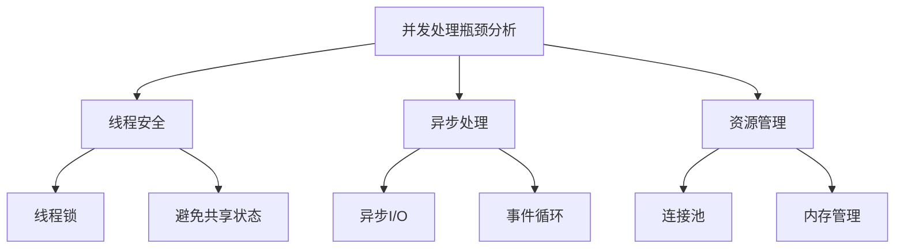
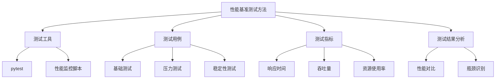

# 性能问题

<cite>
**本文档引用的文件**   
- [rate_limiter.py](file://app/core/rate_limiter.py)
- [rate_limit.py](file://app/middleware/rate_limit.py)
- [redis_client.py](file://app/core/redis_client.py)
- [memory_state_manager.py](file://app/services/memory_state_manager.py)
- [queue_service.py](file://app/services/queue_service.py)
- [keys.py](file://app/services/queue/keys.py)
- [database.py](file://app/core/database.py)
- [config.py](file://app/core/config.py)
- [health.py](file://app/routers/health.py)
- [queue.py](file://app/routers/queue.py)
- [test_performance_comparison.py](file://tests/test_performance_comparison.py)
- [concurrent-safety-summary.md](file://docs/troubleshooting/concurrent-safety-summary.md)
</cite>

## 目录
1. [引言](#引言)
2. [系统性能监控](#系统性能监控)
3. [限流机制配置与调优](#限流机制配置与调优)
4. [数据库查询优化](#数据库查询优化)
5. [任务队列管理策略](#任务队列管理策略)
6. [并发处理瓶颈分析](#并发处理瓶颈分析)
7. [性能基准测试方法](#性能基准测试方法)
8. [结论](#结论)

## 引言

本文档旨在解决系统响应慢、资源占用高、任务堆积等性能问题。通过分析系统的限流机制、数据库查询、任务队列和并发处理，提供全面的优化与排查指南。文档将指导用户如何监控系统性能指标，如CPU、内存、Redis队列长度，并详细说明限流机制的配置与调优，避免因过度请求导致服务降级。此外，文档还将提供数据库查询优化建议，如索引使用、批量操作，以及任务队列管理策略，如优先级设置、失败重试机制。最后，文档将给出性能基准测试的方法和预期指标，帮助用户评估系统的性能表现。

**Section sources**
- [rate_limiter.py](file://app/core/rate_limiter.py#L1-L229)
- [rate_limit.py](file://app/middleware/rate_limit.py#L1-L177)

## 系统性能监控

为了有效监控系统的性能，需要关注以下几个关键指标：

- **CPU使用率**：监控CPU使用率可以帮助识别系统是否处于高负载状态。高CPU使用率可能导致系统响应变慢。
- **内存使用率**：监控内存使用率可以防止内存泄漏和内存溢出问题。高内存使用率可能导致系统频繁进行垃圾回收，影响性能。
- **Redis队列长度**：Redis队列长度是衡量任务处理能力的重要指标。过长的队列可能导致任务堆积，影响系统响应速度。

### 监控工具和方法

- **日志监控**：通过日志记录系统的关键操作和性能指标，如请求处理时间、数据库查询时间等。日志可以帮助快速定位性能瓶颈。
- **健康检查接口**：系统提供了健康检查接口 `/health`，可以定期调用以检查系统的运行状态。该接口返回系统的版本号、时间戳和状态信息。
- **性能监控脚本**：使用性能监控脚本 `test_performance_comparison.py` 可以对比优化前后的性能差异，帮助评估优化效果。

```mermaid
graph TD
A[系统性能监控] --> B[CPU使用率]
A --> C[内存使用率]
A --> D[Redis队列长度]
B --> E[日志监控]
C --> E
D --> E
E --> F[健康检查接口]
F --> G[/health]
F --> H[/healthz]
F --> I[/readyz]
```

**Diagram sources **
- [health.py](file://app/routers/health.py#L1-L41)
- [test_performance_comparison.py](file://tests/test_performance_comparison.py#L1-L218)

**Section sources**
- [health.py](file://app/routers/health.py#L1-L41)
- [test_performance_comparison.py](file://tests/test_performance_comparison.py#L1-L218)

## 限流机制配置与调优

限流机制是防止系统因过度请求而降级的重要手段。系统通过速率限制器和中间件实现了多层次的限流策略。

### 速率限制器

系统使用 `RateLimiter` 类实现滑动窗口算法，精确控制API调用频率。`RateLimiter` 类的主要参数包括：

- `max_calls`：时间窗口内最大调用次数。
- `time_window`：时间窗口大小（秒）。
- `name`：限制器名称（用于日志）。

```python
class RateLimiter:
    def __init__(self, max_calls: int, time_window: float, name: str = "RateLimiter"):
        self.max_calls = max_calls
        self.time_window = time_window
        self.name = name
        self.calls = deque()  # 存储调用时间戳
        self.lock = asyncio.Lock()  # 确保线程安全
```

### 专用速率限制器

系统为不同的数据源提供了专用的速率限制器，如 `TushareRateLimiter`、`AKShareRateLimiter` 和 `BaoStockRateLimiter`。这些限制器根据数据源的特性配置了不同的限流策略。

```python
class TushareRateLimiter(RateLimiter):
    TIER_LIMITS = {
        "free": {"max_calls": 100, "time_window": 60},
        "basic": {"max_calls": 200, "time_window": 60},
        "standard": {"max_calls": 400, "time_window": 60},
        "premium": {"max_calls": 600, "time_window": 60},
        "vip": {"max_calls": 800, "time_window": 60},
    }
```

### 限流中间件

系统通过 `RateLimitMiddleware` 中间件实现用户级和端点级的速率限制。中间件配置了不同端点的速率限制，如单股分析、批量分析、股票筛选等。

```python
class RateLimitMiddleware(BaseHTTPMiddleware):
    def __init__(self, app, default_rate_limit: int = 100):
        super().__init__(app)
        self.default_rate_limit = default_rate_limit
        self.endpoint_limits = {
            "/api/analysis/single": 10,
            "/api/analysis/batch": 5,
            "/api/screening/filter": 20,
            "/api/auth/login": 5,
            "/api/auth/register": 3,
        }
```

### 配置与调优

- **调整限流参数**：根据系统的实际负载和数据源的限制，调整 `max_calls` 和 `time_window` 参数。
- **监控限流效果**：通过日志和监控工具监控限流效果，确保限流策略不会影响正常业务。
- **动态调整**：在高负载情况下，可以动态调整限流参数，以平衡系统性能和用户体验。



**Diagram sources **
- [rate_limiter.py](file://app/core/rate_limiter.py#L1-L229)
- [rate_limit.py](file://app/middleware/rate_limit.py#L1-L177)

**Section sources**
- [rate_limiter.py](file://app/core/rate_limiter.py#L1-L229)
- [rate_limit.py](file://app/middleware/rate_limit.py#L1-L177)

## 数据库查询优化

数据库查询是系统性能的关键环节。优化数据库查询可以显著提高系统的响应速度和处理能力。

### 索引优化

- **创建索引**：为常用的查询字段创建索引，如股票代码、交易日期等。索引可以显著提高查询速度。
- **复合索引**：对于多字段查询，创建复合索引可以进一步提高查询效率。
- **索引维护**：定期检查和维护索引，确保索引的有效性和性能。

```python
async def create_database_indexes(db):
    try:
        basic_info = db["stock_basic_info"]
        await basic_info.create_index([("code", 1), ("source", 1)], unique=True)
        await basic_info.create_index([("industry", 1)])
        await basic_info.create_index([("total_mv", -1)])
        await basic_info.create_index([("pe", 1)])
        await basic_info.create_index([("pb", 1)])

        market_quotes = db["market_quotes"]
        await market_quotes.create_index([("code", 1)], unique=True)
        await market_quotes.create_index([("pct_chg", -1)])
        await market_quotes.create_index([("amount", -1)])
        await market_quotes.create_index([("updated_at", -1)])

        logger.info("✅ 数据库索引创建完成")
    except Exception as e:
        logger.warning(f"⚠️ 创建索引失败: {e}")
```

### 批量操作

- **批量插入**：使用批量插入操作可以显著减少数据库的I/O开销，提高插入速度。
- **批量更新**：对于大量数据的更新操作，使用批量更新可以减少事务开销，提高更新效率。

### 查询优化

- **避免全表扫描**：尽量使用索引字段进行查询，避免全表扫描。
- **减少查询字段**：只查询需要的字段，减少数据传输量。
- **使用缓存**：对于频繁查询的数据，使用缓存可以减少数据库查询次数，提高响应速度。



**Diagram sources **
- [database.py](file://app/core/database.py#L1-L443)

**Section sources**
- [database.py](file://app/core/database.py#L1-L443)

## 任务队列管理策略

任务队列是系统处理异步任务的核心组件。合理的任务队列管理策略可以提高系统的并发处理能力和任务处理效率。

### 任务队列结构

- **待处理队列**：存储待处理的任务。
- **处理中队列**：存储正在处理的任务。
- **完成队列**：存储已完成的任务。
- **失败队列**：存储处理失败的任务。

### 并发控制

- **用户并发限制**：每个用户在同一时间只能处理一定数量的任务，防止用户过度占用系统资源。
- **全局并发限制**：系统在同一时间只能处理一定数量的任务，防止系统过载。

```python
class QueueService:
    def __init__(self, redis: Redis):
        self.r = redis
        self.user_concurrent_limit = DEFAULT_USER_CONCURRENT_LIMIT
        self.global_concurrent_limit = GLOBAL_CONCURRENT_LIMIT
        self.visibility_timeout = VISIBILITY_TIMEOUT_SECONDS
```

### 优先级设置

- **任务优先级**：为不同类型的任务设置不同的优先级，确保高优先级任务优先处理。
- **动态调整**：根据系统负载和任务类型动态调整任务优先级。

### 失败重试机制

- **重试次数**：为每个任务设置最大重试次数，防止无限重试导致系统资源耗尽。
- **重试间隔**：设置合理的重试间隔，避免频繁重试对系统造成压力。

```python
async def cleanup_expired_tasks(self):
    try:
        timeout_keys = await self.r.keys(VISIBILITY_TIMEOUT_PREFIX + "*")
        current_time = int(time.time())
        expired_tasks = []

        for timeout_key in timeout_keys:
            timeout_data = await self.r.hgetall(timeout_key)
            if timeout_data:
                timeout_at = int(timeout_data.get("timeout_at", 0))
                if current_time > timeout_at:
                    task_id = timeout_data.get("task_id")
                    if task_id:
                        expired_tasks.append(task_id)

        for task_id in expired_tasks:
            await self._handle_expired_task(task_id)

        if expired_tasks:
            logger.warning(f"处理了 {len(expired_tasks)} 个过期任务")
    except Exception as e:
        logger.error(f"清理过期任务失败: {e}")
```



**Diagram sources **
- [queue_service.py](file://app/services/queue_service.py#L1-L364)
- [keys.py](file://app/services/queue/keys.py#L1-L23)

**Section sources**
- [queue_service.py](file://app/services/queue_service.py#L1-L364)
- [keys.py](file://app/services/queue/keys.py#L1-L23)

## 并发处理瓶颈分析

并发处理是系统性能的关键因素。分析并发处理瓶颈可以帮助优化系统的并发处理能力。

### 线程安全

- **线程锁**：使用线程锁确保多线程环境下的数据一致性。例如，`MemoryStateManager` 类使用 `threading.Lock` 确保线程安全。
- **避免共享状态**：尽量避免在多线程环境中共享可变状态，防止数据混淆。

```python
class MemoryStateManager:
    def __init__(self):
        self._tasks: Dict[str, TaskState] = {}
        self._lock = threading.Lock()
        self._websocket_manager = None
```

### 异步处理

- **异步I/O**：使用异步I/O操作可以提高系统的并发处理能力。例如，使用 `asyncio` 和 `aiohttp` 进行异步HTTP请求。
- **事件循环**：确保每个线程都有独立的事件循环，避免事件循环冲突。

```python
try:
    loop = asyncio.get_event_loop()
    if loop.is_closed():
        loop = asyncio.new_event_loop()
        asyncio.set_event_loop(loop)
except RuntimeError:
    loop = asyncio.new_event_loop()
    asyncio.set_event_loop(loop)
```

### 资源管理

- **连接池**：使用连接池管理数据库和Redis连接，减少连接开销。
- **内存管理**：合理管理内存使用，避免内存泄漏和内存溢出。

```python
async def init_redis():
    global redis_pool, redis_client

    try:
        redis_pool = redis.ConnectionPool.from_url(
            settings.REDIS_URL,
            max_connections=settings.REDIS_MAX_CONNECTIONS,
            retry_on_timeout=settings.REDIS_RETRY_ON_TIMEOUT,
            decode_responses=True,
            socket_keepalive=True,
            socket_keepalive_options={
                1: 60,
                2: 10,
                3: 3,
            },
            health_check_interval=30,
        )

        redis_client = redis.Redis(connection_pool=redis_pool)
        await redis_client.ping()
        logger.info(f"✅ Redis连接成功建立 (max_connections={settings.REDIS_MAX_CONNECTIONS})")
    except Exception as e:
        logger.error(f"❌ Redis连接失败: {e}")
        raise
```



**Diagram sources **
- [memory_state_manager.py](file://app/services/memory_state_manager.py#L1-L421)
- [redis_client.py](file://app/core/redis_client.py#L1-L203)

**Section sources**
- [memory_state_manager.py](file://app/services/memory_state_manager.py#L1-L421)
- [redis_client.py](file://app/core/redis_client.py#L1-L203)

## 性能基准测试方法

性能基准测试是评估系统性能的重要手段。通过基准测试可以验证优化效果，确保系统在高负载下的稳定性和性能。

### 测试工具

- **pytest**：使用 `pytest` 框架编写和运行性能测试。
- **性能监控脚本**：使用性能监控脚本 `test_performance_comparison.py` 对比优化前后的性能差异。

### 测试用例

- **基础测试**：测试系统在正常负载下的性能表现。
- **压力测试**：测试系统在高负载下的性能表现，如高并发请求、大量数据处理等。
- **稳定性测试**：测试系统在长时间运行下的稳定性和性能表现。

### 测试指标

- **响应时间**：测量系统处理请求的平均响应时间。
- **吞吐量**：测量系统在单位时间内处理的请求数量。
- **资源使用率**：监控CPU、内存、网络等资源的使用率。

### 测试结果分析

- **性能对比**：对比优化前后的性能指标，评估优化效果。
- **瓶颈识别**：通过测试结果识别系统性能瓶颈，进一步优化。

```python
def compare_performance():
    print("=" * 80)
    print("📊 基本面分析数据获取策略性能对比测试")
    print("=" * 80)

    old_results = simulate_old_strategy()
    new_result = test_new_strategy()

    print("\n" + "=" * 80)
    print("📈 性能对比分析")
    print("=" * 80)

    if new_result['success']:
        print(f"\n🚀 优化后策略性能:")
        print(f"   - 数据长度: {new_result['data_length']:,} 字符")
        print(f"   - 处理时间: {new_result['processing_time']:.2f}秒")
        print(f"   - 请求天数: {new_result['days_requested']}天")

        print(f"\n📊 与优化前各级别对比:")

        successful_old = {k: v for k, v in old_results.items() if v['success']}

        if successful_old:
            old_data_lengths = [v['data_length'] for v in successful_old.values()]
            avg_old_length = sum(old_data_lengths) / len(old_data_lengths)
            max_old_length = max(old_data_lengths)
            min_old_length = min(old_data_lengths)

            print(f"\n📏 数据传输量对比:")
            print(f"   - 优化前平均: {avg_old_length:,.0f} 字符")
            print(f"   - 优化前范围: {min_old_length:,} - {max_old_length:,} 字符")
            print(f"   - 优化后: {new_result['data_length']:,} 字符")
            print(f"   - 数据减少: {(avg_old_length - new_result['data_length'])/avg_old_length*100:.1f}%")

            old_times = [v['processing_time'] for v in successful_old.values()]
            avg_old_time = sum(old_times) / len(old_times)

            print(f"\n⏱️ 处理时间对比:")
            print(f"   - 优化前平均: {avg_old_time:.2f}秒")
            print(f"   - 优化后: {new_result['processing_time']:.2f}秒")
            print(f"   - 时间节省: {(avg_old_time - new_result['processing_time'])/avg_old_time*100:.1f}%")

            print(f"\n📋 详细对比表:")
            print(f"{'策略':<25} | {'天数':<4} | {'数据量(字符)':<12} | {'时间(秒)':<8} | {'状态'}")
            print("-" * 70)

            for depth, result in old_results.items():
                status = "✅" if result['success'] else "❌"
                data_len = f"{result['data_length']:,}" if result['success'] else "N/A"
                proc_time = f"{result['processing_time']:.2f}" if result['success'] else "N/A"
                print(f"{result['description']:<25} | {result['days_requested']:<4} | {data_len:<12} | {proc_time:<8} | {status}")

            print("-" * 70)
            data_len = f"{new_result['data_length']:,}"
            proc_time = f"{new_result['processing_time']:.2f}"
            print(f"{'优化后策略':<25} | {new_result['days_requested']:<4} | {data_len:<12} | {proc_time:<8} | ✅")

            print(f"\n💡 优化效果总结:")
            print(f"   ✅ 数据传输量平均减少 {(avg_old_length - new_result['data_length'])/avg_old_length*100:.1f}%")
            print(f"   ✅ 处理时间平均节省 {(avg_old_time - new_result['processing_time'])/avg_old_time*100:.1f}%")
            print(f"   ✅ 保持基本面分析所需的核心信息完整性")
            print(f"   ✅ 提高了数据获取的针对性和效率")
            print(f"   ✅ 减少了不必要的历史价格数据传输")
    else:
        print(f"❌ 优化后策略测试失败: {new_result.get('error', '未知错误')}")

    print(f"\n🎉 性能对比测试完成！")
```



**Diagram sources **
- [test_performance_comparison.py](file://tests/test_performance_comparison.py#L1-L218)

**Section sources**
- [test_performance_comparison.py](file://tests/test_performance_comparison.py#L1-L218)

## 结论

本文档详细介绍了系统性能问题的优化与排查方法。通过监控系统性能指标、配置和调优限流机制、优化数据库查询、管理任务队列和分析并发处理瓶颈，可以显著提高系统的性能和稳定性。性能基准测试方法为评估优化效果提供了科学依据。希望本文档能帮助用户有效解决系统性能问题，提升用户体验。