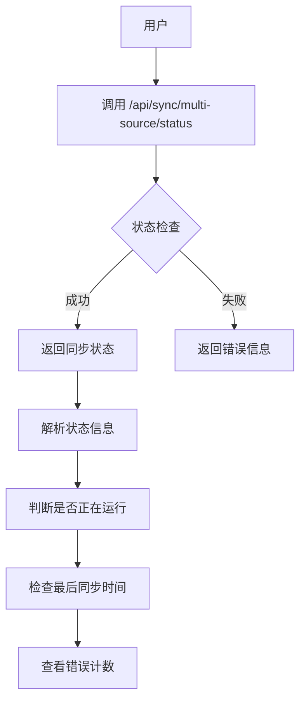
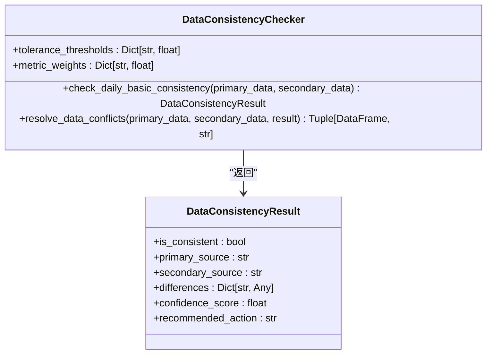
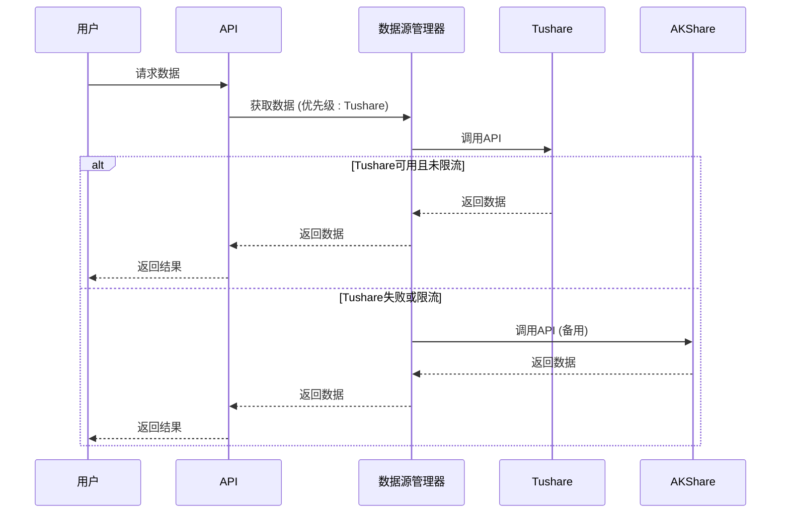

# 数据同步问题

<cite>
**本文档引用的文件**   
- [batch-analysis-concurrent-fix.md](file://docs/troubleshooting/batch-analysis-concurrent-fix.md)
- [data_consistency_checker.py](file://app/services/data_consistency_checker.py)
- [multi_source_basics_sync_service.py](file://app/services/multi_source_basics_sync_service.py)
- [tushare_sync_service.py](file://app/worker/tushare_sync_service.py)
- [akshare_sync_service.py](file://app/worker/akshare_sync_service.py)
- [rate_limiter.py](file://app/core/rate_limiter.py)
- [manager.py](file://app/services/data_sources/manager.py)
- [multi_source_sync.py](file://app/routers/multi_source_sync.py)
- [sync.py](file://app/routers/sync.py)
- [manual_sync_trigger.py](file://scripts/manual_sync_trigger.py)
</cite>

## 目录
1. [引言](#引言)
2. [批量分析并发问题](#批量分析并发问题)
3. [数据源同步失败处理](#数据源同步失败处理)
4. [数据不一致诊断与解决](#数据不一致诊断与解决)
5. [数据源限流与连接问题](#数据源限流与连接问题)
6. [数据回填与手动同步](#数据回填与手动同步)
7. [总结](#总结)

## 引言

本指南旨在为数据同步过程中遇到的各类问题提供深度排查和解决方案。系统集成了Tushare、AKShare、BaoStock等多个数据源，支持多周期、多市场的数据同步。然而，在实际运行中可能会遇到批量分析并发执行问题、数据源同步失败、数据不一致、限流连接异常等挑战。本指南将详细解释`batch-analysis-concurrent-fix.md`中提到的并发安全问题及其解决方案，指导用户如何验证数据同步状态，检查定时任务执行情况，诊断数据完整性问题，并提供应急操作步骤。

**Section sources**
- [batch-analysis-concurrent-fix.md](file://docs/troubleshooting/batch-analysis-concurrent-fix.md)

## 批量分析并发问题

### 问题描述

在早期版本中，用户提交批量分析任务时，系统并未真正实现并发执行，而是串行处理。这意味着分析3只股票的总耗时等于单个任务耗时的3倍，严重影响了用户体验和系统效率。

### 根本原因

经过深入分析，发现存在三个关键问题：

1.  **FastAPI BackgroundTasks 串行执行**：FastAPI的`BackgroundTasks`机制在内部使用`for task in self.tasks: await task()`来执行任务，导致任务被一个接一个地执行，而非并发。
2.  **线程池配置不当**：每次调用都创建新的线程池，导致资源浪费和潜在的线程安全问题。
3.  **实例共享导致状态污染**：多个任务共享同一个`TradingAgentsGraph`实例，导致任务间的可变状态（如`ticker`、`curr_state`）相互覆盖，造成严重的数据混淆。

### 解决方案

系统已通过以下方式彻底解决了并发问题：

1.  **使用 `asyncio.create_task` 实现真正并发**：在`app/routers/analysis.py`的`submit_batch_analysis`端点中，不再使用`BackgroundTasks`，而是使用`asyncio.create_task`在后台启动并发任务，并通过`asyncio.gather`等待所有任务完成。
2.  **创建共享线程池**：在`simple_analysis_service.py`中，将线程池作为服务实例的成员变量在`__init__`中初始化，确保所有任务共享同一个线程池，避免了资源竞争。
3.  **确保实例隔离**：修改`_get_trading_graph`方法，每次调用都创建一个新的`TradingAgentsGraph`实例，从根本上杜绝了状态共享问题。

### 验证方法

1.  **检查日志**：提交批量分析后，查看日志是否出现类似`🚀 [并发任务] 开始执行: task-1 - 000001`、`🚀 [并发任务] 开始执行: task-2 - 000002`的记录，确认多个任务同时开始。
2.  **检查任务中心**：任务中心应显示多个“进行中”的任务，而非只有一个。
3.  **检查总耗时**：3个任务的总耗时应接近单个任务的耗时，而非3倍。

**Section sources**
- [batch-analysis-concurrent-fix.md](file://docs/troubleshooting/batch-analysis-concurrent-fix.md)

## 数据源同步失败处理

### 验证数据同步状态

系统提供了API来查询同步状态，用户可以通过以下方式验证：

**Diagram sources**
- [multi_source_sync.py](file://app/routers/multi_source_sync.py#L137-L149)
- [multi_source_basics_sync_service.py](file://app/services/multi_source_basics_sync_service.py#L66-L77)

- **API端点**：
  - `GET /api/sync/multi-source/status`：获取多数据源基础信息同步状态。
  - `GET /api/sync/stock_basics/status`：获取传统基础信息同步状态。
- **关键字段**：
  - `status`：当前状态（`idle`, `running`, `success`, `failed`）。
  - `started_at` 和 `finished_at`：同步任务的开始和结束时间。
  - `total`, `inserted`, `updated`, `errors`：统计信息。
  - `data_sources_used`：本次同步使用了哪些数据源。

### 检查定时任务执行情况

系统的定时任务由`scheduler_service.py`管理。用户可以通过以下方式检查：

1.  **获取所有任务**：`GET /api/scheduler/jobs` 可以列出所有定时任务及其状态（运行中、暂停）。
2.  **获取执行历史**：`GET /api/scheduler/history` 可以查看任务的历史执行记录，包括执行时间、状态和耗时。
3.  **获取统计信息**：`GET /api/scheduler/stats` 提供了任务总数、运行中任务数等概览信息。

**Section sources**
- [multi_source_sync.py](file://app/routers/multi_source_sync.py#L137-L149)
- [scheduler_service.py](file://app/services/scheduler_service.py#L375-L1159)

## 数据不一致诊断与解决

### 诊断数据完整性问题

当怀疑数据不一致时，可以采取以下步骤进行诊断：

1.  **对比不同数据源的股票代码**：
    - 使用脚本`scripts/check_missing_stocks.py`来检查不同数据源之间是否存在股票代码缺失。
    - 查询`stock_basic_info`集合，检查`code`字段是否完整且格式统一。

2.  **检查财务数据字段缺失**：
    - 使用脚本`scripts/check_financial_data.py`或`scripts/debug/debug_valuation_data.py`来检查`stock_financial_data`集合中关键字段（如`net_profit`, `revenue`, `total_hldr_eqy_exc_min_int`）是否存在。
    - 通过API `/api/financial-data/{symbol}` 获取特定股票的财务数据，检查响应中是否有缺失字段。

### 数据一致性检查机制

系统内置了`DataConsistencyChecker`服务，用于处理多数据源之间的数据不一致问题。

**Diagram sources**
- [data_consistency_checker.py](file://app/services/data_consistency_checker.py#L35-L319)

- **工作流程**：
  1.  **数据源管理器** (`DataSourceManager`) 会按优先级（Tushare > AKShare > BaoStock）尝试从主数据源和备用数据源获取数据。
  2.  **一致性检查**：`DataConsistencyChecker`会比较两个数据源的`PE`、`PB`、`总市值`等关键指标，计算差异百分比。
  3.  **置信度评分**：根据各指标的差异和预设的容忍度阈值（如PE允许5%差异），计算一个综合的置信度分数。
  4.  **解决冲突**：根据置信度分数，系统会自动决定采用哪个数据源的数据：
      - `confidence_score > 0.8`：数据高度一致，可使用任一数据源。
      - `confidence_score > 0.6`：使用主数据源但发出警告。
      - `confidence_score <= 0.3`：需要人工调查数据源问题。

**Section sources**
- [data_consistency_checker.py](file://app/services/data_consistency_checker.py#L35-L319)
- [manager.py](file://app/services/data_sources/manager.py#L219-L279)

## 数据源限流和连接问题

### Tushare 限流处理

Tushare根据用户的积分等级有不同的API调用频率限制。系统通过`TushareRateLimiter`进行精确控制。

- **限流配置**：在`app/core/rate_limiter.py`中，`TIER_LIMITS`定义了不同等级（free, basic, standard, premium, vip）的限流规则。
- **安全边际**：系统默认使用80%的安全边际，即实际调用频率为理论限制的80%，以避免因网络波动导致的限流。
- **错误处理**：当API返回“每分钟最多访问”、“rate limit”等错误时，`_is_rate_limit_error`方法会识别并记录，系统会自动降级或等待。

### AKShare 连接问题

AKShare作为开源库，其稳定性依赖于网络和上游数据源。

- **速率限制**：系统为AKShare配置了保守的限流策略（默认60次/分钟），通过`AKShareRateLimiter`实现。
- **连接测试**：`DataSourceManager`在初始化时会测试每个数据源的连通性，确保服务可用。
- **降级机制**：当主数据源（如Tushare）不可用时，系统会自动切换到备用数据源（如AKShare或BaoStock）。

**Diagram sources**
- [rate_limiter.py](file://app/core/rate_limiter.py#L100-L145)
- [manager.py](file://app/services/data_sources/manager.py#L103-L138)

**Section sources**
- [rate_limiter.py](file://app/core/rate_limiter.py#L100-L145)
- [tushare_sync_service.py](file://app/worker/tushare_sync_service.py#L380-L387)
- [akshare_sync_service.py](file://app/worker/akshare_sync_service.py#L147-L167)

## 数据回填和手动触发同步

### 应急操作步骤

当自动同步失败或需要紧急更新数据时，可以执行手动同步。

1.  **手动触发同步**：
    - 使用提供的脚本`scripts/manual_sync_trigger.py`，该脚本会自动登录并触发历史数据、财务数据和新闻数据的同步。
    - 或者，直接调用API：
      - `POST /api/multi-period-sync/start-incremental?days_back=30`：启动最近30天的历史数据增量同步。
      - `POST /api/financial-data/sync/start`：启动财务数据同步。

2.  **数据回填**：
    - 对于历史数据，可以通过`sync_historical_data`方法指定`start_date`和`end_date`进行全量或增量回填。
    - 对于实时行情，`sync_realtime_quotes`方法支持指定`symbols`列表，可以对特定股票进行数据回填。

### 定时任务管理

- **暂停/恢复任务**：`POST /api/scheduler/jobs/{job_id}/pause` 和 `POST /api/scheduler/jobs/{job_id}/resume`。
- **手动触发任务**：`POST /api/scheduler/jobs/{job_id}/trigger`，可以立即执行一次定时任务。

**Section sources**
- [manual_sync_trigger.py](file://scripts/manual_sync_trigger.py#L31-L214)
- [tushare_sync_service.py](file://app/worker/tushare_sync_service.py#L543-L740)
- [scheduler_management.md](file://docs/guides/scheduler_management.md#L192-L196)

## 总结

本指南详细阐述了数据同步系统中的核心问题及其解决方案。通过采用`asyncio.create_task`解决了批量分析的并发安全问题，通过`DataSourceManager`和`DataConsistencyChecker`构建了健壮的多数据源fallback和一致性检查机制，并通过`RateLimiter`有效管理了Tushare、AKShare等数据源的限流问题。用户可以通过提供的API和脚本验证同步状态、诊断数据完整性并执行手动同步操作，确保系统数据的准确性和及时性。