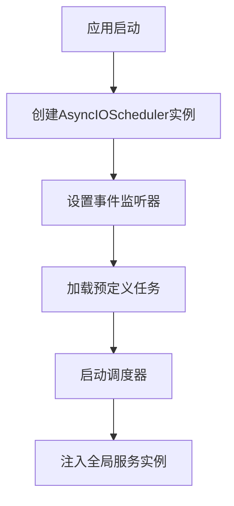
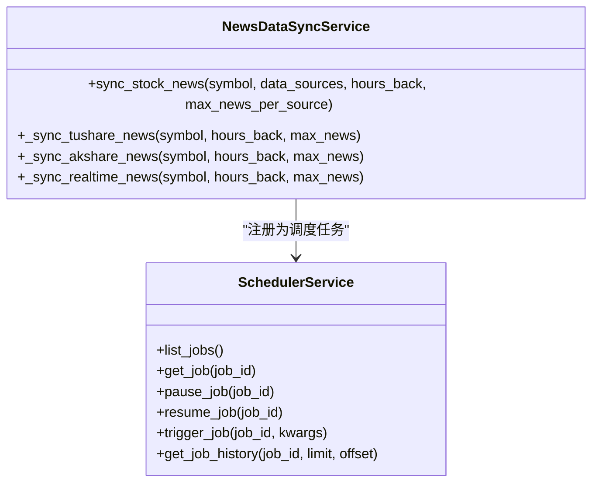
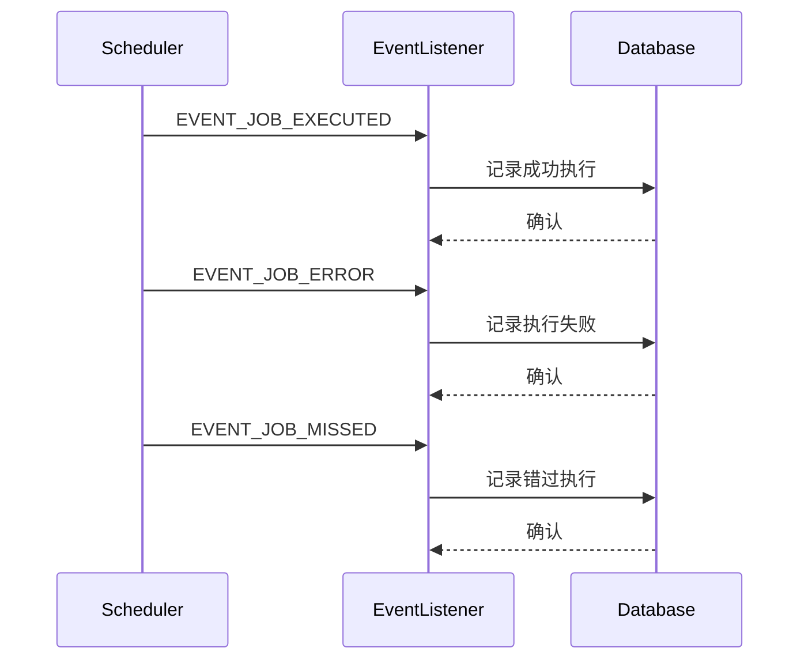
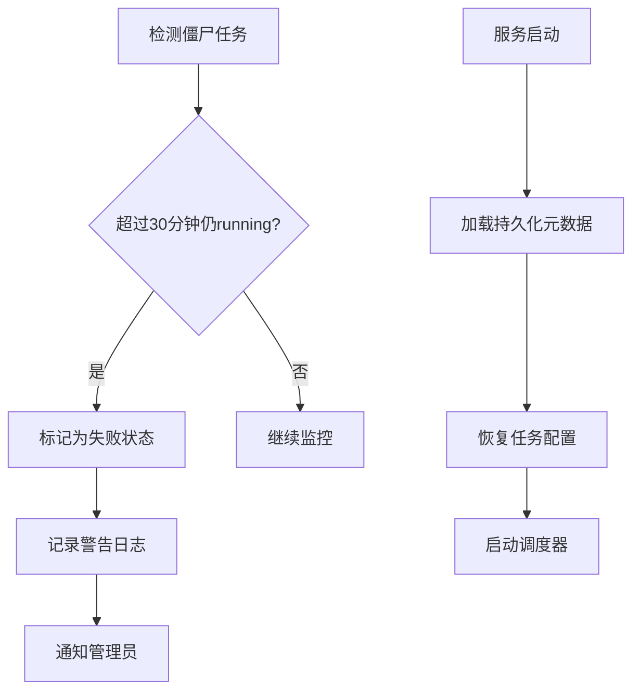
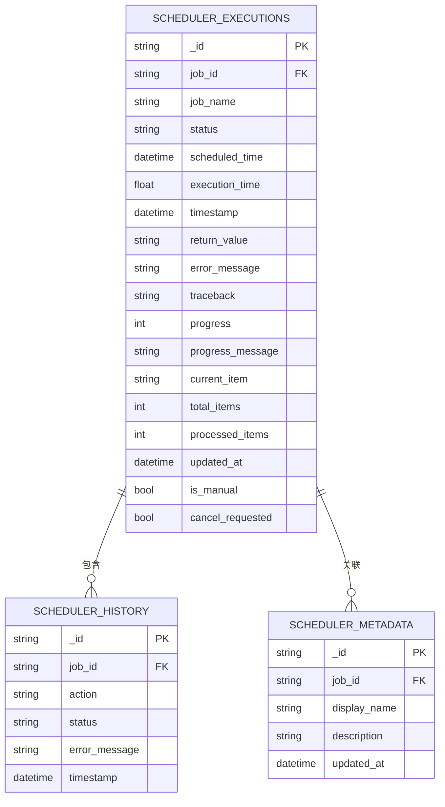

# 任务调度

<cite>
**本文档引用的文件**   
- [scheduler.py](file://app/routers/scheduler.py)
- [scheduler_service.py](file://app/services/scheduler_service.py)
- [main.py](file://app/main.py)
- [init_scheduler_metadata.py](file://scripts/init_scheduler_metadata.py)
- [config.py](file://app/core/config.py)
- [news_data_sync_service.py](file://app/worker/news_data_sync_service.py)
</cite>

## 目录
1. [简介](#简介)
2. [任务调度器初始化](#任务调度器初始化)
3. [Apscheduler配置与使用](#apscheduler配置与使用)
4. [任务注册与同步频率设置](#任务注册与同步频率设置)
5. [任务执行监控机制](#任务执行监控机制)
6. [故障恢复策略](#故障恢复策略)
7. [API接口说明](#api接口说明)
8. [数据库设计](#数据库设计)

## 简介

本系统采用APScheduler作为核心任务调度框架，实现数据同步任务的自动化管理。调度系统支持Cron表达式和Interval两种调度方式，能够灵活配置不同数据源的同步频率。通过RESTful API提供完整的任务管理功能，包括任务查询、暂停、恢复、手动触发等操作。系统还实现了详细的执行监控和故障恢复机制，确保数据同步任务的稳定运行。

## 任务调度器初始化

任务调度器在应用启动时通过lifespan机制进行初始化。首先创建AsyncIOScheduler实例，然后设置事件监听器来监控任务执行状态。调度器启动后，会自动加载预定义的定时任务，并通过set_scheduler_instance函数将实例注入到全局服务中，以便API接口能够管理和控制任务。



**Diagram sources**
- [main.py](file://app/main.py#L540-L579)
- [scheduler_service.py](file://app/services/scheduler_service.py#L48-L732)

**Section sources**
- [main.py](file://app/main.py#L540-L579)
- [scheduler_service.py](file://app/services/scheduler_service.py#L48-L732)

## Apscheduler配置与使用

系统使用APScheduler的AsyncIOScheduler实现异步任务调度。通过CronTrigger.from_crontab方法将配置文件中的Cron表达式转换为触发器，支持灵活的时间调度配置。对于新闻数据同步等周期性任务，采用Cron表达式进行精确的时间控制。

```python
scheduler.add_job(
    run_news_sync,
    CronTrigger.from_crontab(settings.NEWS_SYNC_CRON, timezone=settings.TIMEZONE),
    id="news_sync",
    name="新闻数据同步（AKShare - 仅自选股）"
)
```

Interval调度用于需要固定间隔执行的任务，如实时行情入库服务，配置简单直观：

```python
scheduler.add_job(
    quotes_ingestion_service.run_once,
    'interval',
    seconds=30,
    id='quotes_ingestion',
    name='实时行情入库'
)
```

**Section sources**
- [main.py](file://app/main.py#L560-L570)
- [config.py](file://app/core/config.py#L274-L277)

## 任务注册与同步频率设置

系统通过配置文件定义各类数据同步任务的调度策略。每个数据源都有独立的配置项控制其同步频率和启用状态。例如，新闻数据同步任务默认每2小时执行一次，可通过修改NEWS_SYNC_CRON环境变量调整频率。



**Diagram sources**
- [news_data_sync_service.py](file://app/worker/news_data_sync_service.py#L45-L182)
- [scheduler_service.py](file://app/services/scheduler_service.py#L67-L219)

**Section sources**
- [news_data_sync_service.py](file://app/worker/news_data_sync_service.py#L45-L182)
- [config.py](file://app/core/config.py#L274-L277)

## 任务执行监控机制

系统建立了完善的任务执行监控机制，通过事件监听器捕获任务执行的各个状态。当任务执行成功、失败或错过执行时间时，会自动记录执行历史和性能指标。监控数据包括执行状态、执行时间、返回值、错误信息等。



**Diagram sources**
- [scheduler_service.py](file://app/services/scheduler_service.py#L700-L808)

**Section sources**
- [scheduler_service.py](file://app/services/scheduler_service.py#L700-L808)

## 故障恢复策略

系统实现了多种故障恢复机制确保任务的可靠性。首先，通过僵尸任务检测机制，定期检查长时间处于running状态的任务，并将其标记为失败。其次，支持服务重启后的任务重新加载，通过持久化存储任务元数据，确保配置不会丢失。



**Diagram sources**
- [scheduler_service.py](file://app/services/scheduler_service.py#L733-L764)
- [init_scheduler_metadata.py](file://scripts/init_scheduler_metadata.py#L15-L93)

**Section sources**
- [scheduler_service.py](file://app/services/scheduler_service.py#L733-L764)
- [init_scheduler_metadata.py](file://scripts/init_scheduler_metadata.py#L15-L93)

## API接口说明

系统提供RESTful API用于管理定时任务，主要接口包括：



**Diagram sources**
- [scheduler.py](file://app/routers/scheduler.py#L39-L530)
- [scheduler_service.py](file://app/services/scheduler_service.py#L810-L958)

**Section sources**
- [scheduler.py](file://app/routers/scheduler.py#L39-L530)

## 数据库设计

系统使用MongoDB存储任务执行相关的所有数据，主要包括三个集合：

1. **scheduler_executions**: 存储任务执行的详细记录，包括执行状态、进度、耗时等信息
2. **scheduler_history**: 存储任务操作历史，如暂停、恢复、手动触发等操作记录
3. **scheduler_metadata**: 存储任务的元数据信息，如显示名称、描述等

这些集合通过job_id字段相互关联，形成完整的任务执行追踪体系。系统定期清理过期的执行记录，保持数据库性能。

**Section sources**
- [scheduler_service.py](file://app/services/scheduler_service.py#L810-L958)
- [init_scheduler_metadata.py](file://scripts/init_scheduler_metadata.py#L15-L93)