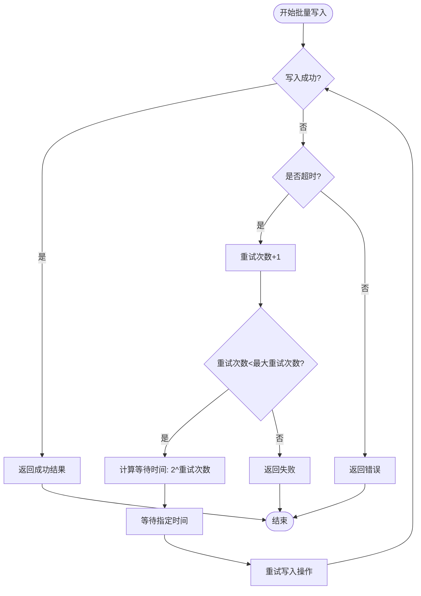
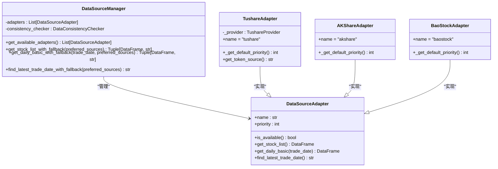
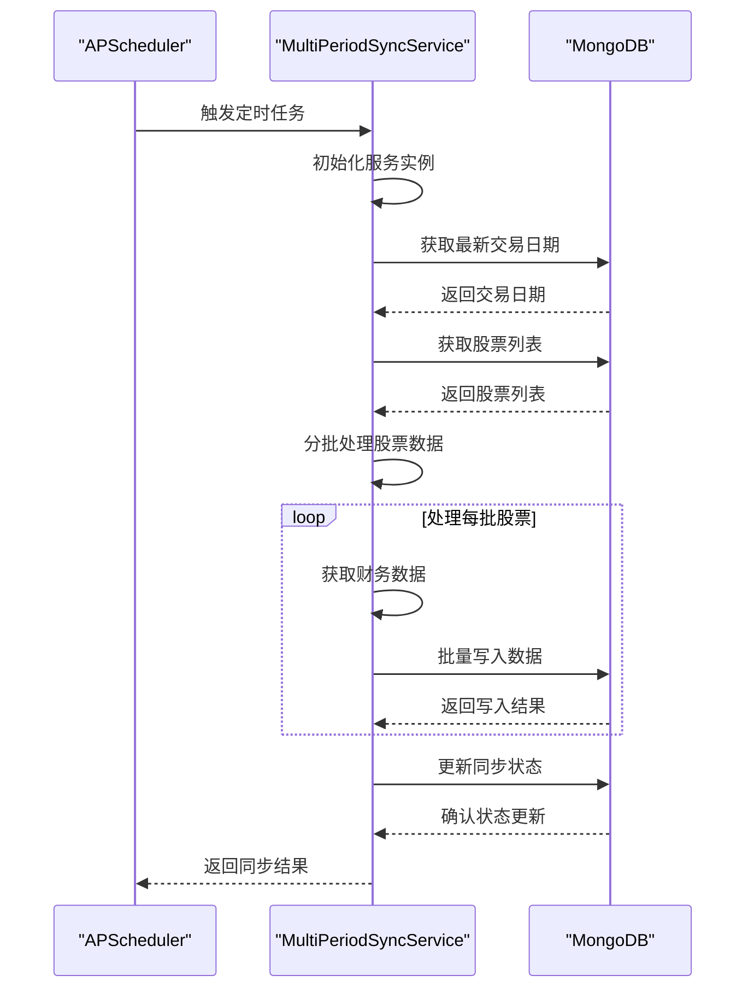
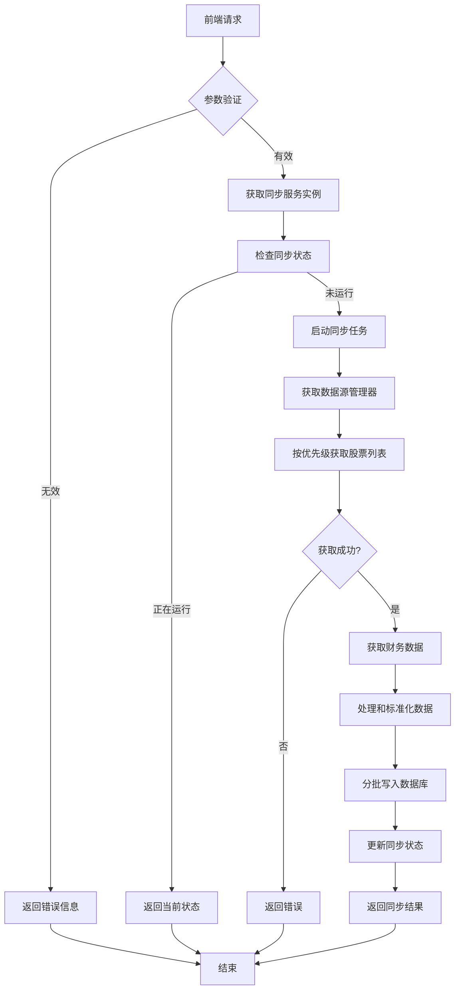

# 同步机制

<cite>
**本文档引用的文件**   
- [basics_sync_service.py](file://app/services/basics_sync_service.py)
- [multi_source_basics_sync_service.py](file://app/services/multi_source_basics_sync_service.py)
- [tracker.py](file://app/services/progress/tracker.py)
- [scheduler_service.py](file://app/services/scheduler_service.py)
- [multi_period_sync_service.py](file://app/worker/multi_period_sync_service.py)
- [data_sources/manager.py](file://app/services/data_sources/manager.py)
- [data_sources/tushare_adapter.py](file://app/services/data_sources/tushare_adapter.py)
- [data_sources/akshare_adapter.py](file://app/services/data_sources/akshare_adapter.py)
- [data_sources/baostock_adapter.py](file://app/services/data_sources/baostock_adapter.py)
</cite>

## 目录
1. [增量与全量同步机制](#增量与全量同步机制)
2. [错误重试与断点续传](#错误重试与断点续传)
3. [多数据源优先级策略](#多数据源优先级策略)
4. [定时任务配置](#定时任务配置)
5. [同步服务调用流程](#同步服务调用流程)

## 增量与全量同步机制

系统实现了基于时间戳和数据源优先级的增量与全量同步机制。全量同步通过`run_full_sync`方法执行，该方法会获取最新的交易日期作为同步基准。增量同步则通过比较数据库中记录的最后交易日期与当前最新交易日期来判断是否需要执行同步。

同步服务会从多个数据源获取股票基础信息和财务数据，包括股票代码、名称、行业、市值等信息。系统通过`find_latest_trade_date`方法确定最新的交易日期，并以此作为数据同步的时间基准。对于财务数据的同步，系统会获取指定交易日期的每日基础数据，包括市盈率(PE)、市净率(PB)、总市值等关键指标。

在数据处理过程中，系统会对获取的数据进行标准化处理，如将总市值从万元转换为亿元单位，确保数据的一致性。同步完成后，系统会将结果持久化到MongoDB数据库中，并更新同步状态。

**Section sources**
- [basics_sync_service.py](file://app/services/basics_sync_service.py#L175-L356)
- [multi_source_basics_sync_service.py](file://app/services/multi_source_basics_sync_service.py#L143-L321)

## 错误重试与断点续传

系统实现了完善的错误重试机制，采用指数退避算法进行重试。在`_execute_bulk_write_with_retry`方法中，当批量写入操作失败时，系统会进行最多3次重试，每次重试的等待时间按2的幂次方递增（2秒、4秒、8秒）。

**Diagram sources**
- [basics_sync_service.py](file://app/services/basics_sync_service.py#L130-L173)
- [multi_source_basics_sync_service.py](file://app/services/multi_source_basics_sync_service.py#L98-L141)

断点续传机制通过Redis进度跟踪器实现。`RedisProgressTracker`类负责跟踪同步任务的进度，包括当前步骤、进度百分比、耗时等信息。系统会定期将进度信息保存到Redis或本地文件中，当同步任务中断后，可以从上次保存的进度点恢复执行。

**Section sources**
- [tracker.py](file://app/services/progress/tracker.py#L46-L472)

## 多数据源优先级策略

系统实现了灵活的多数据源优先级策略，支持Tushare、AKShare和BaoStock三个数据源。数据源优先级通过`DataSourceManager`类管理，优先级数值越大表示优先级越高。默认优先级设置为：Tushare(3) > AKShare(2) > BaoStock(1)。

**Diagram sources**
- [data_sources/manager.py](file://app/services/data_sources/manager.py#L17-L309)
- [data_sources/base.py](file://app/services/data_sources/base.py#L9-L70)

优先级配置支持从数据库动态加载。系统会从`datasource_groupings`集合中读取A股市场的数据源分组配置，根据配置中的priority字段动态调整各数据源的优先级。用户可以通过API指定优先使用的数据源，系统会根据指定的优先级顺序尝试获取数据。

**Section sources**
- [data_sources/manager.py](file://app/services/data_sources/manager.py#L45-L89)
- [data_sources/manager.py](file://app/services/data_sources/manager.py#L116-L127)

## 定时任务配置

系统使用APScheduler实现定时任务调度，通过`scheduler_service.py`和`multi_period_sync_service.py`文件中的配置实现不同频率的同步任务。定时任务包括日线、周线和月线数据同步，分别在每天、每周和每月的指定时间执行。

**Diagram sources**
- [scheduler_service.py](file://app/services/scheduler_service.py#L671-L1074)
- [multi_period_sync_service.py](file://app/worker/multi_period_sync_service.py#L349-L374)

Apscheduler的配置示例如下：
- 日线同步任务：每天执行，调用`run_daily_sync`函数
- 周线同步任务：每周执行，调用`run_weekly_sync`函数  
- 月线同步任务：每月执行，调用`run_monthly_sync`函数

每个任务都有唯一的ID和名称，并配置了相应的触发器和执行参数。系统还实现了任务状态监控和历史记录功能，可以追踪每个任务的执行情况。

**Section sources**
- [multi_period_sync_service.py](file://app/worker/multi_period_sync_service.py#L349-L374)
- [scheduler_service.py](file://app/services/scheduler_service.py#L671-L1074)

## 同步服务调用流程

同步服务的调用流程通过API路由和微服务架构实现。前端通过`multi_source_sync.py`文件中定义的API端点触发同步任务，后端服务处理请求并返回结果。调用流程包括参数传递、状态更新和结果处理三个主要阶段。

**Diagram sources**
- [multi_source_sync.py](file://app/routers/multi_source_sync.py#L1-L488)
- [multi_source_basics_sync_service.py](file://app/services/multi_source_basics_sync_service.py#L143-L321)

在参数传递阶段，前端可以传递`force`参数强制运行同步，以及`preferred_sources`参数指定优先使用的数据源。状态更新阶段，系统会实时更新同步进度，包括已处理的股票数量、进度百分比等信息。结果处理阶段，系统会汇总同步统计信息，包括总数量、新增数量、更新数量和错误数量，并将结果返回给前端。

**Section sources**
- [multi_source_sync.py](file://app/routers/multi_source_sync.py#L154-L187)
- [multi_source_basics_sync_service.py](file://app/services/multi_source_basics_sync_service.py#L143-L321)