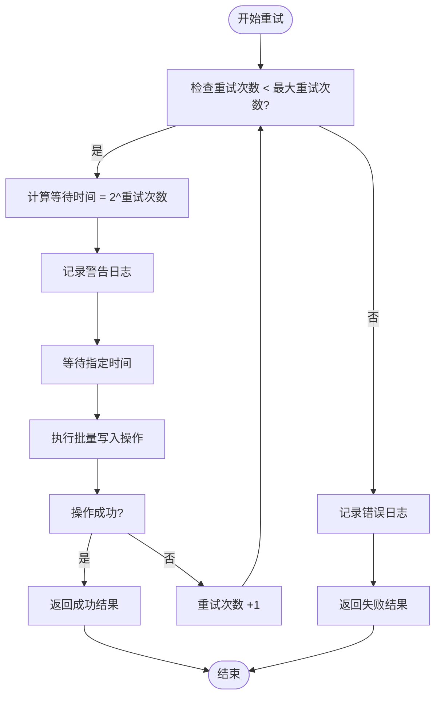
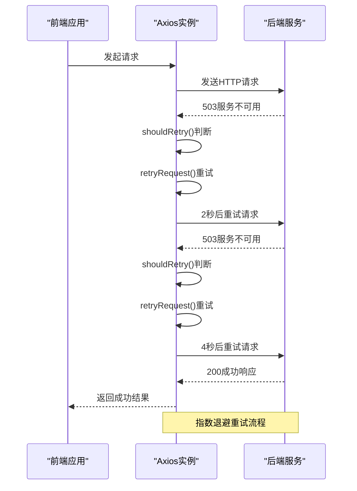
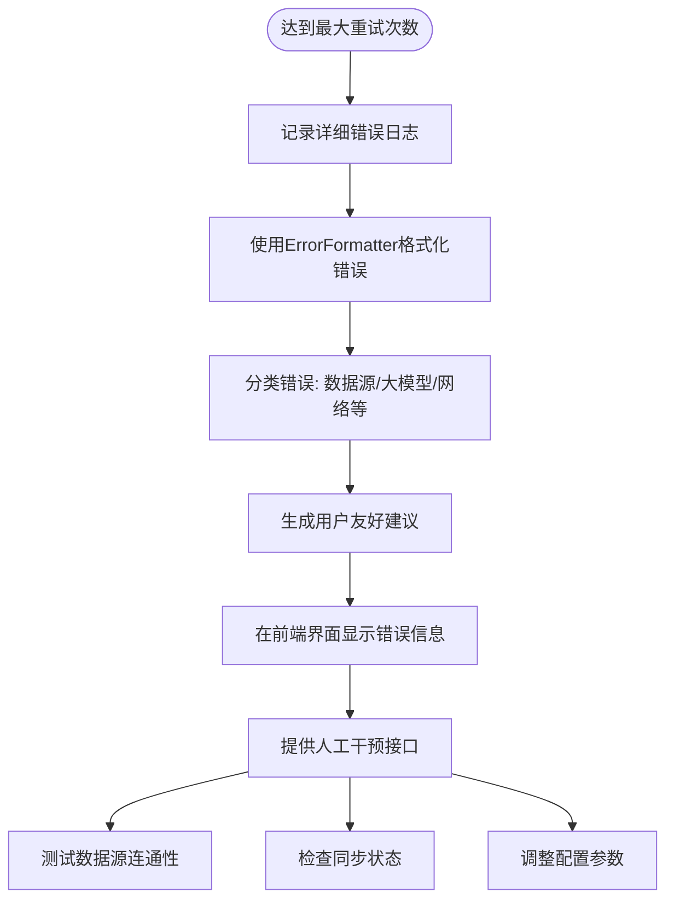

# 错误重试机制

<cite>
**本文档引用文件**  
- [basics_sync_service.py](file://app/services/basics_sync_service.py)
- [request.ts](file://frontend/src/api/request.ts)
- [config.py](file://app/models/config.py)
- [config_bridge.py](file://app/core/config_bridge.py)
- [error_formatter.py](file://app/utils/error_formatter.py)
- [multi_source_sync.py](file://app/routers/multi_source_sync.py)
- [manager.py](file://app/services/data_sources/manager.py)
</cite>

## 目录
1. [引言](#引言)
2. [指数退避算法实现](#指数退避算法实现)
3. [最大重试次数配置](#最大重试次数配置)
4. [重试逻辑代码实现](#重试逻辑代码实现)
5. [达到最大重试次数后的处理](#达到最大重试次数后的处理)
6. [常见错误类型与重试策略对照表](#常见错误类型与重试策略对照表)

## 引言
本系统在数据同步过程中实现了完善的错误重试机制，确保在面对网络波动、服务暂时不可用等临时性故障时能够自动恢复。重试机制覆盖前端请求和后端数据同步操作，采用指数退避策略避免对服务造成过大压力，并支持根据不同数据源进行差异化配置。

**Section sources**
- [basics_sync_service.py](file://app/services/basics_sync_service.py#L129-L167)
- [request.ts](file://frontend/src/api/request.ts#L421-L458)

## 指数退避算法实现
系统在后端数据同步服务中实现了指数退避重试算法，用于处理MongoDB批量写入超时等临时性错误。该算法通过逐步增加重试间隔时间，避免在服务恢复前频繁重试造成额外负载。

在 `basics_sync_service.py` 文件中，`_execute_bulk_write_with_retry` 方法实现了指数退避逻辑。初始重试间隔为2秒，每次重试后间隔时间翻倍（2秒、4秒、8秒），形成指数增长。这种设计既保证了快速响应临时故障，又避免了在长时间故障期间过度消耗资源。



**Diagram sources**
- [basics_sync_service.py](file://app/services/basics_sync_service.py#L129-L167)

**Section sources**
- [basics_sync_service.py](file://app/services/basics_sync_service.py#L129-L167)

## 最大重试次数配置
系统支持灵活的重试次数配置，允许根据不同数据源和场景进行差异化设置。最大重试次数可以通过多种方式配置：

1. **全局默认值**：在 `config.py` 中，`LLMConfig` 模型的 `retry_times` 字段默认值为3次。
2. **数据源特定配置**：在 `config_bridge.py` 中，系统从数据源配置的 `config_params` 中读取 `max_retries` 参数，并将其转换为环境变量，实现不同数据源的差异化重试策略。
3. **前端可配置**：前端请求库支持通过 `retryCount` 参数指定最大重试次数，默认值也设置为3次。

这种分层配置方式既保证了系统默认行为的一致性，又提供了足够的灵活性来应对不同数据源的特性需求。

```mermaid
classDiagram
class DataSourceConfig {
+name : str
+type : DataSourceType
+config_params : Dict[str, Any]
+enabled : bool
+priority : int
}
class LLMConfig {
+provider : str
+model_name : str
+retry_times : int = 3
+timeout : int = 180
+enabled : bool
}
class ConfigBridge {
+bridge_config_to_env()
+_bridge_data_source_config()
}
ConfigBridge --> DataSourceConfig : "读取配置"
ConfigBridge --> LLMConfig : "读取配置"
ConfigBridge --> "os.environ" : "设置环境变量"
```

**Diagram sources**
- [config.py](file://app/models/config.py#L195)
- [config_bridge.py](file://app/core/config_bridge.py#L328-L333)

**Section sources**
- [config.py](file://app/models/config.py#L195)
- [config_bridge.py](file://app/core/config_bridge.py#L328-L333)

## 重试逻辑代码实现
系统的重试逻辑在前后端均有实现，确保端到端的错误恢复能力。

### 后端重试实现
后端主要在数据同步服务中实现重试逻辑。`basics_sync_service.py` 中的 `_execute_bulk_write_with_retry` 方法负责处理MongoDB批量写入操作的重试。该方法捕获 `asyncio.TimeoutError` 异常，增加重试计数器，并根据指数退避算法计算等待时间，然后暂停指定时间后再次尝试。

### 前端重试实现
前端在 `request.ts` 文件中实现了HTTP请求的重试机制。`shouldRetry` 函数判断是否应该重试，仅对网络错误、超时错误和5xx服务器错误进行重试。`retryRequest` 函数负责执行重试，使用 `__retryCount` 属性跟踪重试次数，并根据 `retryDelay` 配置和重试次数计算实际等待时间（`retryDelay * (currentRetry + 1)`）。



**Diagram sources**
- [basics_sync_service.py](file://app/services/basics_sync_service.py#L129-L167)
- [request.ts](file://frontend/src/api/request.ts#L421-L458)

**Section sources**
- [basics_sync_service.py](file://app/services/basics_sync_service.py#L129-L167)
- [request.ts](file://frontend/src/api/request.ts#L421-L458)

## 达到最大重试次数后的处理
当重试达到最大次数后，系统会执行一系列故障处理流程，确保错误得到妥善记录和处理。

### 错误日志记录
系统使用结构化日志记录错误详情。在后端，`basics_sync_service.py` 在达到最大重试次数后会记录错误日志，包含失败原因和已重试次数。前端也会在控制台输出详细的重试信息。

### 通知机制
系统通过 `error_formatter.py` 实现了智能错误分类和用户友好提示。该模块能够识别错误来源（如Tushare、AKShare等数据源或Google Gemini、OpenAI等大模型），并生成包含标题、描述和解决建议的格式化错误信息。这些信息会通过前端界面展示给用户，帮助用户理解问题并采取相应措施。

### 人工干预接口
系统提供了多个接口支持人工干预：
1. **数据源测试接口**：`/api/sync/multi-source/test-sources` 可用于测试数据源连通性。
2. **同步状态查询**：`/api/sync/multi-source/status` 提供同步任务的实时状态。
3. **配置管理界面**：用户可通过前端界面调整数据源优先级和重试配置。

这些接口使得运维人员能够快速诊断问题并进行必要的配置调整。



**Diagram sources**
- [error_formatter.py](file://app/utils/error_formatter.py#L12-L409)
- [multi_source_sync.py](file://app/routers/multi_source_sync.py#L277-L346)

**Section sources**
- [error_formatter.py](file://app/utils/error_formatter.py#L12-L409)
- [multi_source_sync.py](file://app/routers/multi_source_sync.py#L277-L346)

## 常见错误类型与重试策略对照表

| 错误类型 | 触发条件 | 是否重试 | 重试策略 | 最大重试次数 | 备注 |
|---------|--------|--------|--------|-----------|------|
| 网络连接错误 | ECONNABORTED, Network Error | 是 | 指数退避 | 3次 | 前端HTTP请求 |
| 请求超时 | 请求超时 | 是 | 指数退避 | 3次 | 前后端均适用 |
| 服务暂时不可用 | HTTP 502, 503, 504 | 是 | 指数退避 | 3次 | 服务器过载或维护 |
| 数据库写入超时 | asyncio.TimeoutError | 是 | 指数退避 | 3次 | MongoDB批量操作 |
| API密钥无效 | 认证失败 | 否 | 不重试 | - | 配置错误，需人工干预 |
| 配额耗尽 | 429 Too Many Requests | 否 | 不重试 | - | 需升级套餐或等待 |
| 股票代码无效 | 未找到数据 | 否 | 不重试 | - | 输入错误，需修正代码 |
| 内容审核失败 | 内容过滤 | 否 | 不重试 | - | 需更换模型或调整内容 |

**Section sources**
- [request.ts](file://frontend/src/api/request.ts#L427-L434)
- [error_formatter.py](file://app/utils/error_formatter.py#L95-L175)
- [basics_sync_service.py](file://app/services/basics_sync_service.py#L159-L166)