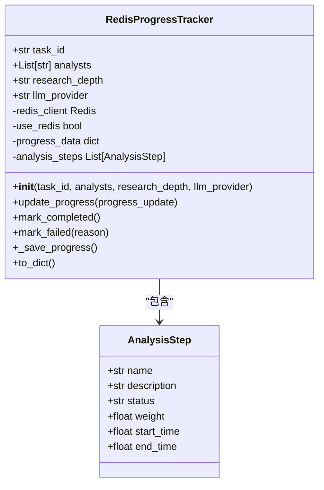
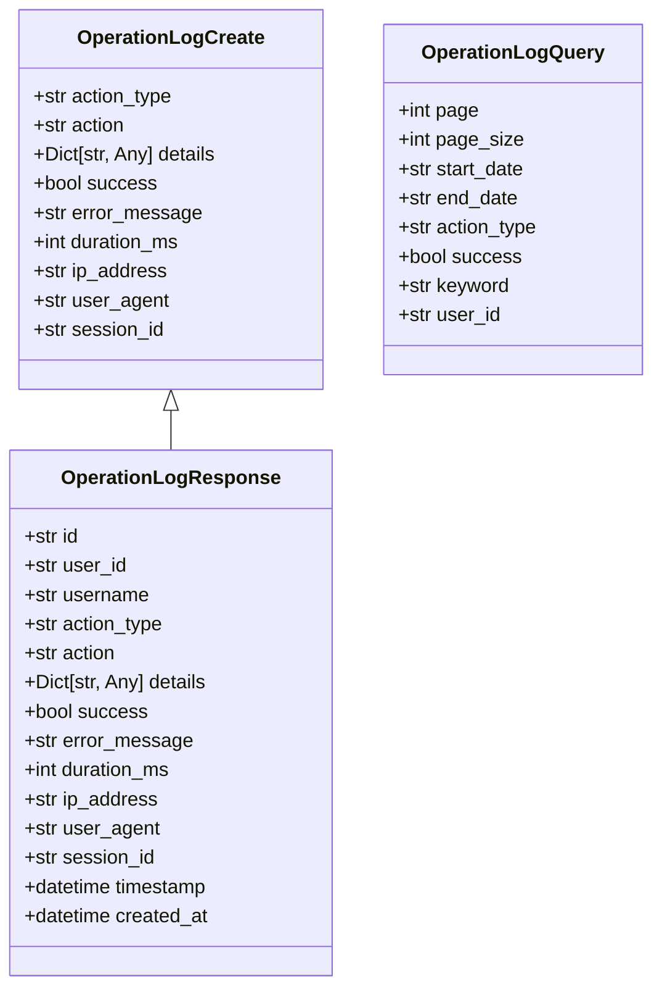
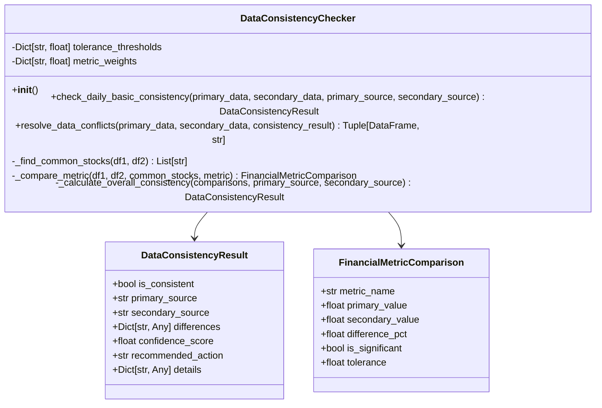
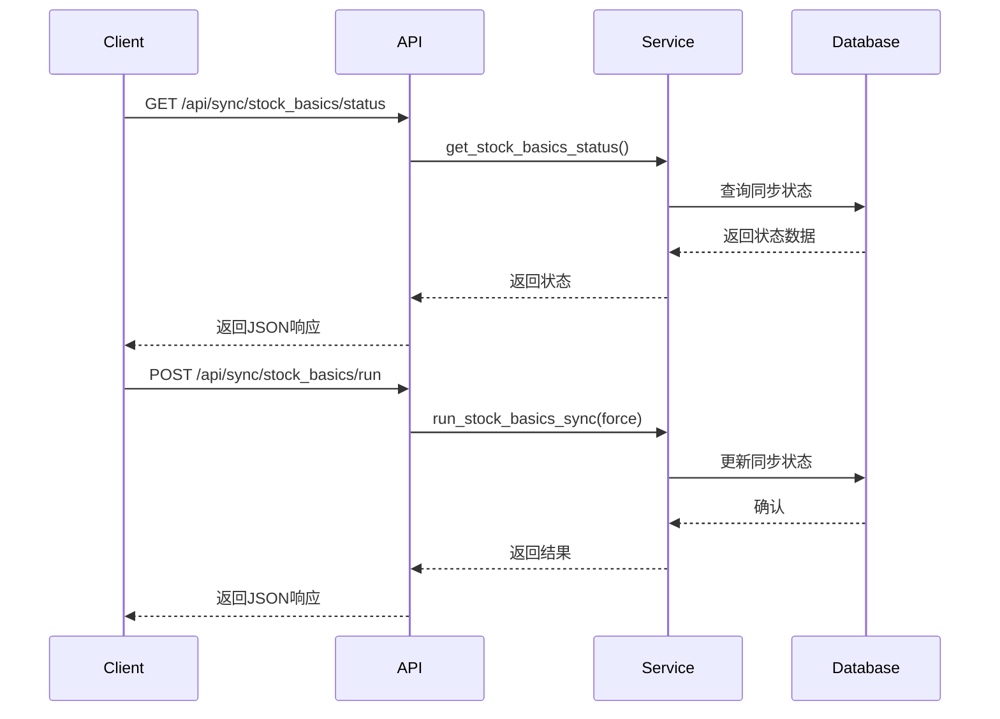
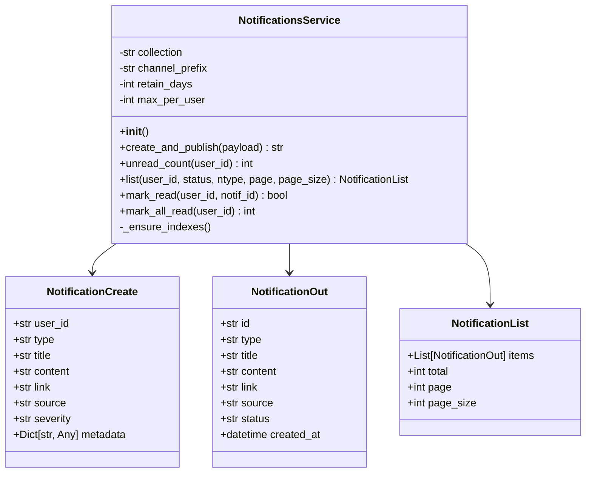

# 同步监控

<cite>
**本文档引用的文件**  
- [RedisProgressTracker.py](file://app/services/progress/tracker.py)
- [data_consistency_checker.py](file://app/services/data_consistency_checker.py)
- [operation_log_middleware.py](file://app/middleware/operation_log_middleware.py)
- [operation_log.py](file://app/models/operation_log.py)
- [operation_logs.py](file://app/routers/operation_logs.py)
- [operation_log_service.py](file://app/services/operation_log_service.py)
- [notifications_service.py](file://app/services/notifications_service.py)
- [notifications.py](file://app/routers/notifications.py)
- [sync.py](file://app/routers/sync.py)
- [multi_source_sync.py](file://app/routers/multi_source_sync.py)
- [scheduler_service.py](file://app/services/scheduler_service.py)
- [tushare_sync_service.py](file://app/worker/tushare_sync_service.py)
</cite>

## 目录
1. [引言](#引言)
2. [进度跟踪器](#进度跟踪器)
3. [操作日志系统](#操作日志系统)
4. [数据一致性检查](#数据一致性检查)
5. [监控API](#监控api)
6. [告警机制](#告警机制)
7. [结论](#结论)

## 引言
同步监控系统是本项目的核心功能之一，负责监控和管理所有同步任务的执行状态。该系统通过进度跟踪器、操作日志、数据一致性检查和告警机制，确保数据同步过程的可靠性和可追溯性。本文档详细介绍了这些功能的实现原理和使用方法。

## 进度跟踪器
进度跟踪器是同步任务监控的核心组件，负责记录和更新任务的执行进度。它通过Redis或文件系统存储进度信息，包括进度百分比、当前步骤、总步骤数、已用时间和剩余时间等。

进度跟踪器的主要功能包括：
- **初始化**：创建任务ID，设置初始进度为0%，并生成动态的分析步骤。
- **更新进度**：根据任务执行情况更新进度百分比和当前步骤。
- **持久化**：将进度信息存储在Redis中，如果Redis不可用则使用文件系统作为备选。
- **获取进度**：根据任务ID查询当前进度信息。

进度跟踪器使用`RedisProgressTracker`类实现，该类在初始化时根据分析师数量、研究深度和LLM提供商动态生成分析步骤，并预估总执行时间。每个步骤都有相应的权重，用于计算整体进度百分比。

**图表来源**
- [tracker.py](file://app/services/progress/tracker.py#L46-L474)

**本节来源**
- [tracker.py](file://app/services/progress/tracker.py#L1-L541)

## 操作日志系统
操作日志系统记录每个同步操作的详细信息，包括开始时间、结束时间、状态和操作详情。该系统通过中间件自动记录API请求，并提供REST API查询日志记录。

操作日志系统的主要功能包括：
- **自动记录**：通过`OperationLogMiddleware`中间件拦截API请求，记录操作类型、描述、状态和耗时。
- **手动记录**：提供API接口允许手动创建操作日志。
- **查询功能**：支持按时间范围、操作类型和成功状态筛选日志。
- **统计功能**：提供日志统计信息，包括总日志数、成功率和操作类型分布。
- **导出功能**：支持将日志导出为CSV格式。

操作日志使用`OperationLog`模型定义，包含用户ID、用户名、操作类型、操作描述、详细信息、成功状态、错误信息、耗时、IP地址、用户代理和时间戳等字段。

**图表来源**
- [operation_log.py](file://app/models/operation_log.py#L11-L47)

**本节来源**
- [operation_log_middleware.py](file://app/middleware/operation_log_middleware.py#L1-L313)
- [operation_log.py](file://app/models/operation_log.py#L1-L138)
- [operation_logs.py](file://app/routers/operation_logs.py#L1-L271)
- [operation_log_service.py](file://app/services/operation_log_service.py#L1-L254)

## 数据一致性检查
数据一致性检查流程定期运行`data_consistency_checker.py`脚本，验证多数据源之间的数据完整性，检测缺失或异常数据。

数据一致性检查器的主要功能包括：
- **数据源比较**：从主数据源和次数据源获取数据，比较关键财务指标（如PE、PB、市值等）。
- **差异检测**：计算各指标的差异百分比，判断是否超过预设的容忍度阈值。
- **置信度评分**：根据差异程度计算置信度分数，评估数据一致性水平。
- **冲突解决**：根据一致性检查结果决定使用哪个数据源的数据。

检查器使用`DataConsistencyChecker`类实现，该类定义了各种财务指标的容忍度阈值和权重，用于计算整体一致性结果。

**图表来源**
- [data_consistency_checker.py](file://app/services/data_consistency_checker.py#L35-L319)

**本节来源**
- [data_consistency_checker.py](file://app/services/data_consistency_checker.py#L1-L319)

## 监控API
监控API提供REST接口查询同步任务状态和历史记录。主要API包括：

- **获取同步状态**：`GET /api/sync/stock_basics/status` 返回股票基础信息同步的最新状态。
- **运行同步任务**：`POST /api/sync/stock_basics/run` 触发股票基础信息同步任务。
- **获取操作日志**：`GET /logs/list` 查询操作日志列表。
- **获取日志统计**：`GET /logs/stats` 获取操作日志统计信息。
- **获取同步历史**：`GET /api/sync/multi-source/history` 查询多数据源同步历史记录。

这些API使用FastAPI框架实现，提供JSON格式的响应，包含成功状态、消息和数据。

**图表来源**
- [sync.py](file://app/routers/sync.py#L1-L32)
- [multi_source_sync.py](file://app/routers/multi_source_sync.py#L1-L488)

**本节来源**
- [sync.py](file://app/routers/sync.py#L1-L32)
- [multi_source_sync.py](file://app/routers/multi_source_sync.py#L1-L488)

## 告警机制
告警机制在同步失败或数据异常时通过通知系统发送告警。当数据一致性检查发现严重不一致或同步任务失败时，系统会创建通知并推送给用户。

通知服务的主要功能包括：
- **创建通知**：当发生重要事件时创建通知记录。
- **WebSocket推送**：通过WebSocket实时将通知推送给前端。
- **未读计数**：提供API查询用户的未读通知数量。
- **标记已读**：允许用户将通知标记为已读。

通知使用`Notification`模型定义，包含用户ID、类型、标题、内容、链接、来源、严重程度、状态和创建时间等字段。

**图表来源**
- [notifications_service.py](file://app/services/notifications_service.py#L19-L142)

**本节来源**
- [notifications_service.py](file://app/services/notifications_service.py#L1-L142)
- [notifications.py](file://app/routers/notifications.py#L1-L36)

## 结论
同步监控系统通过进度跟踪器、操作日志、数据一致性检查和告警机制，实现了对同步任务的全面监控和管理。该系统确保了数据同步过程的透明性、可靠性和可追溯性，为用户提供了一个稳定可靠的数据环境。