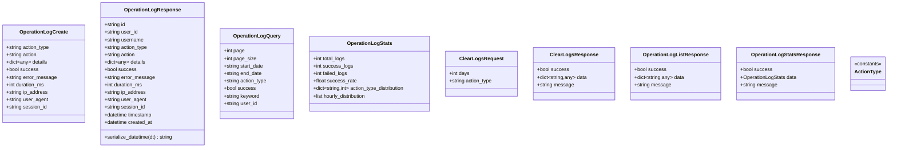

# 操作日志

<cite>
**本文引用的文件**
- [app/models/operation_log.py](file://app/models/operation_log.py)
- [app/services/operation_log_service.py](file://app/services/operation_log_service.py)
- [app/routers/operation_logs.py](file://app/routers/operation_logs.py)
- [app/middleware/operation_log_middleware.py](file://app/middleware/operation_log_middleware.py)
- [app/services/log_export_service.py](file://app/services/log_export_service.py)
- [app/routers/logs.py](file://app/routers/logs.py)
- [app/utils/timezone.py](file://app/utils/timezone.py)
- [tests/test_operation_logs.py](file://tests/test_operation_logs.py)
</cite>

## 目录
1. [简介](#简介)
2. [项目结构](#项目结构)
3. [核心组件](#核心组件)
4. [架构总览](#架构总览)
5. [详细组件分析](#详细组件分析)
6. [依赖关系分析](#依赖关系分析)
7. [性能与优化](#性能与优化)
8. [故障排查指南](#故障排查指南)
9. [结论](#结论)
10. [附录](#附录)

## 简介
本文件面向开发者与运维人员，系统性梳理“操作日志”子系统的设计与实现，涵盖数据模型、服务层能力、中间件自动记录、RESTful API 暴露、查询与过滤、统计与导出、性能优化与归档策略等。重点说明 OperationLog 模型字段、operation_log_service 的增删查统能力、operation_logs 路由的查询与导出接口，以及日志级别与过滤机制（系统日志导出服务）。同时给出 MongoDB 索引策略与日志归档建议，帮助在高并发与海量数据场景下保持系统可观测性与稳定性。

## 项目结构
围绕操作日志的关键模块组织如下：
- 数据模型：定义日志请求、响应、查询、统计、清空等模型
- 服务层：封装日志的创建、查询、统计、清理、便捷入口
- 中间件：自动拦截 API 请求，异步记录用户操作日志
- 路由层：对外暴露查询、统计、导出、清空、手动创建等接口
- 日志导出服务：提供系统日志文件的读取、过滤、导出与统计
- 时区工具：统一时区处理，确保时间字段一致性

图表来源
- [app/middleware/operation_log_middleware.py](file://app/middleware/operation_log_middleware.py#L1-L120)
- [app/routers/operation_logs.py](file://app/routers/operation_logs.py#L1-L120)
- [app/services/operation_log_service.py](file://app/services/operation_log_service.py#L1-L120)
- [app/models/operation_log.py](file://app/models/operation_log.py#L1-L120)
- [app/utils/timezone.py](file://app/utils/timezone.py#L1-L58)

章节来源
- [app/models/operation_log.py](file://app/models/operation_log.py#L1-L138)
- [app/services/operation_log_service.py](file://app/services/operation_log_service.py#L1-L120)
- [app/routers/operation_logs.py](file://app/routers/operation_logs.py#L1-L120)
- [app/middleware/operation_log_middleware.py](file://app/middleware/operation_log_middleware.py#L1-L120)
- [app/utils/timezone.py](file://app/utils/timezone.py#L1-L58)

## 核心组件
- OperationLog 模型族：用于创建、查询、响应、统计、清空等场景的 Pydantic 模型
- OperationLogService：日志服务，负责插入、查询、统计、清理、按 ID 查询
- OperationLogMiddleware：自动记录中间件，拦截 API 请求并异步落库
- operation_logs 路由：提供分页查询、统计、详情、清空、手动创建、CSV 导出
- LogExportService：系统日志导出服务，支持文件列表、读取、过滤、导出、统计
- logs 路由：系统日志文件的读取、导出、统计、删除

章节来源
- [app/models/operation_log.py](file://app/models/operation_log.py#L1-L138)
- [app/services/operation_log_service.py](file://app/services/operation_log_service.py#L1-L285)
- [app/middleware/operation_log_middleware.py](file://app/middleware/operation_log_middleware.py#L1-L313)
- [app/routers/operation_logs.py](file://app/routers/operation_logs.py#L1-L271)
- [app/services/log_export_service.py](file://app/services/log_export_service.py#L1-L479)
- [app/routers/logs.py](file://app/routers/logs.py#L1-L235)

## 架构总览
操作日志系统采用“中间件自动记录 + 路由查询导出”的双通道设计：
- 自动记录：中间件基于路径前缀映射操作类型，异步记录用户行为
- 手动记录：路由提供手动创建接口，便于业务关键点埋点
- 查询与统计：路由提供分页查询、统计、按 ID 查询
- 导出：CSV 导出与系统日志导出（ZIP/TXT）

图表来源
- [app/middleware/operation_log_middleware.py](file://app/middleware/operation_log_middleware.py#L58-L120)
- [app/services/operation_log_service.py](file://app/services/operation_log_service.py#L30-L90)
- [app/models/operation_log.py](file://app/models/operation_log.py#L11-L39)

章节来源
- [app/middleware/operation_log_middleware.py](file://app/middleware/operation_log_middleware.py#L1-L120)
- [app/services/operation_log_service.py](file://app/services/operation_log_service.py#L1-L120)

## 详细组件分析

### 数据模型与字段定义
OperationLog 模型族覆盖创建、响应、查询、统计、清空等场景，并提供操作类型常量与名称映射，便于统一管理与展示。

- OperationLogCreate：创建日志的请求体，字段包括操作类型、操作描述、详细信息、成功标志、错误信息、耗时、IP、UA、会话ID等
- OperationLogResponse：响应模型，包含用户标识、操作类型、描述、详细信息、成功标志、错误信息、耗时、IP、UA、会话ID、时间戳、创建时间；序列化时将时间字段转为 ISO 8601 字符串
- OperationLogQuery：查询参数，支持分页、时间范围、操作类型、成功状态、关键词、用户ID
- OperationLogListResponse：列表响应包装
- OperationLogStats：统计模型，包含总日志数、成功/失败数、成功率、操作类型分布、小时分布
- OperationLogStatsResponse：统计响应包装
- ClearLogsRequest/ClearLogsResponse：清空日志的请求与响应
- ActionType 常量与 ACTION_TYPE_NAMES 映射：统一管理操作类型枚举与中文名称

章节来源
- [app/models/operation_log.py](file://app/models/operation_log.py#L11-L138)

### 服务层：日志记录、查询与清理
- create_log：构建日志文档（含用户信息、操作类型、描述、详细信息、成功标志、错误信息、耗时、IP、UA、会话ID、时间戳与创建时间），插入 MongoDB 集合 operation_logs
- get_logs：构建多条件查询（时间范围、操作类型、成功状态、用户ID、关键词），支持分页与总数统计，返回响应模型列表
- get_stats：按时间窗口统计总日志数、成功/失败数、成功率，以及操作类型分布与小时分布
- clear_logs：按天数阈值与/或操作类型进行删除，返回删除数量与过滤条件
- get_log_by_id：按 ID 查询单条日志
- log_operation：便捷函数，封装 OperationLogCreate 并调用 create_log
- 时间处理：使用时区工具生成当前时间，MongoDB 存储为 naive datetime（不带时区），便于后续聚合与展示

章节来源
- [app/services/operation_log_service.py](file://app/services/operation_log_service.py#L1-L285)
- [app/utils/timezone.py](file://app/utils/timezone.py#L1-L58)

### 中间件：自动记录用户操作
- 跳过规则：全局开关、健康检查、静态资源、SSE 流、操作日志 API 自身等路径不记录
- 路径到操作类型映射：根据 URL 前缀映射到 ActionType 常量
- 动作描述生成：结合 HTTP 方法与路径生成具体动作描述
- 异步记录：计算耗时，判断成功与否，构造详细信息（方法、路径、状态码、查询参数），调用 log_operation 异步落库

章节来源
- [app/middleware/operation_log_middleware.py](file://app/middleware/operation_log_middleware.py#L1-L313)

### 路由层：查询、统计、导出、清空、手动创建
- GET /logs/list：分页查询，支持时间范围、操作类型、成功状态、关键词、用户ID
- GET /logs/stats：统计最近 N 天的日志，返回总数量、成功率、类型分布、小时分布
- GET /logs/{log_id}：按 ID 获取详情
- POST /logs/clear：清空日志，支持保留最近 N 天或按操作类型清空
- POST /logs/create：手动创建日志，自动提取客户端 IP 与 UA
- GET /logs/export/csv：导出 CSV，包含时间、用户、操作类型、操作内容、状态、耗时、IP、错误信息等列

章节来源
- [app/routers/operation_logs.py](file://app/routers/operation_logs.py#L1-L271)

### 系统日志导出：文件读取、过滤、导出与统计
- 路由 logs.py 提供系统日志文件的读取、导出、统计与删除
- 日志级别过滤：ERROR、WARNING、INFO、DEBUG
- 时间范围过滤：基于日志行内时间戳正则匹配
- 关键词过滤：大小写不敏感
- 导出格式：ZIP 压缩包或合并 TXT 文本
- 统计：文件数量、总大小、错误文件数、最近错误、日志类型分布

章节来源
- [app/routers/logs.py](file://app/routers/logs.py#L1-L235)
- [app/services/log_export_service.py](file://app/services/log_export_service.py#L1-L479)

## 依赖关系分析
- 中间件依赖服务层的 log_operation 与模型 ActionType
- 路由依赖服务层与模型，提供 HTTP 层的输入输出
- 服务层依赖数据库连接、时区工具与模型
- 系统日志导出服务依赖文件系统、正则与压缩库

图表来源
- [app/middleware/operation_log_middleware.py](file://app/middleware/operation_log_middleware.py#L1-L120)
- [app/routers/operation_logs.py](file://app/routers/operation_logs.py#L1-L120)
- [app/services/operation_log_service.py](file://app/services/operation_log_service.py#L1-L120)
- [app/models/operation_log.py](file://app/models/operation_log.py#L1-L120)
- [app/utils/timezone.py](file://app/utils/timezone.py#L1-L58)
- [app/routers/logs.py](file://app/routers/logs.py#L1-L120)
- [app/services/log_export_service.py](file://app/services/log_export_service.py#L1-L120)

章节来源
- [app/middleware/operation_log_middleware.py](file://app/middleware/operation_log_middleware.py#L1-L120)
- [app/routers/operation_logs.py](file://app/routers/operation_logs.py#L1-L120)
- [app/services/operation_log_service.py](file://app/services/operation_log_service.py#L1-L120)
- [app/routers/logs.py](file://app/routers/logs.py#L1-L120)
- [app/services/log_export_service.py](file://app/services/log_export_service.py#L1-L120)

## 性能与优化
- MongoDB 索引策略（建议）
  - 常见查询维度：timestamp（时间范围）、action_type（操作类型）、success（成功状态）、user_id（用户ID）、keyword（组合关键词）
  - 建议复合索引顺序遵循 ESR 原则（等值、排序、范围），例如：
    - (action_type, success, timestamp)
    - (user_id, action_type, timestamp)
    - (timestamp, action_type)
  - 聚合统计：按小时分布使用 $hour 聚合，建议在 timestamp 上建立索引以提升效率
- 日志归档方案
  - 按时间滚动归档：定期将旧日志迁移到冷存储或压缩归档
  - 分片与副本集：海量日志建议使用分片集群，配合副本集保证高可用
  - 清理策略：通过清空接口按天数阈值清理历史日志，避免集合无限增长
- 时区与时间处理
  - 应用层使用时区工具生成当前时间，MongoDB 存储 naive datetime，便于聚合与展示
  - 运维直查数据库时注意时间语义与时区转换

章节来源
- [app/services/operation_log_service.py](file://app/services/operation_log_service.py#L71-L120)
- [app/utils/timezone.py](file://app/utils/timezone.py#L1-L58)
- [docs/design/timezone-strategy.md](file://docs/design/timezone-strategy.md#L48-L76)

## 故障排查指南
- 中间件未记录日志
  - 检查全局开关与跳过路径配置
  - 确认请求方法是否为 POST/PUT/DELETE/PATCH
  - 确认路径是否以 /api/ 开头
- 查询不到日志或结果为空
  - 检查时间范围参数格式与时区处理
  - 确认操作类型、成功状态、关键词是否正确
- 导出 CSV 失败
  - 检查查询参数与分页限制
  - 确认服务层 get_logs 返回数据是否为空
- 系统日志导出异常
  - 检查日志目录配置与权限
  - 确认过滤条件（级别、时间、关键词）是否合理
  - 导出格式是否为 zip 或 txt

章节来源
- [app/middleware/operation_log_middleware.py](file://app/middleware/operation_log_middleware.py#L98-L120)
- [app/routers/operation_logs.py](file://app/routers/operation_logs.py#L25-L120)
- [app/services/log_export_service.py](file://app/services/log_export_service.py#L128-L216)

## 结论
操作日志系统通过中间件自动记录与路由手动创建相结合，提供了完善的日志采集、查询、统计与导出能力。数据模型清晰、服务层职责单一、路由接口完备，配合系统日志导出服务，能够满足生产环境的可观测性需求。建议尽快落地 MongoDB 索引优化与归档策略，保障长期稳定运行。

## 附录

### API 定义与使用要点
- 查询操作日志列表
  - 方法：GET
  - 路径：/logs/list
  - 参数：page、page_size、start_date、end_date、action_type、success、keyword
  - 返回：包含 logs、total、page、page_size、total_pages 的列表响应
- 获取操作日志统计
  - 方法：GET
  - 路径：/logs/stats
  - 参数：days（默认 30）
  - 返回：总日志数、成功/失败数、成功率、操作类型分布、小时分布
- 获取操作日志详情
  - 方法：GET
  - 路径：/logs/{log_id}
  - 返回：单条日志详情
- 清空操作日志
  - 方法：POST
  - 路径：/logs/clear
  - 请求体：days（可选）、action_type（可选）
  - 返回：删除数量与过滤条件
- 手动创建操作日志
  - 方法：POST
  - 路径：/logs/create
  - 请求体：操作类型、描述、详细信息、成功标志、错误信息、耗时、IP、UA、会话ID
  - 返回：日志ID
- 导出操作日志为 CSV
  - 方法：GET
  - 路径：/logs/export/csv
  - 参数：start_date、end_date、action_type
  - 返回：CSV 文件流

章节来源
- [app/routers/operation_logs.py](file://app/routers/operation_logs.py#L25-L271)

### 日志级别与过滤机制（系统日志导出）
- 支持的日志级别：ERROR、WARNING、INFO、DEBUG
- 过滤条件：级别、关键词、时间范围（ISO 格式）
- 导出格式：zip（推荐）、txt（合并文本）

章节来源
- [app/routers/logs.py](file://app/routers/logs.py#L1-L235)
- [app/services/log_export_service.py](file://app/services/log_export_service.py#L128-L216)

### 数据模型类图

图表来源
- [app/models/operation_log.py](file://app/models/operation_log.py#L11-L138)

### 查询流程图（服务层 get_logs）

图表来源
- [app/services/operation_log_service.py](file://app/services/operation_log_service.py#L71-L120)

### 使用示例参考
- 单元测试示例展示了日志创建、查询、统计与数据库校验的完整链路
- 可作为集成测试与回归测试的参考模板

章节来源
- [tests/test_operation_logs.py](file://tests/test_operation_logs.py#L1-L125)