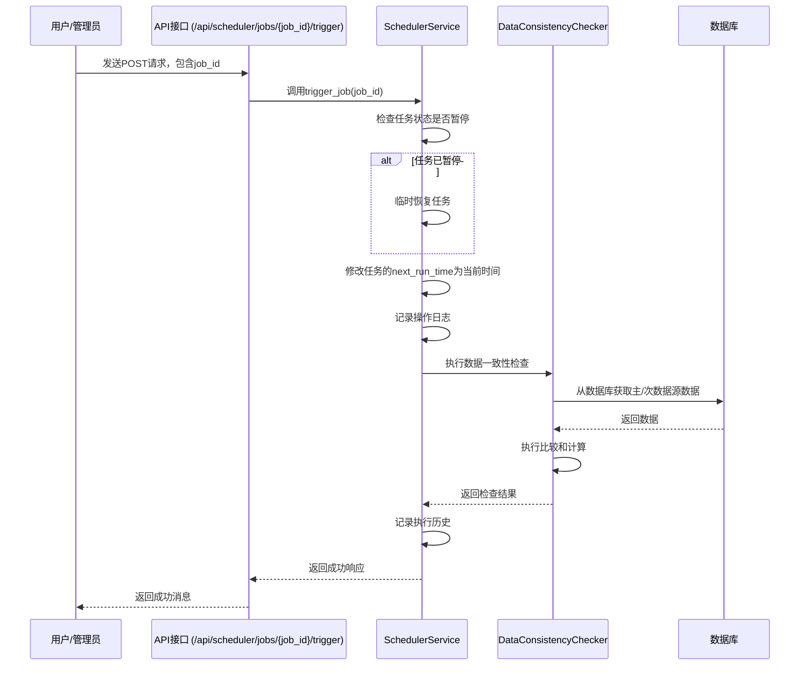

# 数据校验

<cite>
**本文档引用文件**  
- [data_consistency_checker.py](file://app/services/data_consistency_checker.py)
- [scheduler_service.py](file://app/services/scheduler_service.py)
- [scheduler.py](file://app/routers/scheduler.py)
- [stock_validator.py](file://tradingagents/utils/stock_validator.py)
- [database_service.py](file://app/services/database_service.py)
- [operation_log.py](file://app/models/operation_log.py)
</cite>

## 目录
1. [数据一致性检查机制](#数据一致性检查机制)
2. [检查规则与配置](#检查规则与配置)
3. [检查结果处理与报告](#检查结果处理与报告)
4. [手动触发与自动化调度](#手动触发与自动化调度)
5. [常见数据异常诊断与修复](#常见数据异常诊断与修复)

## 数据一致性检查机制

数据一致性检查功能主要通过 `DataConsistencyChecker` 类实现，该类位于 `app/services/data_consistency_checker.py` 文件中。其核心职责是处理多数据源之间的数据不一致性问题，确保从不同数据源获取的股票基础信息、财务数据和K线数据的一致性。

该检查器通过比较主数据源和次数据源的数据来评估数据一致性。它支持对多个关键财务指标进行对比，包括市盈率（PE）、市净率（PB）、总市值（total_mv）、股价（price）、成交量（volume）和换手率（turnover_rate）。检查过程首先验证数据集是否为空，然后通过股票代码匹配共同的股票，最后对每个指标进行逐项比较。

比较时，系统会计算两个数据源中同一指标的平均值，并计算其差异百分比。该差异百分比会与预设的容忍度阈值进行比较，以判断差异是否显著。容忍度阈值在 `DataConsistencyChecker` 的 `__init__` 方法中定义，例如PE和PB的容忍度为5%，而股价的容忍度为1%。

**Section sources**
- [data_consistency_checker.py](file://app/services/data_consistency_checker.py#L38-L47)

## 检查规则与配置

数据一致性检查的规则和配置主要通过类的初始化参数和内部数据结构进行定义。核心配置包括容忍度阈值和指标权重。

容忍度阈值（`tolerance_thresholds`）定义了不同财务指标允许的最大差异百分比。这些阈值是根据金融数据的特性和实际业务需求设定的，例如：
- PE（市盈率）：5%
- PB（市净率）：5%
- 总市值：2%
- 股价：1%
- 成交量：10%
- 换手率：5%

指标权重（`metric_weights`）用于在计算整体置信度分数时对不同指标进行加权。关键指标如PE和PB被赋予更高的权重（25%），以反映其在评估数据质量中的重要性。

检查规则的执行流程如下：
1.  **基础检查**：确认主数据源和次数据源的数据集均不为空。
2.  **股票匹配**：通过多种可能的股票代码列名（如 `ts_code`, `symbol`, `code`）找到两个数据源中的共同股票。
3.  **指标比较**：对每个关键指标，计算两个数据源的平均值并求出差异百分比。
4.  **一致性评估**：根据差异是否超过容忍度阈值，判断该指标的差异是否显著。

**Section sources**
- [data_consistency_checker.py](file://app/services/data_consistency_checker.py#L40-L57)

## 检查结果处理与报告

检查结果的处理流程旨在根据一致性检查的结果，生成校验报告并通过操作日志系统进行记录。整个流程由 `DataConsistencyResult` 和 `FinancialMetricComparison` 两个数据类来承载结果信息。

`DataConsistencyResult` 类包含以下关键字段：
- `is_consistent`: 布尔值，表示数据是否一致。
- `differences`: 字典，详细记录了各个指标的差异。
- `confidence_score`: 置信度分数，一个0到1之间的浮点数，分数越高表示数据越一致。
- `recommended_action`: 推荐的行动策略，如使用主数据源或需要调查数据源问题。

置信度分数的计算采用加权平均法。对于每个指标，系统会根据其差异百分比和容忍度计算一个一致性分数（差异越小，分数越高），然后乘以该指标的权重，最后求和并除以总权重得到最终的置信度分数。

推荐的行动策略根据置信度分数和显著差异的指标数量来决定：
- 置信度 > 0.8：数据高度一致，可以使用任一数据源 (`use_either`)。
- 置信度 > 0.6：数据存在轻微差异，建议使用主数据源并发出警告 (`use_primary_with_warning`)。
- 置信度 > 0.3：数据差异较大，仅使用主数据源 (`use_primary_only`)。
- 置信度 ≤ 0.3：数据源存在严重问题，需要人工调查 (`investigate_sources`)。

最终，`resolve_data_conflicts` 方法会根据 `recommended_action` 来决定最终使用的数据集，并生成一条包含解决策略说明的字符串。整个检查过程和结果会被记录在操作日志中，以便后续审计和追踪。

**Section sources**
- [data_consistency_checker.py](file://app/services/data_consistency_checker.py#L14-L28)
- [data_consistency_checker.py](file://app/services/data_consistency_checker.py#L216-L288)
- [data_consistency_checker.py](file://app/services/data_consistency_checker.py#L290-L318)
- [operation_log.py](file://app/models/operation_log.py)

## 手动触发与自动化调度

数据校验任务可以通过手动触发和自动化调度两种方式执行。自动化调度由 `SchedulerService` 类管理，该类位于 `app/services/scheduler_service.py` 文件中。调度器使用 `APScheduler` 库来管理定时任务，可以定期执行数据校验任务。

手动触发功能通过API接口实现。`app/routers/scheduler.py` 文件中的 `trigger_job` 路由提供了手动触发任务的接口。管理员用户可以通过调用此API，传入任务ID（job_id）来立即执行一次数据校验任务。如果任务当前处于暂停状态，系统会临时恢复任务以执行一次，但不会改变其暂停状态。

**Diagram sources**
- [scheduler.py](file://app/routers/scheduler.py#L182-L221)
- [scheduler_service.py](file://app/services/scheduler_service.py#L152-L219)
- [data_consistency_checker.py](file://app/services/data_consistency_checker.py)

**Section sources**
- [scheduler_service.py](file://app/services/scheduler_service.py#L152-L219)
- [scheduler.py](file://app/routers/scheduler.py#L182-L221)

## 常见数据异常诊断与修复

在数据校验过程中，可能会遇到多种数据异常，包括缺失的股票基础信息、异常的财务数据或不一致的K线数据。系统通过 `StockDataPreparer` 类（位于 `tradingagents/utils/stock_validator.py`）提供了一套诊断和修复机制。

对于**缺失的股票基础信息**，系统会首先验证股票代码的格式是否正确。如果格式正确，则尝试从数据库中获取基本信息。如果无法获取，系统会返回一个包含错误信息和建议的 `StockDataPreparationResult` 对象，提示用户检查股票代码或确认股票是否已上市。

对于**数据库数据不完整或过期**，`StockDataPreparer` 类的 `_check_database_data` 方法会检查指定日期范围内是否存在数据以及数据是否最新。如果数据缺失或不是最新的，系统会自动触发 `_trigger_data_sync_async` 方法，根据配置的数据源优先级进行数据同步，从而修复数据。

对于**数据源API限制**（特别是港股），系统会捕获网络限制异常，并提供详细的建议，例如等待几分钟后重试或检查网络连接。

**Section sources**
- [stock_validator.py](file://tradingagents/utils/stock_validator.py#L54-L608)
- [stock_validator.py](file://tradingagents/utils/stock_validator.py#L701-L752)
- [database_service.py](file://app/services/database_service.py)