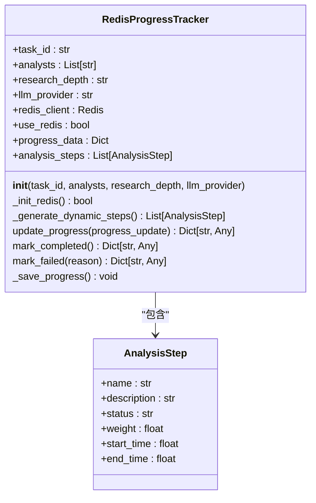
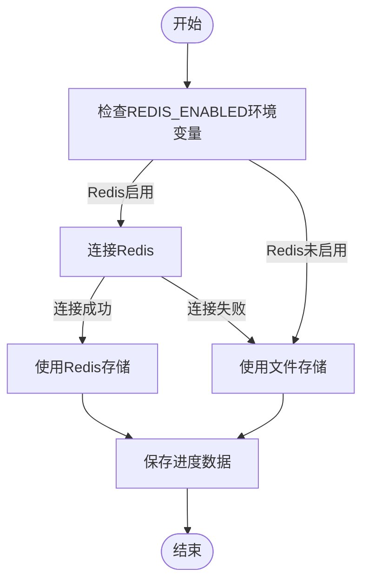
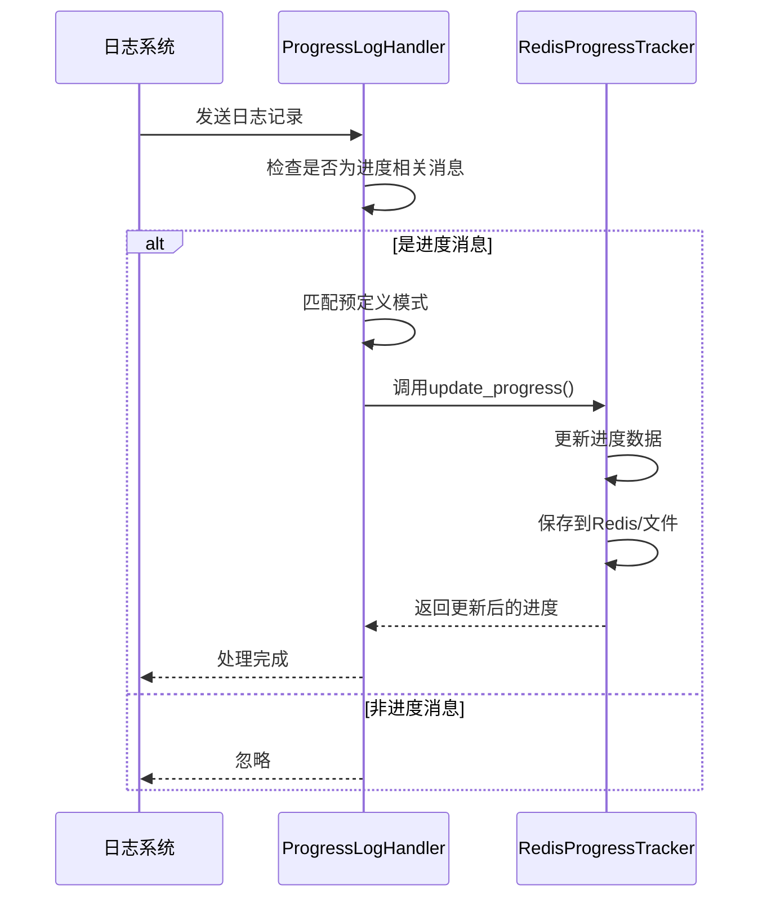

# 进度监控

<cite>
**本文档引用文件**  
- [redis_progress_tracker.py](file://app/services/redis_progress_tracker.py)
- [tracker.py](file://app/services/progress/tracker.py)
- [log_handler.py](file://app/services/progress/log_handler.py)
- [multi_source_sync.py](file://app/routers/multi_source_sync.py)
- [multi_source_basics_sync_service.py](file://app/services/multi_source_basics_sync_service.py)
</cite>

## 目录
1. [简介](#简介)
2. [核心组件](#核心组件)
3. [进度跟踪器实现](#进度跟踪器实现)
4. [日志处理器集成](#日志处理器集成)
5. [API接口文档](#api接口文档)
6. [错误处理与状态恢复](#错误处理与状态恢复)
7. [多源同步服务中的实际应用](#多源同步服务中的实际应用)
8. [结论](#结论)

## 简介
本文档详细阐述了基于Redis的进度跟踪系统实现，重点介绍ProgressTracker类如何通过Redis存储同步任务的进度百分比、已完成项目数和总项目数，以及如何生成唯一的任务ID。文档还说明了日志处理器如何与进度跟踪器集成以实时更新任务状态，提供完整的API接口文档，并包含错误处理机制和实际代码示例。

## 核心组件
进度监控系统由两个核心组件构成：`RedisProgressTracker`类负责进度数据的存储和管理，`ProgressLogHandler`类负责监听日志并自动更新进度。这两个组件协同工作，实现了对长时间运行任务的实时监控和状态跟踪。

**Section sources**
- [tracker.py](file://app/services/progress/tracker.py#L46-L541)
- [log_handler.py](file://app/services/progress/log_handler.py#L15-L186)

## 进度跟踪器实现
`RedisProgressTracker`类是进度监控系统的核心，它通过Redis或文件系统存储任务进度信息。该类在初始化时接收任务ID、分析师列表、研究深度和LLM提供商等参数，并根据这些参数动态生成分析步骤。



**Diagram sources**
- [tracker.py](file://app/services/progress/tracker.py#L46-L541)

### 任务ID生成
任务ID在`RedisProgressTracker`的构造函数中作为参数传入，通常由调用方生成。系统通过任务ID作为Redis键的前缀（`progress:{task_id}`）来唯一标识和存储每个任务的进度数据。

### 进度数据结构
进度跟踪器维护一个包含以下关键字段的`progress_data`字典：
- `task_id`: 任务唯一标识符
- `status`: 任务状态（running, completed, failed）
- `progress_percentage`: 进度百分比
- `current_step`: 当前步骤索引
- `total_steps`: 总步骤数
- `current_step_name`: 当前步骤名称
- `current_step_description`: 当前步骤描述
- `last_message`: 最后一条消息
- `start_time`: 开始时间戳
- `last_update`: 最后更新时间戳
- `elapsed_time`: 已用时间
- `remaining_time`: 剩余时间
- `estimated_total_time`: 预估总时间
- `steps`: 步骤列表

**Section sources**
- [tracker.py](file://app/services/progress/tracker.py#L59-L74)

### Redis存储机制
进度跟踪器优先使用Redis进行数据存储，如果Redis未启用则回退到文件存储。数据以JSON格式存储，键名为`progress:{task_id}`，并设置1小时的过期时间。



**Diagram sources**
- [tracker.py](file://app/services/progress/tracker.py#L91-L131)
- [tracker.py](file://app/services/progress/tracker.py#L406-L418)

## 日志处理器集成
`ProgressLogHandler`是一个自定义的日志处理器，它监控特定日志记录器的输出，并根据日志消息的内容自动更新关联的进度跟踪器。



**Diagram sources**
- [log_handler.py](file://app/services/progress/log_handler.py#L74-L103)

### 模式匹配机制
日志处理器使用正则表达式模式匹配来识别进度相关的日志消息。每个模式对应一个进度消息，当日志消息匹配某个模式时，相应的进度消息会被发送到进度跟踪器。

```python
self.progress_patterns = {
    r"验证.*股票代码|检查.*数据源": "📋 准备阶段",
    r"检查.*API.*密钥|环境.*配置": "🔧 环境检查",
    r"预估.*成本|成本.*估算": "💰 成本估算",
    # ... 其他模式
}
```

**Section sources**
- [log_handler.py](file://app/services/progress/log_handler.py#L24-L57)

### 注册与注销机制
进度跟踪器需要通过`register_tracker`方法注册到日志处理器，完成后通过`unregister_tracker`方法注销。这种机制确保了只有运行中的任务才会被监控。

```mermaid
flowchart TD
A[创建RedisProgressTracker] --> B[调用register_analysis_tracker()]
B --> C[ProgressLogHandler注册跟踪器]
C --> D[日志处理器开始监控]
D --> E[任务执行]
E --> F[任务完成/失败]
F --> G[调用unregister_analysis_tracker()]
G --> H[日志处理器停止监控]
```

**Section sources**
- [log_handler.py](file://app/services/progress/log_handler.py#L61-L73)
- [log_handler.py](file://app/services/progress/log_handler.py#L175-L184)

## API接口文档
进度监控系统通过API接口提供任务管理功能，支持启动新任务、查询任务进度和更新任务状态。

### 启动新任务 (POST)
启动一个新的同步任务，返回任务ID和初始状态。

**Endpoint**: `POST /api/sync/multi-source/stock_basics/run`

**请求参数**:
```json
{
  "force": false,
  "preferred_sources": ["tushare", "akshare"]
}
```

**响应**:
```json
{
  "success": true,
  "message": "Synchronization completed successfully",
  "data": {
    "status": "success",
    "started_at": "2025-11-15T10:30:00",
    "finished_at": "2025-11-15T10:45:00",
    "total": 5000,
    "inserted": 4980,
    "updated": 20,
    "errors": 0,
    "last_trade_date": "2025-11-14"
  }
}
```

### 查询任务进度 (GET)
获取指定任务的当前进度。

**Endpoint**: `GET /api/sync/multi-source/status`

**响应**:
```json
{
  "success": true,
  "message": "Status retrieved successfully",
  "data": {
    "job": "stock_basics_multi_source",
    "status": "running",
    "started_at": "2025-11-15T10:30:00",
    "total": 5000,
    "inserted": 2500,
    "updated": 10,
    "errors": 0,
    "progress_percentage": 50.2,
    "current_step_name": "📊 市场分析师正在分析",
    "current_step_description": "分析股价走势、成交量、技术指标等市场表现",
    "elapsed_time": 900,
    "remaining_time": 900,
    "estimated_total_time": 1800
  }
}
```

### 更新任务状态 (PATCH)
更新任务状态（通常由系统内部调用，不直接暴露给前端）。

**Endpoint**: `PATCH /api/sync/multi-source/status/{task_id}`

**请求参数**:
```json
{
  "status": "running",
  "progress_percentage": 75.5,
  "current_step_name": "💼 交易员制定策略"
}
```

**Section sources**
- [multi_source_sync.py](file://app/routers/multi_source_sync.py#L137-L149)
- [multi_source_sync.py](file://app/routers/multi_source_sync.py#L154-L187)

## 错误处理与状态恢复
系统实现了完善的错误处理机制，确保在任务超时或异常中断时能够正确恢复状态。

### 失败处理
当任务执行失败时，调用`mark_failed()`方法更新状态，记录失败原因，并保存到持久化存储中。

```mermaid
flowchart TD
A[任务执行] --> B{发生异常?}
B --> |是| C[调用mark_failed(reason)]
C --> D[设置status为failed]
D --> E[记录failed_reason]
E --> F[保存进度数据]
F --> G[注销跟踪器]
G --> H[结束]
B --> |否| I[正常完成]
```

**Section sources**
- [tracker.py](file://app/services/progress/tracker.py#L437-L449)

### 超时处理
系统通过预估总时间和已用时间来判断任务是否超时。如果已用时间超过预估总时间的1.5倍，系统会自动标记任务为失败。

### 状态恢复
通过`get_progress_by_id()`函数可以从Redis或文件系统中恢复任务进度，实现任务状态的持久化和恢复。

```python
def get_progress_by_id(task_id: str) -> Optional[Dict[str, Any]]:
    """根据任务ID获取进度"""
    # 尝试从Redis读取
    # 如果失败，尝试从文件读取
    # 如果都失败，返回None
```

**Section sources**
- [tracker.py](file://app/services/progress/tracker.py#L477-L536)

## 多源同步服务中的实际应用
在多源同步服务中，进度跟踪器被用于监控股票基础信息的同步过程。

### 服务集成
`MultiSourceBasicsSyncService`服务在执行同步任务时创建`RedisProgressTracker`实例，并将其注册到日志处理器。

```mermaid
flowchart TD
A[调用run_full_sync()] --> B[创建RedisProgressTracker]
B --> C[注册到ProgressLogHandler]
C --> D[执行同步任务]
D --> E{任务完成?}
E --> |是| F[调用mark_completed()]
E --> |否| G[调用mark_failed()]
F --> H[注销跟踪器]
G --> H
H --> I[返回结果]
```

**Section sources**
- [multi_source_basics_sync_service.py](file://app/services/multi_source_basics_sync_service.py#L143-L330)

### 进度更新
在同步过程中，系统通过日志消息自动更新进度。例如，当开始处理股票列表时，会记录"Successfully fetched {len} stocks"日志，触发进度更新。

```python
logger.info(f"Successfully fetched {len(stock_df)} stocks from {source_used}")
```

### 前端轮询
前端通过定时轮询`/api/sync/multi-source/status`接口来获取最新进度，并在UI中显示进度条和状态信息。

```javascript
// 前端轮询示例
setInterval(async () => {
  const response = await fetch('/api/sync/multi-source/status');
  const data = await response.json();
  updateProgressBar(data.progress_percentage);
  updateStatusText(data.current_step_name);
}, 5000);
```

**Section sources**
- [multi_source_basics_sync_service.py](file://app/services/multi_source_basics_sync_service.py#L293-L295)

## 结论
本文档详细介绍了基于Redis的进度跟踪系统的实现。该系统通过`RedisProgressTracker`类和`ProgressLogHandler`类的协同工作，实现了对长时间运行任务的实时监控。系统支持通过API接口管理任务，具备完善的错误处理和状态恢复机制，并已在多源同步服务中成功应用。通过这种设计，用户可以实时了解任务执行进度，提高了系统的透明度和用户体验。