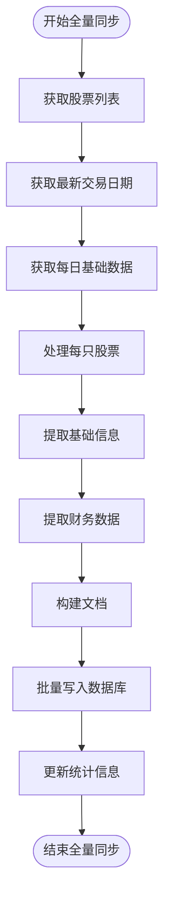

# 数据同步

<cite>
**本文档引用的文件**  
- [data_consistency_checker.py](file://app/services/data_consistency_checker.py)
- [multi_source_basics_sync_service.py](file://app/services/multi_source_basics_sync_service.py)
- [tushare_sync_service.py](file://app/worker/tushare_sync_service.py)
- [akshare_sync_service.py](file://app/worker/akshare_sync_service.py)
- [baostock_sync_service.py](file://app/worker/baostock_sync_service.py)
- [manager.py](file://app/services/data_sources/manager.py)
- [multi_source_sync.py](file://app/routers/multi_source_sync.py)
- [sync.py](file://app/routers/sync.py)
- [multi_period_sync_service.py](file://app/worker/multi_period_sync_service.py)
- [scheduler_service.py](file://app/services/scheduler_service.py)
</cite>

## 目录
1. [引言](#引言)
2. [多数据源获取机制](#多数据源获取机制)
3. [数据优先级与冲突解决](#数据优先级与冲突解决)
4. [定时同步任务调度](#定时同步任务调度)
5. [增量与全量同步实现](#增量与全量同步实现)
6. [错误重试与断点续传](#错误重试与断点续传)
7. [数据一致性检查](#数据一致性检查)
8. [性能优化策略](#性能优化策略)
9. [同步服务调用示例](#同步服务调用示例)

## 引言
本文档详细介绍了数据同步服务的核心功能与实现机制。该服务旨在通过整合Tushare、AkShare和BaoStock等多个数据源，实现股票基础信息、行情数据、财务数据和新闻资讯的高效同步。系统采用多数据源优先级策略和数据冲突解决机制，确保数据的准确性和完整性。通过Apscheduler实现定时同步任务的调度，并支持增量同步与全量同步两种模式。此外，系统还提供了错误重试、断点续传和数据一致性检查等高级功能，以保障数据同步的稳定性和可靠性。

## 多数据源获取机制
数据同步服务通过多个数据源获取股票相关信息，包括基础信息、行情数据、财务数据和新闻资讯。每个数据源都有其特定的适配器，负责与数据源进行交互。

### Tushare数据源
Tushare是一个专业的金融数据API，提供高质量的A股数据和财务指标。TushareSyncService类负责与Tushare数据源进行交互，支持股票基础信息、实时行情、历史数据和财务数据的同步。

**Diagram sources**
- [tushare_sync_service.py](file://app/worker/tushare_sync_service.py#L35-L789)

### AkShare数据源
AkShare是一个开源的金融数据库，提供基础的股票信息。AKShareSyncService类负责与AkShare数据源进行交互，支持股票基础信息、实时行情、历史数据和财务数据的同步。

**Diagram sources**
- [akshare_sync_service.py](file://app/worker/akshare_sync_service.py#L18-L800)

### BaoStock数据源
BaoStock是一个免费的证券数据平台，提供历史数据。BaoStockSyncService类负责与BaoStock数据源进行交互，支持股票基础信息、日K线数据和历史数据的同步。

**Diagram sources**
- [baostock_sync_service.py](file://app/worker/baostock_sync_service.py#L34-L608)

**Section sources**
- [tushare_sync_service.py](file://app/worker/tushare_sync_service.py#L1-L1360)
- [akshare_sync_service.py](file://app/worker/akshare_sync_service.py#L1-L1236)
- [baostock_sync_service.py](file://app/worker/baostock_sync_service.py#L1-L608)

## 数据优先级与冲突解决
系统通过DataSourceManager类管理多个数据源的优先级，并在数据冲突时进行解决。

### 数据源优先级管理
DataSourceManager类负责管理多个数据源的优先级。它根据配置文件中的优先级设置，决定数据源的使用顺序。默认情况下，Tushare的优先级最高，其次是AkShare，最后是BaoStock。

**Diagram sources**
- [manager.py](file://app/services/data_sources/manager.py#L17-L309)

### 数据冲突解决
当多个数据源提供的数据存在冲突时，系统通过DataConsistencyChecker类进行一致性检查，并根据检查结果选择最可靠的数据源。

**Diagram sources**
- [data_consistency_checker.py](file://app/services/data_consistency_checker.py#L35-L319)

**Section sources**
- [manager.py](file://app/services/data_sources/manager.py#L1-L309)
- [data_consistency_checker.py](file://app/services/data_consistency_checker.py#L1-L319)

## 定时同步任务调度
系统通过Apscheduler实现定时同步任务的调度，支持任务的暂停、恢复和手动触发。

### 任务调度器
SchedulerService类负责管理定时任务的调度。它提供了获取任务列表、获取任务详情、暂停任务、恢复任务和手动触发任务等功能。

**Diagram sources**
- [scheduler_service.py](file://app/services/scheduler_service.py#L45-L800)

### 任务执行历史
系统记录每个任务的执行历史，包括成功、失败和错过的执行记录。这些记录存储在MongoDB的scheduler_executions集合中。

**Diagram sources**
- [scheduler_service.py](file://app/services/scheduler_service.py#L344-L408)

**Section sources**
- [scheduler_service.py](file://app/services/scheduler_service.py#L1-L1161)

## 增量与全量同步实现
系统支持增量同步和全量同步两种模式，以满足不同的数据同步需求。

### 增量同步
增量同步只同步自上次同步以来发生变化的数据。MultiSourceBasicsSyncService类负责执行增量同步，通过比较数据的更新时间来确定需要同步的数据。

**Diagram sources**
- [multi_source_basics_sync_service.py](file://app/services/multi_source_basics_sync_service.py#L58-L382)

### 全量同步
全量同步会同步所有数据，无论数据是否发生变化。MultiSourceBasicsSyncService类也支持全量同步，通过设置force参数为True来触发。

**Diagram sources**
- [multi_source_basics_sync_service.py](file://app/services/multi_source_basics_sync_service.py#L143-L321)

**Section sources**
- [multi_source_basics_sync_service.py](file://app/services/multi_source_basics_sync_service.py#L1-L382)

## 错误重试与断点续传
系统在数据同步过程中实现了错误重试和断点续传机制，以提高数据同步的可靠性。

### 错误重试
当数据同步过程中发生错误时，系统会自动进行重试。TushareSyncService和AKShareSyncService类都实现了重试机制，最大重试次数为3次。

**Diagram sources**
- [tushare_sync_service.py](file://app/worker/tushare_sync_service.py#L119-L135)
- [akshare_sync_service.py](file://app/worker/akshare_sync_service.py#L112-L113)

### 断点续传
当数据同步过程中断时，系统可以从断点处继续同步。MultiSourceBasicsSyncService类通过记录同步状态来实现断点续传。

**Diagram sources**
- [multi_source_basics_sync_service.py](file://app/services/multi_source_basics_sync_service.py#L40-L55)

**Section sources**
- [tushare_sync_service.py](file://app/worker/tushare_sync_service.py#L1-L1360)
- [akshare_sync_service.py](file://app/worker/akshare_sync_service.py#L1-L1236)
- [multi_source_basics_sync_service.py](file://app/services/multi_source_basics_sync_service.py#L1-L382)

## 数据一致性检查
系统通过DataConsistencyChecker类进行数据一致性检查，确保从不同数据源获取的数据具有一致性。

### 一致性检查流程
数据一致性检查流程包括以下几个步骤：
1. 获取主数据源和次数据源的数据。
2. 检查两个数据集是否为空。
3. 找到两个数据集中的共同股票。
4. 逐指标比较数据。
5. 计算整体一致性结果。
6. 根据一致性结果解决数据冲突。

**Diagram sources**
- [data_consistency_checker.py](file://app/services/data_consistency_checker.py#L59-L319)

### 一致性检查结果
一致性检查结果包括是否一致、主数据源、次数据源、差异、置信度分数、推荐操作和详细信息。

**Diagram sources**
- [data_consistency_checker.py](file://app/services/data_consistency_checker.py#L14-L23)

**Section sources**
- [data_consistency_checker.py](file://app/services/data_consistency_checker.py#L1-L319)

## 性能优化策略
系统通过批量写入、并发控制和数据预处理等策略来优化数据同步的性能。

### 批量写入
系统通过批量写入来减少数据库操作的次数，提高写入效率。MultiSourceBasicsSyncService类在处理股票数据时，每500只股票进行一次批量写入。

**Diagram sources**
- [multi_source_basics_sync_service.py](file://app/services/multi_source_basics_sync_service.py#L207-L307)

### 并发控制
系统通过并发控制来提高数据同步的效率。TushareSyncService和AKShareSyncService类在获取实时行情时，使用并发任务来同时获取多只股票的行情。

**Diagram sources**
- [tushare_sync_service.py](file://app/worker/tushare_sync_service.py#L429-L436)
- [akshare_sync_service.py](file://app/worker/akshare_sync_service.py#L397-L400)

### 数据预处理
系统在将数据写入数据库之前，进行数据预处理，包括生成完整股票代码、确定交易所等。

**Diagram sources**
- [multi_source_basics_sync_service.py](file://app/services/multi_source_basics_sync_service.py#L217-L277)

**Section sources**
- [multi_source_basics_sync_service.py](file://app/services/multi_source_basics_sync_service.py#L1-L382)

## 同步服务调用示例
以下是一个调用多数据源同步服务的示例。

### API调用
通过HTTP API调用多数据源同步服务，可以触发股票基础信息的同步。

**Diagram sources**
- [multi_source_sync.py](file://app/routers/multi_source_sync.py#L154-L188)

### 配置方法
在配置文件中设置数据源的优先级和API密钥，以启用相应的数据源。

**Diagram sources**
- [manager.py](file://app/services/data_sources/manager.py#L45-L89)

**Section sources**
- [multi_source_sync.py](file://app/routers/multi_source_sync.py#L1-L488)