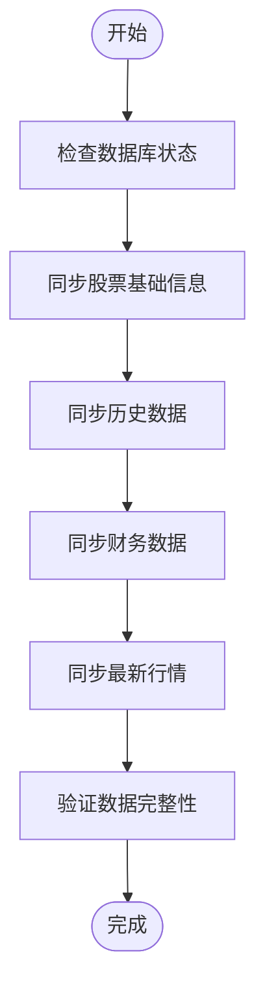
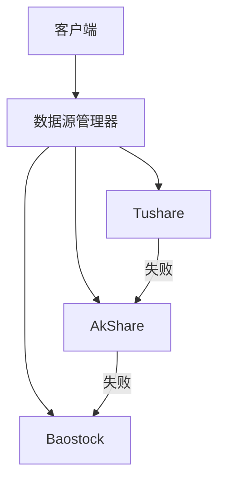

# AkShare集成

<cite>
**本文档引用的文件**   
- [akshare_adapter.py](file://app/services/data_sources/akshare_adapter.py)
- [akshare_init_service.py](file://app/worker/akshare_init_service.py)
- [akshare_sync_service.py](file://app/worker/akshare_sync_service.py)
- [akshare.py](file://tradingagents/dataflows/providers/china/akshare.py)
- [cli/akshare_init.py](file://cli/akshare_init.py)
</cite>

## 目录
1. [引言](#引言)
2. [适配器实现](#适配器实现)
3. [初始化与服务启动](#初始化与服务启动)
4. [数据类型支持](#数据类型支持)
5. [多数据源协同](#多数据源协同)
6. [性能优化](#性能优化)
7. [故障排查](#故障排查)
8. [结论](#结论)

## 引言
AkShare是一个开源的金融数据接口库，为本系统提供股票、基金、期货等金融产品的数据支持。该数据源无需认证即可使用，通过适配器模式集成到系统中，支持批量请求和数据预加载等优化策略。本文档详细说明AkShare的集成方式、数据获取模式及与其他数据源的协同工作机制。

## 适配器实现

AkShare适配器实现了`DataSourceAdapter`基类，提供了统一的数据访问接口。其核心特点是无需认证，通过`is_available`方法检查依赖库是否安装即可判断可用性。适配器优先级设置为2，在多数据源环境中具有较高的优先级。

适配器主要实现了以下数据获取方法：
- `get_stock_list`：获取股票列表，使用`stock_info_a_code_name`接口获取真实股票名称，并生成标准的`ts_code`和市场信息。
- `get_daily_basic`：获取每日基础财务数据，通过`stock_individual_info_em`接口获取最新价、总市值等信息，其中总市值单位从万元转换为亿元以保持一致性。
- `get_realtime_quotes`：获取全市场实时快照，支持东方财富和新浪财经两个数据源，自动处理不同接口的列名差异。
- `get_kline`：获取K线数据，支持日线、周线、月线及分钟线，提供前复权和后复权选项。
- `get_news`：获取新闻和公告信息，从东方财富网获取相关新闻数据。

**Section sources**
- [akshare_adapter.py](file://app/services/data_sources/akshare_adapter.py#L1-L393)

## 初始化与服务启动

AkShare的初始化和服务启动流程包括依赖库加载、连接验证和数据同步。系统通过`akshare_init_service.py`中的`AKShareInitService`类管理完整的初始化过程。

初始化流程如下：
1. 检查数据库状态，确认是否需要重新初始化。
2. 同步股票基础信息，强制更新所有股票的基本资料。
3. 同步历史数据，支持配置时间范围，可选择全量或增量同步。
4. 同步财务数据，获取最新的财务指标。
5. 同步最新行情，更新实时市场数据。
6. 验证数据完整性，确保各集合数据量符合预期。

服务启动时，`akshare_sync_service.py`中的`AKShareSyncService`类负责初始化数据库连接、历史数据服务和新闻数据服务，并通过`get_akshare_provider`获取全局单例的AKShare提供器。连接测试通过后，服务才被视为准备就绪。

**Diagram sources **
- [akshare_init_service.py](file://app/worker/akshare_init_service.py#L1-L463)
- [akshare_sync_service.py](file://app/worker/akshare_sync_service.py#L1-L1236)

**Section sources**
- [akshare_init_service.py](file://app/worker/akshare_init_service.py#L1-L463)
- [akshare_sync_service.py](file://app/worker/akshare_sync_service.py#L1-L1236)

## 数据类型支持

AkShare支持多种金融产品的数据获取，包括但不限于：
- **股票**：A股、港股、美股的实时行情、历史K线、基本面数据。
- **基金**：开放式基金、ETF、LOF的净值、持仓、分红等信息。
- **期货**：国内商品期货、金融期货的合约信息、行情数据。
- **宏观经济**：GDP、CPI、PPI等经济指标。
- **新闻公告**：上市公司新闻、公告、研报等信息。

数据获取模式采用批量请求和缓存机制，通过`get_batch_stock_quotes`一次性获取全市场快照，避免频繁调用接口被限流。对于单个股票的请求，则直接调用单个股票接口以提高效率。

**Section sources**
- [akshare.py](file://tradingagents/dataflows/providers/china/akshare.py#L1-L1596)

## 多数据源协同

在多源数据融合场景下，AkShare与其他数据源（如Tushare、Baostock）协同工作。系统通过`DataSourceManager`管理多个数据源，根据优先级和可用性自动选择最佳数据源。

当主数据源不可用时，系统会自动降级到备用数据源。例如，在获取每日基础财务数据时，如果Tushare不可用，则会尝试使用AkShare作为备选。这种机制确保了数据获取的高可用性。

**Diagram sources **
- [akshare.py](file://tradingagents/dataflows/providers/china/akshare.py#L1-L1596)
- [data_source_manager.py](file://tradingagents/dataflows/data_source_manager.py#L1-L622)

**Section sources**
- [akshare.py](file://tradingagents/dataflows/providers/china/akshare.py#L1-L1596)
- [data_source_manager.py](file://tradingagents/dataflows/data_source_manager.py#L1-L622)

## 性能优化

为提高AkShare数据获取的性能，系统采用了多种优化策略：

### 批量请求处理
通过`get_batch_stock_quotes`一次性获取全市场快照，减少API调用次数。对于无法批量获取的情况，采用分批处理，每批100只股票，并添加0.2秒的延迟以避免频率限制。

### 数据预加载
在系统启动时，预先加载常用数据到内存缓存中，减少实时查询的延迟。例如，股票列表和基础信息会在服务初始化时加载并缓存。

### 连接复用
使用全局单例的AKShare提供器，确保monkey patch生效，并复用HTTP连接，减少连接建立的开销。

### 异常处理与重试
对网络请求添加重试机制，最多重试3次，每次间隔递增。对于SSL错误，等待后重试，提高在不稳定网络环境下的成功率。

**Section sources**
- [akshare_sync_service.py](file://app/worker/akshare_sync_service.py#L1-L1236)
- [akshare.py](file://tradingagents/dataflows/providers/china/akshare.py#L1-L1596)

## 故障排查

### 数据缺失问题
当出现数据缺失时，首先检查AKShare连接是否正常。可通过`test_akshare_connection`函数测试连接状态。如果连接失败，可能是网络问题或AKShare服务暂时不可用。

其次，检查API调用频率是否超出限制。AkShare有调用频率限制，建议在请求间添加适当延迟。如果问题持续，可尝试更换数据源或使用代理。

### 格式异常问题
数据格式异常通常由接口返回的列名变化引起。系统通过`next`函数查找兼容的列名，如"最新价"、"现价"、"最新价(元)"等。如果仍无法匹配，需更新适配器代码以支持新的列名。

对于数值字段的格式问题，使用`_safe_float`函数进行安全转换，处理空值和非数字字符串。

**Section sources**
- [akshare_adapter.py](file://app/services/data_sources/akshare_adapter.py#L1-L393)
- [akshare.py](file://tradingagents/dataflows/providers/china/akshare.py#L1-L1596)

## 结论
AkShare作为一个无需认证的开源金融数据接口，通过适配器模式成功集成到系统中。其丰富的数据类型支持和灵活的获取模式，为系统提供了可靠的数据源。通过批量请求、数据预加载和多源协同等优化策略，系统在性能和可用性方面达到了预期目标。未来可进一步优化缓存策略和错误处理机制，提升用户体验。