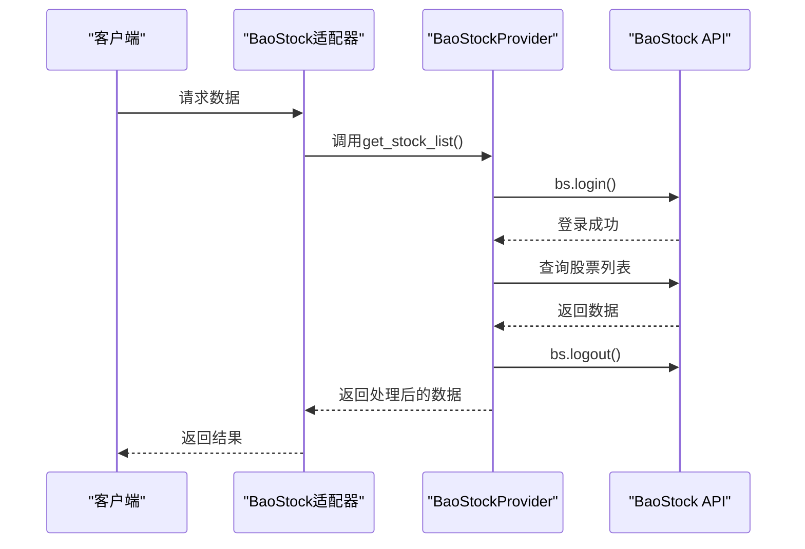
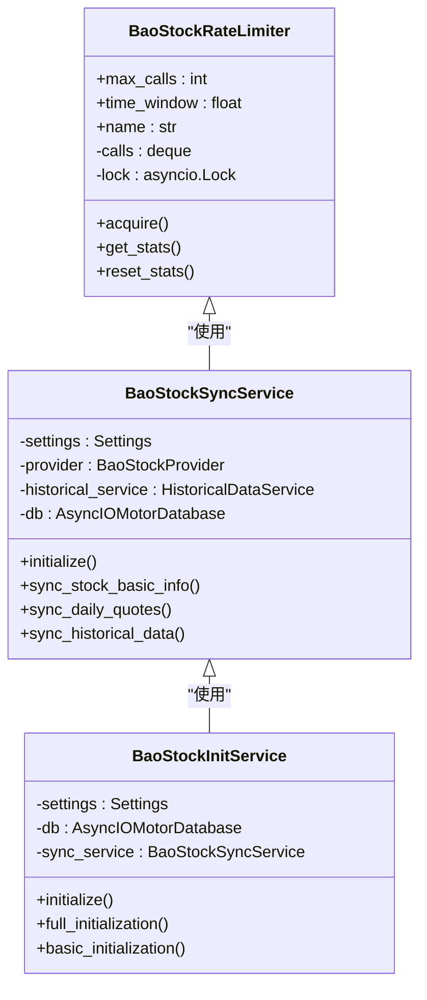
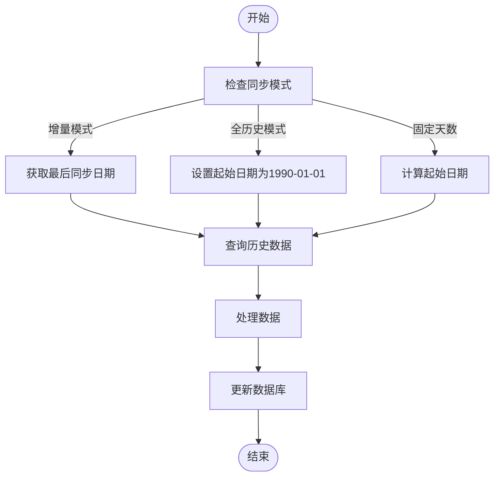
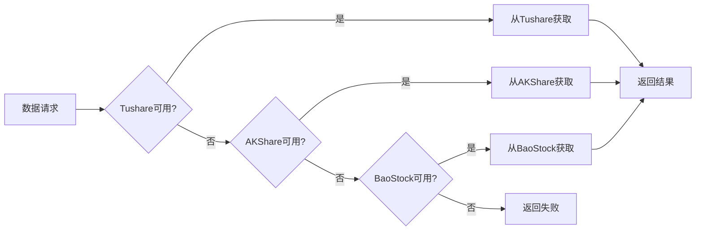
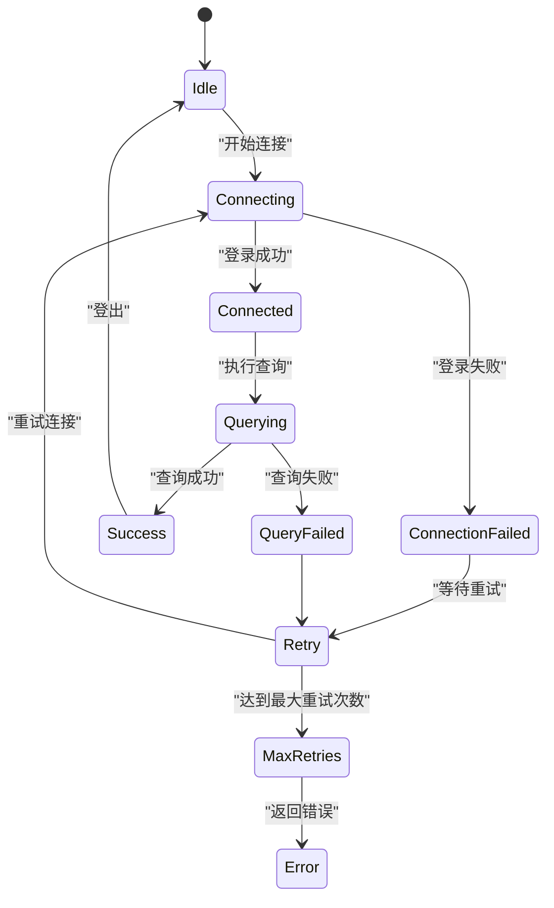
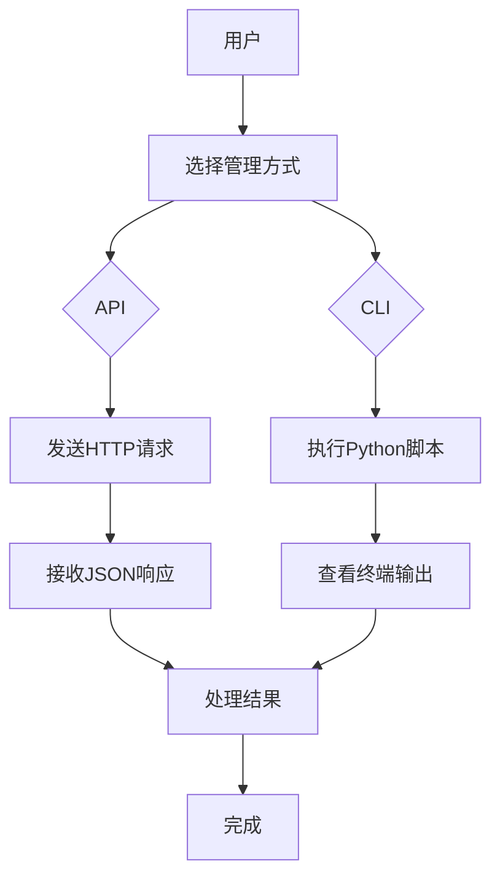

# BaoStock集成

<cite>
**本文档引用文件**   
- [baostock_adapter.py](file://app/services/data_sources/baostock_adapter.py)
- [baostock_init.py](file://app/routers/baostock_init.py)
- [baostock_init_service.py](file://app/worker/baostock_init_service.py)
- [baostock_sync_service.py](file://app/worker/baostock_sync_service.py)
- [baostock.py](file://tradingagents/dataflows/providers/china/baostock.py)
- [base.py](file://app/services/data_sources/base.py)
- [unified_config.py](file://app/core/unified_config.py)
- [historical_data_service.py](file://app/services/historical_data_service.py)
- [rate_limiter.py](file://app/core/rate_limiter.py)
- [baostock_init.py](file://cli/baostock_init.py)
</cite>

## 目录
1. [BaoStock适配器实现机制](#baostock适配器实现机制)
2. [会话管理与登录认证](#会话管理与登录认证)
3. [连接池与速率限制](#连接池与速率限制)
4. [数据获取方式](#数据获取方式)
5. [多源优先级配置](#多源优先级配置)
6. [稳定性保障措施](#稳定性保障措施)
7. [性能调优建议](#性能调优建议)
8. [API与CLI管理示例](#api与cli管理示例)

## BaoStock适配器实现机制

BaoStock适配器通过继承`DataSourceAdapter`基类实现，封装了与BaoStock数据源的交互逻辑。适配器核心功能包括股票列表获取、每日基础数据（PE/PB等）获取、实时行情和K线数据查询。适配器通过`is_available()`方法检查BaoStock库是否已安装，确保服务的健壮性。`get_stock_list()`方法在登录后查询股票基础信息和行业信息，并进行数据清洗和标准化，最终返回包含股票代码、名称、市场等信息的DataFrame。`get_daily_basic()`方法则用于获取指定交易日的估值数据，通过分批处理和进度日志提供良好的用户体验。

**Section sources**
- [baostock_adapter.py](file://app/services/data_sources/baostock_adapter.py#L1-L260)

## 会话管理与登录认证

BaoStock的会话管理采用"登录-操作-登出"的模式。在每次数据请求前，适配器会调用`bs.login()`建立会话，操作完成后立即调用`bs.logout()`释放资源。这种模式确保了会话的及时清理，避免了资源泄露。登录认证流程在`BaoStockProvider`类中实现，通过`_init_baostock()`方法加载BaoStock模块，并在`test_connection()`方法中进行连接测试。连接测试使用`asyncio.to_thread()`在独立线程中执行登录操作，避免阻塞异步事件循环。若登录失败，系统会记录错误日志并返回连接失败状态，确保上层服务能正确处理异常情况。

**Diagram sources**
- [baostock_adapter.py](file://app/services/data_sources/baostock_adapter.py#L1-L260)
- [baostock.py](file://tradingagents/dataflows/providers/china/baostock.py#L1-L903)

**Section sources**
- [baostock_adapter.py](file://app/services/data_sources/baostock_adapter.py#L1-L260)
- [baostock.py](file://tradingagents/dataflows/providers/china/baostock.py#L1-L903)

## 连接池与速率限制

系统通过`BaoStockRateLimiter`实现速率限制，采用滑动窗口算法精确控制API调用频率。默认配置为100次/分钟，可根据实际需求调整。速率限制器通过`acquire()`方法获取调用许可，若超过限制则自动等待。系统还实现了连接复用策略，在`BaoStockSyncService`中通过延迟初始化数据库连接，提高资源利用率。`BaoStockInitService`和`BaoStockSyncService`均采用异步初始化模式，确保数据库连接在异步上下文中正确建立。批处理大小（如`batch_size=50`）的配置也起到了连接池管理的作用，平衡了性能和稳定性。

**Diagram sources**
- [rate_limiter.py](file://app/core/rate_limiter.py#L1-L229)
- [baostock_init_service.py](file://app/worker/baostock_init_service.py#L1-L365)
- [baostock_sync_service.py](file://app/worker/baostock_sync_service.py#L1-L608)

**Section sources**
- [rate_limiter.py](file://app/core/rate_limiter.py#L1-L229)
- [baostock_init_service.py](file://app/worker/baostock_init_service.py#L1-L365)
- [baostock_sync_service.py](file://app/worker/baostock_sync_service.py#L1-L608)

## 数据获取方式

BaoStock采用分页查询和增量更新策略获取数据。`get_stock_list()`方法通过循环调用`rs.next()`分页获取所有股票数据，避免内存溢出。历史数据同步采用增量模式，通过`_get_last_sync_date()`获取每只股票的最后同步日期，从该日期的下一天开始同步，避免重复数据。`sync_historical_data()`方法支持全历史、固定天数和增量三种模式，灵活适应不同场景。财务数据获取通过`get_financial_data()`方法实现，按盈利能力、营运能力、成长能力等分类查询，并合并为统一的数据结构。总市值计算通过股价乘以总股本实现，总股本从财务数据中获取，确保数据的准确性。

**Diagram sources**
- [baostock_adapter.py](file://app/services/data_sources/baostock_adapter.py#L1-L260)
- [baostock_sync_service.py](file://app/worker/baostock_sync_service.py#L1-L608)

**Section sources**
- [baostock_adapter.py](file://app/services/data_sources/baostock_adapter.py#L1-L260)
- [baostock_sync_service.py](file://app/worker/baostock_sync_service.py#L1-L608)

## 多源优先级配置

BaoStock在多源环境中的优先级由`unified_config.py`中的`get_data_source_configs()`方法管理。默认优先级顺序为Tushare > AKShare > BaoStock，数字越大优先级越高。系统优先从数据库的`system_configs`集合读取配置，若不存在则使用硬编码配置。`BaoStockAdapter`的`_get_default_priority()`方法返回1，表示最低优先级。当多个数据源可用时，系统会按优先级顺序尝试获取数据，若高优先级源失败则自动降级到低优先级源。这种设计确保了数据获取的高可用性，同时允许用户通过数据库配置灵活调整优先级。

**Diagram sources**
- [unified_config.py](file://app/core/unified_config.py#L1-L501)
- [baostock_adapter.py](file://app/services/data_sources/baostock_adapter.py#L1-L260)

**Section sources**
- [unified_config.py](file://app/core/unified_config.py#L1-L501)
- [baostock_adapter.py](file://app/services/data_sources/baostock_adapter.py#L1-L260)

## 稳定性保障措施

系统通过多层次的异常处理和恢复策略保障BaoStock服务的稳定性。连接重试机制在`_execute_bulk_write_with_retry()`方法中实现，最多重试5次，确保数据写入的可靠性。会话超时处理通过在每次操作前重新登录实现，避免长会话导致的超时问题。异常恢复策略包括：在`get_stock_list()`中捕获`ImportError`并返回None；在同步服务中捕获异常并记录错误，但不影响其他股票的同步；在CLI工具中捕获`KeyboardInterrupt`并优雅退出。`check_service_status()`方法提供全面的服务健康检查，包括BaoStock连接和数据库连接状态，便于及时发现和解决问题。

**Diagram sources**
- [baostock_sync_service.py](file://app/worker/baostock_sync_service.py#L1-L608)
- [historical_data_service.py](file://app/services/historical_data_service.py#L1-L507)
- [baostock_init.py](file://cli/baostock_init.py#L1-L284)

**Section sources**
- [baostock_sync_service.py](file://app/worker/baostock_sync_service.py#L1-L608)
- [historical_data_service.py](file://app/services/historical_data_service.py#L1-L507)
- [baostock_init.py](file://cli/baostock_init.py#L1-L284)

## 性能调优建议

为优化BaoStock集成的性能，建议采取以下措施：查询频率控制方面，使用`BaoStockRateLimiter`限制调用频率，避免触发API限流；数据缓存配置方面，通过`BAOSTOCK_INIT_BATCH_SIZE`环境变量调整批处理大小，平衡内存使用和处理速度。历史数据同步建议使用增量模式，减少不必要的数据传输。对于财务数据，可限制处理的股票数量，避免长时间运行。在`baostock_unified/README.md`中建议：基础信息50条/批次，行情数据50条/批次，历史数据20条/批次，财务数据限制前50只股票。这些配置可根据实际网络环境和硬件性能进行调整，以达到最佳性能。

**Section sources**
- [rate_limiter.py](file://app/core/rate_limiter.py#L1-L229)
- [baostock_unified/README.md](file://docs/guides/baostock_unified/README.md#L250-L323)

## API与CLI管理示例

通过API和CLI工具可方便地管理BaoStock连接。API示例包括：使用`/api/baostock-init/connection-test`测试连接，`/api/baostock-init/start-full`启动完整初始化。CLI工具提供丰富的命令行选项，如`python cli/baostock_init.py --test-connection`测试连接，`--full`进行完整初始化，`--historical-days 180`自定义历史数据范围。CLI工具还支持`--help-detail`显示详细帮助，包含所有使用示例和注意事项。这些工具通过异步执行和进度日志提供良好的用户体验，便于自动化脚本集成和日常维护。

**Diagram sources**
- [baostock_init.py](file://app/routers/baostock_init.py#L1-L331)
- [baostock_init.py](file://cli/baostock_init.py#L1-L284)

**Section sources**
- [baostock_init.py](file://app/routers/baostock_init.py#L1-L331)
- [baostock_init.py](file://cli/baostock_init.py#L1-L284)