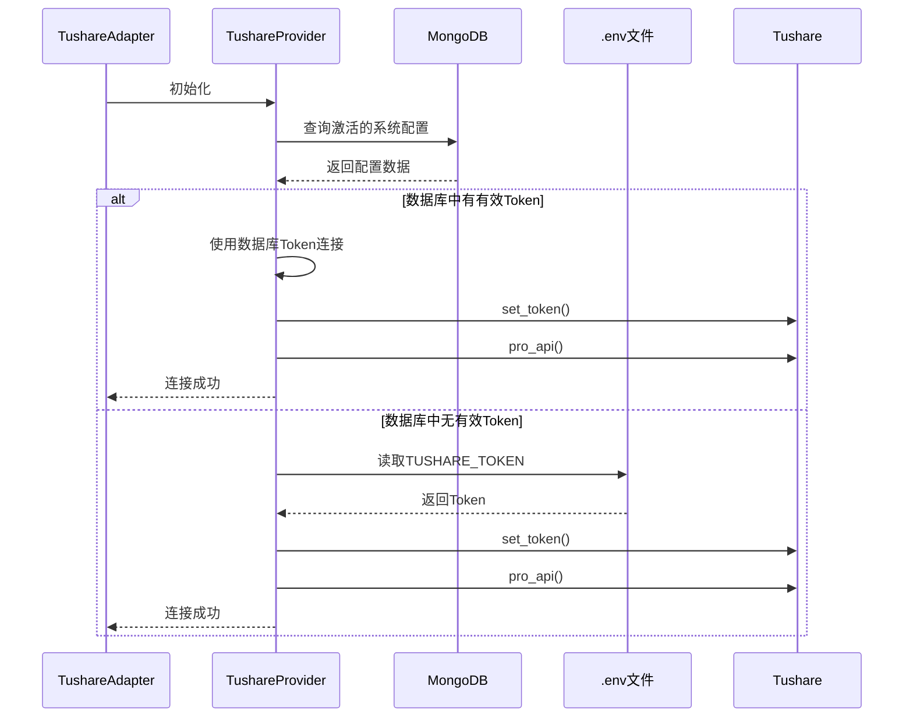
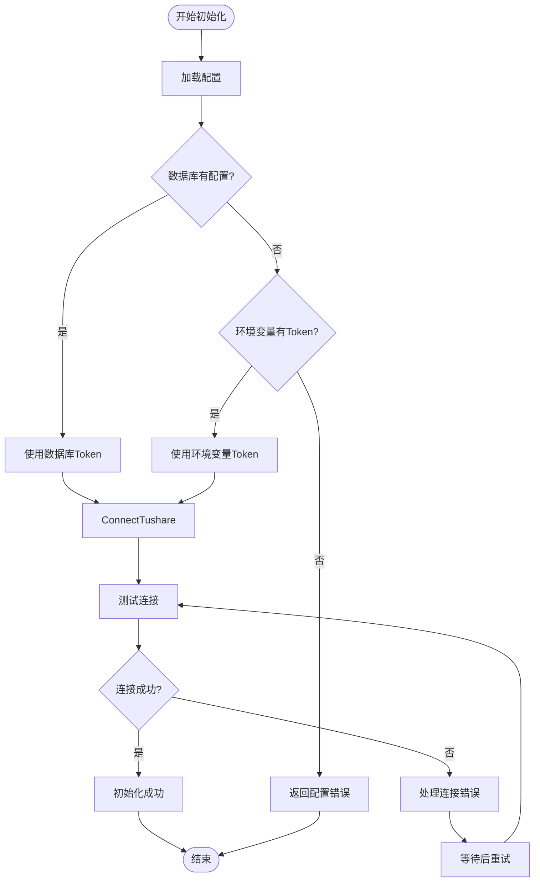
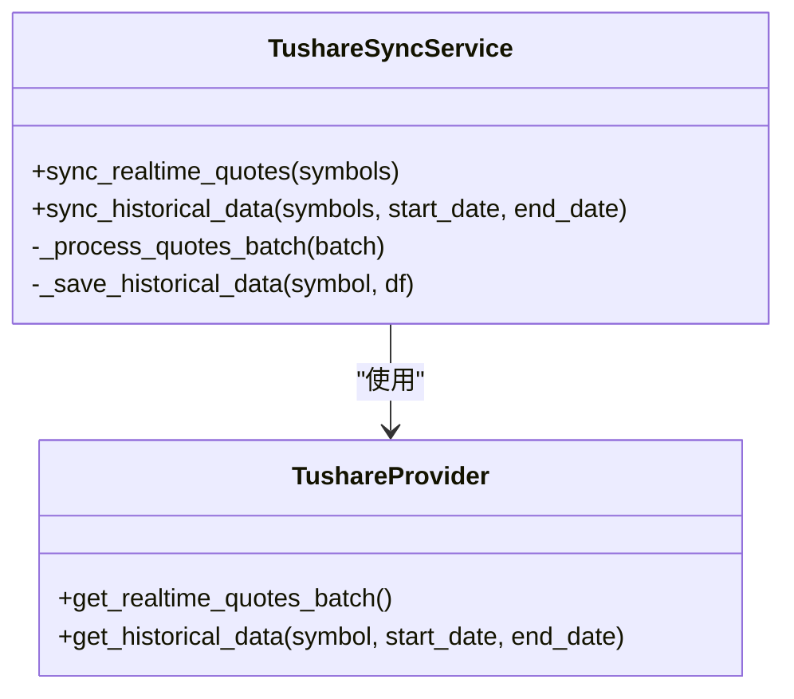

# Tushare集成

<cite>
**本文档引用的文件**   
- [tushare_adapter.py](file://app/services/data_sources/tushare_adapter.py)
- [tushare_init.py](file://app/routers/tushare_init.py)
- [tushare_init_service.py](file://app/worker/tushare_init_service.py)
- [tushare_sync_service.py](file://app/worker/tushare_sync_service.py)
- [cli/tushare_init.py](file://cli/tushare_init.py)
- [tushare.py](file://tradingagents/dataflows/providers/china/tushare.py)
</cite>

## 目录
1. [简介](#简介)
2. [Tushare适配器实现细节](#tushare适配器实现细节)
3. [Tushare初始化流程](#tushare初始化流程)
4. [Tushare数据同步机制](#tushare数据同步机制)
5. [Tushare API调用最佳实践](#tushare-api调用最佳实践)
6. [常见问题解决方案](#常见问题解决方案)
7. [CLI和API接口配置](#cli和api接口配置)

## 简介
Tushare数据源集成是本系统的重要组成部分，提供高质量的中国股票市场数据。本文档详细说明了Tushare数据源的集成实现，包括适配器设计、初始化流程、数据同步机制、API调用最佳实践以及常见问题的解决方案。通过本文档，用户可以全面了解如何配置和使用Tushare数据源，确保系统的稳定运行和数据的准确性。

## Tushare适配器实现细节

Tushare适配器实现了`DataSourceAdapter`统一接口，作为系统与Tushare数据源之间的桥梁。适配器的主要职责包括API密钥认证、数据格式转换和错误处理。

### API密钥认证
Tushare适配器通过`TushareProvider`进行API密钥认证。认证流程优先从数据库读取Token，如果数据库中没有配置，则降级到使用环境变量中的Token。这种设计确保了用户在Web后台修改配置后可以立即生效，而不需要重新部署系统。



**Diagram sources**
- [tushare.py](file://tradingagents/dataflows/providers/china/tushare.py#L31-L174)
- [tushare_adapter.py](file://app/services/data_sources/tushare_adapter.py#L14-L37)

**Section sources**
- [tushare.py](file://tradingagents/dataflows/providers/china/tushare.py#L31-L174)
- [tushare_adapter.py](file://app/services/data_sources/tushare_adapter.py#L14-L37)

### 数据格式转换
Tushare适配器负责将Tushare原始数据转换为系统标准格式。适配器提供了多个方法来处理不同类型的数据：

- `get_stock_list()`: 获取股票列表，转换为包含ts_code、symbol、name等字段的DataFrame
- `get_daily_basic()`: 获取每日基础财务数据，包含总市值、流通市值、市盈率等指标
- `get_kline()`: 获取K线数据，支持日线、周线、月线及分钟线
- `get_news()`: 获取股票相关新闻和公告

数据转换过程中，适配器会标准化字段名称，确保与系统其他部分的数据格式一致。

**Section sources**
- [tushare_adapter.py](file://app/services/data_sources/tushare_adapter.py#L59-L314)

### 错误处理
Tushare适配器实现了完善的错误处理机制。当API调用失败时，适配器会记录详细的错误信息，并根据错误类型采取相应的措施：

- 网络连接错误：重试机制，最多重试3次
- API限流错误：记录警告并停止后续调用，避免进一步触发限流
- 数据格式错误：捕获异常并返回空结果，不影响其他数据的获取

适配器还提供了`is_available()`方法来检查Tushare服务的可用性，如果服务不可用，会尝试重新连接。

**Section sources**
- [tushare_adapter.py](file://app/services/data_sources/tushare_adapter.py#L44-L57)

## Tushare初始化流程

Tushare初始化流程从配置加载到连接测试，确保系统能够正确连接并使用Tushare数据源。

### 配置加载
初始化流程首先从多种来源加载配置，优先级顺序为：数据库配置 > 环境变量 > 默认配置。系统会检查`.env`文件中的`TUSHARE_TOKEN`，如果存在有效Token，则使用该Token进行连接。



**Diagram sources**
- [tushare_init_service.py](file://app/worker/tushare_init_service.py#L57-L71)
- [tushare.py](file://tradingagents/dataflows/providers/china/tushare.py#L88-L174)

**Section sources**
- [tushare_init_service.py](file://app/worker/tushare_init_service.py#L57-L71)
- [tushare.py](file://tradingagents/dataflows/providers/china/tushare.py#L88-L174)

### 连接测试
连接测试是初始化流程的关键步骤。系统会调用Tushare的`trade_cal`接口来验证Token的有效性。测试过程包括：

1. 设置Token：调用`tushare.set_token()`设置API Token
2. 创建API实例：调用`tushare.pro_api()`创建API实例
3. 轻量级测试：调用`trade_cal`接口获取交易日历，验证连接

如果测试成功，系统会记录响应时间并确认凭证来源（数据库或环境变量）。

**Section sources**
- [config_service.py](file://app/services/config_service.py#L1239-L1257)

## Tushare数据同步机制

Tushare数据同步机制涵盖了股票基础信息、行情数据和财务数据的获取方式，确保系统能够及时获取最新的市场数据。

### 股票基础信息同步
股票基础信息同步通过调用Tushare的`stock_basic`接口实现。系统会获取所有上市股票的基本信息，包括股票代码、名称、行业、上市日期等。同步过程采用批量处理方式，每100只股票为一批，以提高效率。

同步的数据字段包括：
- `ts_code`: TS代码（000001.SZ）
- `symbol`: 股票代码（000001）
- `name`: 股票名称
- `area`: 地域
- `industry`: 所属行业
- `market`: 市场类型
- `exchange`: 交易所代码
- `list_date`: 上市日期

**Section sources**
- [tushare_sync_service.py](file://app/worker/tushare_sync_service.py#L75-L225)

### 行情数据同步
行情数据同步分为实时行情和历史数据两种类型。

**实时行情同步**：
- 少量股票（≤10只）：自动切换到AKShare接口，避免浪费Tushare的rt_k配额
- 大量股票或全市场：使用Tushare的rt_k批量接口一次性获取
- 数据包含：开盘价、最高价、最低价、收盘价、成交量、成交额等

**历史数据同步**：
- 支持日线、周线、月线及分钟线数据
- 使用`pro_bar`接口获取前复权数据，与同花顺一致
- 增量同步：从上次同步的最后日期开始获取新数据



**Diagram sources**
- [tushare_sync_service.py](file://app/worker/tushare_sync_service.py#L228-L758)
- [tushare.py](file://tradingagents/dataflows/providers/china/tushare.py#L352-L559)

**Section sources**
- [tushare_sync_service.py](file://app/worker/tushare_sync_service.py#L228-L758)

### 财务数据同步
财务数据同步通过调用Tushare的多个财务接口实现，包括：

- 利润表（income）
- 资产负债表（balancesheet）
- 现金流量表（cashflow）
- 财务指标（fina_indicator）
- 主营业务构成（fina_mainbz）

同步过程会获取最近4个季度的财务数据，并将不同接口的数据整合为统一的财务数据结构。系统还会计算TTM（滚动十二个月）指标，提供更准确的财务分析数据。

**Section sources**
- [tushare_sync_service.py](file://app/worker/tushare_sync_service.py#L759-L800)

## Tushare API调用最佳实践

为了确保系统的稳定性和数据获取的效率，遵循以下Tushare API调用最佳实践至关重要。

### 频率限制处理
Tushare API有严格的频率限制，不同等级的账户有不同的调用限制。系统通过以下方式处理频率限制：

- **速率限制器**：使用`TushareRateLimiter`控制API调用频率，确保不超过账户限制
- **限流检测**：检测API返回的限流错误信息，如"每分钟最多访问"、"rate limit"等
- **安全边际**：配置速率限制时设置安全边际（默认80%），避免接近限制阈值

当检测到限流时，系统会记录警告并停止后续调用，直到下一个时间窗口。

**Section sources**
- [rate_limiter.py](file://app/core/rate_limiter.py#L131-L144)

### 数据缓存策略
系统实现了多层数据缓存策略，以减少对Tushare API的直接调用：

- **内存缓存**：对频繁访问的数据（如股票列表）进行内存缓存
- **数据库缓存**：将获取的数据存储在MongoDB中，避免重复获取
- **缓存更新**：设置合理的缓存过期时间，确保数据的时效性

对于基础信息，缓存过期时间为24小时；对于行情数据，缓存过期时间为1小时。

**Section sources**
- [tushare_adapter.py](file://app/services/data_sources/tushare_adapter.py#L152-L157)

## 常见问题解决方案

### Token失效
当Tushare Token失效时，系统会显示连接失败的错误信息。解决方案包括：

1. 检查`.env`文件中的`TUSHARE_TOKEN`是否正确
2. 在Web后台重新配置Tushare Token
3. 确认Tushare账户有足够的积分和权限
4. 重启系统以重新加载配置

**Section sources**
- [tushare.py](file://tradingagents/dataflows/providers/china/tushare.py#L168-L169)

### 网络连接超时
网络连接超时可能是由于网络问题或Tushare服务器问题导致。解决方案包括：

1. 检查网络连接是否正常
2. 确认防火墙或代理设置没有阻止连接
3. 等待一段时间后重试
4. 检查Tushare官方状态页面，确认服务是否正常

系统会自动重试连接，最多重试3次，每次间隔0.1秒。

**Section sources**
- [tushare.py](file://tradingagents/dataflows/providers/china/tushare.py#L95-L96)

## CLI和API接口配置

### CLI工具配置
系统提供了CLI工具来配置Tushare数据源。使用方法如下：

```bash
# 首次完整初始化（推荐）
python cli/tushare_init.py --full

# 初始化最近6个月的历史数据
python cli/tushare_init.py --full --historical-days 180

# 初始化全历史数据
python cli/tushare_init.py --full --historical-days 10000

# 仅同步历史数据
python cli/tushare_init.py --full --sync-items historical
```

CLI工具支持多种选项，包括历史数据天数、批处理大小、是否强制初始化等。

**Section sources**
- [cli/tushare_init.py](file://cli/tushare_init.py#L1-L293)

### API接口配置
通过Web API接口可以配置Tushare数据源。主要API端点包括：

- `/api/tushare-init/status`: 获取数据库状态
- `/api/tushare-init/initialization-status`: 获取初始化状态
- `/api/tushare-init/start-basic`: 启动基础信息初始化
- `/api/tushare-init/start-full`: 启动完整数据初始化
- `/api/tushare-init/stop`: 停止初始化任务

这些API端点允许用户通过Web界面管理Tushare数据源的初始化过程。

**Section sources**
- [tushare_init.py](file://app/routers/tushare_init.py#L1-L302)