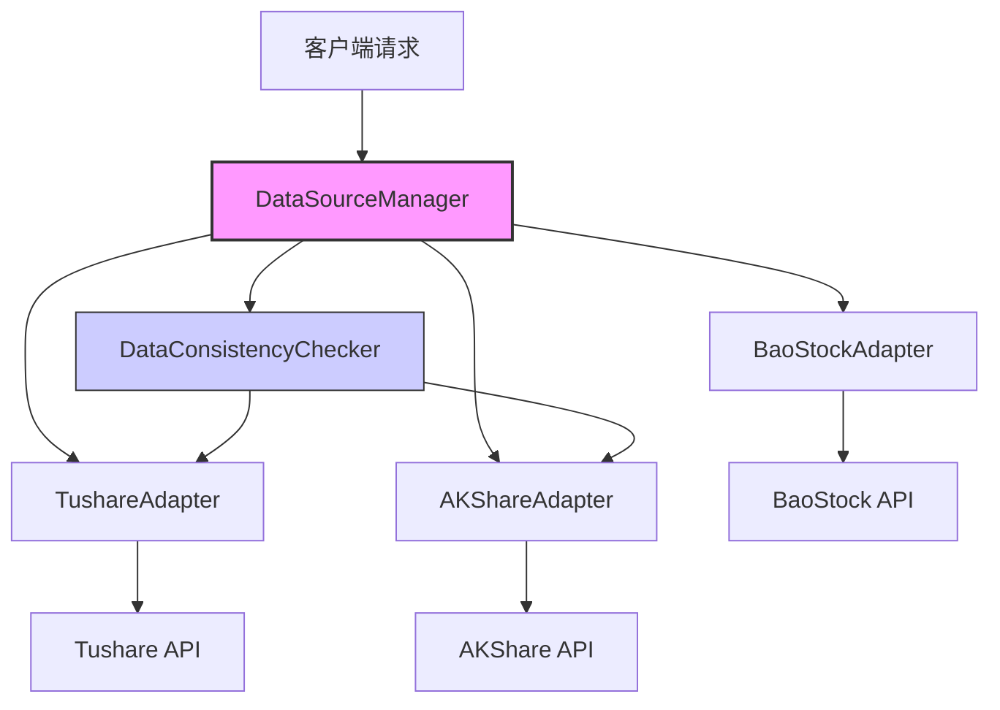

# 数据源扩展

<cite>
**本文档引用的文件**   
- [base.py](file://app/services/data_sources/base.py)
- [manager.py](file://app/services/data_sources/manager.py)
- [akshare_adapter.py](file://app/services/data_sources/akshare_adapter.py)
- [tushare_adapter.py](file://app/services/data_sources/tushare_adapter.py)
- [baostock_adapter.py](file://app/services/data_sources/baostock_adapter.py)
- [ADD_NEW_DATA_SOURCE.md](file://docs/development/ADD_NEW_DATA_SOURCE.md)
- [data_consistency_checker.py](file://app/services/data_sources/data_consistency_checker.py)
</cite>

## 目录
1. [引言](#引言)
2. [核心架构与设计](#核心架构与设计)
3. [数据源适配器接口规范](#数据源适配器接口规范)
4. [数据格式标准化要求](#数据格式标准化要求)
5. [扩展开发工作流程](#扩展开发工作流程)
6. [新数据源适配器实现示例](#新数据源适配器实现示例)
7. [集成测试方法](#集成测试方法)
8. [最佳实践与注意事项](#最佳实践与注意事项)
9. [结论](#结论)

## 引言

本文档旨在为开发者提供一份详尽的指南，用于在系统中扩展新的数据源适配器。通过分析 `manager.py` 和 `base.py` 中定义的抽象基类，我们将详细阐述如何实现一个符合系统规范的新数据源适配器。文档将涵盖必须实现的接口方法、数据格式的标准化要求、完整的开发工作流程、代码示例以及集成测试方法。同时，我们也会引用 `ADD_NEW_DATA_SOURCE.md` 中的最佳实践和注意事项，确保扩展开发的高质量和稳定性。

**Section sources**
- [base.py](file://app/services/data_sources/base.py#L1-L70)
- [manager.py](file://app/services/data_sources/manager.py#L1-L309)

## 核心架构与设计

系统采用数据源管理器（DataSourceManager）模式来统一管理和调度多个数据源适配器。该设计的核心是通过一个中心化的管理器来协调不同数据源的优先级、可用性检查和数据获取的降级（fallback）逻辑。

### 架构概览



**Diagram sources**
- [manager.py](file://app/services/data_sources/manager.py#L17-L309)
- [base.py](file://app/services/data_sources/base.py#L9-L70)

### 核心组件

- **DataSourceManager (数据源管理器)**：作为系统的入口，负责初始化所有适配器、从数据库加载优先级配置、按优先级排序，并提供带有降级逻辑的统一数据获取接口。
- **DataSourceAdapter (数据源适配器基类)**：定义了所有具体数据源适配器必须实现的抽象接口，确保了不同数据源在接口层面的一致性。
- **DataConsistencyChecker (数据一致性检查器)**：可选组件，用于在多个数据源返回数据时进行比对和冲突解决，以提高数据的可靠性。

**Section sources**
- [manager.py](file://app/services/data_sources/manager.py#L17-L309)
- [base.py](file://app/services/data_sources/base.py#L9-L70)

## 数据源适配器接口规范

`DataSourceAdapter` 基类定义了一套完整的抽象方法，任何新的数据源适配器都必须继承此类并实现所有抽象方法。

### 必须实现的接口方法

| 方法名 | 参数 | 返回值 | 说明 |
| :--- | :--- | :--- | :--- |
| `name` | - | `str` | **属性**，返回数据源的唯一标识符（小写字符串，如 "tushare"）。 |
| `_get_default_priority` | - | `int` | 返回该数据源的默认优先级（数字越大，优先级越高）。 |
| `is_available` | - | `bool` | 检查数据源是否可用（如API密钥是否有效，网络连接是否正常）。 |
| `get_stock_list` | - | `Optional[pd.DataFrame]` | 获取全市场股票列表，返回包含股票代码、名称等信息的DataFrame。 |
| `get_daily_basic` | `trade_date: str` | `Optional[pd.DataFrame]` | 获取指定交易日的每日基础财务数据。 |
| `find_latest_trade_date` | - | `Optional[str]` | 查找并返回最新的交易日期（YYYYMMDD格式）。 |
| `get_realtime_quotes` | - | `Optional[Dict[str, Dict[str, Optional[float]]]]` | 获取全市场实时快照，返回以6位股票代码为键的字典。 |
| `get_kline` | `code: str, period: str, limit: int, adj: Optional[str]` | `Optional[List[Dict]]` | 获取指定股票的K线数据，返回按时间正序排列的列表。 |
| `get_news` | `code: str, days: int, limit: int, include_announcements: bool` | `Optional[List[Dict]]` | 获取指定股票的新闻和公告，返回列表。 |

**Section sources**
- [base.py](file://app/services/data_sources/base.py#L15-L69)

## 数据格式标准化要求

为了确保不同数据源返回的数据能够被系统统一处理，所有适配器在返回数据前必须进行格式标准化。

### 股票列表 (get_stock_list)

返回的 `DataFrame` 必须包含以下列：
- `symbol`: 6位股票代码（如 "000001"）。
- `name`: 股票名称。
- `ts_code`: 完整的股票代码（如 "000001.SZ"）。
- `market`: 所属市场（如 "主板"、"创业板"）。
- `industry`: 所属行业。
- `area`: 所属地区。

### 每日基础数据 (get_daily_basic)

返回的 `DataFrame` 必须包含以下列：
- `ts_code`: 股票代码。
- `trade_date`: 交易日期（YYYYMMDD）。
- `name`: 股票名称。
- `close`: 收盘价。
- `total_mv`: 总市值（单位：亿元）。
- `pe`: 市盈率。
- `pb`: 市净率。
- `ps`: 市销率。
- `turnover_rate`: 换手率。

### 实时行情 (get_realtime_quotes)

返回的字典结构必须为：
```python
{
    "000001": {
        "close": 10.0,      # 收盘价
        "pct_chg": 1.2,     # 涨跌幅
        "amount": 1.2e8,    # 成交额
        "volume": 1.2e7,    # 成交量（股）
        "open": 9.9,        # 开盘价
        "high": 10.1,       # 最高价
        "low": 9.8,         # 最低价
        "pre_close": 9.88   # 昨收价
    },
    ...
}
```

### K线数据 (get_kline)

返回的列表中每个字典必须包含以下字段：
- `time`: 时间戳（字符串）。
- `open`: 开盘价。
- `high`: 最高价。
- `low`: 最低价。
- `close`: 收盘价。
- `volume`: 成交量。
- `amount`: 成交额。

### 新闻数据 (get_news)

返回的列表中每个字典必须包含以下字段：
- `title`: 新闻标题。
- `source`: 来源。
- `time`: 发布时间。
- `url`: 链接。
- `type`: 类型（"news" 或 "announcement"）。

**Section sources**
- [tushare_adapter.py](file://app/services/data_sources/tushare_adapter.py#L82-L97)
- [akshare_adapter.py](file://app/services/data_sources/akshare_adapter.py#L115-L184)
- [baostock_adapter.py](file://app/services/data_sources/baostock_adapter.py#L107-L215)

## 扩展开发工作流程

从零开始创建一个新的数据源适配器需要遵循以下步骤：

### 1. 环境准备

确保开发环境已安装必要的依赖库，例如 `pandas`、`requests` 以及目标数据源的官方SDK（如果存在）。

### 2. 创建适配器文件

在 `app/services/data_sources/` 目录下创建一个新的Python文件，例如 `your_new_source_adapter.py`。

### 3. 继承基类并实现接口

创建一个新类，继承 `DataSourceAdapter`，并实现所有抽象方法。

### 4. 处理依赖和初始化

在 `__init__` 方法中，处理API密钥的加载和第三方库的初始化。

### 5. 实现数据获取逻辑

针对每个接口方法，编写具体的API调用和数据解析逻辑。

### 6. 进行数据标准化

将从API获取的原始数据转换为系统要求的标准化格式。

### 7. 添加错误处理和日志记录

为每个方法添加 `try-except` 块，捕获异常并记录日志，确保适配器的健壮性。

### 8. 注册到管理器

将新适配器的实例添加到 `DataSourceManager` 的 `adapters` 列表中。

**Section sources**
- [manager.py](file://app/services/data_sources/manager.py#L26-L30)
- [base.py](file://app/services/data_sources/base.py#L12-L13)

## 新数据源适配器实现示例

以下是一个创建新数据源适配器的代码框架示例：

```python
"""
YourNewSource 数据源适配器
"""

from typing import Optional, Dict
import logging
import pandas as pd
from .base import DataSourceAdapter

logger = logging.getLogger(__name__)

class YourNewSourceAdapter(DataSourceAdapter):
    """YourNewSource 数据源适配器"""

    def __init__(self):
        super().__init__()
        self._api_key = self._load_api_key()
        self._client = self._initialize_client()

    def _load_api_key(self) -> Optional[str]:
        """从环境变量加载API密钥"""
        import os
        return os.getenv("YOUR_NEW_SOURCE_API_KEY")

    def _initialize_client(self):
        """初始化YourNewSource客户端"""
        try:
            from your_new_source_sdk import Client
            return Client(api_key=self._api_key)
        except ImportError:
            logger.warning("YourNewSource SDK 未安装")
            return None

    @property
    def name(self) -> str:
        return "your_new_source"

    def _get_default_priority(self) -> int:
        return 4  # 自定义优先级

    def is_available(self) -> bool:
        return self._client is not None and self._api_key is not None

    def get_stock_list(self) -> Optional[pd.DataFrame]:
        # 实现获取股票列表的逻辑
        pass

    def get_daily_basic(self, trade_date: str) -> Optional[pd.DataFrame]:
        # 实现获取每日基础数据的逻辑
        pass

    def find_latest_trade_date(self) -> Optional[str]:
        # 实现查找最新交易日期的逻辑
        pass

    def get_realtime_quotes(self) -> Optional[Dict[str, Dict[str, Optional[float]]]]:
        # 实现获取实时行情的逻辑
        pass

    def get_kline(self, code: str, period: str = "day", limit: int = 120, adj: Optional[str] = None):
        # 实现获取K线数据的逻辑
        pass

    def get_news(self, code: str, days: int = 2, limit: int = 50, include_announcements: bool = True):
        # 实现获取新闻数据的逻辑
        pass
```

**Section sources**
- [base.py](file://app/services/data_sources/base.py#L9-L70)

## 集成测试方法

新适配器开发完成后，必须进行严格的集成测试，以确保其在多源同步场景下的稳定运行。

### 1. 单元测试

为每个接口方法编写单元测试，验证其在各种输入和异常情况下的行为。

### 2. 功能测试

使用 `DataSourceManager` 提供的 `get_*_with_fallback` 方法，测试新适配器与其他适配器的降级逻辑是否正常工作。

### 3. 一致性测试

如果系统启用了 `DataConsistencyChecker`，测试当新适配器作为主数据源或备数据源时，一致性检查的结果是否符合预期。

### 4. 性能测试

评估新适配器的数据获取速度和资源消耗，确保其不会成为系统瓶颈。

### 5. 稳定性测试

进行长时间运行测试，检查是否存在内存泄漏或连接超时等问题。

**Section sources**
- [manager.py](file://app/services/data_sources/manager.py#L103-L308)
- [data_consistency_checker.py](file://app/services/data_sources/data_consistency_checker.py#L30-L48)

## 最佳实践与注意事项

在扩展开发过程中，请遵循以下最佳实践：

1.  **优先级配置**：合理设置默认优先级，并允许通过数据库进行动态调整。
2.  **错误处理**：对所有外部API调用进行完善的错误处理，避免因单个数据源故障导致整个系统崩溃。
3.  **日志记录**：使用 `logging` 模块记录关键操作和错误信息，便于问题排查。
4.  **数据缓存**：对于频繁访问且变化不大的数据，考虑实现本地缓存以提高性能。
5.  **API速率限制**：遵守目标API的速率限制规则，避免账号被封禁。
6.  **代码复用**：提取公共逻辑（如 `_safe_float`）到基类或工具函数中，减少代码重复。
7.  **文档完善**：为新适配器编写清晰的文档，说明其配置方法和使用限制。

**Section sources**
- [ADD_NEW_DATA_SOURCE.md](file://docs/development/ADD_NEW_DATA_SOURCE.md#L415-L423)

## 结论

通过遵循本文档提供的指南，开发者可以高效地实现新的数据源适配器，并将其无缝集成到现有系统中。关键在于严格遵守 `DataSourceAdapter` 基类定义的接口规范和数据格式标准，并通过全面的测试来验证其功能和稳定性。这种模块化的设计使得系统能够灵活地支持多种数据源，为用户提供更丰富、更可靠的数据服务。