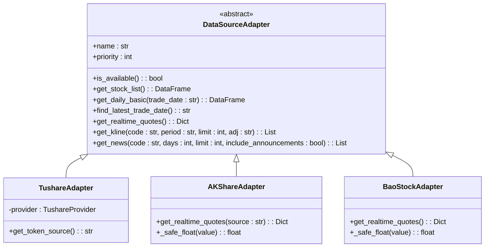
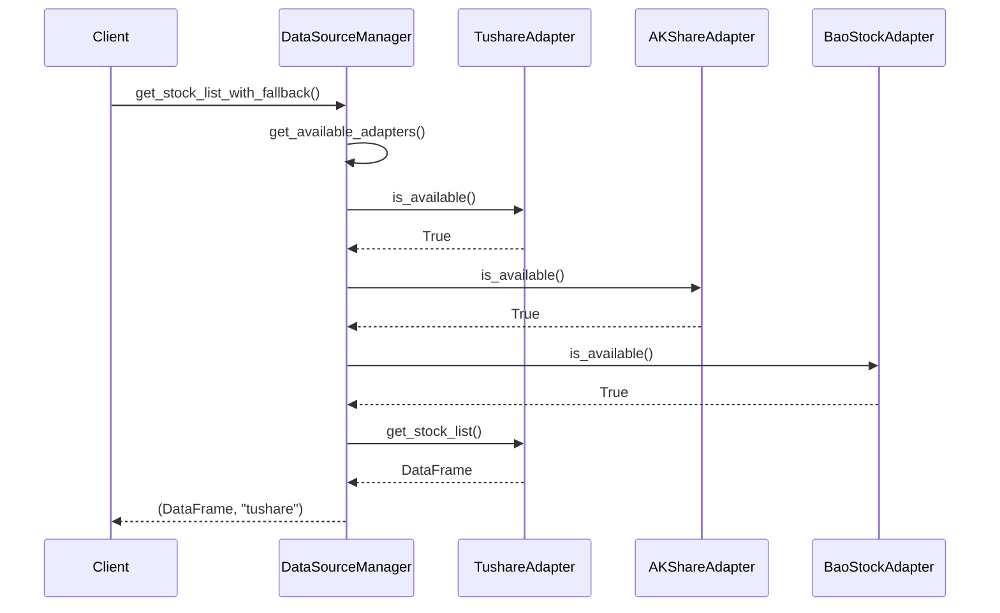
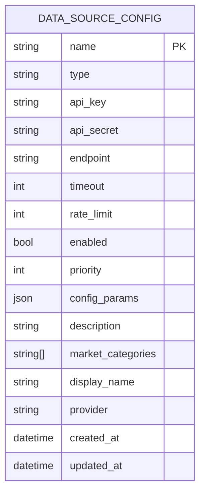
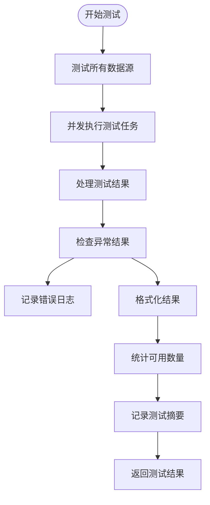
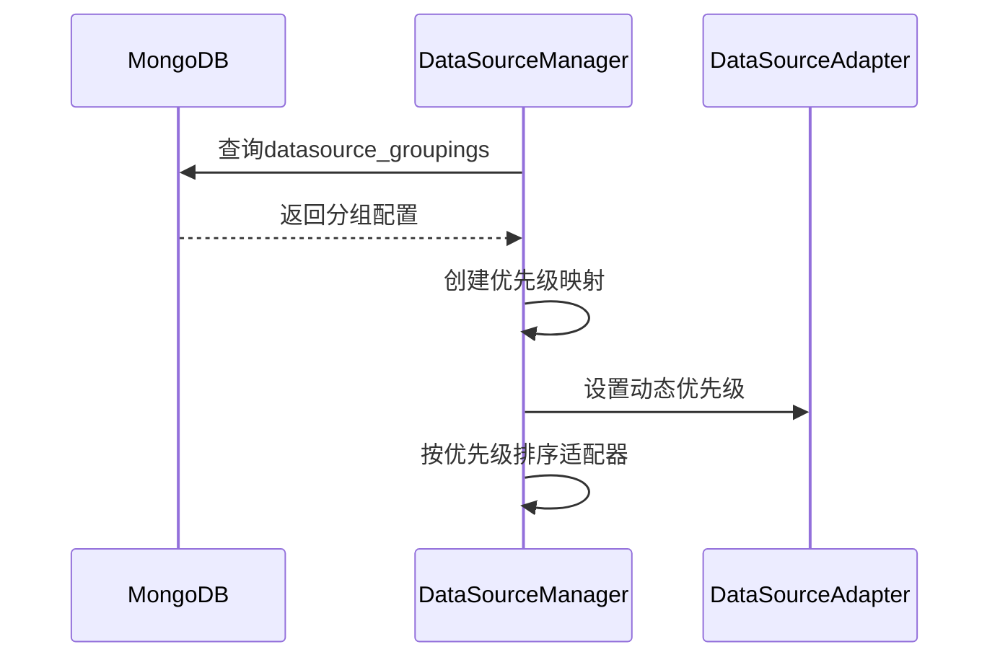
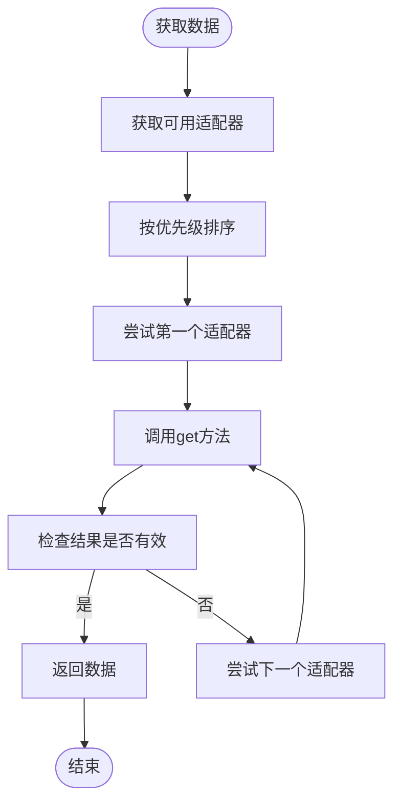

# 数据源管理

<cite>
**本文档引用的文件**   
- [base.py](file://app/services/data_sources/base.py)
- [tushare_adapter.py](file://app/services/data_sources/tushare_adapter.py)
- [akshare_adapter.py](file://app/services/data_sources/akshare_adapter.py)
- [baostock_adapter.py](file://app/services/data_sources/baostock_adapter.py)
- [manager.py](file://app/services/data_sources/manager.py)
- [config.py](file://app/models/config.py)
- [config_service.py](file://app/services/config_service.py)
- [multi_source_sync.py](file://app/routers/multi_source_sync.py)
</cite>

## 目录
1. [引言](#引言)
2. [数据源适配器实现](#数据源适配器实现)
3. [适配器模式应用](#适配器模式应用)
4. [数据源配置结构](#数据源配置结构)
5. [健康检查机制](#健康检查机制)
6. [数据源切换与故障转移](#数据源切换与故障转移)
7. [数据源扩展指南](#数据源扩展指南)
8. [结论](#结论)

## 引言
本文档详细说明了Tushare、AkShare和BaoStock三大数据源的集成方式，重点阐述了适配器模式在数据源管理中的应用。系统通过统一接口抽象不同数据源的差异，实现了灵活的数据源管理和故障转移机制。文档涵盖了数据源配置结构、健康检查、切换策略以及扩展新数据源的方法，为系统的稳定运行和可扩展性提供了全面的技术支持。

## 数据源适配器实现

### Tushare适配器
Tushare适配器作为优先级最高的数据源，提供了完整的股票列表、每日基础数据、实时行情和K线数据获取功能。适配器通过TushareProvider连接到数据源，实现了`get_stock_list`、`get_daily_basic`、`get_realtime_quotes`和`get_kline`等核心方法。适配器还实现了健康检查机制，通过检查连接状态和API可用性来判断数据源的可用性。

**Section sources**
- [tushare_adapter.py](file://app/services/data_sources/tushare_adapter.py#L1-L314)

### AkShare适配器
AkShare适配器作为次优先级数据源，提供了股票列表、基础财务数据和实时行情获取功能。适配器通过`stock_info_a_code_name`接口获取真实股票名称，并实现了`get_stock_list`、`get_daily_basic`和`get_realtime_quotes`方法。适配器支持从东方财富和新浪财经两个数据源获取实时行情，增强了数据获取的可靠性。

**Section sources**
- [akshare_adapter.py](file://app/services/data_sources/akshare_adapter.py#L1-L393)

### BaoStock适配器
BaoStock适配器作为最低优先级的数据源，主要提供股票列表和基础财务数据获取功能。适配器通过BaoStock API获取数据，并实现了`get_stock_list`和`get_daily_basic`方法。适配器在获取数据时会先登录BaoStock服务，然后查询股票基本信息和行业信息。

**Section sources**
- [baostock_adapter.py](file://app/services/data_sources/baostock_adapter.py#L1-L260)

## 适配器模式应用

### 统一接口抽象
系统采用适配器模式，通过`DataSourceAdapter`基类定义了统一的数据源接口，抽象了不同数据源的差异。所有数据源适配器都继承自`DataSourceAdapter`基类，并实现其定义的抽象方法，包括`get_stock_list`、`get_daily_basic`、`get_realtime_quotes`等。



**Diagram sources **
- [base.py](file://app/services/data_sources/base.py#L1-L70)
- [tushare_adapter.py](file://app/services/data_sources/tushare_adapter.py#L1-L314)
- [akshare_adapter.py](file://app/services/data_sources/akshare_adapter.py#L1-L393)
- [baostock_adapter.py](file://app/services/data_sources/baostock_adapter.py#L1-L260)

### 数据源管理器
`DataSourceManager`类负责管理多个数据源适配器，基于优先级排序，并提供fallback获取能力。管理器在初始化时加载所有适配器，并从数据库加载优先级配置，然后按优先级降序排列适配器。



**Diagram sources **
- [manager.py](file://app/services/data_sources/manager.py#L1-L309)

## 数据源配置结构

### 配置参数
数据源配置通过`DataSourceConfig`模型定义，包含以下关键参数：
- **API密钥**：用于身份验证的API密钥
- **基础URL**：数据源API的端点地址
- **超时设置**：请求超时时间（默认30秒）
- **速率限制**：每分钟请求限制（默认100次）
- **优先级**：数字越大优先级越高
- **额外配置**：通过`config_params`字段存储额外配置参数



**Diagram sources **
- [config.py](file://app/models/config.py#L237-L255)

### 配置管理
系统通过`config_service.py`中的`test_data_source_config`方法测试数据源配置，支持从配置、数据库或环境变量中获取API密钥。配置管理还支持凭证来源的优先级判断，确保使用正确的凭证进行API调用。

**Section sources**
- [config_service.py](file://app/services/config_service.py#L1127-L1669)

## 健康检查机制

### 连通性测试
系统提供了全面的数据源健康检查机制，通过`test_data_sources`接口测试所有数据源的连通性。测试过程包括：
1. 并发测试所有适配器的可用性
2. 记录每个数据源的测试结果
3. 统计可用数据源数量
4. 返回详细的测试报告



**Diagram sources **
- [multi_source_sync.py](file://app/routers/multi_source_sync.py#L311-L346)

### 健康检查实现
每个数据源适配器都实现了`is_available`方法，用于检查数据源的可用性。例如，Tushare适配器通过检查连接状态和API可用性来判断数据源是否可用，而AkShare适配器则通过检查模块导入情况来判断。

**Section sources**
- [tushare_adapter.py](file://app/services/data_sources/tushare_adapter.py#L44-L57)
- [akshare_adapter.py](file://app/services/data_sources/akshare_adapter.py#L27-L33)
- [baostock_adapter.py](file://app/services/data_sources/baostock_adapter.py#L27-L33)

## 数据源切换与故障转移

### 优先级管理
系统通过`DataSourceManager`的`_load_priority_from_database`方法从数据库加载数据源优先级配置。优先级配置存储在`datasource_groupings`集合中，支持按市场分类设置不同的优先级顺序。



**Diagram sources **
- [manager.py](file://app/services/data_sources/manager.py#L45-L90)

### 故障转移策略
当主数据源不可用时，系统会自动切换到备用数据源。`DataSourceManager`提供了`get_stock_list_with_fallback`、`get_daily_basic_with_fallback`等方法，按优先级顺序尝试各个数据源，直到获取到有效数据。



**Diagram sources **
- [manager.py](file://app/services/data_sources/manager.py#L103-L138)

## 数据源扩展指南

### 新数据源适配器实现
要添加新的数据源适配器，需要遵循以下步骤：
1. 创建新的适配器类，继承`DataSourceAdapter`基类
2. 实现所有抽象方法，包括`get_stock_list`、`get_daily_basic`等
3. 设置默认优先级
4. 在`DataSourceManager`中注册新适配器

```python
class NewDataSourceAdapter(DataSourceAdapter):
    """新数据源适配器"""
    
    def __init__(self):
        super().__init__()
        self._initialize()
    
    @property
    def name(self) -> str:
        return "new_data_source"
    
    def _get_default_priority(self) -> int:
        return 4  # 设置默认优先级
    
    def is_available(self) -> bool:
        # 实现可用性检查
        pass
    
    def get_stock_list(self) -> Optional[pd.DataFrame]:
        # 实现股票列表获取
        pass
    
    # 实现其他必要方法...
```

### 配置注册
新数据源需要在`DataSourceType`枚举中注册，并在系统配置中添加相应的配置项。系统支持通过环境变量、数据库配置或直接配置文件来管理数据源参数。

**Section sources**
- [base.py](file://app/services/data_sources/base.py#L1-L70)
- [config.py](file://app/models/config.py#L146-L174)

## 结论
本文档详细介绍了Tushare、AkShare和BaoStock三大数据源的集成方式，阐述了适配器模式在数据源管理中的应用。系统通过统一接口抽象不同数据源的差异，实现了灵活的数据源管理和故障转移机制。数据源配置结构清晰，支持API密钥、基础URL、超时设置等参数的管理。健康检查机制确保了数据源的可用性，而数据源切换和故障转移策略则保证了系统的稳定性。通过遵循数据源扩展指南，可以轻松添加新的数据源适配器，满足不断变化的业务需求。