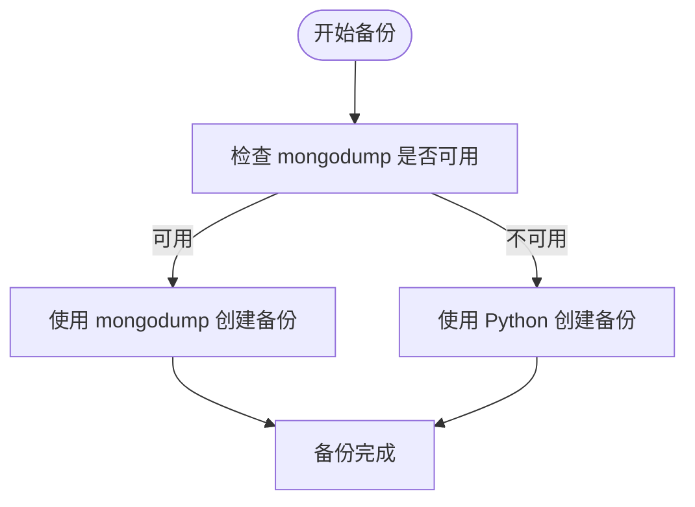
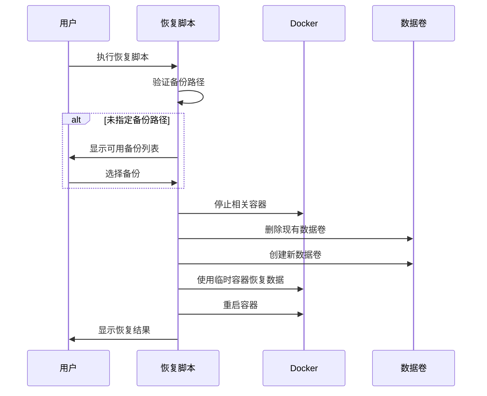
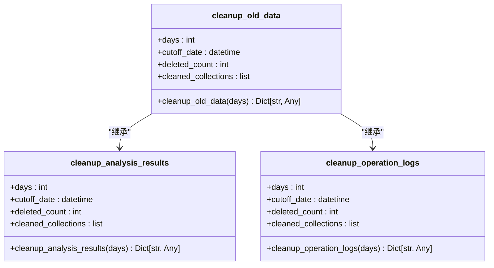
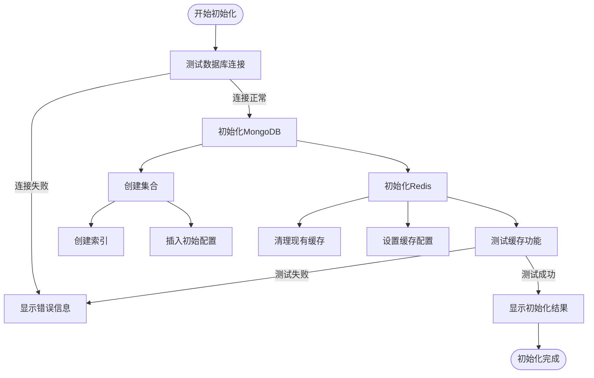
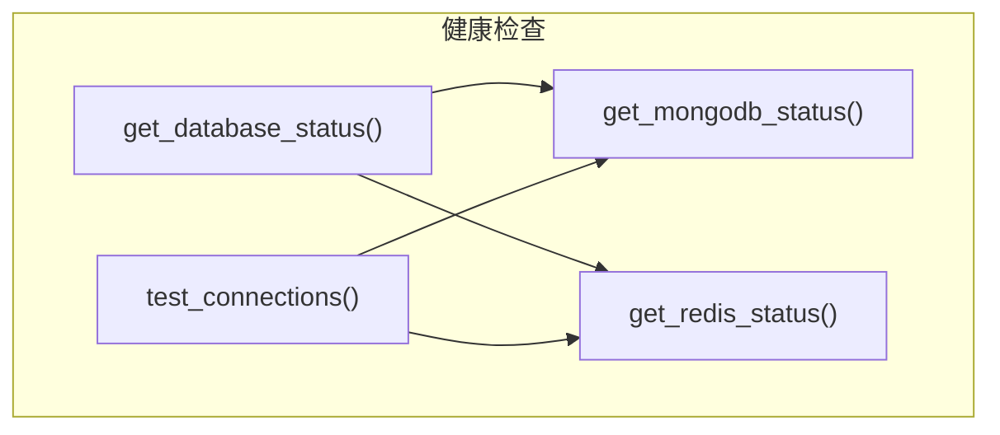

# 数据库维护

<cite>
**本文档引用的文件**   
- [backups.py](file://app/services/database/backups.py)
- [init_database.py](file://scripts/setup/init_database.py)
- [cleanup.py](file://app/services/database/cleanup.py)
- [status_checks.py](file://app/services/database/status_checks.py)
- [database.py](file://app/routers/database.py)
- [optimize_mongodb_indexes.py](file://scripts/maintenance/optimize_mongodb_indexes.py)
- [backup_volumes.ps1](file://scripts/backup_volumes.ps1)
- [restore_volumes.ps1](file://scripts/restore_volumes.ps1)
</cite>

## 目录
1. [数据库备份](#数据库备份)
2. [数据库恢复](#数据库恢复)
3. [数据清理](#数据清理)
4. [数据库初始化](#数据库初始化)
5. [数据库健康检查](#数据库健康检查)
6. [索引优化与查询性能调优](#索引优化与查询性能调优)
7. [实际操作示例](#实际操作示例)

## 数据库备份

数据库备份是确保数据安全的关键操作。系统提供了两种备份方式：使用 `mongodump` 原生命令的快速备份和使用 Python 实现的兼容性备份。

### 全量备份

全量备份会创建数据库的完整副本。系统优先使用 `mongodump` 命令进行备份，因为它速度快、压缩效率高。如果 `mongodump` 不可用，则会回退到 Python 实现的备份方法。



**备份流程：**
1. 检查 `mongodump` 命令是否在系统 PATH 中
2. 如果可用，使用 `mongodump` 创建压缩备份
3. 如果不可用，使用 Python 逐集合导出数据并压缩
4. 记录备份元数据到 `database_backups` 集合

### 增量备份

增量备份通过指定要备份的集合来实现。可以在创建备份时通过 `collections` 参数指定需要备份的集合列表。

**备份策略：**
- **推荐策略**：使用 `mongodump` 原生命令，性能最佳
- **兼容策略**：当无法安装 MongoDB 工具时使用 Python 实现

**灾难恢复预案：**
- 定期备份：建议每天执行一次全量备份
- 备份验证：定期测试备份文件的可恢复性
- 多地存储：将备份文件存储在不同物理位置

**Section sources**
- [backups.py](file://app/services/database/backups.py#L30-L135)

## 数据库恢复

数据库恢复操作可以从备份文件中恢复数据，支持从指定备份恢复或交互式选择备份。

### 恢复流程

恢复操作通过 PowerShell 脚本 `restore_volumes.ps1` 实现，主要步骤包括：



### 恢复策略

- **完整恢复**：恢复 MongoDB 和 Redis 所有数据
- **选择性恢复**：可以选择只恢复特定数据卷
- **确认机制**：恢复前需要用户确认，防止误操作

**恢复注意事项：**
- 恢复操作会覆盖现有数据，请谨慎操作
- 确保有足够的磁盘空间
- 恢复期间服务将不可用

**Section sources**
- [restore_volumes.ps1](file://scripts/restore_volumes.ps1#L27-L210)

## 数据清理

数据清理机制用于自动清理过期数据，包括分析报告、临时数据和日志。

### 清理规则

系统提供了多种清理函数，根据不同的数据类型和保留策略进行清理：



### 清理范围

- **分析任务**：清理指定天数前已完成或失败的任务
- **用户会话**：清理过期的用户会话
- **登录尝试**：清理历史登录尝试记录
- **操作日志**：清理旧的操作日志

**自动清理配置：**
- 建议设置定期清理任务（如每天凌晨执行）
- 根据磁盘空间和性能需求调整保留天数
- 重要数据应先备份再清理

**Section sources**
- [cleanup.py](file://app/services/database/cleanup.py#L12-L99)

## 数据库初始化

数据库初始化流程通过 `init_database.py` 脚本创建必要的集合和索引，并初始化缓存结构。

### 初始化流程



### 初始化内容

**MongoDB 集合与索引：**
- **股票数据集合** (`stock_data`)
  - 复合唯一索引：`(symbol, market_type)`
  - 创建时间索引：`created_at` (降序)
  - 更新时间索引：`updated_at` (降序)
- **分析结果集合** (`analysis_results`)
  - 复合索引：`(symbol, analysis_type)`
  - 创建时间索引：`created_at` (降序)
  - 符号+时间复合索引：`(symbol, created_at)` (降序)
- **用户会话集合** (`user_sessions`)
  - 唯一索引：`session_id`
  - 活跃时间索引：`last_activity` (降序)
- **配置集合** (`configurations`)
  - 复合唯一索引：`(config_type, config_name)`
  - 更新时间索引：`updated_at` (降序)

**Redis 缓存初始化：**
- 清理现有缓存
- 设置缓存 TTL 配置
- 初始化缓存统计
- 测试缓存读写功能

**Section sources**
- [init_database.py](file://scripts/setup/init_database.py#L27-L303)

## 数据库健康检查

数据库健康检查方法用于监控数据库的连接状态、存储空间和性能指标。

### 健康检查接口

系统提供了多个健康检查函数，可以分别检查 MongoDB 和 Redis 的状态：



### 监控指标

**MongoDB 监控指标：**
- 连接状态
- 服务器版本
- 运行时间
- 连接数
- 内存使用情况
- 响应时间

**Redis 监控指标：**
- 连接状态
- 服务器版本
- 运行时间
- 已用内存
- 连接客户端数
- 总命令处理数
- 响应时间

**监控建议：**
- 设置定期健康检查（如每5分钟一次）
- 当连接失败时发送告警
- 监控响应时间，超过阈值时告警
- 记录健康检查历史，便于问题排查

**Section sources**
- [status_checks.py](file://app/services/database/status_checks.py#L13-L100)

## 索引优化与查询性能调优

索引优化是提升数据库查询性能的关键。系统提供了索引优化指南和自动化脚本。

### 索引设计原则

遵循 **ESR 原则**：
- **E (Equality)**: 等值查询字段放在最前面
- **S (Sort)**: 排序字段放在中间
- **R (Range)**: 范围查询字段放在最后

### 优化方案

**方案一：使用自动化脚本（推荐）**
```bash
# 激活虚拟环境
source env/bin/activate  # Linux/Mac
# 或
.\env\Scripts\activate   # Windows

# 运行优化脚本
python scripts/maintenance/optimize_mongodb_indexes.py
```

**方案二：手动创建索引**
```javascript
// 1. 慢查询优化索引
db.stock_daily_quotes.createIndex(
  {
    "symbol": 1,
    "data_source": 1,
    "trade_date": 1,
    "period": 1
  },
  {
    name: "symbol_source_date_period_idx",
    background: true
  }
)

// 2. 查询优化索引（按股票代码+周期查询）
db.stock_daily_quotes.createIndex(
  {
    "symbol": 1,
    "period": 1,
    "trade_date": -1
  },
  {
    name: "symbol_period_date_idx",
    background: true
  }
)
```

### 性能测试

使用 `explain("executionStats")` 命令测试查询性能：

```javascript
db.stock_daily_quotes.find({
  "symbol": "688188",
  "trade_date": "2024-12-10",
  "data_source": "tushare",
  "period": "daily"
}).explain("executionStats")
```

**关键性能指标：**
- **executionTimeMillis**: 执行时间（毫秒）
- **totalDocsExamined**: 扫描的文档数
- **totalKeysExamined**: 扫描的索引键数
- **stage**: 查询阶段（IXSCAN 表示使用索引，COLLSCAN 表示全表扫描）

**优化前后对比：**
- 优化前：287ms（全表扫描）
- 优化后：2ms（索引扫描）
- 性能提升：143倍

**索引维护建议：**
1. 定期监控慢查询日志
2. 每月运行一次索引优化脚本
3. 监控索引大小，避免过度索引
4. 删除未使用的索引，节省资源
5. 根据实际查询模式调整索引

**Section sources**
- [optimize_mongodb_indexes.py](file://scripts/maintenance/optimize_mongodb_indexes.py#L227-L251)
- [mongodb_index_optimization.md](file://docs/maintenance/mongodb_index_optimization.md#L1-L348)

## 实际操作示例

### 备份操作示例

**创建全量备份：**
```bash
# 使用API创建备份
curl -X POST http://localhost:8000/api/database/backups \
  -H "Authorization: Bearer your_token" \
  -H "Content-Type: application/json" \
  -d '{"name": "daily_backup"}'
```

**预期输出：**
```json
{
  "id": "673a1b2c3d4e5f6a7b8c9d0e",
  "name": "daily_backup",
  "filename": "backup_daily_backup_20251113_143000",
  "file_path": "/path/to/backups/backup_daily_backup_20251113_143000",
  "size": 10485760,
  "collections": ["stock_data", "analysis_results", "user_sessions", "configurations"],
  "created_at": "2025-11-13T14:30:00Z",
  "backup_type": "mongodump"
}
```

### 恢复操作示例

**执行恢复脚本：**
```powershell
# 交互式选择备份恢复
.\scripts\restore_volumes.ps1

# 指定备份路径恢复
.\scripts\restore_volumes.ps1 -BackupPath "backups/20250117_143000"
```

**预期输出：**
```
======================================================================
⚠️  警告：恢复数据卷将覆盖现有数据！
======================================================================

📁 备份路径: C:\project\backups\20250117_143000

📝 备份信息:
   - 时间: 2025-01-17 14:30:00
   - 主机: DESKTOP-ABC123

确认恢复？(yes/no) yes

🔄 开始恢复数据卷...

🛑 停止相关容器...
   停止容器: tradingagents-mongodb
   停止容器: tradingagents-redis

📦 恢复 MongoDB 数据 (tradingagents_mongodb_data)...
   🗑️  删除现有数据卷...
   📁 创建新数据卷...
   🔄 恢复数据...
   ✅ 恢复成功

📦 恢复 Redis 数据 (tradingagents_redis_data)...
   🗑️  删除现有数据卷...
   📁 创建新数据卷...
   🔄 恢复数据...
   ✅ 恢复成功

🚀 重启容器...
   启动容器: tradingagents-mongodb
   启动容器: tradingagents-redis

======================================================================
✅ 恢复完成！
======================================================================

💡 提示:
   - 请检查容器日志确认服务正常运行
   - 使用 'docker logs <container_name>' 查看日志
```

### 清理操作示例

**清理30天前的数据：**
```bash
# 使用API清理数据
curl -X POST http://localhost:8000/api/database/cleanup \
  -H "Authorization: Bearer your_token" \
  -H "Content-Type: application/json" \
  -d '{"days": 30}'
```

**预期输出：**
```json
{
  "success": true,
  "message": "清理完成，删除了 150 条记录",
  "data": {
    "deleted_count": 150,
    "cleaned_collections": [
      "analysis_tasks: 100",
      "user_sessions: 30",
      "login_attempts: 20"
    ],
    "cutoff_date": "2025-10-14T00:00:00Z"
  }
}
```

### 健康检查示例

**检查数据库状态：**
```bash
# 获取数据库状态
curl -X GET http://localhost:8000/api/health/database \
  -H "Authorization: Bearer your_token"
```

**预期输出：**
```json
{
  "mongodb": {
    "connected": true,
    "host": "localhost",
    "port": 27017,
    "database": "tradingagents",
    "version": "6.0.12",
    "uptime": 3600,
    "connections": {
      "current": 10,
      "available": 50000
    },
    "memory": {
      "bits": 64,
      "resident": 1024,
      "virtual": 2048
    },
    "connected_at": "2025-11-13T14:30:00Z"
  },
  "redis": {
    "connected": true,
    "host": "localhost",
    "port": 6379,
    "database": 0,
    "version": "7.0.12",
    "uptime": 3600,
    "memory_used": 52428800,
    "memory_peak": 67108864,
    "connected_clients": 5,
    "total_commands": 10000
  }
}
```

**Section sources**
- [database.py](file://app/routers/database.py#L238-L277)
- [backup_volumes.ps1](file://scripts/backup_volumes.ps1#L1-L140)