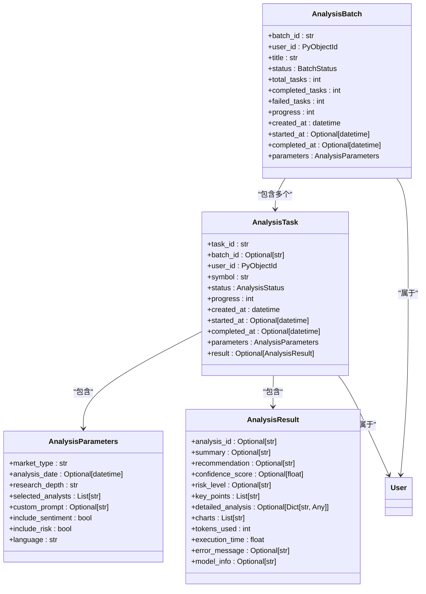
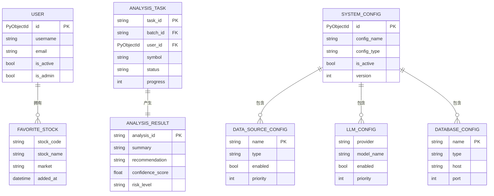

# 数据模型

<cite>
**本文档引用的文件**
- [stock_models.py](file://app/models/stock_models.py)
- [analysis.py](file://app/models/analysis.py)
- [user.py](file://app/models/user.py)
- [operation_log.py](file://app/models/operation_log.py)
- [config.py](file://app/models/config.py)
- [database.py](file://app/core/database.py)
- [reports.py](file://app/routers/reports.py)
- [stock_data.py](file://app/routers/stock_data.py)
</cite>

## 目录
1. [引言](#引言)
2. [核心实体模型](#核心实体模型)
3. [实体关系分析](#实体关系分析)
4. [数据库模式演进策略](#数据库模式演进策略)
5. [数据标准化方案](#数据标准化方案)
6. [数据生命周期管理](#数据生命周期管理)
7. [数据验证与序列化](#数据验证与序列化)
8. [索引策略](#索引策略)
9. [结论](#结论)

## 引言

sagacity平台的数据模型设计旨在提供一个灵活、可扩展且高性能的数据库架构，以支持股票分析、用户配置管理和操作审计等核心功能。本文档详细描述了MongoDB中各集合的结构与关系，重点关注股票数据、分析报告、用户配置和操作日志等核心实体。

平台采用Pydantic模型进行数据验证和序列化，确保数据的一致性和完整性。通过标准化的字段命名和数据类型，实现了跨市场、多数据源的数据统一。数据库设计遵循向后兼容原则，支持平滑的模式演进和版本升级。

## 核心实体模型

### 股票基础信息模型 (stock_basic_info)

股票基础信息模型 `StockBasicInfoExtended` 定义了股票的基本属性和扩展信息。该模型采用方案B，在现有集合基础上扩展字段，保持向后兼容。

**主要字段定义：**

- **symbol**: `str` - 6位股票代码，主键字段，采用正则表达式 `^\d{6}$` 验证
- **full_symbol**: `str` - 完整标准化代码（如 000001.SZ）
- **name**: `str` - 股票名称
- **code**: `Optional[str]` - 兼容性字段，已废弃，使用symbol替代
- **market_info**: `MarketInfo` - 市场信息结构，包含市场标识、交易所、货币和时区等
- **data_version**: `Optional[int]` - 数据版本，用于模式演进和兼容性管理

**扩展字段：**

- **board**: `Optional[str]` - 板块标准化
- **industry_code**: `Optional[str]` - 行业代码
- **sector**: `Optional[str]` - 所属板块标准化（GICS行业）
- **status**: `Optional[StockStatus]` - 上市状态（L-上市 D-退市 P-暂停）
- **currency**: `Optional[CurrencyType]` - 交易货币（CNY/HKD/USD）
- **total_shares**: `Optional[float]` - 总股本
- **float_shares**: `Optional[float]` - 流通股本

该模型通过 `extra = "allow"` 配置允许额外字段，确保向后兼容性，同时支持未来扩展。

**Section sources**
- [stock_models.py](file://app/models/stock_models.py#L54-L150)

### 实时行情模型 (market_quotes)

实时行情模型 `MarketQuotesExtended` 扩展了现有的market_quotes集合，统一使用symbol作为主要股票代码字段。

**核心字段：**

- **symbol**: `str` - 6位股票代码，主键字段
- **full_symbol**: `Optional[str]` - 完整标准化代码
- **market**: `Optional[MarketType]` - 市场标识（CN/HK/US）
- **close**: `Optional[float]` - 收盘价
- **pct_chg**: `Optional[float]` - 涨跌幅%
- **amount**: `Optional[float]` - 成交额
- **volume**: `Optional[float]` - 成成交量
- **timestamp**: `Optional[datetime]` - 行情时间戳

**五档行情字段：**

- **bid_prices**: `Optional[List[float]]` - 买1-5价
- **bid_volumes**: `Optional[List[float]]` - 买1-5量
- **ask_prices**: `Optional[List[float]]` - 卖1-5价
- **ask_volumes**: `Optional[List[float]]` - 卖1-5量

该模型同样采用 `extra = "allow"` 配置，保持向后兼容性，同时支持未来行情数据的扩展。

**Section sources**
- [stock_models.py](file://app/models/stock_models.py#L153-L220)

### 分析报告模型 (analysis_reports)

分析报告模型定义了股票分析任务和结果的结构，支持单股和批量分析。



**Diagram sources**
- [analysis.py](file://app/models/analysis.py#L72-L103)
- [analysis.py](file://app/models/analysis.py#L106-L136)
- [user.py](file://app/models/user.py#L73-L99)

**Section sources**
- [analysis.py](file://app/models/analysis.py#L14-L70)

### 用户配置模型 (user_configs)

用户配置模型 `User` 和 `UserPreferences` 定义了用户信息和个性化设置。

**用户基本信息：**

- **id**: `Optional[PyObjectId]` - 用户ID，ObjectId类型
- **username**: `str` - 用户名，长度3-50
- **email**: `str` - 邮箱，通过正则表达式验证
- **is_active**: `bool` - 账户是否激活
- **is_admin**: `bool` - 是否管理员
- **created_at**: `datetime` - 创建时间
- **last_login**: `Optional[datetime]` - 最后登录时间

**用户偏好设置 (UserPreferences)：**

- **default_market**: `str` - 默认市场（A股）
- **default_depth**: `str` - 默认分析深度（3级标准分析）
- **default_analysts**: `List[str]` - 默认分析师
- **auto_refresh**: `bool` - 是否自动刷新
- **refresh_interval**: `int` - 刷新间隔（秒）
- **ui_theme**: `str` - 界面主题
- **language**: `str` - 语言设置
- **notifications_enabled**: `bool` - 通知是否启用

**自选股管理：**

- **favorite_stocks**: `List[FavoriteStock]` - 自选股列表
- **FavoriteStock** 包含股票代码、名称、市场、添加时间、标签和提醒价格等信息

该模型通过 `ConfigDict(populate_by_name=True, arbitrary_types_allowed=True)` 配置支持别名字段和任意类型，确保灵活性。

**Section sources**
- [user.py](file://app/models/user.py#L73-L99)

### 操作日志模型 (operation_logs)

操作日志模型 `OperationLogCreate` 和 `OperationLogResponse` 记录了系统的所有操作行为。

**核心字段：**

- **action_type**: `str` - 操作类型（枚举值）
- **action**: `str` - 操作描述
- **details**: `Optional[Dict[str, Any]]` - 详细信息
- **success**: `bool` - 是否成功
- **error_message**: `Optional[str]` - 错误信息
- **duration_ms**: `Optional[int]` - 操作耗时（毫秒）
- **ip_address**: `Optional[str]` - IP地址
- **user_agent**: `Optional[str]` - 用户代理
- **session_id**: `Optional[str]` - 会话ID
- **timestamp**: `datetime` - 操作时间
- **created_at**: `datetime` - 创建时间

**操作类型常量：**

- **STOCK_ANALYSIS**: 股票分析
- **CONFIG_MANAGEMENT**: 配置管理
- **CACHE_OPERATION**: 缓存操作
- **DATA_IMPORT**: 数据导入
- **DATA_EXPORT**: 数据导出
- **SYSTEM_SETTINGS**: 系统设置
- **USER_LOGIN**: 用户登录
- **USER_LOGOUT**: 用户登出
- **USER_MANAGEMENT**: 用户管理
- **DATABASE_OPERATION**: 数据库操作
- **SCREENING**: 股票筛选
- **REPORT_GENERATION**: 报告生成

该模型通过 `field_serializer` 装饰器将datetime字段序列化为ISO 8601格式，保留时区信息。

**Section sources**
- [operation_log.py](file://app/models/operation_log.py#L11-L47)

## 实体关系分析

### 用户与自选股关系

用户与自选股之间存在一对多的关系。每个用户可以拥有多个自选股，而每个自选股只属于一个用户。这种关系通过 `User` 模型中的 `favorite_stocks` 字段实现，该字段是一个 `FavoriteStock` 对象的列表。

当用户添加股票到自选股时，系统会在用户的 `favorite_stocks` 列表中创建一个新的 `FavoriteStock` 对象，记录股票代码、名称、市场类型、添加时间和用户自定义的标签与备注。这种设计避免了创建单独的关联表，简化了数据结构，同时通过嵌入式引用保持了数据的完整性。

### 分析任务与报告关系

分析任务与报告之间存在一对一的关系。每个分析任务（`AnalysisTask`）对应生成一个分析报告（`AnalysisResult`）。这种关系通过 `AnalysisTask` 模型中的 `result` 字段实现，该字段是 `AnalysisResult` 类型的可选字段。

当分析任务完成时，系统会将分析结果填充到 `result` 字段中。这种设计确保了任务与报告的紧密关联，便于追踪分析过程和结果。同时，通过 `task_id` 字段，可以在多个集合之间建立引用关系，支持跨集合查询。

### 系统配置与数据源关系

系统配置与数据源之间存在一对多的关系。每个系统配置（`SystemConfig`）可以包含多个数据源配置（`DataSourceConfig`）。这种关系通过 `SystemConfig` 模型中的 `data_source_configs` 字段实现，该字段是 `DataSourceConfig` 对象的列表。

系统配置还包含大模型配置（`llm_configs`）和数据库配置（`database_configs`）等其他配置项。这种聚合式设计将所有相关配置集中管理，便于配置的版本控制和激活管理。通过 `is_active` 字段，系统可以快速切换不同的配置方案。



**Diagram sources**
- [user.py](file://app/models/user.py#L73-L99)
- [analysis.py](file://app/models/analysis.py#L72-L103)
- [config.py](file://app/models/config.py#L323-L351)

**Section sources**
- [analysis.py](file://app/models/analysis.py#L72-L136)
- [user.py](file://app/models/user.py#L73-L99)
- [config.py](file://app/models/config.py#L323-L351)

## 数据库模式演进策略

### 版本兼容性处理

sagacity平台采用渐进式模式演进策略，确保新旧版本之间的兼容性。核心原则包括：

1. **向后兼容性**：所有模型都配置 `extra = "allow"`，允许文档包含未定义的字段。这使得在添加新字段时，旧版本的应用程序仍然可以读取数据。

2. **字段废弃策略**：对于需要废弃的字段，采用"标记废弃"而非立即删除的策略。例如，`code` 字段被标记为废弃，但仍然保留以支持旧数据。

3. **数据版本控制**：通过 `data_version` 字段跟踪数据结构的版本。当模式发生重大变更时，系统可以根据版本号应用不同的处理逻辑。

4. **迁移脚本**：提供自动化迁移脚本，如 `migrate_add_market_type.py`，用于批量更新现有数据。这些脚本在应用启动时或通过管理命令执行。

### 模式变更流程

1. **评估影响**：分析模式变更对现有功能的影响范围
2. **设计兼容方案**：确定向后兼容的实现方式
3. **更新模型定义**：修改Pydantic模型，添加新字段或修改现有字段
4. **编写迁移脚本**：创建数据迁移脚本，处理历史数据
5. **测试验证**：在测试环境中验证新旧版本的兼容性
6. **部署上线**：按计划部署新版本，监控数据一致性

这种系统化的演进策略确保了数据库模式的平滑升级，最大限度地减少了对用户的影响。

**Section sources**
- [stock_models.py](file://app/models/stock_models.py#L119-L121)
- [config.py](file://app/models/config.py#L348-L349)

## 数据标准化方案

### 股票代码格式统一

平台采用统一的股票代码格式标准，确保跨市场、多数据源的数据一致性。

**标准化规则：**

- **symbol字段**：使用6位数字代码作为主要标识，如"000001"
- **full_symbol字段**：使用"代码.交易所"格式，如"000001.SZ"
- **代码补全**：对于不足6位的代码，使用前导零补全
- **市场标识**：通过 `market_info.market` 字段明确标识市场类型（CN/HK/US）

这种标准化方案解决了不同数据源代码格式不一致的问题，如Tushare使用6位代码，而Yahoo Finance使用"代码.交易所"格式。

### 市场类型标识

市场类型通过枚举类型 `MarketType` 进行标准化：

```python
MarketType = Literal["CN", "HK", "US"]  # 市场类型
```

**市场与交易所映射：**

- **CN (中国)**：SZSE(深交所), SSE(上交所)
- **HK (香港)**：SEHK(港交所)
- **US (美国)**：NYSE(纽交所), NASDAQ(纳斯达克)

通过 `MarketInfo` 结构，将市场、交易所、货币和时区等信息统一管理，确保跨市场分析的一致性。

### 数据类型标准化

平台对关键数据类型进行了标准化定义：

- **CurrencyType**: `Literal["CNY", "HKD", "USD"]` - 交易货币
- **ExchangeType**: `Literal["SZSE", "SSE", "SEHK", "NYSE", "NASDAQ"]` - 交易所
- **StockStatus**: `Literal["L", "D", "P"]` - 上市状态

这种枚举式定义避免了字符串拼写错误，提高了数据质量。

**Section sources**
- [stock_models.py](file://app/models/stock_models.py#L21-L25)
- [stock_models.py](file://app/models/stock_models.py#L28-L35)

## 数据生命周期管理

### 数据归档策略

平台实施分级数据归档策略，平衡存储成本和访问性能。

**归档规则：**

1. **热数据**：最近30天的数据保留在主数据库，支持实时查询
2. **温数据**：30-365天的数据迁移到归档集合，访问频率较低
3. **冷数据**：超过365天的数据压缩存储，仅在需要时解压访问

归档过程通过后台任务定期执行，确保主数据库的性能不受历史数据影响。

### 数据清理规则

系统实现了自动化数据清理机制，防止数据无限增长。

**清理策略：**

1. **操作日志清理**：保留最近90天的操作日志，超过期限的日志自动删除
2. **临时数据清理**：分析过程中的临时数据在任务完成后立即清理
3. **缓存数据清理**：Redis缓存设置TTL（生存时间），过期自动清除

清理任务通过 `ClearLogsRequest` 模型配置，支持按时间范围和操作类型选择性清理。

**Section sources**
- [operation_log.py](file://app/models/operation_log.py#L85-L95)

## 数据验证与序列化

### Pydantic模型验证

平台广泛使用Pydantic模型进行数据验证，确保数据的完整性和一致性。

**验证特性：**

- **字段类型验证**：自动验证数据类型，如 `str`, `float`, `datetime`
- **约束验证**：支持最小值、最大值、长度等约束
- **正则表达式验证**：通过 `pattern` 参数验证字符串格式
- **自定义验证**：使用 `validator` 装饰器实现复杂业务逻辑验证

例如，`StockBasicInfoExtended` 模型通过 `pattern=r"^\d{6}$"` 确保symbol字段为6位数字。

### 数据序列化

系统采用统一的序列化策略，确保API响应的一致性。

**序列化特性：**

- **datetime序列化**：使用 `field_serializer` 将datetime字段转换为ISO 8601格式
- **ObjectId序列化**：自定义 `serialize_object_id` 函数将ObjectId转换为字符串
- **嵌套对象序列化**：自动序列化嵌套的Pydantic模型
- **示例数据**：通过 `json_schema_extra` 提供API响应示例

这种序列化策略简化了前端数据处理，提高了开发效率。

**Section sources**
- [user.py](file://app/models/user.py#L133-L138)
- [operation_log.py](file://app/models/operation_log.py#L41-L46)

## 索引策略

### 核心索引设计

平台在关键字段上创建了适当的索引，优化查询性能。

**stock_basic_info集合索引：**

- `("code", 1), ("source", 1)`：唯一复合索引，支持按代码和数据源查询
- `("industry", 1)`：行业索引，支持行业筛选
- `("total_mv", -1)`：总市值索引，支持按市值排序
- `("pe", 1), ("pb", 1)`：估值指标索引，支持估值筛选

**market_quotes集合索引：**

- `("code", 1)`：唯一索引，支持快速查询实时行情
- `("pct_chg", -1)`：涨跌幅索引，支持涨跌幅排序
- `("amount", -1)`：成交额索引，支持成交额排序
- `("updated_at", -1)`：更新时间索引，支持按时间查询

### 视图优化

系统创建了 `stock_screening_view` 视图，将 `stock_basic_info`、`market_quotes` 和 `stock_financial_data` 三个集合关联，支持高效的股票筛选查询。

视图通过 `$lookup` 聚合操作实现数据关联，避免了应用程序层的多次查询，提高了筛选性能。

**Section sources**
- [database.py](file://app/core/database.py#L351-L363)

## 结论

sagacity平台的数据模型设计体现了现代数据分析系统的最佳实践。通过标准化的Pydantic模型、合理的实体关系设计和高效的索引策略，平台实现了高性能、可扩展和易维护的数据架构。

关键优势包括：

1. **向后兼容性**：通过渐进式模式演进策略，确保系统升级的平滑性
2. **数据一致性**：统一的数据标准化方案解决了多数据源的格式差异
3. **性能优化**：合理的索引设计和视图优化提升了查询效率
4. **可维护性**：清晰的实体关系和文档化的模式演进策略降低了维护成本

未来，平台可以进一步优化数据生命周期管理策略，引入更智能的归档和清理机制，同时探索分片集群等高级数据库技术，以支持更大规模的数据分析需求。