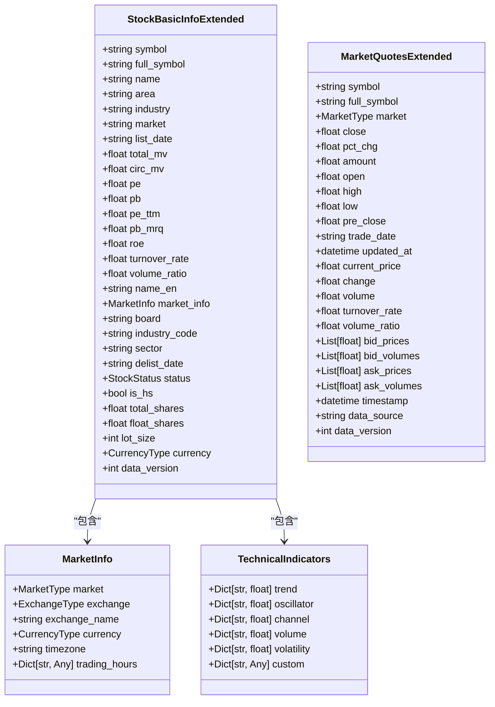
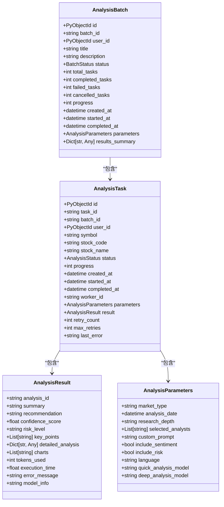
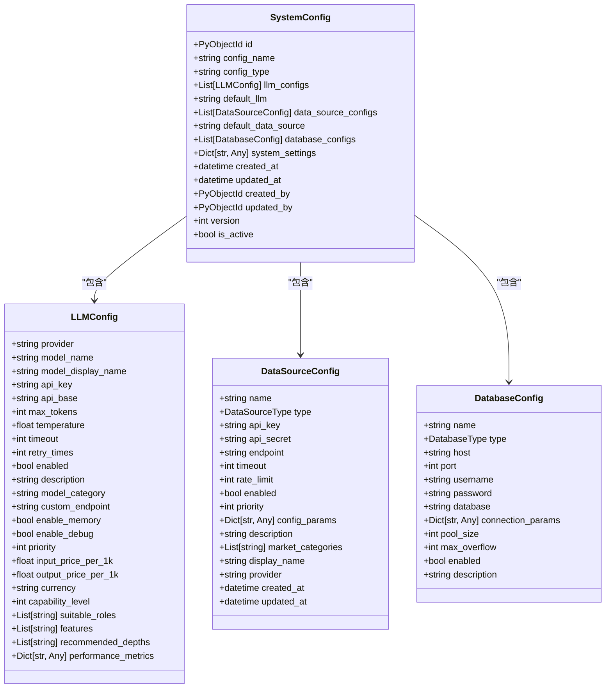
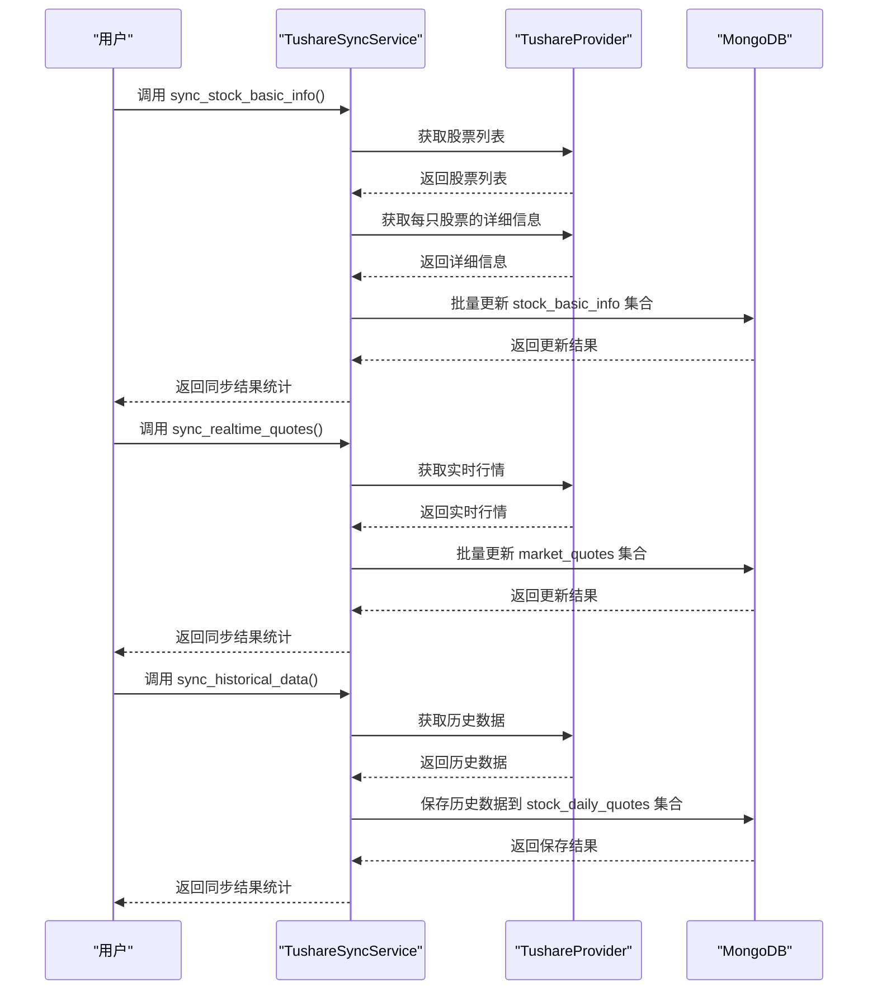
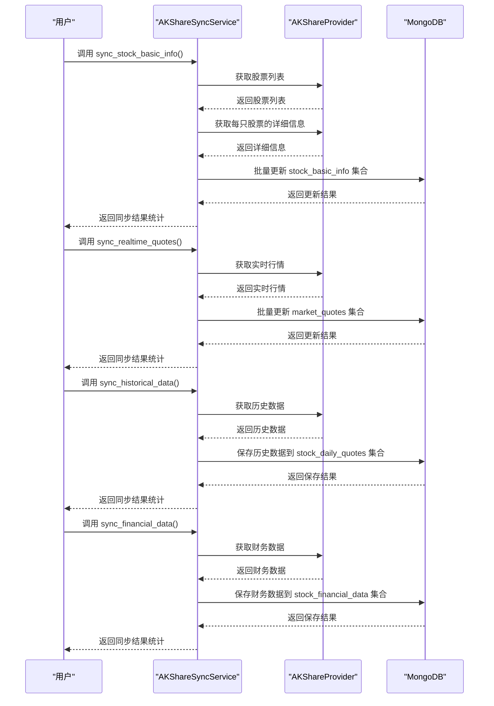
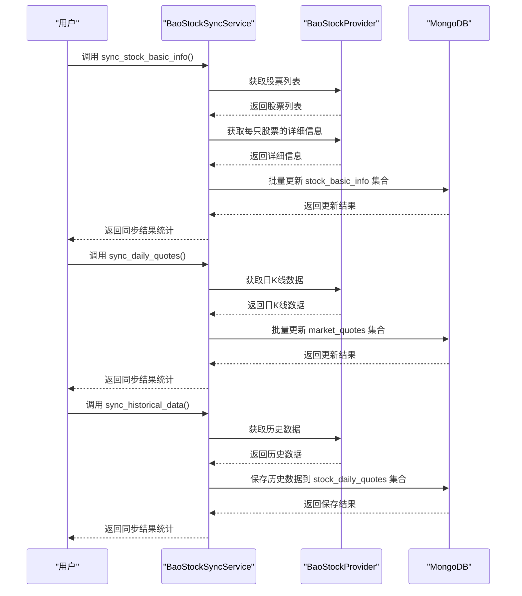
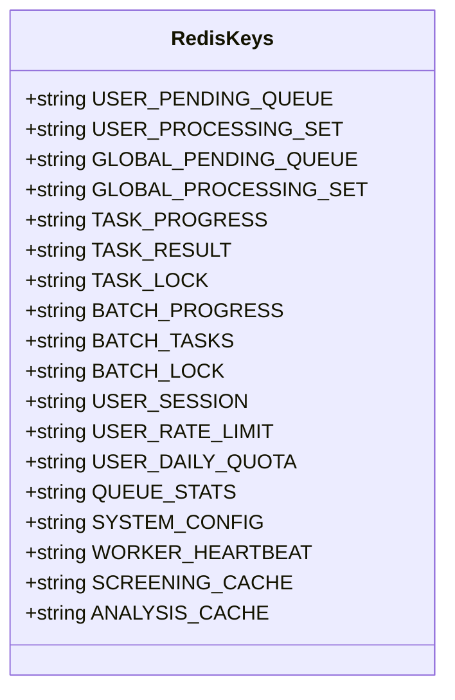
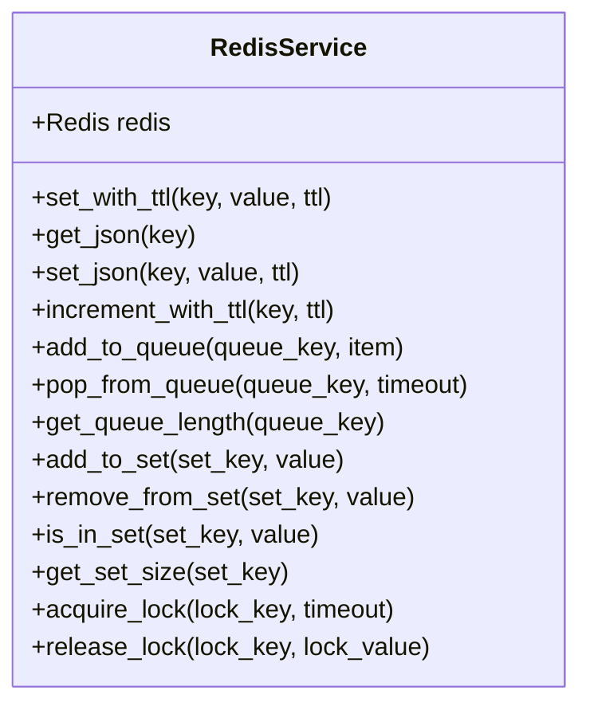
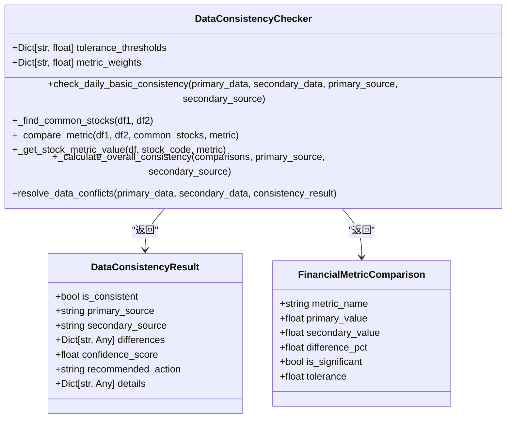
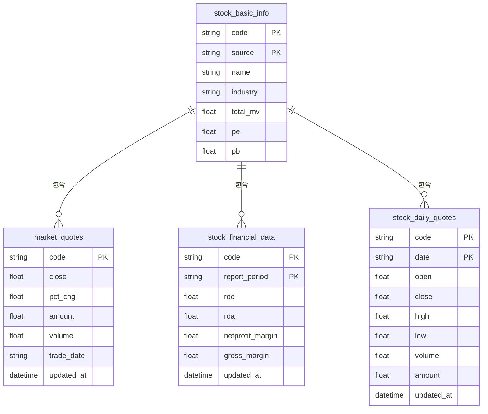

# 数据管理

<cite>
**本文档引用的文件**   
- [stock_models.py](file://app/models/stock_models.py)
- [analysis.py](file://app/models/analysis.py)
- [config.py](file://app/models/config.py)
- [database.py](file://app/core/database.py)
- [redis_client.py](file://app/core/redis_client.py)
- [data_consistency_checker.py](file://app/services/data_consistency_checker.py)
- [quotes_ingestion_service.py](file://app/services/quotes_ingestion_service.py)
- [tushare_sync_service.py](file://app/worker/tushare_sync_service.py)
- [akshare_sync_service.py](file://app/worker/akshare_sync_service.py)
- [baostock_sync_service.py](file://app/worker/baostock_sync_service.py)
</cite>

## 目录
1. [引言](#引言)
2. [数据模型与集合结构](#数据模型与集合结构)
3. [数据同步服务](#数据同步服务)
4. [缓存系统设计](#缓存系统设计)
5. [数据备份与恢复](#数据备份与恢复)
6. [数据质量保证机制](#数据质量保证机制)
7. [数据库性能优化建议](#数据库性能优化建议)
8. [结论](#结论)

## 引言
sagacity平台是一个综合性的金融数据分析系统，集成了多个数据源（Tushare、AkShare、BaoStock等）来提供全面的股票数据、分析报告和用户配置。本文档旨在全面介绍平台的数据处理机制，包括数据模型设计、数据同步流程、缓存策略、数据备份与恢复以及数据质量保证措施。

**Section sources**
- [stock_models.py](file://app/models/stock_models.py#L1-L246)
- [analysis.py](file://app/models/analysis.py#L1-L237)

## 数据模型与集合结构
sagacity平台使用MongoDB作为主要的数据存储，设计了多个集合来存储不同类型的数据。核心集合包括`stock_basic_info`（股票基础信息）、`market_quotes`（实时行情）、`analysis_tasks`（分析任务）和`system_config`（系统配置）。

### 股票数据模型
股票数据模型定义了股票基础信息和实时行情的结构。`StockBasicInfoExtended`类包含了股票代码、名称、行业、市值、市盈率（PE）、市净率（PB）等字段。`MarketQuotesExtended`类则包含了开盘价、收盘价、最高价、最低价、成交量、成交额等行情数据。

**Diagram sources **
- [stock_models.py](file://app/models/stock_models.py#L54-L151)

**Section sources**
- [stock_models.py](file://app/models/stock_models.py#L54-L151)

### 分析报告数据模型
分析报告数据模型定义了分析任务和结果的结构。`AnalysisTask`类包含了任务ID、用户ID、股票代码、状态、进度、参数和结果等字段。`AnalysisResult`类则包含了摘要、推荐、置信度分数、风险等级、关键点、详细分析、图表、使用的token数、执行时间和错误信息。

**Diagram sources **
- [analysis.py](file://app/models/analysis.py#L72-L137)

**Section sources**
- [analysis.py](file://app/models/analysis.py#L72-L137)

### 用户配置数据模型
用户配置数据模型定义了系统配置、大模型配置和数据源配置的结构。`SystemConfig`类包含了大模型配置列表、默认大模型、数据源配置列表、默认数据源、数据库配置列表和系统设置。`LLMConfig`类定义了大模型的提供商、模型名称、API密钥、API基础URL、最大token数、温度参数、超时时间、重试次数、是否启用、描述、模型类别、自定义端点、是否启用记忆功能、是否启用调试模式、优先级、输入价格、输出价格、货币单位、能力等级、适用角色、特性、推荐的分析深度级别和性能指标。

**Diagram sources **
- [config.py](file://app/models/config.py#L323-L351)

**Section sources**
- [config.py](file://app/models/config.py#L323-L351)

## 数据同步服务
sagacity平台通过多个数据同步服务从Tushare、AkShare和BaoStock等数据源获取和更新数据。这些服务负责将数据同步到MongoDB的标准化集合中。

### Tushare数据同步
Tushare数据同步服务负责将Tushare数据同步到MongoDB。该服务提供了同步股票基础信息、实时行情和历史数据的功能。`TushareSyncService`类包含了`sync_stock_basic_info`、`sync_realtime_quotes`和`sync_historical_data`等方法。

**Diagram sources **
- [tushare_sync_service.py](file://app/worker/tushare_sync_service.py#L35-L391)

**Section sources**
- [tushare_sync_service.py](file://app/worker/tushare_sync_service.py#L35-L391)

### AkShare数据同步
AkShare数据同步服务基于AkShare提供器的统一数据同步方案。该服务提供了同步股票基础信息、实时行情、历史数据和财务数据的功能。`AKShareSyncService`类包含了`sync_stock_basic_info`、`sync_realtime_quotes`、`sync_historical_data`和`sync_financial_data`等方法。

**Diagram sources **
- [akshare_sync_service.py](file://app/worker/akshare_sync_service.py#L18-L800)

**Section sources**
- [akshare_sync_service.py](file://app/worker/akshare_sync_service.py#L18-L800)

### BaoStock数据同步
BaoStock数据同步服务提供了BaoStock数据的批量同步功能。该服务可以同步股票基础信息、日K线数据和历史数据。`BaoStockSyncService`类包含了`sync_stock_basic_info`、`sync_daily_quotes`和`sync_historical_data`等方法。

**Diagram sources **
- [baostock_sync_service.py](file://app/worker/baostock_sync_service.py#L34-L608)

**Section sources**
- [baostock_sync_service.py](file://app/worker/baostock_sync_service.py#L34-L608)

## 缓存系统设计
sagacity平台使用Redis作为缓存系统，以提高数据访问速度和系统性能。Redis被用于缓存股票筛选结果、分析结果、用户会话和系统配置。

### Redis键名常量
Redis键名常量定义了各种缓存键的命名规则。`RedisKeys`类包含了用户待处理队列、用户处理中集合、全局待处理队列、全局处理中集合、任务进度、任务结果、任务锁、批次进度、批次任务、批次锁、用户会话、用户速率限制、用户每日配额、队列统计、系统配置、工作节点心跳和筛选缓存等键名。

**Diagram sources **
- [redis_client.py](file://app/core/redis_client.py#L70-L102)

**Section sources**
- [redis_client.py](file://app/core/redis_client.py#L70-L102)

### Redis服务封装
Redis服务封装类提供了对Redis客户端的高级封装，简化了Redis操作。`RedisService`类包含了`set_with_ttl`、`get_json`、`set_json`、`increment_with_ttl`、`add_to_queue`、`pop_from_queue`、`get_queue_length`、`add_to_set`、`remove_from_set`、`is_in_set`、`get_set_size`、`acquire_lock`和`release_lock`等方法。

**Diagram sources **
- [redis_client.py](file://app/core/redis_client.py#L104-L191)

**Section sources**
- [redis_client.py](file://app/core/redis_client.py#L104-L191)

## 数据备份与恢复
sagacity平台的数据备份与恢复流程主要依赖于MongoDB和Redis的持久化机制。MongoDB通过定期的全量备份和增量备份来确保数据安全，而Redis通过RDB和AOF持久化来防止数据丢失。

### MongoDB备份
MongoDB备份通过定期执行`mongodump`命令来创建全量备份，并通过`oplog`来实现增量备份。备份文件存储在安全的存储位置，并定期进行恢复测试以确保备份的有效性。

### Redis备份
Redis备份通过配置RDB和AOF持久化来实现。RDB通过定期生成数据快照来备份数据，而AOF通过记录每个写操作来实现持久化。这两种机制可以单独使用或结合使用，以提供更高的数据安全性。

**Section sources**
- [database.py](file://app/core/database.py#L1-L443)
- [redis_client.py](file://app/core/redis_client.py#L1-L203)

## 数据质量保证机制
sagacity平台通过数据一致性检查和错误处理机制来保证数据质量。`DataConsistencyChecker`类负责检查多数据源之间的数据不一致性问题，并根据检查结果解决数据冲突。

### 数据一致性检查
数据一致性检查器通过比较不同数据源的财务指标（如PE、PB、总市值、股价、成交量和换手率）来判断数据的一致性。检查结果包括是否一致、主数据源、次数据源、差异、置信度分数、推荐操作和详细信息。

**Diagram sources **
- [data_consistency_checker.py](file://app/services/data_consistency_checker.py#L35-L319)

**Section sources**
- [data_consistency_checker.py](file://app/services/data_consistency_checker.py#L35-L319)

### 错误处理
错误处理机制通过日志记录和异常捕获来确保系统的稳定运行。所有关键操作都包含异常处理代码，并将错误信息记录到日志中。此外，系统还提供了重试机制，以应对临时性错误。

## 数据库性能优化建议
为了提高数据库性能，sagacity平台采用了多种优化策略，包括索引优化、连接池管理和查询优化。

### 索引策略
索引策略通过在常用查询字段上创建索引来提高查询性能。例如，在`stock_basic_info`集合的`code`和`source`字段上创建唯一索引，在`market_quotes`集合的`code`字段上创建唯一索引。

**Diagram sources **
- [database.py](file://app/core/database.py#L347-L367)

**Section sources**
- [database.py](file://app/core/database.py#L347-L367)

### 连接池管理
连接池管理通过配置MongoDB和Redis的连接池大小来优化数据库连接。MongoDB连接池的最大连接数和最小连接数可以通过环境变量进行配置，而Redis连接池的最大连接数也可以通过环境变量进行配置。

### 查询优化
查询优化通过使用聚合管道和视图来减少查询复杂度。例如，`stock_screening_view`视图通过将`stock_basic_info`、`market_quotes`和`stock_financial_data`集合关联起来，提供了一个统一的股票筛选视图。

## 结论
sagacity平台通过精心设计的数据模型、高效的数据同步服务、可靠的缓存系统、完善的数据备份与恢复流程以及严格的数据质量保证机制，确保了数据的完整性、一致性和高性能。这些机制共同构成了一个稳定、可靠和高效的金融数据分析平台。