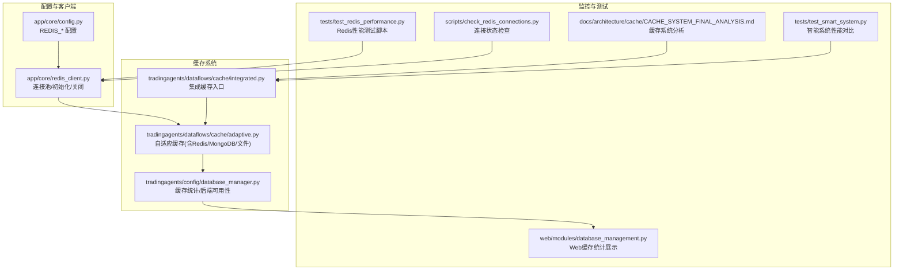
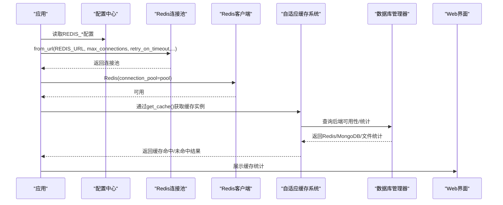
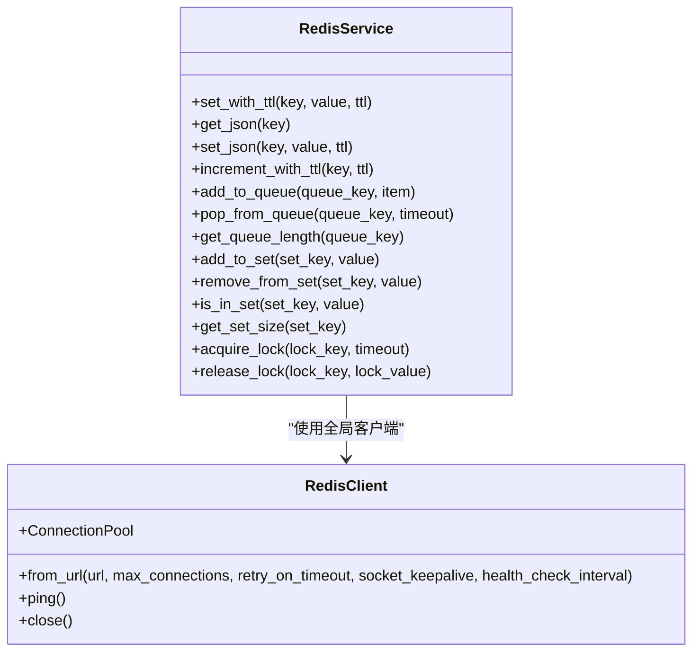
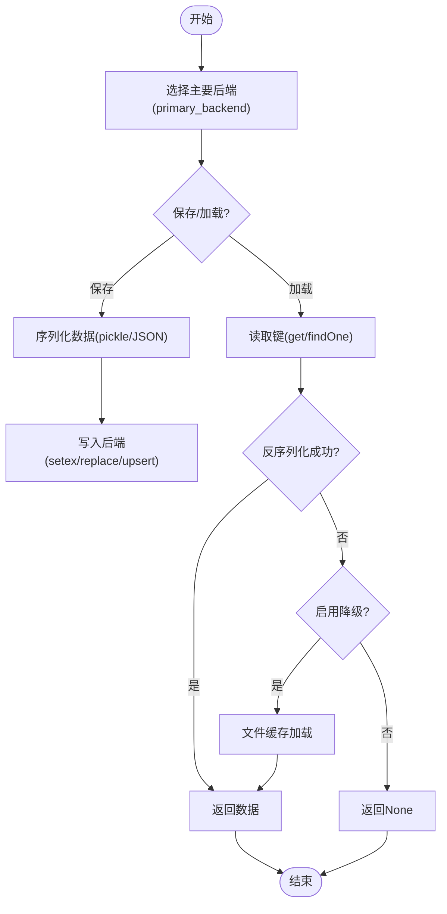
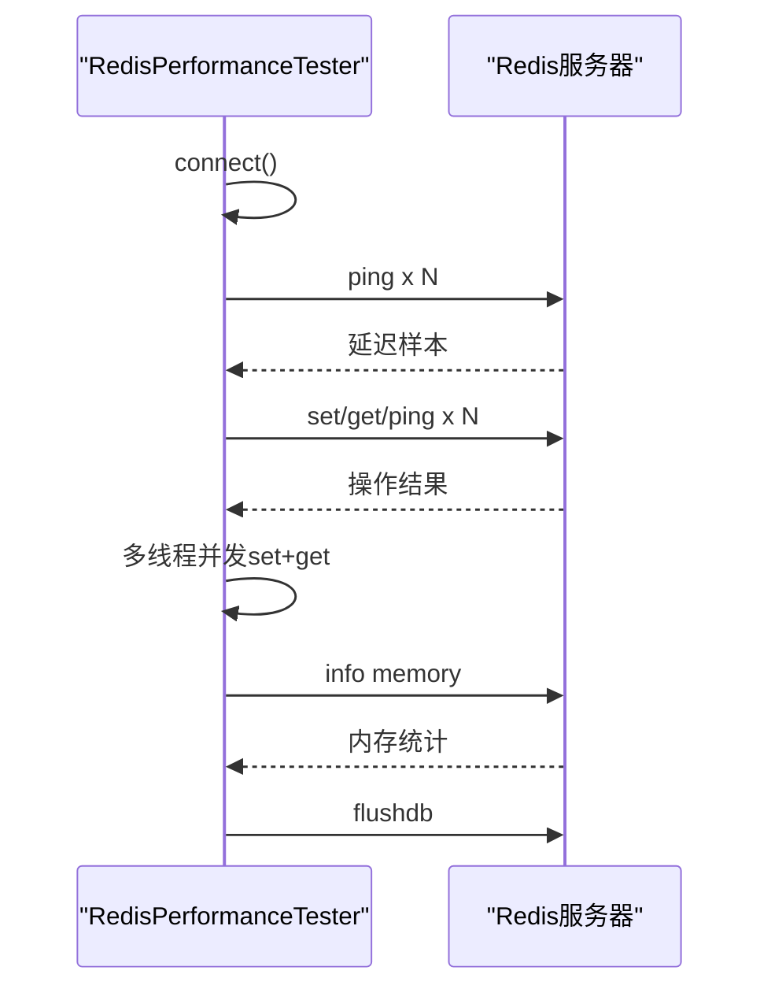
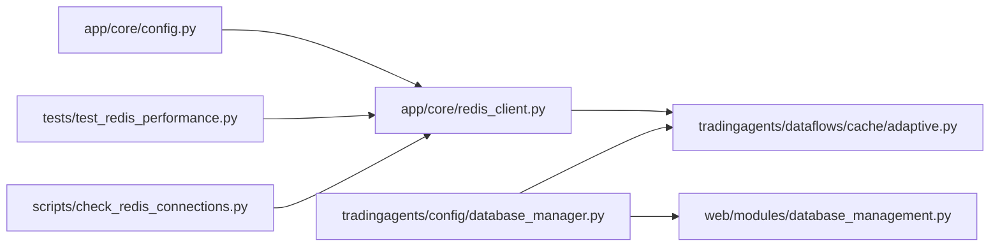

# 缓存性能监控与调优

<cite>
**本文引用的文件**
- [app/core/redis_client.py](file://app/core/redis_client.py)
- [app/core/config.py](file://app/core/config.py)
- [tests/test_redis_performance.py](file://tests/test_redis_performance.py)
- [scripts/check_redis_connections.py](file://scripts/check_redis_connections.py)
- [docs/architecture/cache/CACHE_SYSTEM_FINAL_ANALYSIS.md](file://docs/architecture/cache/CACHE_SYSTEM_FINAL_ANALYSIS.md)
- [tradingagents/dataflows/cache/adaptive.py](file://tradingagents/dataflows/cache/adaptive.py)
- [tradingagents/dataflows/cache/integrated.py](file://tradingagents/dataflows/cache/integrated.py)
- [tradingagents/config/database_manager.py](file://tradingagents/config/database_manager.py)
- [web/modules/database_management.py](file://web/modules/database_management.py)
- [tests/test_smart_system.py](file://tests/test_smart_system.py)
</cite>

## 目录
1. [简介](#简介)
2. [项目结构](#项目结构)
3. [核心组件](#核心组件)
4. [架构总览](#架构总览)
5. [详细组件分析](#详细组件分析)
6. [依赖关系分析](#依赖关系分析)
7. [性能考量](#性能考量)
8. [故障排查指南](#故障排查指南)
9. [结论](#结论)
10. [附录](#附录)

## 简介
本文件围绕 Redis 缓存性能监控与调优展开，重点聚焦于以下方面：
- Redis 连接池配置、超时设置与异常重试机制对性能的影响；
- 如何通过连接池参数（max_connections、timeout）优化高并发下的响应延迟；
- 结合缓存系统整体设计，提供命中率、响应时间、内存使用率等关键指标的监控方法；
- 使用 redis-cli 或 Python 客户端进行性能基准测试的步骤；
- 以 test_redis_performance.py 为例展示自动化性能验证流程；
- 常见性能瓶颈（网络延迟、序列化开销）的诊断工具与优化建议，包括管道操作、批量序列化与连接复用的最佳实践。

## 项目结构
本项目的缓存体系采用“自适应缓存 + 多后端”设计，Redis 作为主要缓存后端之一，贯穿于数据流与服务层。核心文件分布如下：
- Redis 客户端与连接池：app/core/redis_client.py
- 配置中心：app/core/config.py（包含 REDIS_* 相关配置）
- 缓存系统（自适应）：tradingagents/dataflows/cache/adaptive.py
- 缓存系统（集成入口）：tradingagents/dataflows/cache/integrated.py
- 缓存统计与后端可用性：tradingagents/config/database_manager.py
- Web 管理界面缓存统计展示：web/modules/database_management.py
- Redis 连接状态检查脚本：scripts/check_redis_connections.py
- Redis 性能测试脚本：tests/test_redis_performance.py
- 缓存系统最终分析文档：docs/architecture/cache/CACHE_SYSTEM_FINAL_ANALYSIS.md
- 智能系统性能对比参考：tests/test_smart_system.py

图表来源
- [app/core/redis_client.py](file://app/core/redis_client.py#L1-L68)
- [app/core/config.py](file://app/core/config.py#L57-L72)
- [tradingagents/dataflows/cache/adaptive.py](file://tradingagents/dataflows/cache/adaptive.py#L1-L120)
- [tradingagents/dataflows/cache/integrated.py](file://tradingagents/dataflows/cache/integrated.py#L230-L261)
- [tradingagents/config/database_manager.py](file://tradingagents/config/database_manager.py#L308-L344)
- [web/modules/database_management.py](file://web/modules/database_management.py#L127-L158)
- [tests/test_redis_performance.py](file://tests/test_redis_performance.py#L1-L120)
- [scripts/check_redis_connections.py](file://scripts/check_redis_connections.py#L1-L120)
- [docs/architecture/cache/CACHE_SYSTEM_FINAL_ANALYSIS.md](file://docs/architecture/cache/CACHE_SYSTEM_FINAL_ANALYSIS.md#L105-L148)
- [tests/test_smart_system.py](file://tests/test_smart_system.py#L139-L159)

章节来源
- [app/core/redis_client.py](file://app/core/redis_client.py#L1-L68)
- [app/core/config.py](file://app/core/config.py#L57-L72)
- [docs/architecture/cache/CACHE_SYSTEM_FINAL_ANALYSIS.md](file://docs/architecture/cache/CACHE_SYSTEM_FINAL_ANALYSIS.md#L105-L148)

## 核心组件
- Redis 连接池与客户端
  - 通过 ConnectionPool.from_url 创建连接池，设置 max_connections、retry_on_timeout、socket_keepalive、health_check_interval 等参数，确保连接复用与健康检查。
  - 提供 init_redis()/close_redis() 生命周期管理，get_redis() 获取全局客户端实例。
- 配置中心
  - REDIS_URL、REDIS_MAX_CONNECTIONS、REDIS_RETRY_ON_TIMEOUT 等配置项集中管理，便于统一调整。
- 自适应缓存系统
  - 支持 Redis、MongoDB、文件三种后端，依据 primary_backend 与 fallback_enabled 动态选择；提供 get_cache_stats() 输出后端可用性与内存/键数等统计。
- 缓存统计与后端可用性
  - database_manager 提供 get_cache_stats()，聚合 Redis/MongoDB/文件缓存统计；web 展示 Redis keys 与 memory 使用。
- 性能测试与监控
  - test_redis_performance.py 提供连接延迟、吞吐量、并发连接、内存使用等测试；scripts/check_redis_connections.py 提供连接状态与 PubSub 连接检查；smart system 测试提供性能对比参考。

章节来源
- [app/core/redis_client.py](file://app/core/redis_client.py#L1-L68)
- [app/core/config.py](file://app/core/config.py#L57-L72)
- [tradingagents/dataflows/cache/adaptive.py](file://tradingagents/dataflows/cache/adaptive.py#L317-L403)
- [tradingagents/config/database_manager.py](file://tradingagents/config/database_manager.py#L308-L344)
- [web/modules/database_management.py](file://web/modules/database_management.py#L127-L158)
- [tests/test_redis_performance.py](file://tests/test_redis_performance.py#L1-L120)
- [scripts/check_redis_connections.py](file://scripts/check_redis_connections.py#L1-L120)
- [tests/test_smart_system.py](file://tests/test_smart_system.py#L139-L159)

## 架构总览
Redis 在本项目中承担两类角色：
- 作为应用内部缓存后端（Redis/MongoDB/文件），服务于数据缓存与队列等场景；
- 作为连接池与健康检查的基础设施，支撑高并发请求的稳定与低延迟。

图表来源
- [app/core/redis_client.py](file://app/core/redis_client.py#L17-L46)
- [app/core/config.py](file://app/core/config.py#L57-L72)
- [tradingagents/dataflows/cache/adaptive.py](file://tradingagents/dataflows/cache/adaptive.py#L317-L403)
- [tradingagents/config/database_manager.py](file://tradingagents/config/database_manager.py#L308-L344)
- [web/modules/database_management.py](file://web/modules/database_management.py#L127-L158)

## 详细组件分析

### Redis 连接池与客户端（app/core/redis_client.py）
- 连接池参数
  - max_connections：来自配置 REDIS_MAX_CONNECTIONS，决定连接池容量，直接影响并发能力与资源占用。
  - retry_on_timeout：当网络抖动或超时发生时，是否自动重试，有助于提升稳定性。
  - socket_keepalive：启用 TCP keepalive，减少空闲连接断开带来的重建成本。
  - health_check_interval：定期健康检查，及时剔除失效连接。
- 生命周期管理
  - init_redis() 初始化连接池与客户端并 ping 校验；
  - close_redis() 关闭客户端与连接池，避免资源泄露。
- 服务封装
  - RedisService 提供 set/get/队列/集合/分布式锁等常用操作，内部使用 pipeline 执行原子化命令，减少往返开销。

图表来源
- [app/core/redis_client.py](file://app/core/redis_client.py#L104-L191)

章节来源
- [app/core/redis_client.py](file://app/core/redis_client.py#L17-L46)
- [app/core/redis_client.py](file://app/core/redis_client.py#L104-L191)

### 配置中心（app/core/config.py）
- 关键 Redis 配置
  - REDIS_URL：构建 Redis 连接字符串；
  - REDIS_MAX_CONNECTIONS：连接池最大连接数；
  - REDIS_RETRY_ON_TIMEOUT：超时重试开关。
- 其他相关配置
  - CACHE_TTL、SCREENING_CACHE_TTL：缓存 TTL 配置，影响命中率与内存占用。

章节来源
- [app/core/config.py](file://app/core/config.py#L57-L72)
- [app/core/config.py](file://app/core/config.py#L119-L122)

### 自适应缓存系统（tradingagents/dataflows/cache/adaptive.py）
- 后端选择与降级
  - 根据 primary_backend 选择 Redis/MongoDB/文件作为主要后端；
  - fallback_enabled 为真时，主后端失败自动降级至文件缓存。
- 统计与可用性
  - get_cache_stats() 返回各后端可用性、键数、内存使用、文件缓存数量等；
  - 通过 database_manager 获取 Redis/MongoDB 客户端，调用 info/dbsize 等命令。
- TTL 与序列化
  - _get_ttl_seconds() 根据市场类型与数据类型计算 TTL；
  - Redis/MongoDB 使用 pickle 序列化存储，文件缓存同样使用 pickle；DataFrame 在 MongoDB 中以 JSON 存储。

图表来源
- [tradingagents/dataflows/cache/adaptive.py](file://tradingagents/dataflows/cache/adaptive.py#L110-L157)
- [tradingagents/dataflows/cache/adaptive.py](file://tradingagents/dataflows/cache/adaptive.py#L158-L233)
- [tradingagents/dataflows/cache/adaptive.py](file://tradingagents/dataflows/cache/adaptive.py#L234-L305)
- [tradingagents/dataflows/cache/adaptive.py](file://tradingagents/dataflows/cache/adaptive.py#L317-L403)

章节来源
- [tradingagents/dataflows/cache/adaptive.py](file://tradingagents/dataflows/cache/adaptive.py#L1-L120)
- [tradingagents/dataflows/cache/adaptive.py](file://tradingagents/dataflows/cache/adaptive.py#L317-L403)

### 缓存统计与后端可用性（tradingagents/config/database_manager.py）
- get_cache_stats() 聚合 Redis/MongoDB/文件缓存统计，包含：
  - Redis keys 数量、内存使用；
  - MongoDB 可用性、集合数量与大小；
  - 文件缓存目录与文件数量。
- Web 展示
  - web/modules/database_management.py 读取 get_cache_stats() 并展示 Redis keys 与 memory 使用。

章节来源
- [tradingagents/config/database_manager.py](file://tradingagents/config/database_manager.py#L308-L344)
- [web/modules/database_management.py](file://web/modules/database_management.py#L127-L158)

### Redis 性能测试（tests/test_redis_performance.py）
- 测试内容
  - 连接延迟：ping 次数统计（平均/最小/最大/中位/成功率）；
  - 吞吐量：set/get/ping 操作吞吐量与平均每操作耗时；
  - 并发连接：多线程各自创建连接，set+get 混合操作，统计整体吞吐量与成功率；
  - 内存使用：Redis info memory 输出当前与峰值内存。
- 自动化流程
  - run_full_test() 依次执行上述测试，并在最后 flushdb 清理测试数据。

图表来源
- [tests/test_redis_performance.py](file://tests/test_redis_performance.py#L47-L120)
- [tests/test_redis_performance.py](file://tests/test_redis_performance.py#L121-L239)
- [tests/test_redis_performance.py](file://tests/test_redis_performance.py#L241-L297)

章节来源
- [tests/test_redis_performance.py](file://tests/test_redis_performance.py#L1-L120)
- [tests/test_redis_performance.py](file://tests/test_redis_performance.py#L121-L239)
- [tests/test_redis_performance.py](file://tests/test_redis_performance.py#L241-L297)

### Redis 连接状态检查（scripts/check_redis_connections.py）
- 功能
  - 检查 Redis 服务器信息（版本、运行模式、连接数、内存等）；
  - 列出客户端连接，区分普通连接与 PubSub 连接；
  - 获取活跃频道与订阅者数量；
  - 输出应用侧配置（REDIS_MAX_CONNECTIONS、REDIS_RETRY_ON_TIMEOUT）；
  - 提供 kill_idle_pubsub_connections() 杀死空闲 PubSub 连接。
- 适用场景
  - 连接泄漏排查、PubSub 连接过多诊断、连接池容量评估。

章节来源
- [scripts/check_redis_connections.py](file://scripts/check_redis_connections.py#L1-L120)
- [scripts/check_redis_connections.py](file://scripts/check_redis_connections.py#L154-L219)

### 缓存系统最终分析（docs/architecture/cache/CACHE_SYSTEM_FINAL_ANALYSIS.md）
- 缓存系统分层与调用链
  - integrated_cache.get_cache() → adaptive_cache.AdaptiveCacheSystem → db_cache_manager.DatabaseCacheManager（可选）+ cache_manager.StockDataCache（文件）；
  - 业务代码也可直接使用 cache_manager 或 app_cache_adapter。
- 优化建议
  - 将 app_cache_adapter 移动到 providers/app/ 目录；
  - 统一缓存模块导入路径；
  - 保持所有缓存文件，避免破坏功能。

章节来源
- [docs/architecture/cache/CACHE_SYSTEM_FINAL_ANALYSIS.md](file://docs/architecture/cache/CACHE_SYSTEM_FINAL_ANALYSIS.md#L105-L148)
- [docs/architecture/cache/CACHE_SYSTEM_FINAL_ANALYSIS.md](file://docs/architecture/cache/CACHE_SYSTEM_FINAL_ANALYSIS.md#L160-L225)
- [docs/architecture/cache/CACHE_SYSTEM_FINAL_ANALYSIS.md](file://docs/architecture/cache/CACHE_SYSTEM_FINAL_ANALYSIS.md#L227-L255)

### 智能系统性能对比参考（tests/test_smart_system.py）
- 通过平均加载时间与假设 API 调用耗时比较，评估缓存带来的性能改进幅度；
- 该测试可作为缓存命中率与响应时间优化的参考基线。

章节来源
- [tests/test_smart_system.py](file://tests/test_smart_system.py#L139-L159)

## 依赖关系分析
- 配置依赖
  - redis_client 依赖 settings.REDIS_URL、REDIS_MAX_CONNECTIONS、REDIS_RETRY_ON_TIMEOUT；
  - adaptive 缓存依赖 database_manager 获取 Redis/MongoDB 客户端与配置。
- 组件耦合
  - redis_client 与 adaptive 缓存通过全局客户端实例耦合；
  - database_manager 为缓存统计提供统一入口；
  - web 层通过 database_manager 读取统计并展示。

图表来源
- [app/core/config.py](file://app/core/config.py#L57-L72)
- [app/core/redis_client.py](file://app/core/redis_client.py#L17-L46)
- [tradingagents/dataflows/cache/adaptive.py](file://tradingagents/dataflows/cache/adaptive.py#L317-L403)
- [tradingagents/config/database_manager.py](file://tradingagents/config/database_manager.py#L308-L344)
- [web/modules/database_management.py](file://web/modules/database_management.py#L127-L158)
- [tests/test_redis_performance.py](file://tests/test_redis_performance.py#L1-L120)
- [scripts/check_redis_connections.py](file://scripts/check_redis_connections.py#L1-L120)

章节来源
- [app/core/config.py](file://app/core/config.py#L57-L72)
- [app/core/redis_client.py](file://app/core/redis_client.py#L17-L46)
- [tradingagents/dataflows/cache/adaptive.py](file://tradingagents/dataflows/cache/adaptive.py#L317-L403)
- [tradingagents/config/database_manager.py](file://tradingagents/config/database_manager.py#L308-L344)
- [web/modules/database_management.py](file://web/modules/database_management.py#L127-L158)
- [tests/test_redis_performance.py](file://tests/test_redis_performance.py#L1-L120)
- [scripts/check_redis_connections.py](file://scripts/check_redis_connections.py#L1-L120)

## 性能考量
- 连接池参数优化
  - max_connections：根据并发峰值与服务器资源设定，避免过高导致内存压力或过低导致排队等待；可通过 scripts/check_redis_connections.py 观察连接数与 maxclients 配置的关系。
  - retry_on_timeout：在网络抖动环境下开启可提升稳定性，但需关注重试策略与超时时间的平衡。
  - socket_keepalive：减少空闲连接断开与重建成本，降低延迟波动。
  - health_check_interval：定期健康检查，及时剔除失效连接，避免阻塞。
- 超时设置
  - 应用层 socket_connect_timeout/socket_timeout 与 Redis 服务端超时策略协同，避免请求长时间挂起。
- 命中率与响应时间
  - 命中率受 TTL、数据热点、后端选择影响；可通过 adaptive 缓存的 get_cache_stats() 与 Web 展示的 Redis keys 评估。
  - 响应时间受网络延迟、序列化开销、连接池利用率共同影响；可使用 test_redis_performance.py 的延迟与吞吐测试定位瓶颈。
- 内存使用
  - Redis keys 数量与 used_memory_human 是关键指标；可通过 database_manager 与 scripts/check_redis_connections.py 获取。
- 管道与批量
  - 使用 pipeline 执行原子化命令（如 incr + expire），减少 RTT；批量序列化（如批量 set）可降低序列化开销。
- 连接复用
  - 全局连接池与客户端实例，避免频繁创建/销毁连接；确保正确关闭连接，防止泄漏。

章节来源
- [app/core/redis_client.py](file://app/core/redis_client.py#L17-L46)
- [app/core/redis_client.py](file://app/core/redis_client.py#L131-L138)
- [tradingagents/dataflows/cache/adaptive.py](file://tradingagents/dataflows/cache/adaptive.py#L317-L403)
- [tradingagents/config/database_manager.py](file://tradingagents/config/database_manager.py#L308-L344)
- [tests/test_redis_performance.py](file://tests/test_redis_performance.py#L47-L120)
- [scripts/check_redis_connections.py](file://scripts/check_redis_connections.py#L1-L120)

## 故障排查指南
- 连接泄漏
  - 使用 scripts/check_redis_connections.py 检查普通连接与 PubSub 连接数量，必要时使用 kill_idle_pubsub_connections() 清理空闲 PubSub 连接。
- 连接池耗尽
  - 观察连接数接近 maxclients 的警告，适当提高 max_connections 或优化业务并发。
- 超时与重试
  - 检查 retry_on_timeout 配置与网络状况；结合 test_redis_performance.py 的 ping 延迟测试定位网络抖动。
- 序列化开销
  - 对大数据对象优先考虑 JSON 存储（DataFrame）以降低 pickle 序列化成本；批量写入时合并序列化。
- 缓存命中率低
  - 调整 TTL（CACHE_TTL/SCREENING_CACHE_TTL）与后端选择（primary_backend/fallback_enabled），通过 get_cache_stats() 与 Web 展示评估效果。

章节来源
- [scripts/check_redis_connections.py](file://scripts/check_redis_connections.py#L1-L120)
- [scripts/check_redis_connections.py](file://scripts/check_redis_connections.py#L154-L219)
- [tests/test_redis_performance.py](file://tests/test_redis_performance.py#L47-L120)
- [tradingagents/dataflows/cache/adaptive.py](file://tradingagents/dataflows/cache/adaptive.py#L317-L403)
- [app/core/config.py](file://app/core/config.py#L119-L122)

## 结论
- Redis 连接池配置（max_connections、retry_on_timeout、keepalive、健康检查）是高并发下稳定与低延迟的关键；
- 通过自适应缓存系统与 database_manager 的统计接口，可全面掌握命中率、响应时间与内存使用；
- 使用 test_redis_performance.py 与 scripts/check_redis_connections.py 可系统化地进行性能基准测试与连接状态诊断；
- 管道操作、批量序列化与连接复用是优化序列化与网络开销的有效手段；
- 文档化的缓存系统设计与统一入口（integrated_cache）有助于长期维护与性能调优。

[本节不涉及具体文件分析，无需列出章节来源]

## 附录

### 使用 redis-cli 进行性能基准测试
- 基本命令
  - PING：测试连接延迟与可用性；
  - INFO memory：查看内存使用与峰值；
  - FLUSHDB：清理测试数据。
- 建议测试流程
  - 先执行 PING 多次观察延迟分布；
  - 使用 benchmark 命令进行 set/get/ping 吞吐测试；
  - 查看 INFO server 与 memory 获取服务端状态。

[本节为通用指导，不涉及具体文件分析，无需列出章节来源]

### 使用 Python 客户端进行性能基准测试
- 运行测试脚本
  - tests/test_redis_performance.py 支持按类别执行（latency/throughput/concurrent/memory/all），并可输出 JSON 结果。
- 自动化验证流程
  - 在 CI/CD 中调用 run_full_test()，收集延迟、吞吐、并发与内存指标，形成回归报告。

章节来源
- [tests/test_redis_performance.py](file://tests/test_redis_performance.py#L267-L297)

### 监控关键指标与可视化
- 命中率
  - 通过 adaptive 缓存统计与 Web 展示的 Redis keys 变化趋势评估；
  - 结合业务日志与埋点，计算缓存命中率。
- 响应时间
  - 使用 test_redis_performance.py 的 ping/set/get/ping 统计；
  - 结合应用层日志，定位慢查询与热点键。
- 内存使用
  - database_manager 与 scripts/check_redis_connections.py 输出 Redis keys 与 used_memory_human；
  - 定期巡检，设置阈值告警。

章节来源
- [tradingagents/dataflows/cache/adaptive.py](file://tradingagents/dataflows/cache/adaptive.py#L317-L403)
- [tradingagents/config/database_manager.py](file://tradingagents/config/database_manager.py#L308-L344)
- [web/modules/database_management.py](file://web/modules/database_management.py#L127-L158)
- [scripts/check_redis_connections.py](file://scripts/check_redis_connections.py#L1-L120)

### 优化建议清单
- 连接池
  - 合理设置 max_connections，结合 scripts/check_redis_connections.py 的连接数与 maxclients 对比；
  - 开启 retry_on_timeout 与 socket_keepalive，缩短连接断开与重建时间。
- 超时
  - 统一应用层与服务端超时策略，避免长时间挂起；
  - 使用 pipeline 与批量操作降低 RTT。
- 序列化
  - 大对象优先 JSON 存储，减少 pickle 开销；
  - 批量写入时合并序列化与网络请求。
- 缓存策略
  - 调整 TTL 与后端选择，提升命中率；
  - 定期清理过期缓存，维持内存健康。

章节来源
- [app/core/redis_client.py](file://app/core/redis_client.py#L17-L46)
- [tradingagents/dataflows/cache/adaptive.py](file://tradingagents/dataflows/cache/adaptive.py#L317-L403)
- [tests/test_redis_performance.py](file://tests/test_redis_performance.py#L47-L120)
- [scripts/check_redis_connections.py](file://scripts/check_redis_connections.py#L1-L120)