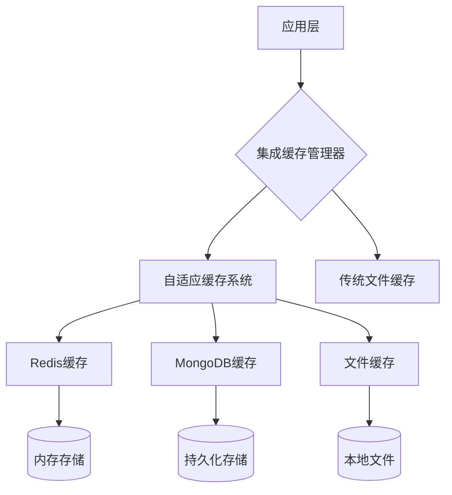
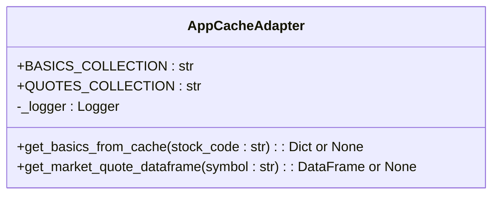
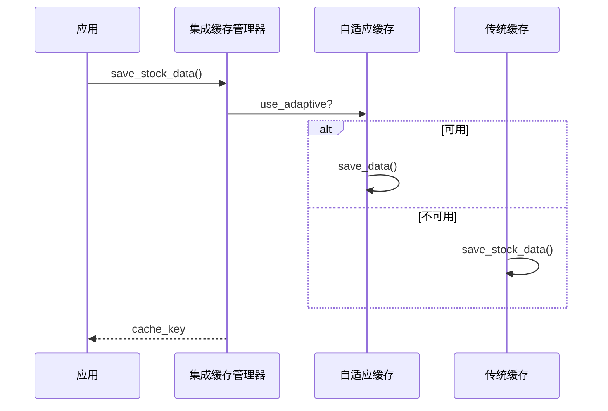
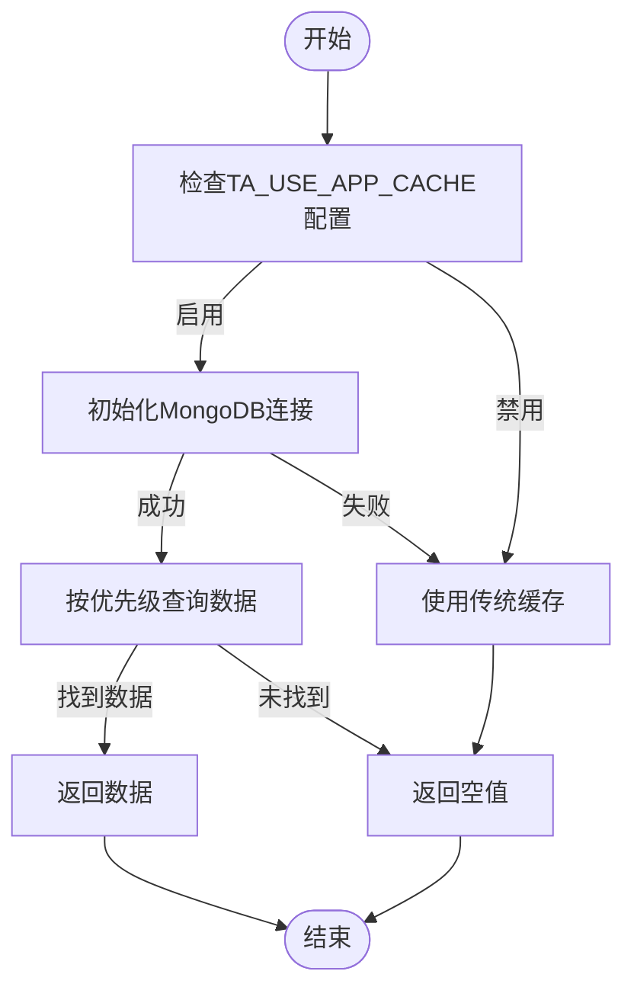
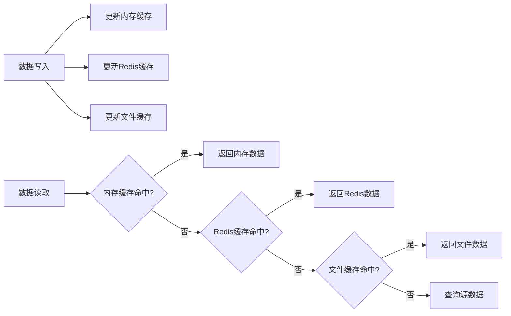
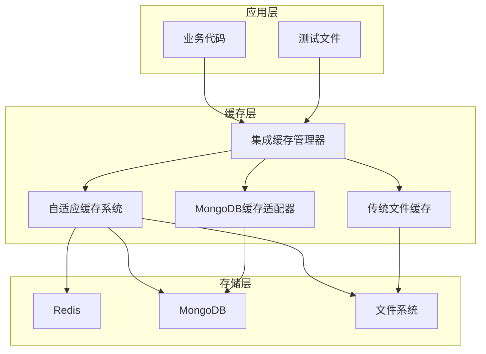

# 缓存架构设计

<cite>
**本文档引用的文件**   
- [app_adapter.py](file://tradingagents/dataflows/cache/app_adapter.py)
- [integrated.py](file://tradingagents/dataflows/cache/integrated.py)
- [mongodb_cache_adapter.py](file://tradingagents/dataflows/cache/mongodb_cache_adapter.py)
- [file_cache.py](file://tradingagents/dataflows/cache/file_cache.py)
- [adaptive.py](file://tradingagents/dataflows/cache/adaptive.py)
- [db_cache.py](file://tradingagents/dataflows/cache/db_cache.py)
- [CACHE_SYSTEM_FINAL_ANALYSIS.md](file://docs/architecture/cache/CACHE_SYSTEM_FINAL_ANALYSIS.md)
- [redis_client.py](file://app/core/redis_client.py)
</cite>

## 目录
1. [引言](#引言)
2. [缓存分层架构](#缓存分层架构)
3. [应用级缓存适配器设计](#应用级缓存适配器设计)
4. [集成缓存策略实现](#集成缓存策略实现)
5. [MongoDB二级缓存桥接逻辑](#mongodb二级缓存桥接逻辑)
6. [缓存协同工作机制](#缓存协同工作机制)
7. [系统分析与数据流位置](#系统分析与数据流位置)
8. [架构图示例](#架构图示例)
9. [高并发稳定性保障](#高并发稳定性保障)
10. [结论](#结论)

## 引言
本文档详细描述了基于Redis与本地文件系统的多层缓存架构设计。系统采用分层缓存策略，结合内存、Redis和文件系统三种存储方式，通过智能降级机制确保数据访问的高效性和可靠性。文档重点分析了`app_adapter.py`中的应用级缓存适配器设计模式、`integrated.py`中的集成缓存策略实现机制，以及`mongodb_cache_adapter.py`中MongoDB作为二级缓存的桥接逻辑。结合`CACHE_SYSTEM_FINAL_ANALYSIS.md`中的系统分析，阐述了缓存模块在整体数据流中的关键作用。

**Section sources**
- [CACHE_SYSTEM_FINAL_ANALYSIS.md](file://docs/architecture/cache/CACHE_SYSTEM_FINAL_ANALYSIS.md)

## 缓存分层架构
系统采用三层缓存架构设计，分别为内存缓存、Redis缓存和本地文件系统缓存。这种分层设计实现了性能与持久性的最佳平衡。内存缓存提供最快的访问速度，适用于高频访问的热点数据；Redis缓存作为中间层，提供分布式缓存能力，支持数据的快速读写和过期管理；本地文件系统缓存作为持久化层，确保数据在服务重启后仍可恢复。

该架构通过自适应缓存系统（AdaptiveCacheSystem）智能选择最佳缓存策略，根据数据库可用性自动选择后端存储。当Redis和MongoDB均可用时，系统进入高性能模式；当仅文件系统可用时，系统自动降级到基础模式，确保服务的持续可用性。

**Diagram sources**
- [integrated.py](file://tradingagents/dataflows/cache/integrated.py)
- [adaptive.py](file://tradingagents/dataflows/cache/adaptive.py)
- [db_cache.py](file://tradingagents/dataflows/cache/db_cache.py)
- [file_cache.py](file://tradingagents/dataflows/cache/file_cache.py)

**Section sources**
- [integrated.py](file://tradingagents/dataflows/cache/integrated.py)
- [adaptive.py](file://tradingagents/dataflows/cache/adaptive.py)

## 应用级缓存适配器设计
`app_adapter.py`实现了应用级缓存适配器的设计模式，主要负责从应用层的MongoDB集合中读取同步数据。该适配器采用弱依赖设计，当MongoDB客户端不可用时，能够优雅地返回空值，避免系统崩溃。适配器提供了两个核心方法：`get_basics_from_cache`用于读取股票基础信息，`get_market_quote_dataframe`用于读取行情数据并转换为DataFrame格式。

设计模式上，该适配器采用了单例模式，通过全局变量`_logger`确保日志实例的唯一性。同时，适配器实现了数据格式的自动对齐，将MongoDB中的原始数据映射为标准化的tushare格式，确保上层应用的兼容性。这种设计使得应用能够优先使用已同步的数据，未命中部分则由上层继续回退到直连数据源。

**Diagram sources**
- [app_adapter.py](file://tradingagents/dataflows/cache/app_adapter.py)

**Section sources**
- [app_adapter.py](file://tradingagents/dataflows/cache/app_adapter.py)

## 集成缓存策略实现
`integrated.py`实现了集成缓存管理器，作为统一的缓存入口，提供向后兼容的接口。该管理器采用智能选择策略，优先使用自适应缓存系统，当自适应系统不可用时，自动降级到传统文件缓存。集成缓存管理器通过`_log_cache_status`方法记录当前缓存配置，包括主要后端、MongoDB和Redis的可用性状态。

管理器提供了完整的缓存操作接口，包括`save_stock_data`、`load_stock_data`、`find_cached_stock_data`等方法，支持股票数据、新闻数据和基本面数据的缓存操作。特别地，`clear_old_cache`方法实现了多后端清理策略，能够同时清理Redis、MongoDB和文件系统的过期缓存，确保数据的一致性。

**Diagram sources**
- [integrated.py](file://tradingagents/dataflows/cache/integrated.py)

**Section sources**
- [integrated.py](file://tradingagents/dataflows/cache/integrated.py)

## MongoDB二级缓存桥接逻辑
`mongodb_cache_adapter.py`实现了MongoDB作为二级缓存的桥接逻辑，通过`MongoDBCacheAdapter`类提供统一的数据访问接口。该适配器根据`TA_USE_APP_CACHE`配置决定是否启用MongoDB缓存，当启用时，优先从MongoDB读取数据，否则使用传统缓存模式。

核心功能包括`get_stock_basic_info`、`get_historical_data`和`get_financial_data`等方法，支持按数据源优先级查询。其中，`_get_data_source_priority`方法实现了智能优先级排序，根据股票代码识别市场分类，并从数据库读取配置，按优先级排序后返回数据源列表。这种设计确保了数据获取的灵活性和可靠性。

**Diagram sources**
- [mongodb_cache_adapter.py](file://tradingagents/dataflows/cache/mongodb_cache_adapter.py)

**Section sources**
- [mongodb_cache_adapter.py](file://tradingagents/dataflows/cache/mongodb_cache_adapter.py)

## 缓存协同工作机制
缓存分层结构通过协同工作机制实现数据的高效流动和故障降级。数据流向遵循"内存→Redis→文件系统"的优先级顺序，写入时采用写穿透策略，同时更新所有层级的缓存；读取时采用读穿透策略，逐层查找直到找到有效数据。

故障降级策略是该机制的核心，当高层级缓存不可用时，系统自动降级到低层级缓存。例如，当Redis服务不可用时，自适应缓存系统会自动切换到文件缓存；当MongoDB连接失败时，应用级缓存适配器会返回空值，由上层逻辑处理。这种设计确保了系统的高可用性，即使在部分组件故障的情况下，仍能提供基本服务。

**Diagram sources**
- [integrated.py](file://tradingagents/dataflows/cache/integrated.py)
- [adaptive.py](file://tradingagents/dataflows/cache/adaptive.py)
- [file_cache.py](file://tradingagents/dataflows/cache/file_cache.py)

**Section sources**
- [integrated.py](file://tradingagents/dataflows/cache/integrated.py)
- [adaptive.py](file://tradingagents/dataflows/cache/adaptive.py)

## 系统分析与数据流位置
根据`CACHE_SYSTEM_FINAL_ANALYSIS.md`的系统分析，缓存模块在整体数据流中处于核心位置，作为数据访问的中间层，有效减少了对原始数据源的直接调用。缓存系统采用分层设计，包括顶层的集成缓存、中层的自适应缓存、底层的具体实现，以及独立的数据源适配器。

在数据流中，缓存模块位于数据源和业务逻辑之间，拦截大部分数据请求。当请求到达时，首先通过集成缓存管理器，然后由自适应缓存系统选择最佳后端。如果缓存命中，则直接返回数据；如果未命中，则继续向后端数据源查询，并将结果缓存以供后续使用。这种设计显著提高了系统的响应速度和吞吐量。

**Section sources**
- [CACHE_SYSTEM_FINAL_ANALYSIS.md](file://docs/architecture/cache/CACHE_SYSTEM_FINAL_ANALYSIS.md)

## 架构图示例
以下架构图展示了缓存系统的组件间调用关系。系统采用模块化设计，各组件职责清晰，通过统一接口进行通信。集成缓存管理器作为入口，协调自适应缓存和传统缓存的调用；自适应缓存系统根据配置自动选择Redis、MongoDB或文件系统作为后端；应用级缓存适配器则作为独立的数据源，提供快速的数据访问。

**Diagram sources**
- [integrated.py](file://tradingagents/dataflows/cache/integrated.py)
- [adaptive.py](file://tradingagents/dataflows/cache/adaptive.py)
- [file_cache.py](file://tradingagents/dataflows/cache/file_cache.py)
- [mongodb_cache_adapter.py](file://tradingagents/dataflows/cache/mongodb_cache_adapter.py)

## 高并发稳定性保障
在高并发场景下，系统通过多种机制保障稳定性。首先，Redis作为内存数据库，提供毫秒级的响应速度，有效缓解数据库压力。其次，连接池管理确保数据库连接的高效复用，避免连接耗尽。再者，分布式锁机制防止并发写入导致的数据不一致。

系统还实现了智能的缓存失效策略，通过TTL（Time To Live）机制自动清理过期数据，避免缓存雪崩。同时，降级策略确保在Redis或MongoDB故障时，系统仍能通过文件缓存提供服务。监控系统实时跟踪缓存命中率、响应时间和资源使用情况，为性能优化提供数据支持。

**Section sources**
- [redis_client.py](file://app/core/redis_client.py)
- [adaptive.py](file://tradingagents/dataflows/cache/adaptive.py)
- [db_cache.py](file://tradingagents/dataflows/cache/db_cache.py)

## 结论
本文档详细阐述了基于Redis与本地文件系统的多层缓存架构设计。系统通过分层缓存、智能降级和统一接口，实现了高性能、高可用的数据访问。应用级缓存适配器、集成缓存策略和MongoDB桥接逻辑共同构成了完整的缓存解决方案，在保证数据一致性的同时，显著提升了系统性能。该架构设计合理，组件职责清晰，为高并发场景下的稳定性提供了有力保障。