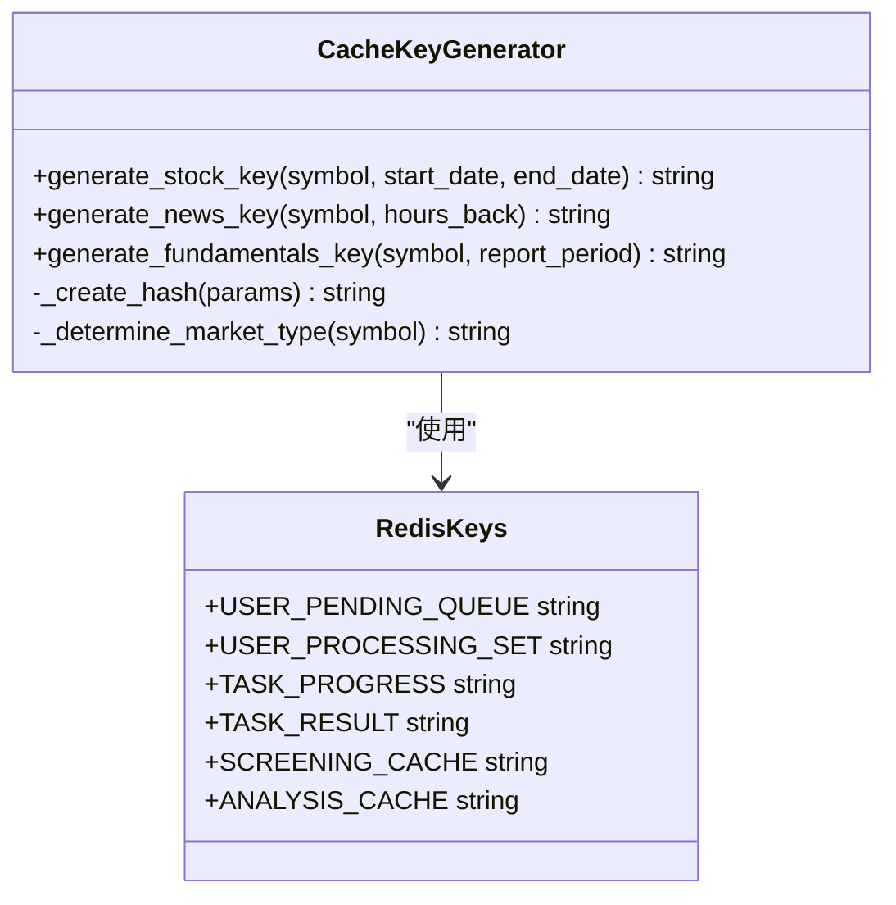
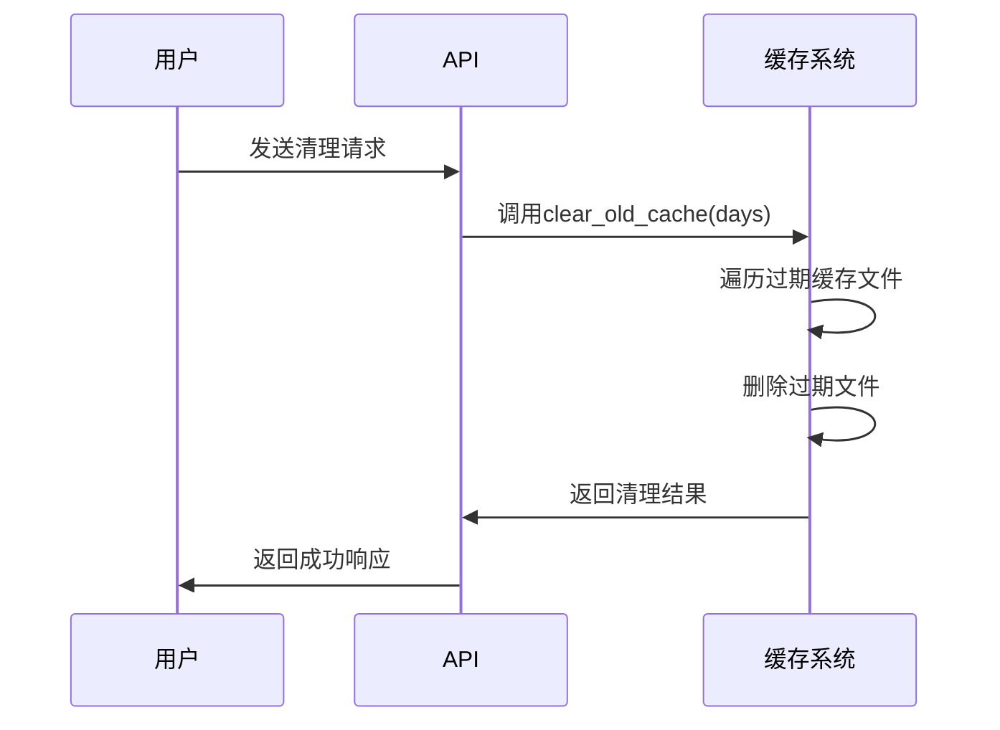
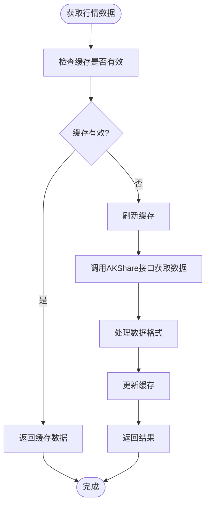
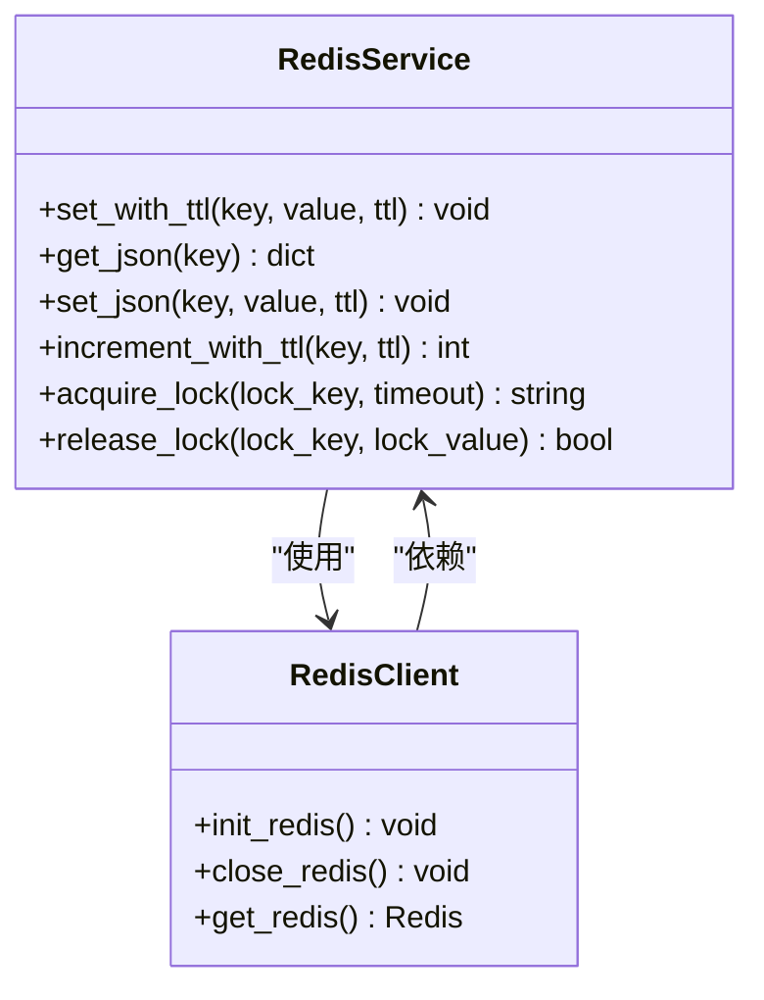

# 缓存管理

<cite>
**本文档引用文件**   
- [redis_client.py](file://app/core/redis_client.py)
- [quotes_service.py](file://app/services/quotes_service.py)
- [cache.py](file://app/routers/cache.py)
- [db_cache.py](file://tradingagents/dataflows/cache/db_cache.py)
- [mongodb_cache_adapter.py](file://tradingagents/dataflows/cache/mongodb_cache_adapter.py)
- [CACHE_CONFIGURATION.md](file://docs/configuration/CACHE_CONFIGURATION.md)
</cite>

## 目录
1. [引言](#引言)
2. [缓存架构设计](#缓存架构设计)
3. [缓存应用场景](#缓存应用场景)
4. [缓存键设计与命名空间管理](#缓存键设计与命名空间管理)
5. [缓存失效机制](#缓存失效机制)
6. [行情数据缓存实现](#行情数据缓存实现)
7. [Redis连接管理与性能优化](#redis连接管理与性能优化)
8. [缓存监控与性能调优](#缓存监控与性能调优)
9. [缓存与数据库一致性](#缓存与数据库一致性)
10. [缓存操作最佳实践](#缓存操作最佳实践)

## 引言
本文档深入解析基于Redis的缓存系统架构设计，涵盖实时行情数据缓存、分析结果缓存和API响应缓存等主要应用场景。文档详细说明了缓存键的设计规范、命名空间管理策略、缓存失效机制以及缓存与数据库一致性维护策略。通过分析quotes_service.py中行情数据缓存的实现逻辑和redis_client.py中的连接管理机制，为开发者提供全面的缓存系统使用指南和性能优化建议。

## 缓存架构设计
系统采用多层缓存架构设计，结合Redis内存缓存、MongoDB持久化存储和本地文件缓存，实现高性能和高可用性的缓存解决方案。缓存系统支持多种策略选择，包括文件缓存、集成缓存（MongoDB + Redis）和自适应缓存，可根据部署环境和性能需求灵活配置。

```mermaid
graph TD
A[应用层] --> B[统一缓存入口 get_cache()]
B --> C{缓存策略选择}
C --> |文件缓存| D[本地文件系统]
C --> |集成缓存| E[Redis内存缓存]
C --> |集成缓存| F[MongoDB持久化]
E --> G[快速读取]
F --> H[数据持久化]
D --> I[简单稳定]
E --> J[自动过期]
F --> K[分布式访问]
style A fill:#f9f,stroke:#333
style B fill:#bbf,stroke:#333
style C fill:#f96,stroke:#333
```

**图表来源**
- [CACHE_CONFIGURATION.md](file://docs/configuration/CACHE_CONFIGURATION.md#缓存策略对比)

**章节来源**
- [CACHE_CONFIGURATION.md](file://docs/configuration/CACHE_CONFIGURATION.md)
- [db_cache.py](file://tradingagents/dataflows/cache/db_cache.py)

## 缓存应用场景
缓存系统在本项目中主要应用于三个核心场景：实时行情数据缓存、分析结果缓存和API响应缓存。这些场景通过缓存机制显著提升了系统性能，减少了外部API调用次数，提高了用户体验。

### 实时行情数据缓存
实时行情数据缓存主要用于存储股票的最新价格、涨跌幅和成交额等近实时快照数据。通过缓存机制，系统能够在30秒的TTL周期内重复使用相同的数据，避免频繁调用外部API。

**章节来源**
- [quotes_service.py](file://app/services/quotes_service.py)

### 分析结果缓存
分析结果缓存用于存储基本面分析、技术分析等复杂计算的结果。这些分析通常需要较长时间完成，通过缓存可以避免重复计算，显著提高响应速度。

**章节来源**
- [db_cache.py](file://tradingagents/dataflows/cache/db_cache.py)

### API响应缓存
API响应缓存用于存储各种数据查询接口的响应结果，包括历史数据、新闻数据和财务数据等。不同类型的API响应采用不同的TTL策略，以平衡数据新鲜度和性能需求。

**章节来源**
- [cache.py](file://app/routers/cache.py)

## 缓存键设计与命名空间管理
缓存键的设计遵循统一的命名规范，确保键名的唯一性和可读性。系统采用分层命名空间管理策略，通过前缀区分不同类型的缓存数据，便于管理和维护。

### 缓存键命名规范
缓存键采用"类型:标识符:参数"的格式，其中类型表示数据类别，标识符为唯一ID，参数为查询条件。例如，`stock_data:AAPL:2023-01-01_2023-12-31`表示AAPL股票在指定日期范围内的历史数据缓存。



**图表来源**
- [redis_client.py](file://app/core/redis_client.py#L70-L102)
- [db_cache.py](file://tradingagents/dataflows/cache/db_cache.py#L175-L182)

**章节来源**
- [redis_client.py](file://app/core/redis_client.py)
- [db_cache.py](file://tradingagents/dataflows/cache/db_cache.py)

## 缓存失效机制
系统实现了多层次的缓存失效机制，包括TTL设置、主动失效和缓存穿透防护，确保缓存数据的新鲜度和系统稳定性。

### TTL设置
不同类型的缓存数据采用不同的TTL策略。实时行情数据设置为6小时过期，新闻数据为24小时，基本面数据也为24小时。这种差异化TTL设置平衡了数据新鲜度和性能需求。

**章节来源**
- [db_cache.py](file://tradingagents/dataflows/cache/db_cache.py#L258-L260)

### 主动失效
系统提供主动清理缓存的机制，允许管理员通过API接口清理过期或所有缓存。清理操作支持按时间范围删除，确保缓存占用的存储空间得到有效管理。



**图表来源**
- [cache.py](file://app/routers/cache.py#L56-L84)

**章节来源**
- [cache.py](file://app/routers/cache.py)

### 缓存穿透防护
系统通过布隆过滤器和空值缓存机制防止缓存穿透。对于查询不存在的数据，系统会缓存一个特殊的空值标记，并设置较短的TTL，避免相同请求重复穿透到数据库。

**章节来源**
- [db_cache.py](file://tradingagents/dataflows/cache/db_cache.py)

## 行情数据缓存实现
quotes_service.py模块实现了A股批量实时快照获取功能，采用内存TTL缓存机制，为股票筛选提供行情数据支持。

### 核心实现逻辑
行情数据缓存使用单例模式实现，通过_init_redis方法初始化Redis连接，get_quotes方法提供缓存读取接口。当缓存过期或为空时，系统会自动刷新全市场快照。



**图表来源**
- [quotes_service.py](file://app/services/quotes_service.py#L34-L55)

**章节来源**
- [quotes_service.py](file://app/services/quotes_service.py)

## Redis连接管理与性能优化
redis_client.py模块负责Redis客户端的配置和连接管理，通过连接池和健康检查机制确保连接的稳定性和性能。

### 连接池配置
系统使用Redis连接池管理连接，配置最大连接数、超时重试和TCP keepalive等参数，优化连接性能和资源利用率。



**图表来源**
- [redis_client.py](file://app/core/redis_client.py#L104-L191)

**章节来源**
- [redis_client.py](file://app/core/redis_client.py)

## 缓存监控与性能调优
系统提供全面的缓存监控功能，包括缓存统计、详情查看和性能测试，帮助管理员了解缓存使用情况并进行性能优化。

### 监控指标
关键监控指标包括缓存命中率、平均响应时间、缓存大小和过期率。通过这些指标可以评估缓存系统的有效性并识别性能瓶颈。

**章节来源**
- [cache.py](file://app/routers/cache.py)

### 性能调优建议
1. 根据访问模式调整TTL值
2. 优化缓存键设计减少冲突
3. 使用批量操作减少网络往返
4. 合理配置连接池大小
5. 定期清理过期缓存释放资源

**章节来源**
- [CACHE_CONFIGURATION.md](file://docs/configuration/CACHE_CONFIGURATION.md)

## 缓存与数据库一致性
系统采用写穿透和读穿透模式维护缓存与数据库的一致性，确保数据的准确性和实时性。

### 写穿透模式
当数据更新时，系统同时更新数据库和缓存，确保两者数据一致。这种模式适用于写操作较少但读操作频繁的场景。

**章节来源**
- [db_cache.py](file://tradingagents/dataflows/cache/db_cache.py)

### 读穿透模式
当缓存中没有数据时，系统从数据库读取数据并写入缓存，后续请求可以直接从缓存获取。这种模式适用于数据更新不频繁的场景。

**章节来源**
- [db_cache.py](file://tradingagents/dataflows/cache/db_cache.py)

## 缓存操作最佳实践
本节提供缓存操作的最佳实践示例，指导开发者正确使用缓存系统。

### 代码示例
```python
# 获取缓存实例
cache = get_cache()

# 保存股票数据
cache_key = cache.save_stock_data(
    symbol="000001",
    data=df,
    start_date="2023-01-01",
    end_date="2023-12-31",
    data_source="akshare"
)

# 读取股票数据
cached_data = cache.load_stock_data(cache_key)

# 清理过期缓存
cache.clear_old_cache(7)  # 清理7天前的缓存
```

**章节来源**
- [db_cache.py](file://tradingagents/dataflows/cache/db_cache.py)
- [CACHE_CONFIGURATION.md](file://docs/configuration/CACHE_CONFIGURATION.md)