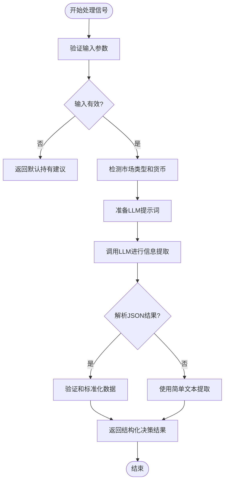
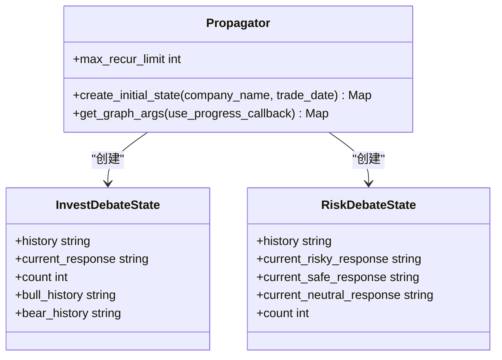
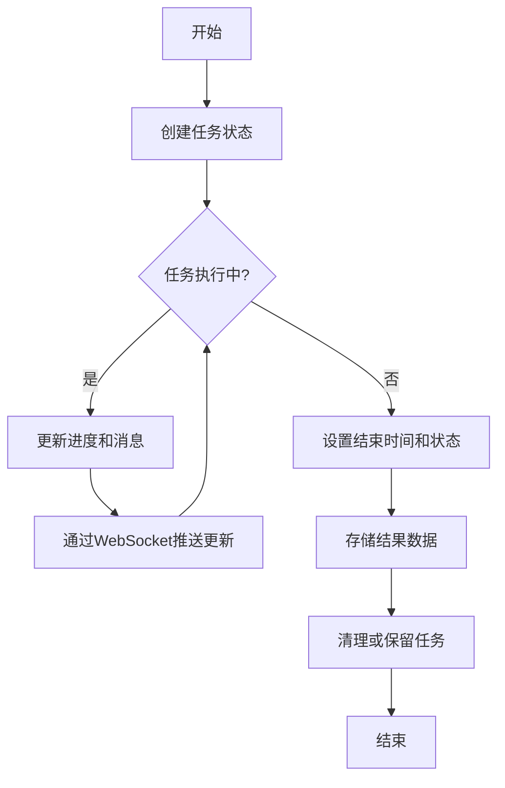
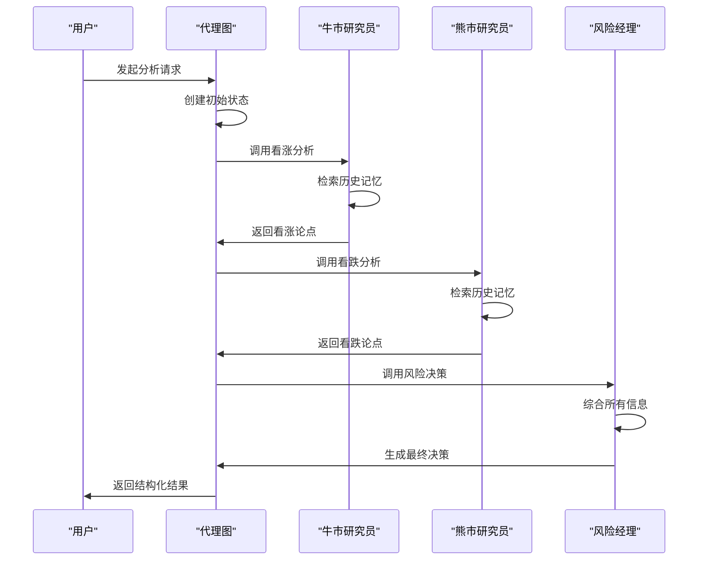

# 信号处理机制

<cite>
**本文档引用文件**  
- [signal_processing.py](file://tradingagents/graph/signal_processing.py)
- [propagation.py](file://tradingagents/graph/propagation.py)
- [memory.py](file://tradingagents/agents/utils/memory.py)
- [memory_state_manager.py](file://app/services/memory_state_manager.py)
- [bull_researcher.py](file://tradingagents/agents/researchers/bull_researcher.py)
- [bear_researcher.py](file://tradingagents/agents/researchers/bear_researcher.py)
- [risk_manager.py](file://tradingagents/agents/managers/risk_manager.py)
- [trading_graph.py](file://tradingagents/graph/trading_graph.py)
</cite>

## 目录
1. [引言](#引言)
2. [核心组件](#核心组件)
3. [信号处理机制](#信号处理机制)
4. [信号传播规则](#信号传播规则)
5. [状态管理与上下文维护](#状态管理与上下文维护)
6. [智能体间信号流转案例](#智能体间信号流转案例)
7. [信号格式与序列化机制](#信号格式与序列化机制)
8. [结论](#结论)

## 引言
本系统通过多智能体协作框架实现金融分析与决策支持，其中信号处理机制是整个系统的核心。该机制负责在牛市研究员、熊市研究员和风险经理等智能体之间传递分析结果和决策信号，确保各组件能够基于共享上下文进行协同推理。系统采用LangGraph构建有状态的代理图，结合LLM进行深度分析，并通过内存管理器维护分析过程中的上下文状态。信号处理不仅涉及原始文本的解析与结构化提取，还包括跨智能体的消息传递、状态传播和上下文感知的决策生成。

## 核心组件
系统的核心组件包括信号处理器（SignalProcessor）、传播器（Propagator）、内存管理器（MemoryStateManager）以及各类智能体节点。这些组件共同构成了一个完整的信号处理与决策闭环。信号处理器负责将非结构化的LLM输出转化为标准化的决策数据结构；传播器管理图的状态初始化与流转；内存管理器则在应用层面维护任务级状态；而各类智能体节点通过预定义的节点函数实现特定角色的分析逻辑。

**Section sources**
- [signal_processing.py](file://tradingagents/graph/signal_processing.py#L11-L337)
- [propagation.py](file://tradingagents/graph/propagation.py#L15-L69)
- [memory_state_manager.py](file://app/services/memory_state_manager.py#L94-L421)

## 信号处理机制
信号处理机制的核心是`SignalProcessor`类，它负责将LLM生成的非结构化分析文本转化为结构化的投资决策。该类通过`process_signal`方法接收完整的交易信号文本，并利用LLM进行信息提取，最终输出包含操作建议、目标价格、置信度、风险评分和推理理由的JSON格式数据。

处理流程包括输入验证、市场信息检测、LLM调用、JSON解析与数据标准化等步骤。系统会根据股票代码自动识别市场类型（A股、港股、美股），并据此确定货币单位。对于LLM输出的非标准格式，系统提供了强大的容错机制，包括英文术语映射、目标价格的正则提取和智能推算。当无法从文本中直接提取目标价格时，系统会尝试从当前价格和涨跌幅信息中推算，或基于市场类型应用默认涨幅/跌幅进行估算。

**Diagram sources**
- [signal_processing.py](file://tradingagents/graph/signal_processing.py#L19-L214)

**Section sources**
- [signal_processing.py](file://tradingagents/graph/signal_processing.py#L11-L337)

## 信号传播规则
信号传播规则由`Propagator`类定义，它负责初始化代理图的状态并管理信号在图中的流转。`create_initial_state`方法创建了图的初始状态，包括分析请求消息、公司名称、交易日期以及投资辩论和风险辩论的状态对象。

初始状态中包含了多个关键字段：`messages`存储对话历史，`investment_debate_state`维护多头与空头研究员的辩论历史，`risk_debate_state`记录风险分析师的讨论过程，而各类报告字段（`market_report`, `fundamentals_report`等）则用于存储各阶段的分析结果。这种结构化的状态设计使得信号可以在不同智能体节点间有序传递和累积。

**Diagram sources**
- [propagation.py](file://tradingagents/graph/propagation.py#L15-L69)
- [agent_states.py](file://tradingagents/agents/utils/agent_states.py)

**Section sources**
- [propagation.py](file://tradingagents/graph/propagation.py#L15-L69)

## 状态管理与上下文维护
系统的状态管理分为两个层面：图内状态和应用级状态。图内状态由LangGraph框架维护，存储在内存中并随节点流转；应用级状态则由`MemoryStateManager`管理，用于跨请求的任务状态跟踪。

`FinancialSituationMemory`类实现了基于ChromaDB的向量内存，支持历史分析记忆的存储与检索。该类根据LLM提供商自动选择嵌入模型（如阿里百炼、OpenAI等），并实现了多级降级策略。当主嵌入服务不可用时，系统会尝试使用备用提供商或直接返回空向量，确保核心功能不受影响。

`MemoryStateManager`则提供了任务级别的状态管理，包括任务创建、状态更新、进度跟踪和结果存储。它使用线程锁保证并发安全，并通过WebSocket将状态更新实时推送给前端。任务状态包含进度、消息、执行时间、令牌使用量等丰富信息，支持对分析过程的全面监控。

**Diagram sources**
- [memory.py](file://tradingagents/agents/utils/memory.py#L99-L702)
- [memory_state_manager.py](file://app/services/memory_state_manager.py#L94-L421)

**Section sources**
- [memory.py](file://tradingagents/agents/utils/memory.py#L1-L702)
- [memory_state_manager.py](file://app/services/memory_state_manager.py#L1-L421)

## 智能体间信号流转案例
以对平安银行（000001）的分析为例，信号在智能体间的流转过程如下：首先，系统创建初始状态，包含对平安银行的分析请求。随后，市场研究员、基本面研究员等节点依次执行，生成各自的分析报告并更新到状态中。

接下来，牛市研究员（Bull Researcher）节点被激活，它接收当前状态，结合市场报告、情绪报告和基本面数据，生成看涨论点。其节点函数会检索向量内存中的历史记忆，构建更有说服力的论证。然后，熊市研究员（Bear Researcher）节点被调用，它基于相同的上下文生成反驳论点。

这两个研究员的输出通过`investment_debate_state`在多次迭代中累积，形成辩论历史。最后，风险经理（Risk Manager）节点被触发，它综合所有信息，包括三位风险分析师（激进、保守、中立）的辩论，生成最终的交易决策。整个过程通过结构化的状态对象实现了上下文的无缝传递。

**Diagram sources**
- [bull_researcher.py](file://tradingagents/agents/researchers/bull_researcher.py#L10-L146)
- [bear_researcher.py](file://tradingagents/agents/researchers/bear_researcher.py#L10-L137)
- [risk_manager.py](file://tradingagents/agents/managers/risk_manager.py#L9-L164)

**Section sources**
- [bull_researcher.py](file://tradingagents/agents/researchers/bull_researcher.py#L1-L146)
- [bear_researcher.py](file://tradingagents/agents/researchers/bear_researcher.py#L1-L137)
- [risk_manager.py](file://tradingagents/agents/managers/risk_manager.py#L1-L164)

## 信号格式与序列化机制
系统采用JSON作为主要的信号序列化格式，确保数据的结构化和可解析性。`SignalProcessor`输出的决策信号包含五个核心字段：`action`（操作：买入/持有/卖出）、`target_price`（目标价格）、`confidence`（置信度）、`risk_score`（风险评分）和`reasoning`（推理理由）。

在内部状态传递中，系统使用Python字典作为序列化格式，通过LangGraph的状态管理机制在节点间传递。对于需要持久化的任务状态，`MemoryStateManager`将其转换为字典格式并存储在内存字典中，同时通过`to_dict`方法将`TaskState`数据类序列化为JSON兼容的格式，便于通过API暴露给前端。

所有信号处理都遵循严格的验证和标准化规则。例如，`action`字段必须为中文的"买入"、"持有"或"卖出"，系统会自动映射英文或其他变体。目标价格会进行货币单位的标准化处理，确保与股票的交易市场一致。这种统一的信号格式保证了系统各组件之间的互操作性和数据一致性。

**Section sources**
- [signal_processing.py](file://tradingagents/graph/signal_processing.py#L73-L87)
- [memory_state_manager.py](file://app/services/memory_state_manager.py#L48-L92)

## 结论
本系统的信号处理机制通过精心设计的组件协作，实现了复杂金融分析场景下的高效信息传递与决策生成。`SignalProcessor`提供了鲁棒的非结构化文本解析能力，`Propagator`确保了图状态的正确初始化，而多层次的内存管理机制则保障了上下文的连续性。智能体间的信号流转通过结构化的状态对象实现，支持多轮辩论和渐进式推理。统一的信号格式和序列化机制确保了系统各部分的无缝集成。这一机制不仅满足了当前的分析需求，也为未来的功能扩展提供了坚实的基础。