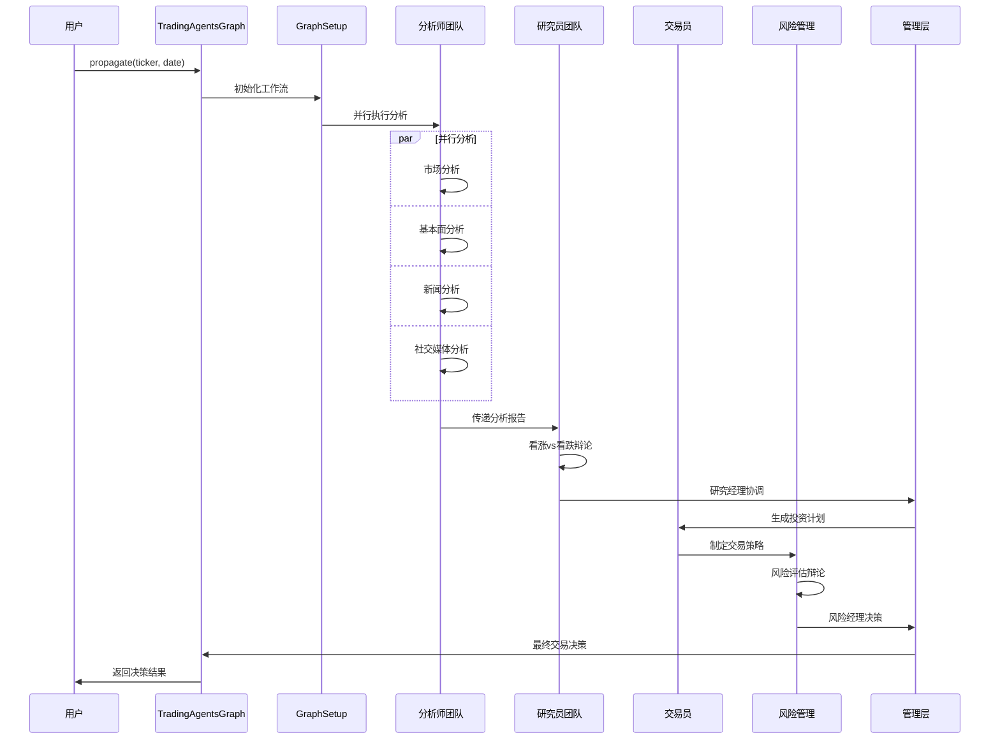
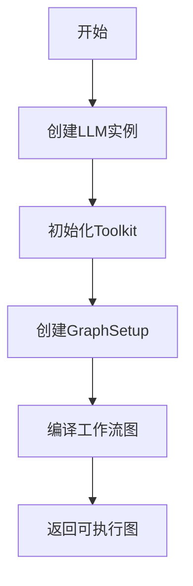
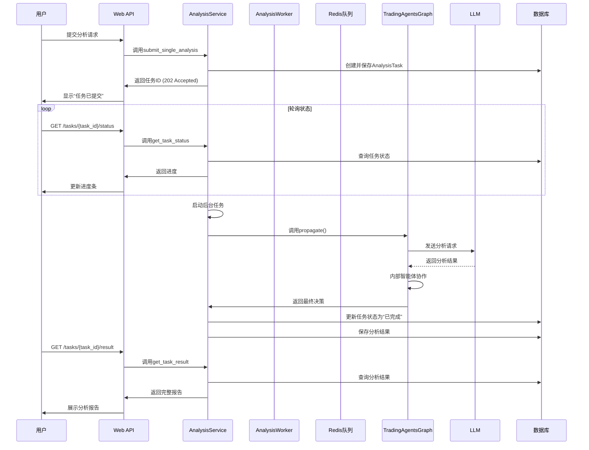

# 分析流程与协作机制

<cite>
**本文档引用的文件**   
- [trading_graph.py](file://tradingagents/graph/trading_graph.py)
- [signal_processing.py](file://tradingagents/graph/signal_processing.py)
- [conditional_logic.py](file://tradingagents/graph/conditional_logic.py)
- [setup.py](file://tradingagents/graph/setup.py)
- [propagation.py](file://tradingagents/graph/propagation.py)
- [analysis_service.py](file://app/services/analysis_service.py)
- [analysis.py](file://app/routers/analysis.py)
- [analysis.py](file://docs/architecture/v0.1.13/system-architecture.md)
- [analysis-nodes-and-tools.md](file://docs/analysis/analysis-nodes-and-tools.md)
</cite>

## 目录
1. [引言](#引言)
2. [分析流程概览](#分析流程概览)
3. [交易图（Trading Graph）编排机制](#交易图trading-graph编排机制)
4. [条件逻辑模块](#条件逻辑模块)
5. [信号处理机制](#信号处理机制)
6. [批量分析与单个分析流程差异](#批量分析与单个分析流程差异)
7. [智能体协作时序图](#智能体协作时序图)
8. [异常处理与重试机制](#异常处理与重试机制)
9. [结论](#结论)

## 引言
本文档详细阐述了智能分析系统中从用户发起分析请求到生成最终报告的完整工作流。系统采用基于LangGraph的多智能体协作架构，通过交易图（trading_graph）编排各智能体的执行顺序，并利用条件逻辑模块根据市场情况动态调整分析路径。文档深入解析了信号处理机制如何在智能体间传递分析结果和决策信号，对比了批量分析与单个分析的流程差异，并提供了完整的时序图展示智能体协作过程，以及异常处理和重试机制的实现细节。

## 分析流程概览
当用户发起一个分析请求时，系统启动一个复杂的多智能体协作流程。该流程始于用户输入股票代码和分析参数，随后系统初始化一个由多个专业智能体组成的“交易图”（TradingAgentsGraph）。这些智能体包括市场分析师、基本面分析师、新闻分析师、社交媒体分析师、研究员、交易员和风险管理团队。

整个分析流程遵循一个层次化的协作结构：首先，各分析师团队并行执行其专业领域的分析；然后，研究员团队基于分析师的报告进行多轮辩论，形成投资共识；接着，交易员制定交易策略；最后，风险管理团队进行风险评估，形成最终决策。所有智能体的输出通过一个统一的`AgentState`状态对象进行共享和同步，确保信息在团队间无缝流转。



**Diagram sources**
- [system-architecture.md](file://docs/architecture/v0.1.13/system-architecture.md#L596-L634)

**Section sources**
- [system-architecture.md](file://docs/architecture/v0.1.13/system-architecture.md#L596-L650)
- [analysis-nodes-and-tools.md](file://docs/analysis/analysis-nodes-and-tools.md#L1-L259)

## 交易图（Trading Graph）编排机制
交易图（`TradingAgentsGraph`）是整个分析流程的核心编排引擎，它基于`StateGraph`构建了一个有向无环图（DAG），用于管理智能体之间的复杂工作流。

### 图结构初始化
`TradingAgentsGraph`类在初始化时，会根据配置创建两个主要的LLM实例：`quick_thinking_llm`用于快速决策和工具调用，`deep_thinking_llm`用于深度思考和复杂推理。同时，它会初始化一个`Toolkit`，其中包含了所有智能体可以调用的工具，如`get_stock_market_data_unified`、`get_stock_fundamentals_unified`等。



### 节点注册与编排
`GraphSetup`类负责将各个智能体节点注册到工作流图中。它首先根据用户选择的分析师类型（如市场、基本面、新闻、社交媒体）创建相应的分析师节点。每个分析师节点都关联一个工具节点（`ToolNode`）和一个消息清理节点（`Msg Clear`），以处理工具调用和状态清理。

随后，`GraphSetup`会添加研究员团队（看涨研究员、看跌研究员、研究经理）、交易员和风险管理团队（激进、保守、中性分析师、风险经理）等节点。这些节点构成了分析流程的后续阶段。

### 边缘与条件路由
`GraphSetup`通过定义图的“边”（edges）来确定智能体的执行顺序。对于并行执行的分析师，系统使用`par`关键字将它们并行化。对于需要条件判断的节点，如分析师是否需要继续调用工具，系统会使用`add_conditional_edges`方法，将节点的输出路由到不同的下一个节点。

例如，`should_continue_market`函数会检查市场分析师的最后一条消息是否包含工具调用（`tool_calls`）。如果有，则路由到`tools_market`节点执行工具；如果没有，则路由到`Msg Clear Market`节点，表示该分析师的任务完成，可以进入下一个阶段。

## 条件逻辑模块
条件逻辑模块（`ConditionalLogic`）是交易图的“大脑”，它决定了工作流的分支和循环，确保分析过程能够根据实际情况动态调整。

### 分析师循环控制
每个分析师节点都有一个对应的条件判断函数，如`should_continue_market`、`should_continue_fundamentals`等。这些函数的核心逻辑是：
1.  **检查工具调用**：如果智能体的最后一条消息包含`tool_calls`，则返回对应的工具节点名称，触发工具执行。
2.  **检查报告完成**：如果智能体的状态中已经生成了足够长的报告（如`market_report`长度超过100字符），则认为分析已完成，返回消息清理节点。
3.  **防止死循环**：为了防止智能体陷入无限循环，系统引入了`tool_call_count`计数器。当工具调用次数达到预设上限（如3次）时，无论条件如何，都会强制结束该分析师的循环。

### 辩论轮次控制
`ConditionalLogic`还控制着研究员和风险管理团队的辩论流程。`should_continue_debate`函数会检查当前辩论的轮次计数。如果计数未达到配置的最大轮次（`max_debate_rounds`），则在看涨研究员和看跌研究员之间交替发言；一旦达到最大轮次，辩论结束，流程进入研究经理节点。

```python
def should_continue_debate(self, state: AgentState) -> str:
    current_count = state["investment_debate_state"]["count"]
    max_count = 2 * self.max_debate_rounds # 每轮辩论包含两次发言
    if current_count >= max_count:
        return "Research Manager" # 结束辩论
    next_speaker = "Bear Researcher" if current_speaker.startswith("Bull") else "Bull Researcher"
    return next_speaker # 继续辩论
```

这种机制确保了辩论既充分又不会无限进行，保证了分析流程的效率和可控性。

**Section sources**
- [conditional_logic.py](file://tradingagents/graph/conditional_logic.py#L1-L243)
- [setup.py](file://tradingagents/graph/setup.py#L1-L254)

## 信号处理机制
信号处理机制是连接智能体协作流程与最终用户输出的关键环节。`SignalProcessor`类负责将交易员生成的复杂、非结构化的分析报告，转化为用户和前端可以轻松理解的、标准化的决策信息。

### 处理流程
`SignalProcessor`的`process_signal`方法是其核心。它接收来自交易员的完整信号文本和股票代码，然后执行以下步骤：

1.  **输入验证**：首先检查输入信号是否为空或无效，如果是，则返回一个默认的“持有”建议。
2.  **市场信息检测**：根据股票代码，使用`StockUtils.get_market_info`确定股票所属的市场（如A股、港股）和计价货币（如人民币、港币），这对于后续的决策解析至关重要。
3.  **LLM指令构建**：构造一个系统提示（system prompt），明确指示LLM从报告中提取特定的结构化信息，包括：
    *   `action`: 投资建议（买入/持有/卖出）
    *   `target_price`: 目标价格（必须为具体数值）
    *   `confidence`: 置信度（0-1之间）
    *   `risk_score`: 风险评分（0-1之间）
    *   `reasoning`: 决策理由摘要
4.  **LLM调用与解析**：调用`quick_thinking_llm`执行指令，并尝试从返回的文本中提取JSON格式的决策数据。
5.  **数据验证与回退**：对解析出的数据进行严格验证。如果`target_price`为空，系统会尝试从报告文本中通过正则表达式匹配（如“目标价: 45.50”）或智能推算（基于当前价格和涨跌幅）来获取。如果LLM调用失败或无法解析JSON，则回退到`_extract_simple_decision`方法，使用简单的文本匹配来提取关键信息。

### 标准化输出
最终，`SignalProcessor`返回一个包含所有关键决策信息的字典。这个标准化的输出被前端用于生成清晰的分析报告，确保了端到端的一致性。

```python
{
    "action": "买入",
    "target_price": 45.5,
    "confidence": 0.8,
    "risk_score": 0.3,
    "reasoning": "公司基本面强劲，技术面呈现突破形态，市场情绪积极。"
}
```

**Section sources**
- [signal_processing.py](file://tradingagents/graph/signal_processing.py#L1-L337)

## 批量分析与单个分析流程差异
系统支持单个分析和批量分析两种模式，它们在任务提交、执行方式和状态管理上存在显著差异。

### 单个分析流程
单个分析流程直接在Web API的后台任务中执行。当用户通过`/analysis/single`端点提交请求时，`analysis.py`中的`submit_single_analysis`函数会立即创建一个`AnalysisTask`并将其保存到数据库。随后，它使用`BackgroundTasks`异步启动`execute_analysis_background`任务。该任务会直接调用`TradingAgentsGraph`的`propagate`方法，在同一个进程中完成整个分析流程。这种方式响应速度快，适合实时交互。

### 批量分析流程
批量分析流程则通过一个独立的队列系统（`analysis_worker.py`）来实现。当用户提交批量请求时，`submit_batch_analysis`函数会为列表中的每只股票创建一个`AnalysisTask`，并将这些任务提交到Redis队列中。一个或多个独立的`AnalysisWorker`进程会持续监听这个队列，从队列中取出任务并执行。这种设计实现了任务的解耦和异步处理，能够有效管理大量任务的并发执行，避免阻塞主Web服务。

| 特性 | 单个分析 | 批量分析 |
| :--- | :--- | :--- |
| **执行方式** | Web API后台任务 | 独立Worker进程 |
| **任务队列** | 无 | Redis队列 |
| **并发控制** | 依赖FastAPI的并发能力 | 通过`user_concurrent_limit`和`global_concurrent_limit`精确控制 |
| **适用场景** | 实时、交互式分析 | 大量股票的后台分析 |
| **状态跟踪** | 内存中的`RedisProgressTracker` | 数据库记录 + 队列状态 |

**Section sources**
- [analysis.py](file://app/routers/analysis.py#L1-L1259)
- [analysis_service.py](file://app/services/analysis_service.py#L1-L955)
- [analysis_worker.py](file://app/worker/analysis_worker.py#L1-L275)

## 智能体协作时序图
下图详细展示了从用户发起请求到最终获得决策的完整时序。



**Diagram sources**
- [analysis.py](file://app/routers/analysis.py#L40-L92)
- [analysis_service.py](file://app/services/analysis_service.py#L422-L512)

## 异常处理与重试机制
系统在多个层面实现了健壮的异常处理和重试机制，以确保分析流程的稳定性和可靠性。

### LLM调用重试
在`create_llm_by_provider`函数中，虽然未直接体现，但系统通过配置`timeout`和`retry_times`参数，利用底层LLM库（如LangChain）的内置重试机制来处理网络超时和临时性错误。

### 死循环防护
`ConditionalLogic`类中的每个`should_continue_*`函数都内置了防止死循环的逻辑。通过`tool_call_count`计数器和最大调用次数限制（`max_tool_calls`），系统可以强制中断任何可能陷入无限循环的智能体，保证了整个工作流的终止性。

### 任务级异常处理
在`AnalysisWorker`中，`_process_task`方法被包裹在`try-except`块中。如果任务执行过程中发生任何异常，系统会捕获异常，记录错误日志，并将任务状态标记为失败。`_work_loop`也会捕获异常，避免单个任务的失败导致整个Worker进程崩溃。

### 进度与状态持久化
`RedisProgressTracker`和数据库中的`AnalysisTask`模型确保了任务状态的持久化。即使系统重启，任务的进度和结果也不会丢失。`AnalysisService`在查询任务状态时，会优先从内存中的进度跟踪器查找，如果找不到，则会回退到查询数据库，确保了数据的最终一致性。

## 结论
本文档详细解析了智能分析系统的核心工作流。通过`TradingAgentsGraph`和`LangGraph`，系统实现了高度模块化和可扩展的多智能体协作。条件逻辑模块赋予了工作流动态调整的能力，而信号处理机制则确保了最终输出的标准化和可用性。单个分析和批量分析的差异化设计，满足了不同场景下的性能和可靠性需求。整套机制通过完善的异常处理和状态管理，构建了一个稳定、高效且用户友好的智能分析平台。