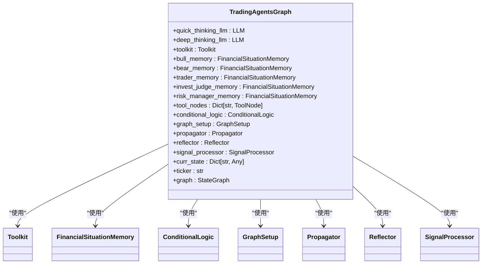
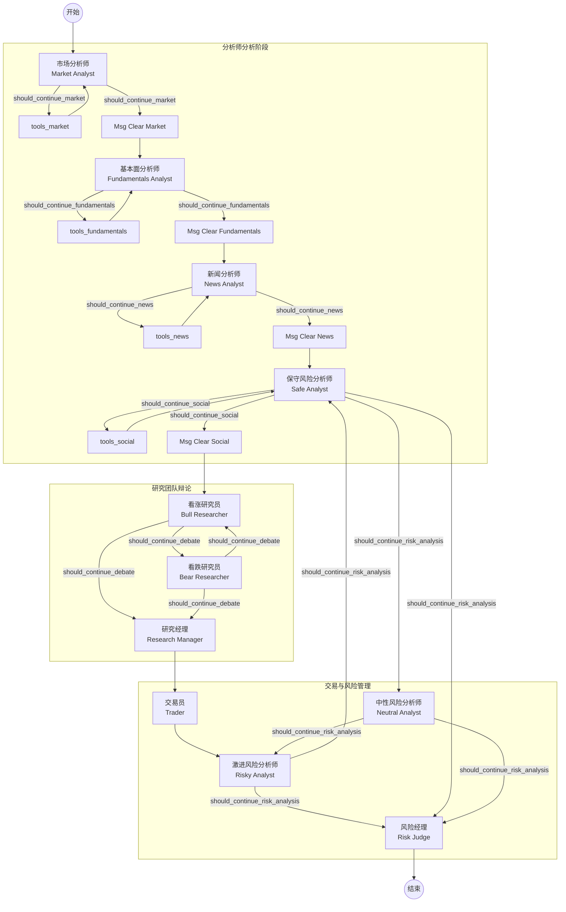
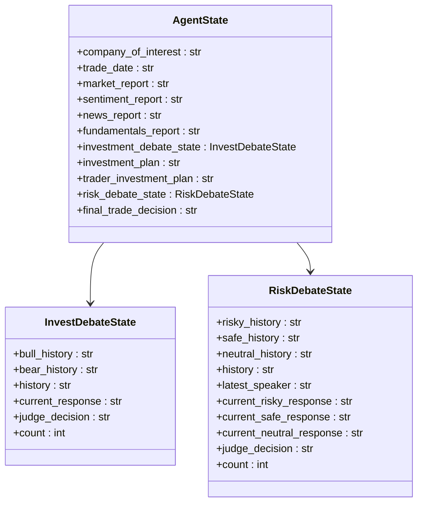
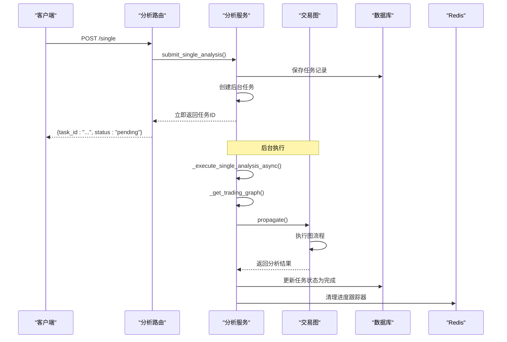

# 工作流编排

<cite>
**本文档引用的文件**   
- [trading_graph.py](file://tradingagents/graph/trading_graph.py)
- [analysis_service.py](file://app/services/analysis_service.py)
- [analysis.py](file://app/routers/analysis.py)
- [setup.py](file://tradingagents/graph/setup.py)
- [propagation.py](file://tradingagents/graph/propagation.py)
- [default_config.py](file://tradingagents/default_config.py)
- [simple_analysis_service.py](file://app/services/simple_analysis_service.py)
</cite>

## 目录
1. [引言](#引言)
2. [交易图结构](#交易图结构)
3. [分析服务与API接口](#分析服务与api接口)
4. [执行流程与错误处理](#执行流程与错误处理)
5. [性能监控与时间统计](#性能监控与时间统计)
6. [结论](#结论)

## 引言
本文档详细描述了系统中工作流编排的核心机制，重点分析了`trading_graph.py`文件中定义的交易图（Trading Agents Graph）如何组织和调度多个智能体（如市场分析师、基本面分析师、新闻分析师等）的执行流程。文档将解释图结构中的节点定义、边连接关系以及执行引擎如何遍历图结构。同时，将详细说明分析服务（analysis_service.py）如何接收API请求并启动交易图执行，以及路由层（analysis.py）的接口设计。此外，文档还将提供代码示例展示图的构建过程，并说明错误传播机制和超时处理策略。

## 交易图结构

### 图的初始化与组件
交易图的核心类`TradingAgentsGraph`在初始化时会根据配置创建两个主要的LLM实例：`quick_thinking_llm`用于快速思考和工具调用，`deep_thinking_llm`用于深度推理和最终决策。该类还负责初始化工具包（`Toolkit`）、记忆系统（如`FinancialSituationMemory`）以及图的各个组件，如`ConditionalLogic`（条件逻辑）、`GraphSetup`（图构建器）、`Propagator`（状态传播器）、`Reflector`（反思器）和`SignalProcessor`（信号处理器）。

**Diagram sources**
- [trading_graph.py](file://tradingagents/graph/trading_graph.py#L193-L801)

**Section sources**
- [trading_graph.py](file://tradingagents/graph/trading_graph.py#L193-L801)

### 节点与边的定义
交易图的结构由`GraphSetup`类负责构建。该类根据用户选择的分析师类型（如市场、基本面、新闻、社交媒体）动态创建相应的节点。每个分析师节点（如"Market Analyst"）负责执行特定领域的分析任务。与之关联的还有工具节点（如"tools_market"）和消息清理节点（如"Msg Clear Market"）。

图的执行流程是一个有向无环图（DAG）。执行从`START`节点开始，首先连接到第一个分析师节点。分析师节点执行后，会根据`ConditionalLogic`中的条件判断是否需要调用工具。如果需要，则跳转到对应的工具节点；否则，跳转到消息清理节点，并继续执行下一个分析师节点。当所有分析师完成工作后，流程会进入研究团队辩论阶段，由看涨研究员（Bull Researcher）和看跌研究员（Bear Researcher）进行多轮辩论，最终由研究经理（Research Manager）做出决策。随后，该决策会传递给交易员（Trader）和风险管理团队（Risky Analyst, Safe Analyst, Neutral Analyst），最终由风险经理（Risk Judge）给出最终的交易决策。

**Diagram sources**
- [setup.py](file://tradingagents/graph/setup.py#L51-L254)
- [trading_graph.py](file://tradingagents/graph/trading_graph.py#L812)

**Section sources**
- [setup.py](file://tradingagents/graph/setup.py#L51-L254)

### 状态管理
图的执行依赖于一个共享的状态对象（`AgentState`），该对象继承自`MessagesState`，并扩展了多个字段来存储分析过程中的数据。这些字段包括`company_of_interest`（目标公司）、`trade_date`（交易日期）、`market_report`（市场报告）、`fundamentals_report`（基本面报告）等。此外，状态中还包含了`investment_debate_state`和`risk_debate_state`，用于管理研究团队和风险管理团队的辩论历史。`propagate`方法在执行时会创建一个初始状态，并在整个图的执行过程中不断更新和传递该状态。

**Diagram sources**
- [agent_states.py](file://tradingagents/agents/utils/agent_states.py#L54-L87)

## 分析服务与API接口

### 分析服务（analysis_service.py）
`AnalysisService`是连接外部API与内部交易图的核心服务。它通过`_get_trading_graph`方法获取或创建`TradingAgentsGraph`实例。为了提高效率，该服务使用了一个基于配置的缓存机制，避免为相同的配置重复创建图实例。当接收到分析请求时，服务会创建一个`AnalysisTask`对象，并将其保存到数据库中。随后，它会启动一个后台任务（`_execute_single_analysis_async`），该任务使用线程池在后台执行分析，从而不会阻塞API的响应。

**Diagram sources**
- [analysis_service.py](file://app/services/analysis_service.py#L46-L513)

**Section sources**
- [analysis_service.py](file://app/services/analysis_service.py#L46-L513)

### 路由层（analysis.py）
`analysis.py`文件定义了FastAPI的路由，为前端或其他客户端提供RESTful API接口。主要端点包括：
- `POST /single`: 提交单股分析任务。该端点立即返回一个任务ID，而实际的分析在后台异步执行。
- `GET /tasks/{task_id}/status`: 查询指定任务的当前状态，包括进度百分比和当前执行步骤。
- `GET /tasks/{task_id}/result`: 获取已完成任务的详细分析结果。

这些API的设计遵循了非阻塞原则，确保了良好的用户体验和系统的可扩展性。

**Section sources**
- [analysis.py](file://app/routers/analysis.py#L40-L508)

## 执行流程与错误处理

### 执行流程
`propagate`方法是交易图的入口点。它首先设置目标股票代码（`ticker`），然后通过`propagator.create_initial_state`创建一个包含初始消息和状态的字典。接着，它会根据是否有进度回调函数来选择`stream_mode`（"updates"或"values"），以便在执行过程中提供进度更新。图的执行通过`self.graph.stream()`方法进行，该方法会逐个产生图中每个节点的输出。在执行过程中，系统会记录每个节点的执行时间，用于后续的性能分析。

### 错误传播与超时处理
系统通过多层机制来处理错误和超时。首先，在`_execute_analysis_sync_with_progress`方法中，整个分析过程被包裹在`try-except`块中，任何异常都会被捕获并记录到日志中。其次，LLM调用本身也配置了超时参数（`timeout`），防止单个调用无限期挂起。此外，系统使用Redis作为任务队列（通过`QueueService`），队列中的任务具有可见性超时（visibility timeout），如果一个任务在指定时间内没有完成，它将被重新放回队列，从而避免任务丢失。当任务执行失败时，`AnalysisService`会将任务状态更新为"failed"，并将错误信息存储在结果中。

**Section sources**
- [trading_graph.py](file://tradingagents/graph/trading_graph.py#L872-L1057)
- [analysis_service.py](file://app/services/analysis_service.py#L232-L234)

## 性能监控与时间统计
系统内置了详细的性能监控功能。在`propagate`方法中，通过一个`node_timings`字典来记录每个节点的执行时间。每当图流（stream）产生一个新的节点输出时，系统会停止上一个节点的计时，并开始为新节点计时。执行完成后，系统会调用`_build_performance_data`和`_print_timing_summary`方法，生成一个包含总耗时、各节点耗时、最慢/最快节点等信息的性能报告。这个报告不仅会输出到日志中，还会被添加到最终的状态中，供后续分析使用。

**Section sources**
- [trading_graph.py](file://tradingagents/graph/trading_graph.py#L899-L1247)

## 结论
本系统通过`LangGraph`框架构建了一个复杂而灵活的多智能体工作流。交易图的结构清晰，通过节点和边的定义实现了智能体间的有序协作。`AnalysisService`和`analysis.py`提供了稳定、高效的API接口，支持异步任务提交和状态查询。整个系统具备完善的错误处理和性能监控机制，确保了分析流程的可靠性和可维护性。这种设计模式为构建复杂的AI驱动分析系统提供了一个优秀的范例。