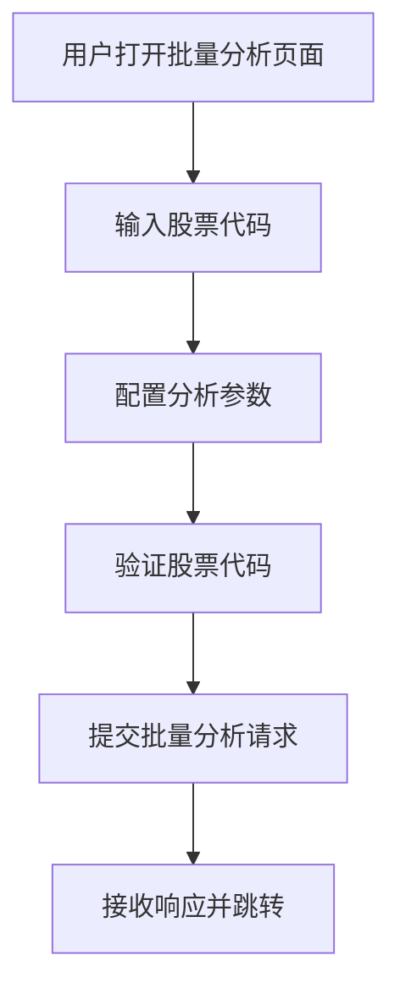
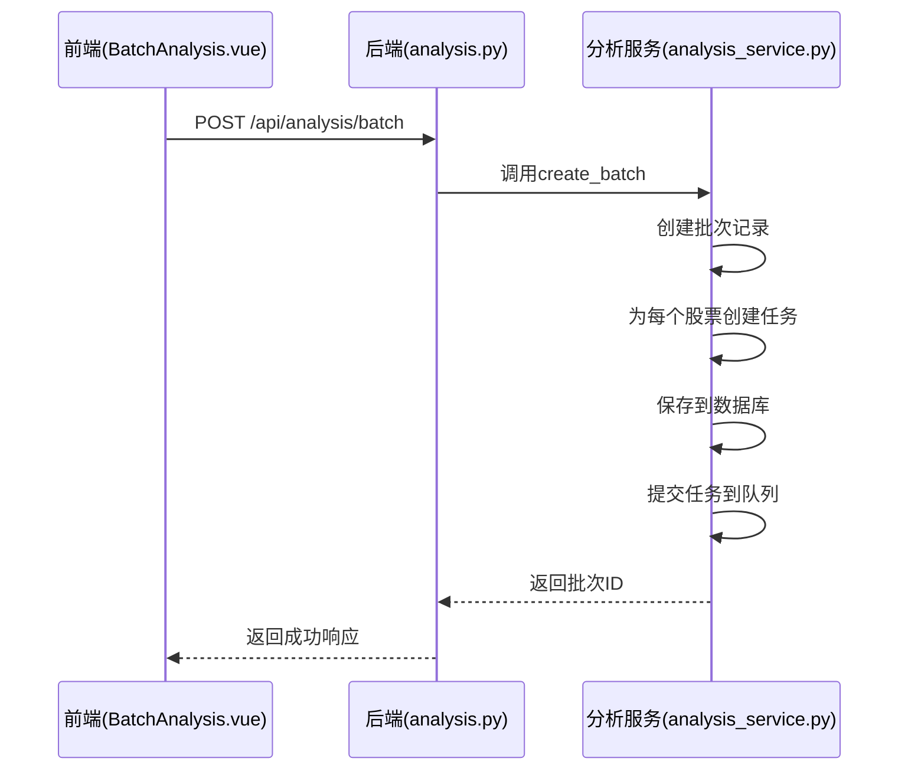
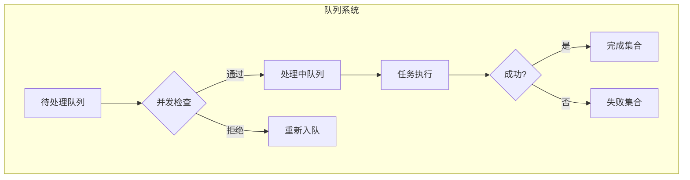
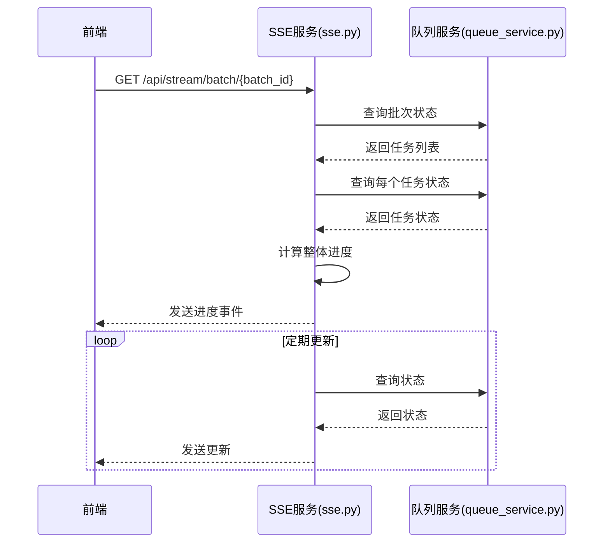

# 批量分析流程

<cite>
**本文档引用的文件**   
- [BatchAnalysis.vue](file://frontend/src/views/Analysis/BatchAnalysis.vue)
- [analysis.py](file://app/routers/analysis.py)
- [analysis_service.py](file://app/services/analysis_service.py)
- [queue_service.py](file://app/services/queue_service.py)
- [batch-analysis-limits.md](file://docs/api/batch-analysis-limits.md)
- [sse.py](file://app/routers/sse.py)
</cite>

## 目录
1. [批量分析流程概述](#批量分析流程概述)
2. [前端批量分析组件](#前端批量分析组件)
3. [后端批量任务处理](#后端批量任务处理)
4. [任务队列与资源管理](#任务队列与资源管理)
5. [进度跟踪与状态监控](#进度跟踪与状态监控)
6. [系统限制与节流机制](#系统限制与节流机制)
7. [最佳实践建议](#最佳实践建议)

## 批量分析流程概述

批量分析流程是系统中用于同时处理多个股票代码分析请求的核心功能。该流程通过前端组件收集用户输入的多个股票代码和分析参数，然后将这些请求提交到后端进行处理。后端系统将批量任务分解为独立的分析工作流，并通过任务队列管理系统进行调度和执行。

与单个分析相比，批量分析在架构上具有显著差异。单个分析是直接触发并立即执行的独立任务，而批量分析则引入了批次（batch）的概念，将多个相关任务组织在一起进行统一管理和监控。这种设计不仅提高了用户体验，还优化了系统资源的利用效率。

批量分析流程的关键优势在于：
- **效率提升**：用户可以一次性提交多个股票的分析请求，无需重复操作
- **资源优化**：通过并发控制和队列管理，合理分配系统资源
- **进度可视化**：提供整体批次进度和单个任务进度的实时跟踪
- **错误隔离**：单个任务的失败不会影响整个批次的执行

**Section sources**
- [batch-analysis-limits.md](file://docs/api/batch-analysis-limits.md#L1-L265)

## 前端批量分析组件

前端 `BatchAnalysis.vue` 组件是用户与批量分析功能交互的主要界面。该组件提供了直观的用户界面，用于收集多个股票代码并配置分析参数。

组件的主要功能包括：
- 股票代码输入区域，支持多种格式的股票代码输入
- 分析参数配置，包括分析深度、分析师选择等
- 高级配置选项，如AI模型选择、语言偏好等
- 批量分析提交和进度监控

**Diagram sources**
- [BatchAnalysis.vue](file://frontend/src/views/Analysis/BatchAnalysis.vue#L1-L925)

**Section sources**
- [BatchAnalysis.vue](file://frontend/src/views/Analysis/BatchAnalysis.vue#L1-L925)

## 后端批量任务处理

后端通过 `analysis.py` 路由和 `analysis_service.py` 服务处理批量分析请求。当接收到前端提交的批量分析请求时，系统会创建一个分析批次（batch），并将批量任务分解为独立的分析工作流。

处理流程如下：
1. 接收批量分析请求，包含股票代码列表和分析参数
2. 生成唯一的批次ID，创建批次记录
3. 为每个股票代码创建独立的分析任务
4. 将所有任务保存到数据库
5. 将任务提交到队列系统等待执行

**Diagram sources**
- [analysis.py](file://app/routers/analysis.py#L892-L928)
- [analysis_service.py](file://app/services/analysis_service.py#L520-L719)

**Section sources**
- [analysis.py](file://app/routers/analysis.py#L892-L928)
- [analysis_service.py](file://app/services/analysis_service.py#L520-L719)

## 任务队列与资源管理

系统使用 `queue_service.py` 实现任务队列管理，确保批量分析任务的有序执行和资源合理分配。队列服务采用Redis作为底层存储，实现了FIFO（先进先出）队列机制。

关键特性包括：
- **并发控制**：限制每个用户的并发任务数，防止资源过度占用
- **优先级管理**：支持用户级、批次级和任务级的优先级设置
- **超时处理**：通过可见性超时机制防止任务卡死
- **失败重试**：实现指数退避重试策略，提高任务成功率

**Diagram sources**
- [queue_service.py](file://app/services/queue_service.py#L1-L364)

**Section sources**
- [queue_service.py](file://app/services/queue_service.py#L1-L364)

## 进度跟踪与状态监控

系统通过SSE（Server-Sent Events）技术实现实时进度跟踪。`sse.py` 文件中的 `batch_progress_generator` 函数负责生成批次进度的实时更新事件。

进度跟踪机制的工作原理：
1. 前端建立SSE连接，订阅特定批次的进度更新
2. 服务端定期查询批次中所有任务的状态
3. 计算整体进度并发送更新事件
4. 前端接收事件并更新UI显示

**Diagram sources**
- [sse.py](file://app/routers/sse.py#L113-L221)

**Section sources**
- [sse.py](file://app/routers/sse.py#L113-L221)

## 系统限制与节流机制

根据 `batch-analysis-limits.md` 文档，系统对批量分析功能设置了多项限制，以保证系统稳定性和性能。

主要限制参数：
- **批量分析数量限制**：最多支持10个股票，最少需要1个股票
- **并发执行限制**：最多同时执行3个分析任务，超过的任务自动排队等待

节流和优先级调度机制：
- **线程池控制**：使用固定大小的线程池（默认3个工作线程）限制并发任务数
- **自动排队**：超出并发限制的任务会自动进入队列等待
- **资源隔离**：每个用户的任务独立管理，避免相互影响
- **动态配置**：系统设置允许根据服务器资源调整线程池大小和批量限制

这些限制确保了系统在高负载情况下仍能稳定运行，同时为用户提供可预测的性能表现。

**Section sources**
- [batch-analysis-limits.md](file://docs/api/batch-analysis-limits.md#L1-L265)

## 最佳实践建议

基于系统限制和性能特点，以下是使用批量分析功能的最佳实践建议：

### 批量大小建议
- **推荐批量大小**：3-5个股票，可以充分利用并发能力而不等待太久
- **避免提交过多任务**：虽然最多支持10个，但建议分批提交
- **根据分析级别调整**：
  - 快速分析（级别1-2）：可以提交8-10个
  - 标准分析（级别3）：建议5-7个
  - 深度分析（级别4-5）：建议3-5个

### 性能优化建议
- **预估时间**：总耗时 ≈ 单个任务耗时 × ceil(任务数 / 3)
- **分批提交**：对于大量股票分析，建议分成多个批次提交
- **监控队列状态**：在提交前检查用户队列状态，避免超出并发限制

### 错误处理建议
- **验证输入**：在提交前验证股票代码的正确性
- **处理失败**：关注任务中心的失败任务，及时重试或调整参数
- **避免取消**：一旦任务被创建，就会按顺序执行，不支持取消排队中的任务

这些建议有助于用户更高效地使用批量分析功能，同时减轻系统负载，确保分析任务的顺利完成。

**Section sources**
- [batch-analysis-limits.md](file://docs/api/batch-analysis-limits.md#L1-L265)