# 条件逻辑控制

<cite>
**本文档引用的文件**  
- [conditional_logic.py](file://tradingagents/graph/conditional_logic.py)
- [reflection.py](file://tradingagents/graph/reflection.py)
- [agent_states.py](file://tradingagents/agents/utils/agent_states.py)
- [trading_graph.py](file://tradingagents/graph/trading_graph.py)
- [setup.py](file://tradingagents/graph/setup.py)
- [default_config.py](file://tradingagents/default_config.py)
</cite>

## 目录
1. [引言](#引言)
2. [核心组件分析](#核心组件分析)
3. [动态路径选择机制](#动态路径选择机制)
4. [自省能力与运行时决策](#自省能力与运行时决策)
5. [状态机与条件逻辑协同](#状态机与条件逻辑协同)
6. [配置示例与分析策略](#配置示例与分析策略)
7. [性能优化措施](#性能优化措施)
8. [结论](#结论)

## 引言
本系统通过条件逻辑控制实现了智能、动态的分析流程管理。系统根据市场环境、用户配置和中间分析结果，动态决定后续的分析分支。通过`conditional_logic.py`中的动态路径选择机制、`reflection.py`提供的自省能力以及`agent_states.py`定义的状态机，系统能够实现复杂的决策流程和自我优化。这种设计使得分析过程既灵活又可控，能够适应不同的分析需求和市场条件。

## 核心组件分析

系统的核心条件逻辑控制由三个主要组件构成：`ConditionalLogic`类负责动态路径选择，`Reflector`类提供自省能力，`AgentState`类定义了状态机。这些组件协同工作，形成了一个完整的决策控制系统。

**Section sources**
- [conditional_logic.py](file://tradingagents/graph/conditional_logic.py#L10-L243)
- [reflection.py](file://tradingagents/graph/reflection.py#L11-L126)
- [agent_states.py](file://tradingagents/agents/utils/agent_states.py#L14-L87)

## 动态路径选择机制

### 条件路由实现
`ConditionalLogic`类实现了系统的动态路径选择机制。该机制通过一系列条件判断函数，根据当前状态决定工作流的下一步走向。每个分析师节点都有对应的条件判断函数，如`should_continue_market`、`should_continue_social`等。

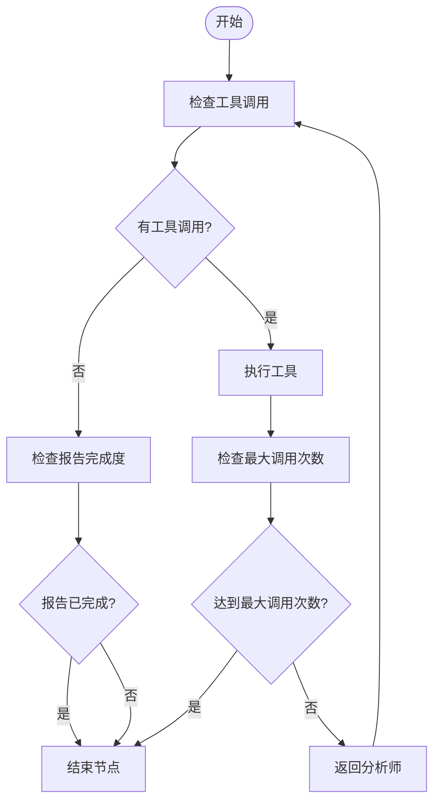

**Diagram sources**
- [conditional_logic.py](file://tradingagents/graph/conditional_logic.py#L18-L199)

### 死循环防护机制
系统实现了完善的死循环防护机制，通过工具调用计数器防止无限循环。每个分析师节点都有独立的调用计数器，当达到预设的最大调用次数时，系统会强制结束该节点的执行。

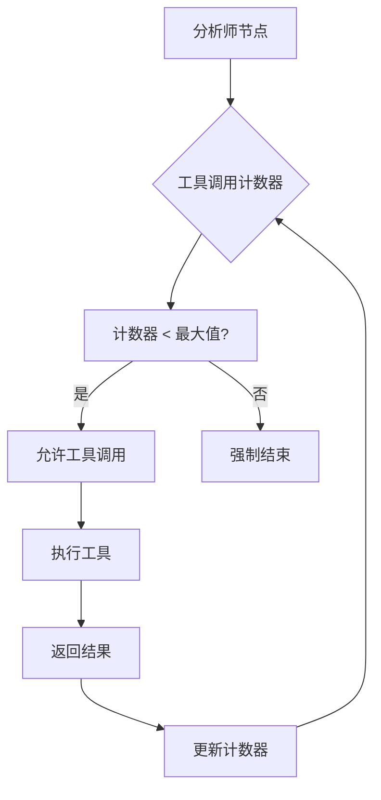

**Diagram sources**
- [conditional_logic.py](file://tradingagents/graph/conditional_logic.py#L26-L48)
- [agent_states.py](file://tradingagents/agents/utils/agent_states.py#L68-L72)

### 条件判断优先级
系统中的条件判断遵循明确的优先级顺序，确保决策的可靠性和可预测性。优先级从高到低依次为：任务完成状态、工具调用状态、消息状态。

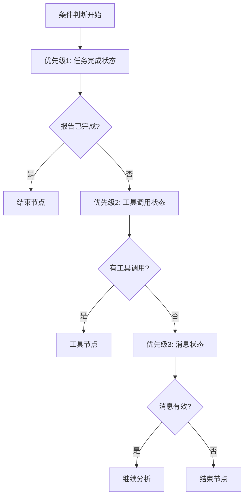

**Diagram sources**
- [conditional_logic.py](file://tradingagents/graph/conditional_logic.py#L182-L199)

**Section sources**
- [conditional_logic.py](file://tradingagents/graph/conditional_logic.py#L18-L199)
- [docs/fixes/analyst_infinite_loop_fix.md](file://docs/fixes/analyst_infinite_loop_fix.md#L399-L411)

## 自省能力与运行时决策

### 反思机制实现
`Reflector`类实现了系统的自省能力，能够在运行时对决策进行反思和优化。该机制通过LLM对历史决策进行分析，提取经验教训，并更新记忆系统。

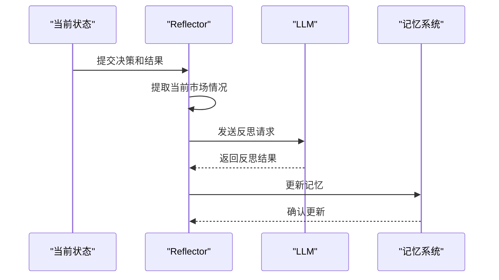

**Diagram sources**
- [reflection.py](file://tradingagents/graph/reflection.py#L11-L126)

### 反思流程
系统的反思流程包括四个主要步骤：提取当前情况、生成反思提示、调用LLM进行分析、更新记忆系统。这个流程确保了系统能够从每次决策中学习和改进。

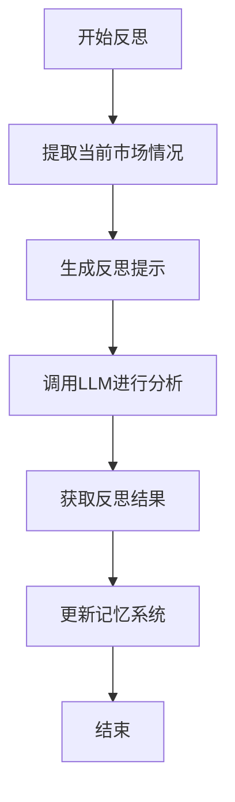

**Diagram sources**
- [reflection.py](file://tradingagents/graph/reflection.py#L53-L126)

### 记忆更新策略
系统采用基于情境的记忆更新策略，将市场情况和反思结果作为键值对存储在记忆系统中。这种策略使得系统能够在类似情境下快速检索相关经验。

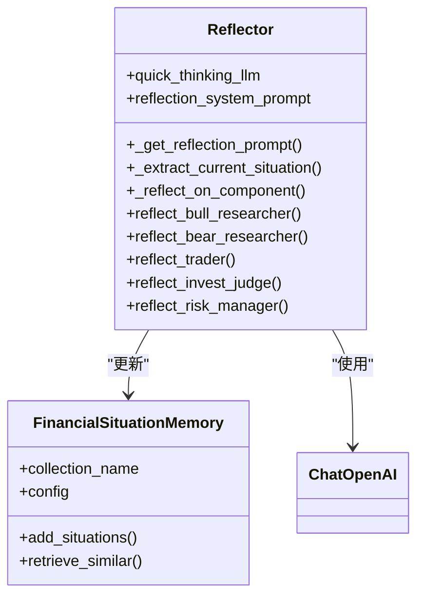

**Diagram sources**
- [reflection.py](file://tradingagents/graph/reflection.py#L11-L126)
- [agent_states.py](file://tradingagents/agents/utils/agent_states.py#L758-L772)

**Section sources**
- [reflection.py](file://tradingagents/graph/reflection.py#L11-L126)

## 状态机与条件逻辑协同

### 状态定义
`AgentState`类定义了系统的核心状态机，包含了所有必要的状态信息。状态机采用`TypedDict`类型注解，确保了类型安全和代码可读性。

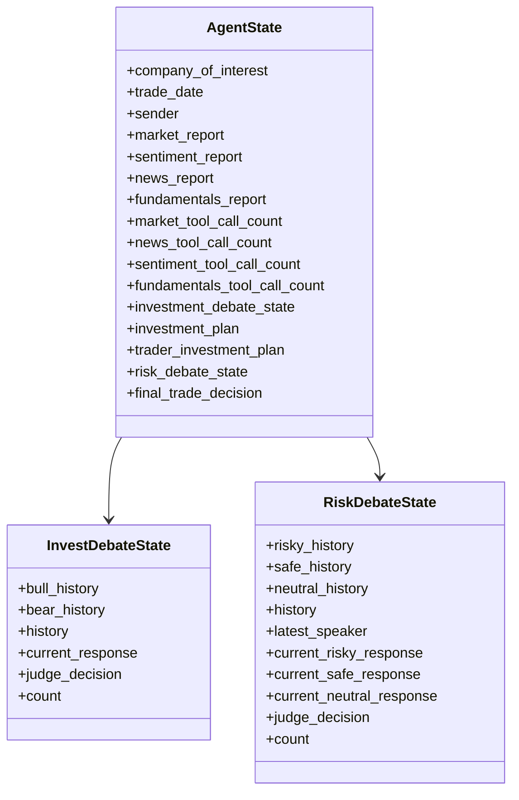

**Diagram sources**
- [agent_states.py](file://tradingagents/agents/utils/agent_states.py#L14-L87)

### 状态流转
系统通过`GraphSetup`类将条件逻辑与状态机协同工作，实现了复杂的状态流转。工作流图根据条件判断结果在不同节点间跳转，形成动态的分析路径。

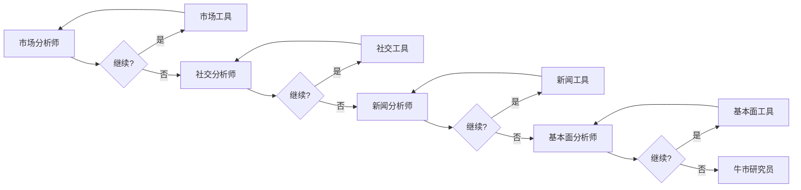

**Diagram sources**
- [setup.py](file://tradingagents/graph/setup.py#L180-L205)

### 辩论状态管理
系统实现了复杂的辩论状态管理机制，通过`should_continue_debate`函数控制研究员之间的辩论流程。辩论轮次由配置参数动态控制，实现了不同深度的分析策略。

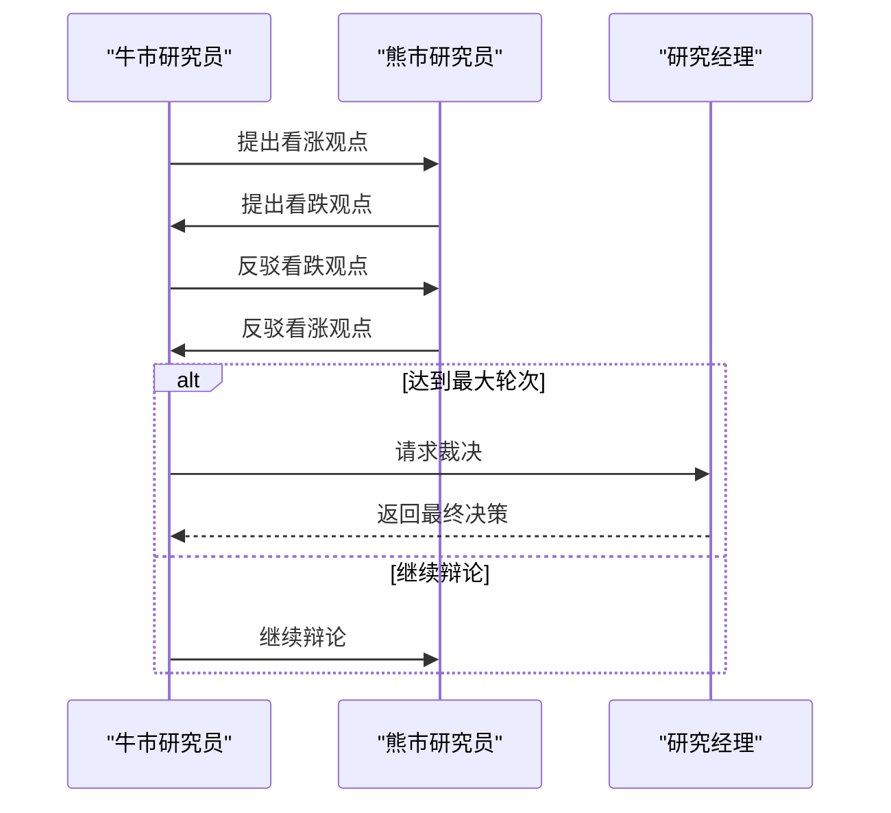

**Diagram sources**
- [conditional_logic.py](file://tradingagents/graph/conditional_logic.py#L201-L217)
- [setup.py](file://tradingagents/graph/setup.py#L207-L222)

**Section sources**
- [agent_states.py](file://tradingagents/agents/utils/agent_states.py#L14-L87)
- [conditional_logic.py](file://tradingagents/graph/conditional_logic.py#L201-L217)
- [setup.py](file://tradingagents/graph/setup.py#L180-L254)

## 配置示例与分析策略

### 配置参数
系统通过配置文件灵活控制分析策略，主要配置参数包括辩论轮次、风险讨论轮次和研究深度。这些参数直接影响分析的深度和复杂度。

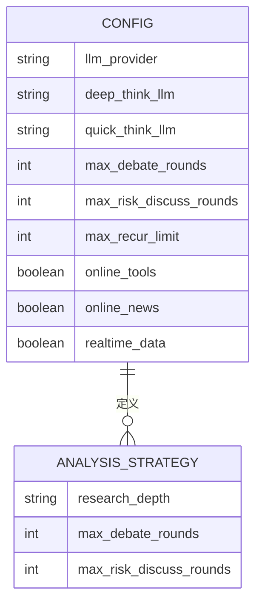

**Diagram sources**
- [default_config.py](file://tradingagents/default_config.py#L3-L27)

### 分析策略映射
不同的研究深度对应不同的配置参数，形成了从快速到全面的分析策略体系。这种设计使得用户可以根据需求选择合适的分析深度。

| 研究深度 | 辩论轮次 | 风险讨论轮次 | 适用场景 |
|---------|---------|------------|--------|
| 快速 | 1 | 1 | 实时监控 |
| 基础 | 1 | 1 | 日常分析 |
| 标准 | 1 | 2 | 中期投资 |
| 深度 | 2 | 2 | 长期投资 |
| 全面 | 3 | 3 | 重大决策 |

**Diagram sources**
- [test_conditional_logic_config.py](file://tests/test_conditional_logic_config.py#L89-L95)

### 配置传递机制
系统通过`TradingAgentsGraph`类将配置参数传递给`ConditionalLogic`实例，确保了配置的一致性和有效性。配置传递过程在图初始化时完成。

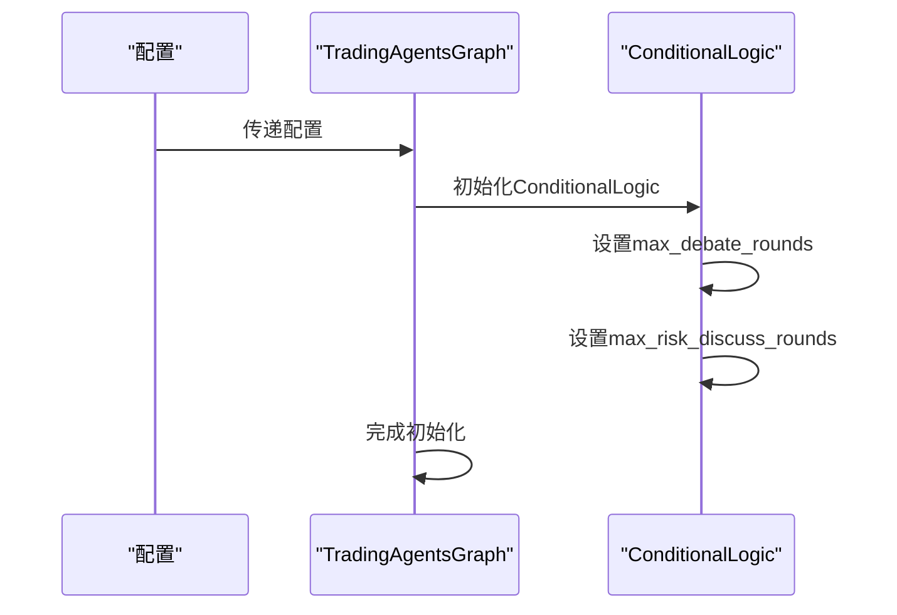

**Diagram sources**
- [trading_graph.py](file://tradingagents/graph/trading_graph.py#L779-L782)
- [test_conditional_logic_config.py](file://tests/test_conditional_logic_config.py#L28-L44)

**Section sources**
- [default_config.py](file://tradingagents/default_config.py#L3-L27)
- [test_conditional_logic_config.py](file://tests/test_conditional_logic_config.py#L1-L124)

## 性能优化措施

### 条件判断优化
系统对条件判断进行了多项优化，包括提前返回、状态缓存和日志级别控制。这些优化措施显著提高了条件判断的执行效率。

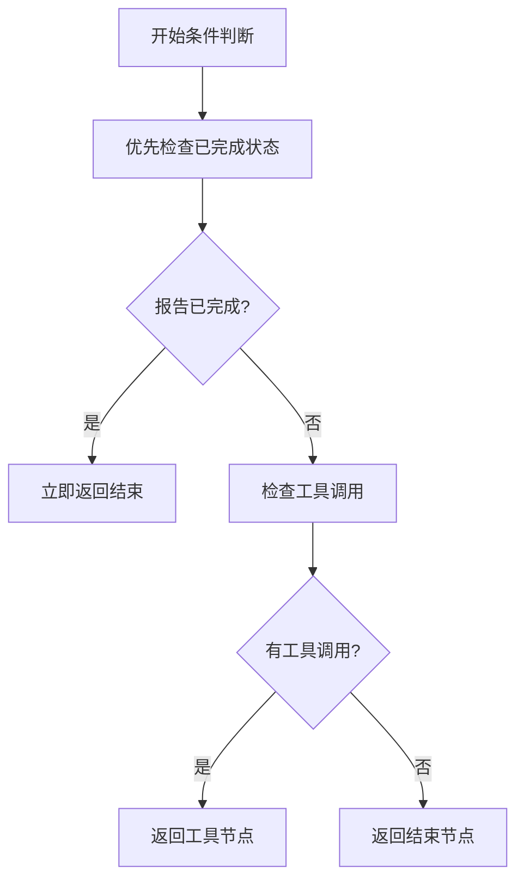

**Diagram sources**
- [conditional_logic.py](file://tradingagents/graph/conditional_logic.py#L50-L61)

### 配置缓存
系统实现了配置缓存机制，避免了重复的配置读取和解析操作。配置在初始化时加载到内存中，并在整个生命周期内重复使用。

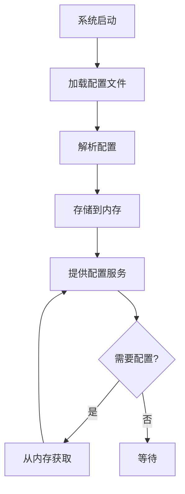

**Diagram sources**
- [trading_graph.py](file://tradingagents/graph/trading_graph.py#L210-L211)

### 日志优化
系统通过分级日志和条件日志减少了不必要的日志输出，提高了运行效率。关键决策点使用INFO级别，调试信息使用DEBUG级别。

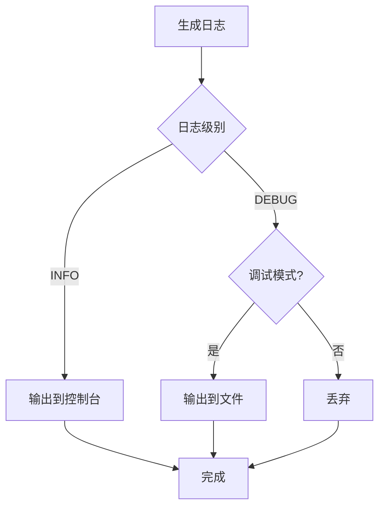

**Diagram sources**
- [conditional_logic.py](file://tradingagents/graph/conditional_logic.py#L33-L61)

**Section sources**
- [conditional_logic.py](file://tradingagents/graph/conditional_logic.py#L18-L199)

## 结论
本系统的条件逻辑控制机制通过`conditional_logic.py`、`reflection.py`和`agent_states.py`三个核心组件的协同工作，实现了智能、动态的分析流程管理。动态路径选择机制根据市场环境、用户配置和中间分析结果决定后续的分析分支，自省能力支持运行时决策调整，状态机与条件逻辑协同工作确保了系统的稳定性和可靠性。通过合理的配置示例和性能优化措施，系统能够适应不同的分析需求，提供高效、准确的决策支持。