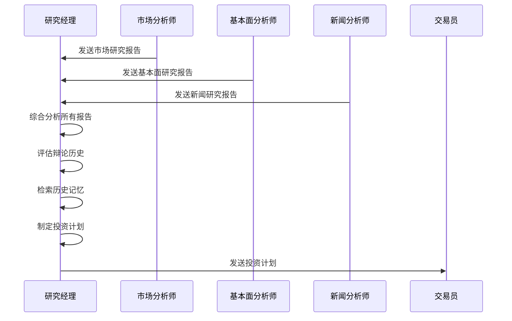
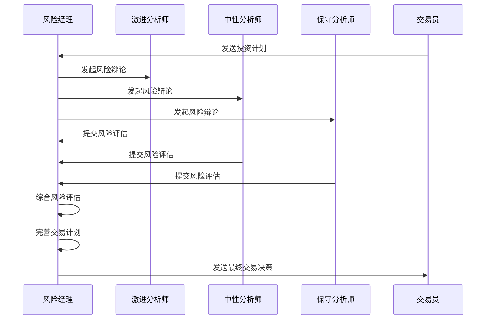
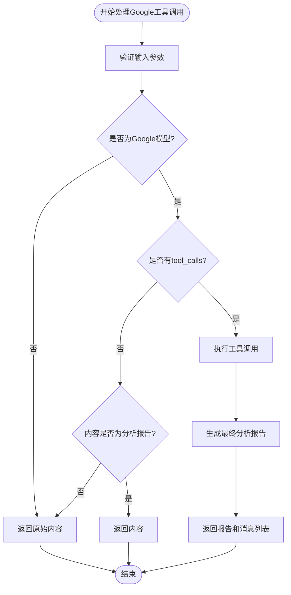
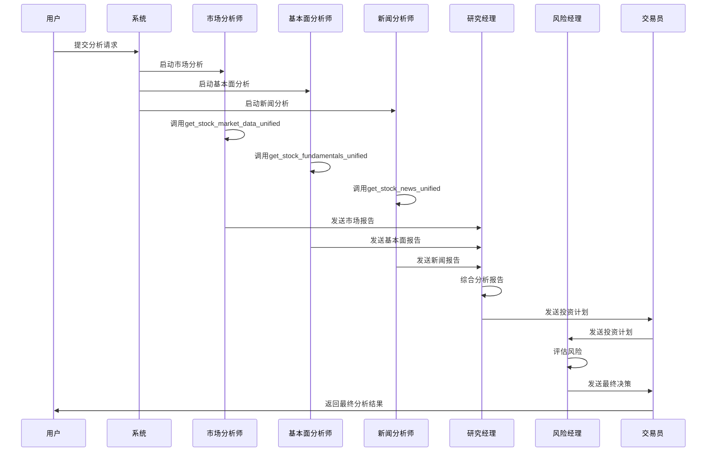

# 多智能体分析

<cite>
**本文档引用的文件**   
- [tradingagents/agents/analysts/market_analyst.py](file://tradingagents/agents/analysts/market_analyst.py)
- [tradingagents/agents/analysts/fundamentals_analyst.py](file://tradingagents/agents/analysts/fundamentals_analyst.py)
- [tradingagents/agents/analysts/news_analyst.py](file://tradingagents/agents/analysts/news_analyst.py)
- [tradingagents/agents/managers/research_manager.py](file://tradingagents/agents/managers/research_manager.py)
- [tradingagents/agents/managers/risk_manager.py](file://tradingagents/agents/managers/risk_manager.py)
- [tradingagents/agents/utils/google_tool_handler.py](file://tradingagents/agents/utils/google_tool_handler.py)
- [tradingagents/agents/utils/chromadb_config.py](file://tradingagents/agents/utils/chromadb_config.py)
- [tradingagents/agents/utils/memory.py](file://tradingagents/agents/utils/memory.py)
- [tradingagents/agents/utils/agent_states.py](file://tradingagents/agents/utils/agent_states.py)
- [tradingagents/tools/unified_news_tool.py](file://tradingagents/tools/unified_news_tool.py)
- [tradingagents/default_config.py](file://tradingagents/default_config.py)
</cite>

## 目录
1. [引言](#引言)
2. [核心智能体职责分工](#核心智能体职责分工)
3. [管理智能体协作机制](#管理智能体协作机制)
4. [智能体通信协议与数据交换格式](#智能体通信协议与数据交换格式)
5. [智能体状态管理](#智能体状态管理)
6. [智能体工具调用机制](#智能体工具调用机制)
7. [扩展新智能体类型](#扩展新智能体类型)
8. [分析流程时序图](#分析流程时序图)

## 引言
本文档详细描述了多智能体分析系统的架构与实现，重点阐述了市场分析师、基本面分析师、新闻分析师等智能体的职责分工与协作机制。文档解释了研究经理如何协调各分析师的工作流程，以及风险经理如何进行风险评估。同时，文档详细说明了智能体之间的通信协议、数据交换格式、状态管理实现、工具调用机制，并为开发者提供了扩展新智能体类型的指导。

## 核心智能体职责分工

### 市场分析师
市场分析师负责对股票进行技术分析，评估其价格趋势和市场表现。该智能体通过调用`get_stock_market_data_unified`工具获取股票的市场数据，包括历史价格、交易量、技术指标（如MA、MACD、RSI、布林带）等。分析完成后，市场分析师会生成一份包含股票基本信息、技术指标分析、价格趋势分析和投资建议的报告。

**Section sources**
- [tradingagents/agents/analysts/market_analyst.py](file://tradingagents/agents/analysts/market_analyst.py#L95-L508)

### 基本面分析师
基本面分析师负责对公司进行基本面分析，评估其财务状况和估值水平。该智能体通过调用`get_stock_fundamentals_unified`工具获取公司的财务数据，包括市盈率(PE)、市净率(PB)、净资产收益率(ROE)、盈利能力、行业地位等。分析完成后，基本面分析师会生成一份包含公司基本信息、财务数据分析、估值分析、合理价位区间和投资建议的报告。

**Section sources**
- [tradingagents/agents/analysts/fundamentals_analyst.py](file://tradingagents/agents/analysts/fundamentals_analyst.py#L98-L689)

### 新闻分析师
新闻分析师负责分析与股票相关的最新新闻和事件，评估其对股价的潜在影响。该智能体通过调用`get_stock_news_unified`工具获取最新的财经新闻，重点关注财报发布、重大合作、政策变化、突发事件等。分析完成后，新闻分析师会生成一份包含新闻事件总结、影响分析、市场情绪评估和投资建议的报告。

**Section sources**
- [tradingagents/agents/analysts/news_analyst.py](file://tradingagents/agents/analysts/news_analyst.py#L19-L410)

## 管理智能体协作机制

### 研究经理
研究经理作为投资组合经理和辩论主持人，负责协调市场分析师、基本面分析师和新闻分析师的工作。研究经理接收各分析师的报告，批判性地评估这些报告，并做出明确的投资决策（买入、卖出或持有）。研究经理还会为交易员制定详细的投资计划，包括投资建议、理由、战略行动和目标价格分析。



**Diagram sources**
- [tradingagents/agents/managers/research_manager.py](file://tradingagents/agents/managers/research_manager.py#L9-L109)

**Section sources**
- [tradingagents/agents/managers/research_manager.py](file://tradingagents/agents/managers/research_manager.py#L9-L109)

### 风险经理
风险经理作为风险管理委员会主席，负责评估交易的风险并做出最终的交易决策。风险经理接收研究经理的投资计划，并与三位风险分析师（激进、中性、保守）进行辩论。基于辩论结果，风险经理会完善交易员的计划，并做出最终的交易决策（买入、卖出或持有）。



**Diagram sources**
- [tradingagents/agents/managers/risk_manager.py](file://tradingagents/agents/managers/risk_manager.py#L9-L164)

**Section sources**
- [tradingagents/agents/managers/risk_manager.py](file://tradingagents/agents/managers/risk_manager.py#L9-L164)

## 智能体通信协议与数据交换格式
智能体之间通过一个共享的状态对象（State Object）进行通信。该状态对象是一个包含多个字段的字典，每个智能体都可以读取和更新其中的字段。状态对象的结构在`agent_states.py`文件中定义，主要字段包括：
- `company_of_interest`: 感兴趣的公司股票代码
- `trade_date`: 交易日期
- `market_report`: 市场分析师的报告
- `sentiment_report`: 情绪分析师的报告
- `news_report`: 新闻分析师的报告
- `fundamentals_report`: 基本面分析师的报告
- `investment_plan`: 研究经理制定的投资计划
- `final_trade_decision`: 风险经理的最终交易决策

智能体通过读取状态对象中的相关字段来获取其他智能体的输出，并将自己的输出写入状态对象的相应字段中，从而实现信息的交换和流程的推进。

**Section sources**
- [tradingagents/agents/utils/agent_states.py](file://tradingagents/agents/utils/agent_states.py#L14-L87)

## 智能体状态管理
系统使用ChromaDB作为向量数据库来管理智能体的历史记忆。`FinancialSituationMemory`类负责处理记忆的存储和检索。当智能体做出决策时，其决策和理由会被存储到ChromaDB中。当智能体面临类似情况时，它会从ChromaDB中检索过去的相关记忆，以避免重复犯错。

ChromaDB的配置是自动适配的，系统会根据操作系统（Windows 10/11 或其他）选择最优的配置。对于Windows 10，系统使用兼容性配置；对于Windows 11，系统使用优化配置；对于其他操作系统，系统使用标准配置。

```mermaid
classDiagram
class FinancialSituationMemory {
+config : dict
+llm_provider : str
+client : object
+embedding : str
+situation_collection : Collection
+add_situations(situations_and_advice) void
+get_memories(current_situation, n_matches) list
+get_embedding(text) list
}
class ChromaDBManager {
-_instance : ChromaDBManager
-_lock : threading.Lock
-_collections : dict
-_client : Client
+get_or_create_collection(name) Collection
}
FinancialSituationMemory --> ChromaDBManager : "使用"
FinancialSituationMemory --> "ChromaDB Client" : "存储/检索"
```

**Diagram sources**
- [tradingagents/agents/utils/memory.py](file://tradingagents/agents/utils/memory.py#L99-L702)
- [tradingagents/agents/utils/chromadb_config.py](file://tradingagents/agents/utils/chromadb_config.py#L1-L132)

**Section sources**
- [tradingagents/agents/utils/memory.py](file://tradingagents/agents/utils/memory.py#L99-L702)
- [tradingagents/agents/utils/chromadb_config.py](file://tradingagents/agents/utils/chromadb_config.py#L1-L132)

## 智能体工具调用机制
智能体通过调用外部工具来获取数据。系统提供了一个统一的工具调用处理器`GoogleToolCallHandler`，用于处理Google模型的工具调用问题。该处理器解决了Google模型在工具调用时`result.content`为空的问题。

### 谷歌工具处理器实现
`GoogleToolCallHandler`类提供了一个`handle_google_tool_calls`方法，该方法的处理流程如下：
1.  **验证输入**：检查输入参数是否有效。
2.  **执行工具调用**：遍历`result.tool_calls`，找到对应的工具并执行。
3.  **生成最终报告**：将工具执行结果（`ToolMessage`）与原始的AI消息（`AIMessage`）和分析提示组合成一个新的消息序列，并调用LLM生成最终的分析报告。



**Diagram sources**
- [tradingagents/agents/utils/google_tool_handler.py](file://tradingagents/agents/utils/google_tool_handler.py#L17-L751)

**Section sources**
- [tradingagents/agents/utils/google_tool_handler.py](file://tradingagents/agents/utils/google_tool_handler.py#L17-L751)

## 扩展新智能体类型
开发者可以通过创建新的智能体节点函数来扩展系统。一个智能体节点函数接收`state`和`llm`作为参数，并返回一个更新后的状态字典。新智能体应遵循以下接口定义：
1.  **函数签名**：`def my_analyst_node(state, llm) -> dict:`
2.  **状态读取**：从`state`中读取所需的信息，如`company_of_interest`、`trade_date`等。
3.  **工具调用**：通过`llm.bind_tools(tools)`绑定工具，并调用`chain.invoke()`来触发工具调用。
4.  **结果处理**：处理工具调用的结果，并生成分析报告。
5.  **状态更新**：将分析报告写入`state`中的相应字段，并返回更新后的状态。

**Section sources**
- [tradingagents/agents/analysts/market_analyst.py](file://tradingagents/agents/analysts/market_analyst.py#L95-L508)
- [tradingagents/agents/analysts/fundamentals_analyst.py](file://tradingagents/agents/analysts/fundamentals_analyst.py#L98-L689)
- [tradingagents/agents/analysts/news_analyst.py](file://tradingagents/agents/analysts/news_analyst.py#L19-L410)

## 分析流程时序图
下图展示了多智能体分析系统的完整工作流程。



**Diagram sources**
- [tradingagents/agents/analysts/market_analyst.py](file://tradingagents/agents/analysts/market_analyst.py#L95-L508)
- [tradingagents/agents/analysts/fundamentals_analyst.py](file://tradingagents/agents/analysts/fundamentals_analyst.py#L98-L689)
- [tradingagents/agents/analysts/news_analyst.py](file://tradingagents/agents/analysts/news_analyst.py#L19-L410)
- [tradingagents/agents/managers/research_manager.py](file://tradingagents/agents/managers/research_manager.py#L9-L109)
- [tradingagents/agents/managers/risk_manager.py](file://tradingagents/agents/managers/risk_manager.py#L9-L164)