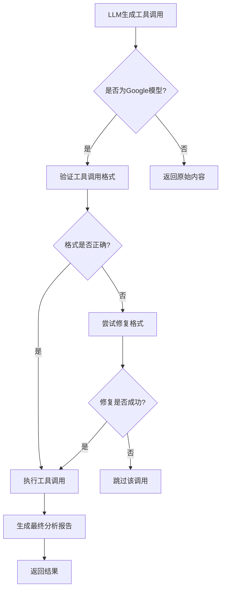
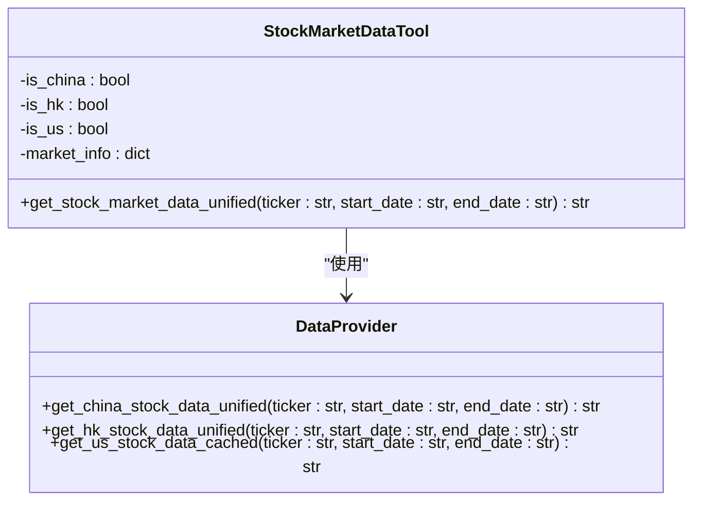
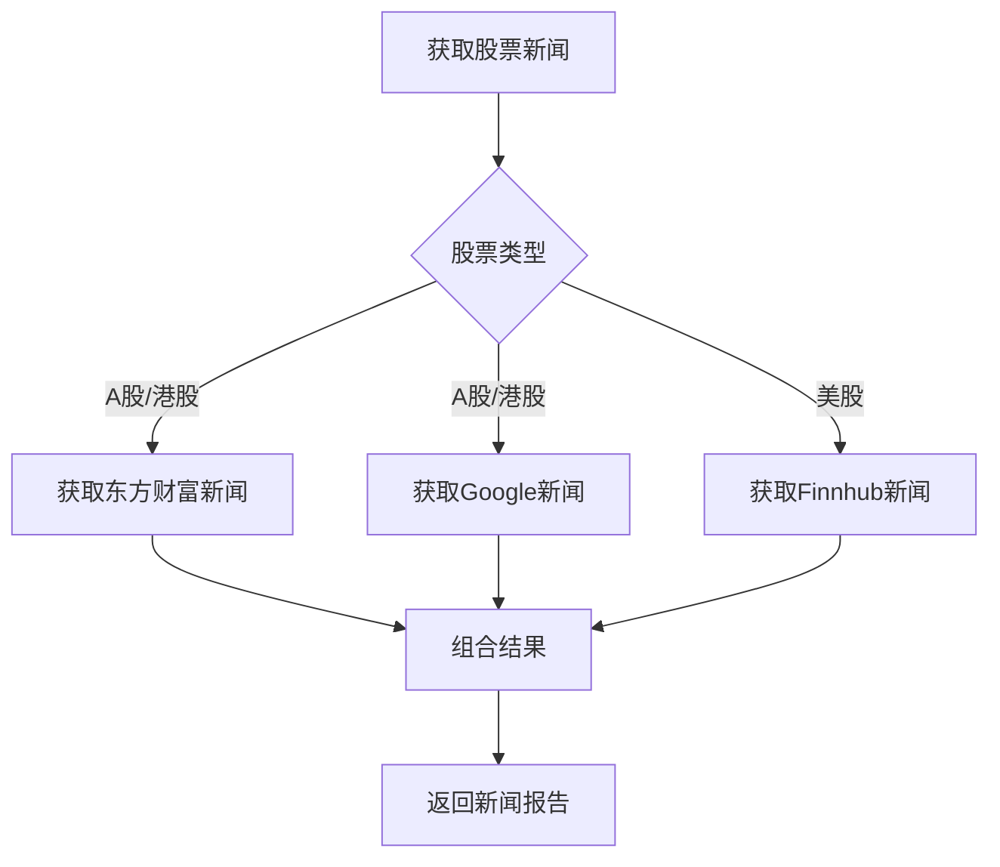
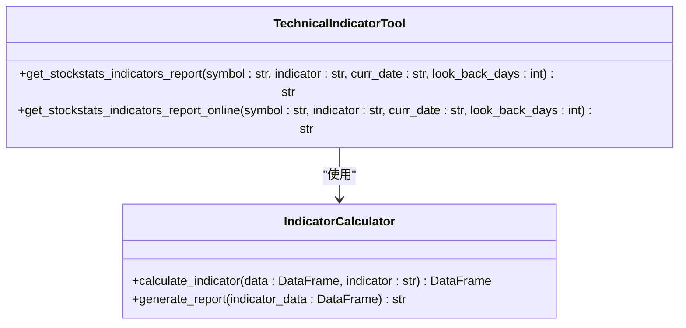
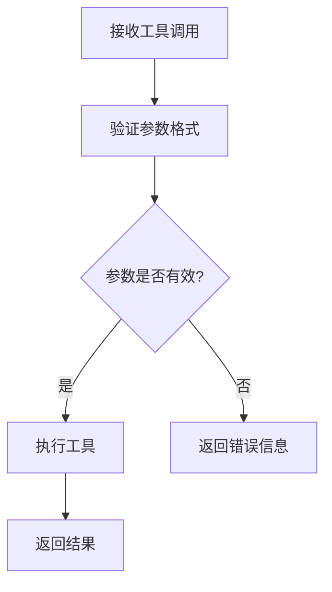
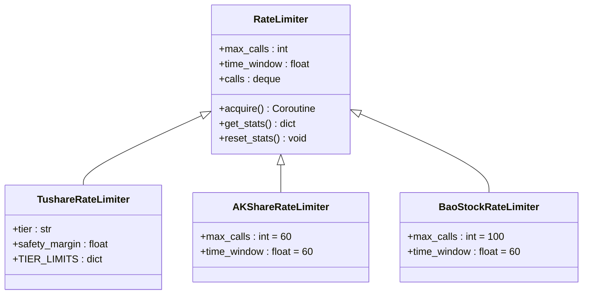
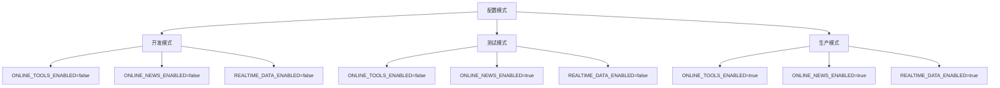

# 工具集成与外部API

<cite>
**本文档引用的文件**   
- [google_tool_handler.py](file://tradingagents/agents/utils/google_tool_handler.py)
- [agent_utils.py](file://tradingagents/agents/utils/agent_utils.py)
- [rate_limiter.py](file://app/core/rate_limiter.py)
- [interface.py](file://tradingagents/dataflows/interface.py)
- [default_config.py](file://tradingagents/default_config.py)
- [online-tools-config.md](file://docs/configuration/online-tools-config.md)
</cite>

## 目录
1. [引言](#引言)
2. [工具调用处理机制](#工具调用处理机制)
3. [内置工具实现](#内置工具实现)
4. [工具注册与调用协议](#工具注册与调用协议)
5. [安全考虑与速率限制](#安全考虑与速率限制)
6. [配置管理](#配置管理)
7. [总结](#总结)

## 引言
本系统通过智能体架构实现了对实时市场数据、财经新闻和技术分析结果的自动化获取。核心机制是利用LLM（大语言模型）的工具调用能力，将自然语言请求转换为具体的API调用。系统设计了统一的工具接口，能够自动识别股票类型（A股、港股、美股）并调用相应的数据源，确保了跨市场分析的一致性和准确性。

## 工具调用处理机制

系统实现了专门的Google模型工具调用处理器，用于处理LLM生成的工具调用请求。该处理器负责验证、修复和执行工具调用，并生成最终的分析报告。



**Diagram sources**
- [google_tool_handler.py](file://tradingagents/agents/utils/google_tool_handler.py#L25-L354)

**Section sources**
- [google_tool_handler.py](file://tradingagents/agents/utils/google_tool_handler.py#L1-L751)

## 内置工具实现

系统提供了多种内置工具，用于获取不同类型的金融数据。这些工具通过统一的接口进行管理，确保了调用的一致性和可维护性。

### 统一市场数据工具
`get_stock_market_data_unified` 是一个核心工具，能够根据股票代码自动识别市场类型并获取相应的市场数据。



**Diagram sources**
- [agent_utils.py](file://tradingagents/agents/utils/agent_utils.py#L1041-L1151)

### 新闻获取工具
系统提供了多种新闻获取工具，支持从不同来源获取财经新闻。



**Diagram sources**
- [agent_utils.py](file://tradingagents/agents/utils/agent_utils.py#L1153-L1285)

### 技术指标工具
系统集成了多种技术指标计算工具，支持对股票数据进行深度分析。



**Diagram sources**
- [agent_utils.py](file://tradingagents/agents/utils/agent_utils.py#L281-L337)

## 工具注册与调用协议

系统通过工具包（Toolkit）机制管理所有可用工具。每个工具都通过装饰器进行注册，并在运行时根据需要进行调用。

### 工具注册
工具通过 `@tool` 装饰器进行注册，系统会自动将其添加到可用工具列表中。

```python
@staticmethod
@tool
def get_stock_market_data_unified(
    ticker: Annotated[str, "股票代码（支持A股、港股、美股）"],
    start_date: Annotated[str, "开始日期，格式：YYYY-MM-DD"],
    end_date: Annotated[str, "结束日期，格式：YYYY-MM-DD"]
) -> str:
    """
    统一的股票市场数据工具
    自动识别股票类型（A股、港股、美股）并调用相应的数据源
    """
```

### 参数验证
系统对工具调用的参数进行严格验证，确保输入的正确性。



**Section sources**
- [agent_utils.py](file://tradingagents/agents/utils/agent_utils.py#L59-L1380)

## 安全考虑与速率限制

系统实施了多层次的安全措施和速率限制策略，以保护数据源和系统稳定性。

### 速率限制器
系统实现了基于滑动窗口算法的速率限制器，用于控制API调用频率。



**Diagram sources**
- [rate_limiter.py](file://app/core/rate_limiter.py#L14-L229)

### 全局限制器
系统使用单例模式管理全局限制器，确保整个应用的速率限制一致性。

```python
# 全局速率限制器实例
_tushare_limiter: Optional[TushareRateLimiter] = None
_akshare_limiter: Optional[AKShareRateLimiter] = None
_baostock_limiter: Optional[BaoStockRateLimiter] = None

def get_tushare_rate_limiter(tier: str = "standard", safety_margin: float = 0.8) -> TushareRateLimiter:
    """获取Tushare速率限制器（单例）"""
    global _tushare_limiter
    if _tushare_limiter is None:
        _tushare_limiter = TushareRateLimiter(tier=tier, safety_margin=safety_margin)
    return _tushare_limiter
```

**Section sources**
- [rate_limiter.py](file://app/core/rate_limiter.py#L191-L229)

## 配置管理

系统通过环境变量和配置文件灵活管理在线工具的启用状态。

### 配置字段
系统支持以下主要配置字段：

| 环境变量 | 默认值 | 说明 |
|---------|--------|------|
| `ONLINE_TOOLS_ENABLED` | `false` | 在线工具总开关 |
| `ONLINE_NEWS_ENABLED` | `true` | 在线新闻工具开关 |
| `REALTIME_DATA_ENABLED` | `false` | 实时数据获取开关 |

### 配置模式
系统支持多种配置模式，以适应不同的使用场景。



**Section sources**
- [default_config.py](file://tradingagents/default_config.py#L1-L28)
- [online-tools-config.md](file://docs/configuration/online-tools-config.md#L1-L229)

## 总结
本系统通过精心设计的工具集成架构，实现了对多种金融数据源的统一访问。核心优势包括：
- **统一接口**：通过统一的工具接口，简化了跨市场数据获取的复杂性。
- **智能路由**：自动识别股票类型并选择最优数据源。
- **弹性设计**：支持多种配置模式，适应开发、测试和生产环境的不同需求。
- **安全可靠**：实施了严格的速率限制和错误处理机制，确保系统稳定运行。

这些特性共同构成了一个强大而灵活的金融数据分析平台，能够为投资决策提供及时、准确的数据支持。