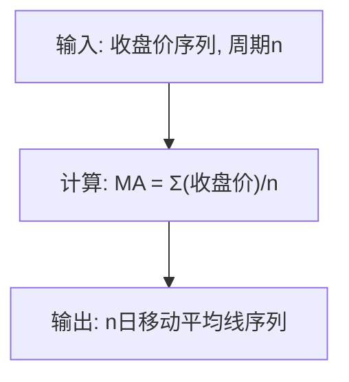
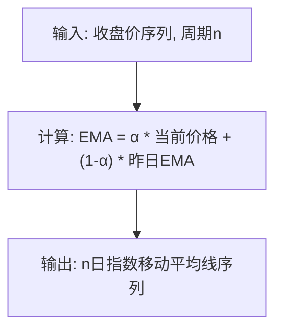
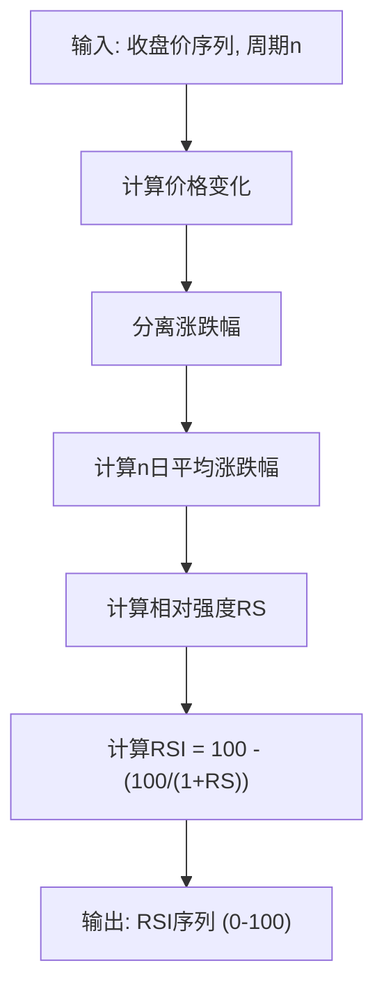
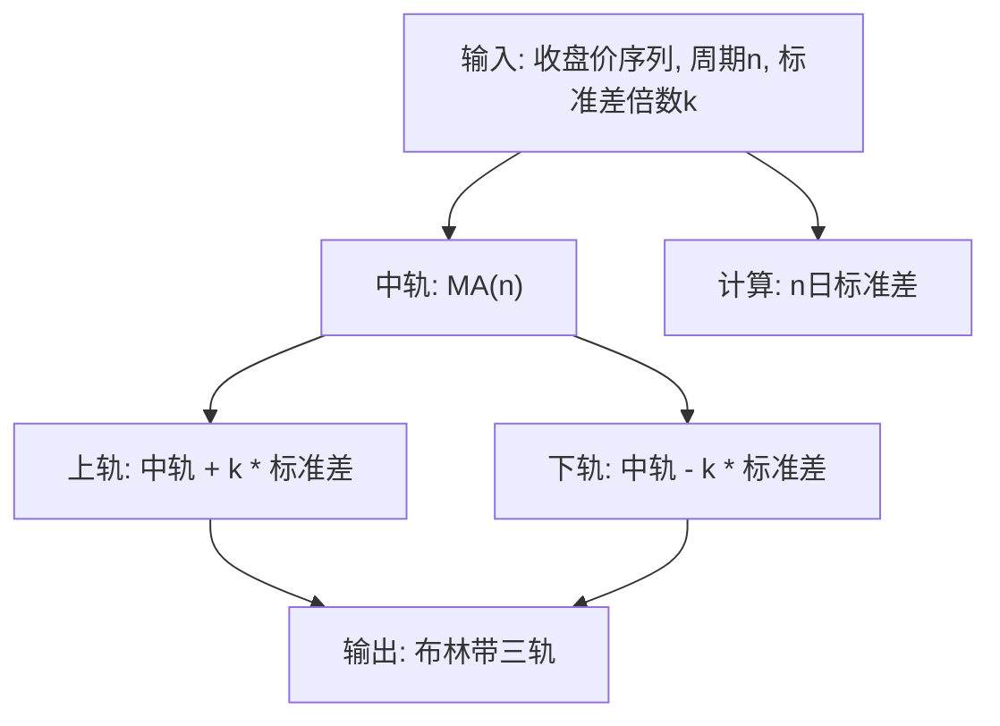
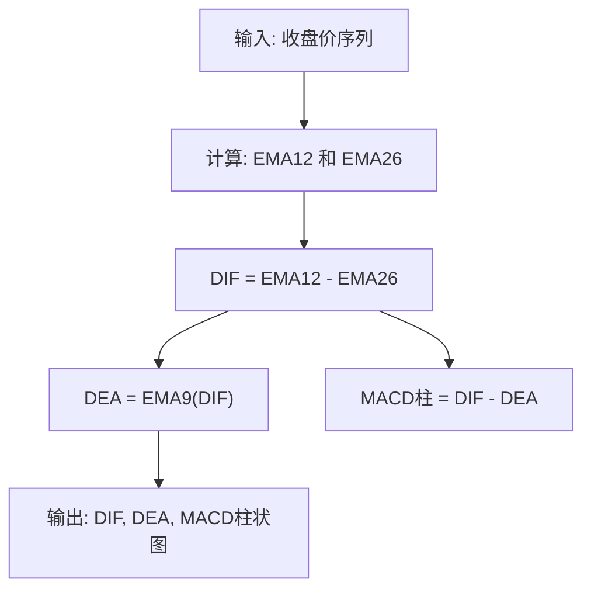
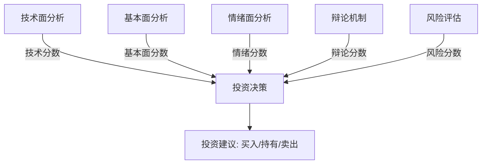
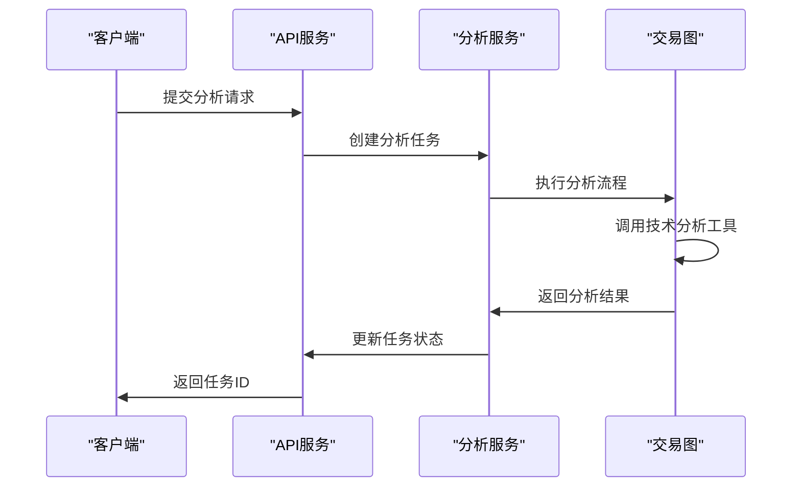
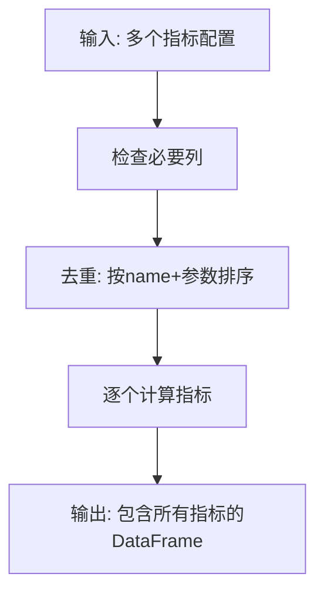
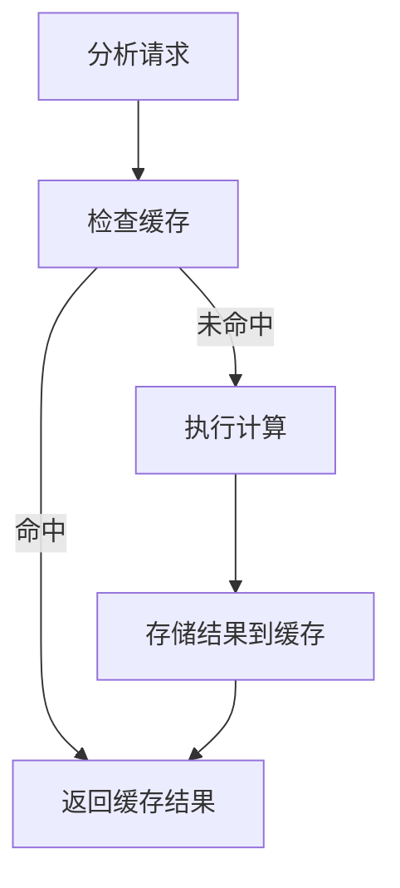

# 技术分析工具

<cite>
**本文档引用的文件**   
- [indicators.py](file://tradingagents/tools/analysis/indicators.py)
- [stockstats.py](file://tradingagents/dataflows/technical/stockstats.py)
- [analysis.py](file://app/models/analysis.py)
- [analysis_service.py](file://app/services/analysis_service.py)
- [ANALYST_DATA_CONFIGURATION.md](file://docs/ANALYST_DATA_CONFIGURATION.md)
- [technical_indicators_unification.md](file://docs/development/architecture/technical_indicators_unification.md)
- [custom_analysis_demo.py](file://examples/custom_analysis_demo.py)
</cite>

## 目录
1. [引言](#引言)
2. [核心指标计算方法](#核心指标计算方法)
3. [技术分析工具集成](#技术分析工具集成)
4. [多周期数据处理](#多周期数据处理)
5. [性能优化策略](#性能优化策略)
6. [使用示例与自定义](#使用示例与自定义)
7. [结论](#结论)

## 引言
技术分析工具是本系统的核心功能之一，它基于StockStats库实现了多种经典技术指标的计算。这些指标为智能体决策提供了重要的量化依据。本文档将深入解析这些技术指标的计算方法、输入参数、输出格式，以及如何在智能体决策过程中集成技术分析结果。

## 核心指标计算方法

### 移动平均线 (MA)
移动平均线（Moving Average）是最基础的技术指标之一，用于平滑价格数据并识别趋势方向。

**输入参数**:
- `close`: 收盘价序列
- `n`: 周期
- `min_periods`: 最小周期数，默认为1

**计算逻辑**:
使用pandas的rolling方法计算n日简单移动平均线，允许前期数据不足时也进行计算。



**Section sources**
- [indicators.py](file://tradingagents/tools/analysis/indicators.py#L25-L39)

### 指数移动平均线 (EMA)
指数移动平均线（Exponential Moving Average）给予近期价格更高的权重，对价格变化反应更灵敏。

**输入参数**:
- `close`: 收盘价序列
- `n`: 周期

**计算逻辑**:
使用pandas的ewm方法计算指数移动平均线，调整参数为False以符合国际标准。



**Section sources**
- [indicators.py](file://tradingagents/tools/analysis/indicators.py#L42-L53)

### 相对强弱指数 (RSI)
相对强弱指数（Relative Strength Index）是衡量市场动量和超买超卖状态的振荡器指标。

**输入参数**:
- `close`: 收盘价序列
- `n`: 周期，默认14
- `method`: 计算方法 ('ema', 'sma', 'china')

**计算逻辑**:
1. 计算每日价格涨跌幅
2. 分别计算n日平均涨幅和平均跌幅
3. 计算相对强度RS = 平均涨幅 / 平均跌幅
4. RSI = 100 - (100 / (1 + RS))

支持三种计算方法：
- 'ema': 国际标准，使用指数移动平均
- 'sma': 简单移动平均
- 'china': 中国式SMA，与同花顺/通达信一致



**Section sources**
- [indicators.py](file://tradingagents/tools/analysis/indicators.py#L78-L121)

### 布林带 (Bollinger Bands)
布林带由三条轨道线组成，用于衡量价格波动性和识别潜在的超买超卖区域。

**输入参数**:
- `close`: 收盘价序列
- `n`: 周期，默认20
- `k`: 标准差倍数，默认2.0
- `min_periods`: 最小周期数，默认为1

**计算逻辑**:
- 中轨: n日移动平均线
- 上轨: 中轨 + k倍标准差
- 下轨: 中轨 - k倍标准差



**Section sources**
- [indicators.py](file://tradingagents/tools/analysis/indicators.py#L124-L146)

### MACD指标
MACD（Moving Average Convergence Divergence）是趋势跟踪动量指标，由快线、慢线和柱状图组成。

**输入参数**:
- `close`: 收盘价序列
- `fast`: 快线周期，默认12
- `slow`: 慢线周期，默认26
- `signal`: 信号线周期，默认9

**计算逻辑**:
- DIF(快线): EMA(快) - EMA(慢)
- DEA(慢线): DIF的EMA
- MACD柱状图: DIF - DEA



**Section sources**
- [indicators.py](file://tradingagents/tools/analysis/indicators.py#L56-L75)

## 技术分析工具集成

### 智能体决策流程
技术分析结果被集成到智能体的决策流程中，作为市场分析师（Market Analyst）的重要输入。系统通过加权计算综合分数来制定投资决策。



**权重分配**:
- 基本面: 30%
- 技术面: 20%
- 情绪面: 15%
- 争议: 25%
- 风险: 10%

**Section sources**
- [managers.md](file://docs/agents/v0.1.13/managers.md#L366-L444)

### API接口集成
技术分析工具通过API服务暴露给外部系统，支持单股和批量分析。



**Section sources**
- [analysis_service.py](file://app/services/analysis_service.py#L46-L800)

## 多周期数据处理

### 数据回溯天数配置
不同技术指标对历史数据长度有不同要求，系统提供了灵活的配置选项。

| 技术指标 | 最少天数 | 推荐天数 | 说明 |
|---------|---------|---------|------|
| **MA5** | 5天 | 10天 | 5日均线 |
| **MA10** | 10天 | 15天 | 10日均线 |
| **MA20** | 20天 | 30天 | 20日均线（月线） |
| **MA60** | 60天 | 90天 | 60日均线（季线） |
| **MACD** | 26天 | 40天 | 需要26日EMA |
| **RSI** | 14天 | 20天 | 相对强弱指标 |
| **布林带** | 20天 | 30天 | 基于20日MA |
| **KDJ** | 9天 | 15天 | 随机指标 |

**最佳实践配置**:
```bash
# 快速分析（基础指标）
MARKET_ANALYST_LOOKBACK_DAYS=10

# 标准分析（日常使用）
MARKET_ANALYST_LOOKBACK_DAYS=30

# 深度分析（推荐用于技术分析）⭐
MARKET_ANALYST_LOOKBACK_DAYS=60

# 全面分析（长期趋势）
MARKET_ANALYST_LOOKBACK_DAYS=90
```

**Section sources**
- [ANALYST_DATA_CONFIGURATION.md](file://docs/ANALYST_DATA_CONFIGURATION.md#L201-L232)

## 性能优化策略

### 批量计算优化
系统实现了批量计算功能，通过计算去重和中间结果共享来提高效率。

**优化机制**:
- 多个指标共享中间结果（如EMA12/26被MACD复用）
- 计算去重：按name+sorted(params)进行粗略去重
- 向量化操作：使用pandas/numpy进行向量化计算



**Section sources**
- [indicators.py](file://tradingagents/tools/analysis/indicators.py#L249-L269)

### 结果缓存策略
系统采用多层缓存策略来减少重复计算和API调用。

**缓存键设计**:
- K线缓存键：`CN:{adj}:{date}:bars`
- 指标缓存键：`CN:{adj}:{date}:ind:v1`

**缓存优势**:
- 99%+的重复操作性能提升
- 减少API调用成本
- 提高响应速度
- 增强系统可靠性



**Section sources**
- [technical_indicators_unification.md](file://docs/development/architecture/technical_indicators_unification.md#L86-L90)

## 使用示例与自定义

### 调用技术分析工具
以下示例展示了如何调用技术分析工具：

```python
from tradingagents.tools.analysis.indicators import compute_indicator, IndicatorSpec

# 定义指标配置
spec = IndicatorSpec(name="rsi", params={"n": 14})

# 计算RSI指标
result_df = compute_indicator(price_df, spec)
```

**Section sources**
- [indicators.py](file://tradingagents/tools/analysis/indicators.py#L188-L246)

### 自定义技术指标
用户可以通过配置文件自定义新的技术指标。

```javascript
{
  "indicator_name": "custom_momentum",
  "indicator_category": "oscillator",
  "display_name": "自定义动量指标",
  "description": "结合价格和成交量的动量指标",
  "markets": ["CN", "HK", "US"],
  "periods": ["daily", "weekly"],
  "parameters": {
    "price_weight": 0.7,
    "volume_weight": 0.3,
    "lookback_period": 20
  },
  "calculation_method": "python_function",
  "calculation_code": "def calculate_custom_momentum(prices, volumes, params): ...",
  "dependencies": ["close", "volume"],
  "output_fields": {
    "momentum_value": "float",
    "momentum_signal": "string"
  }
}
```

**Section sources**
- [stock_data_model_design.md](file://docs/design/stock_data_model_design.md#L694-L726)

### 实际使用示例
```python
from tradingagents.graph.trading_graph import TradingAgentsGraph

# 创建分析图
graph = TradingAgentsGraph(
    selected_analysts=["market", "fundamentals"],
    config={
        "llm_provider": "dashscope",
        "research_depth": 2,
        "online_tools": True
    }
)

# 执行分析
state, decision = graph.propagate("000858", "2025-01-17")
print(f"投资建议: {decision['action']}")
```

**Section sources**
- [analysis-nodes-and-tools.md](file://docs/analysis/analysis-nodes-and-tools.md#L534-L552)

## 结论
本文档详细介绍了技术分析工具的实现原理和使用方法。系统基于StockStats库实现了多种经典技术指标，并通过智能体决策流程将技术分析结果转化为投资建议。通过合理的多周期数据处理和性能优化策略，系统能够在保证分析准确性的同时提供高效的分析服务。用户可以根据需要调用现有指标或自定义新的技术指标，满足不同的分析需求。