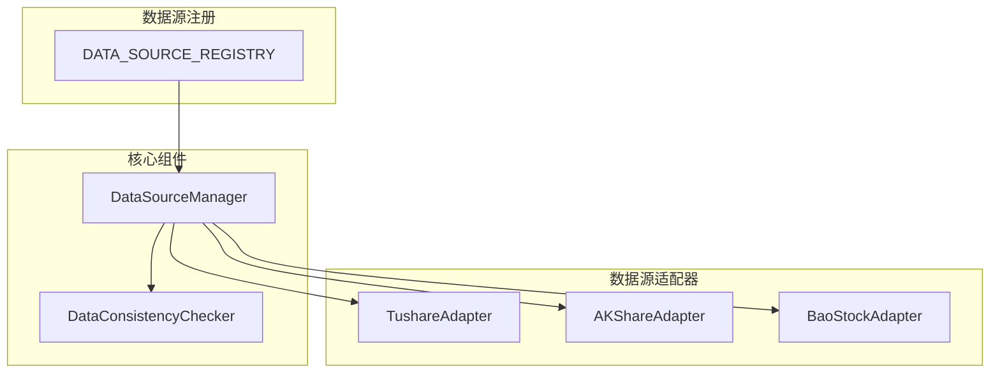
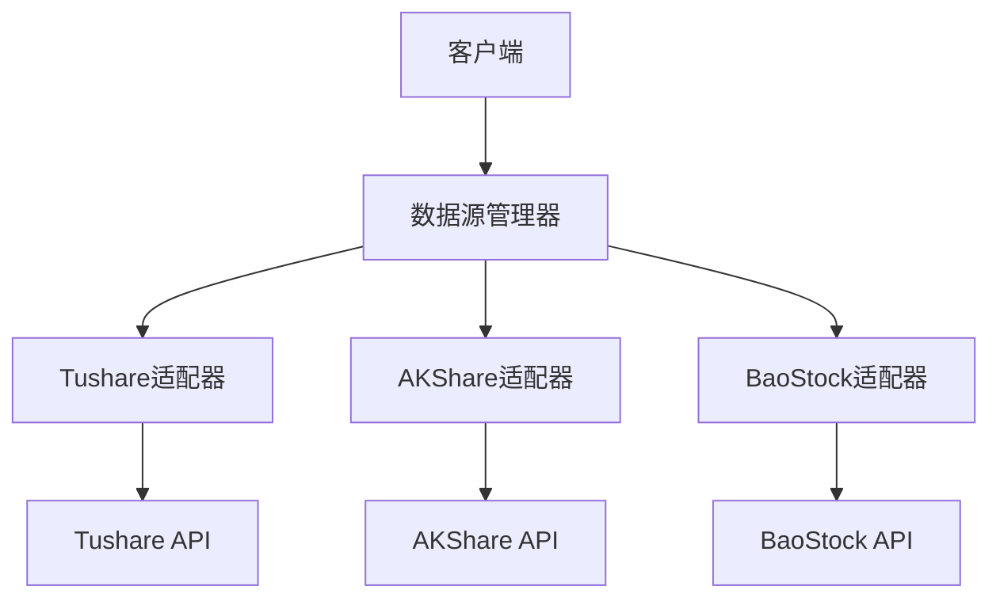
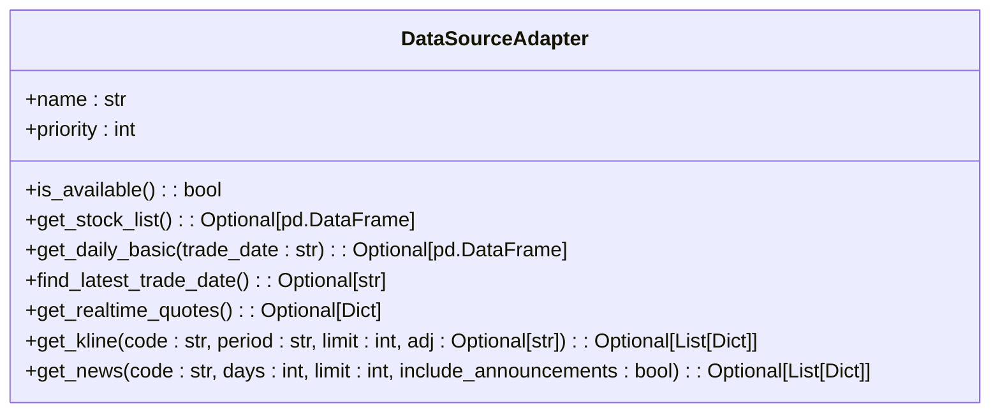
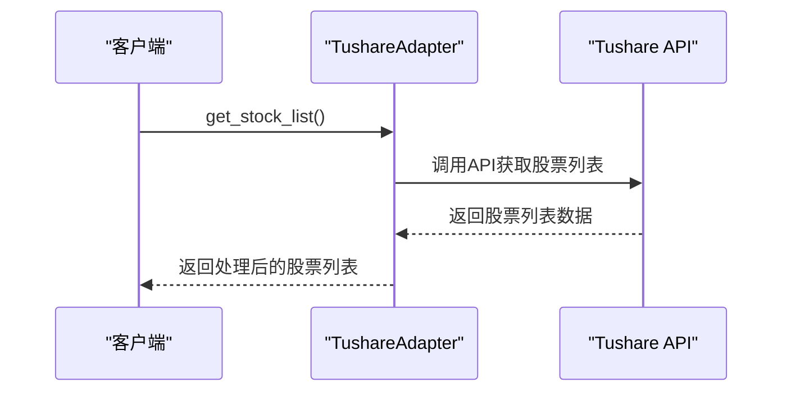
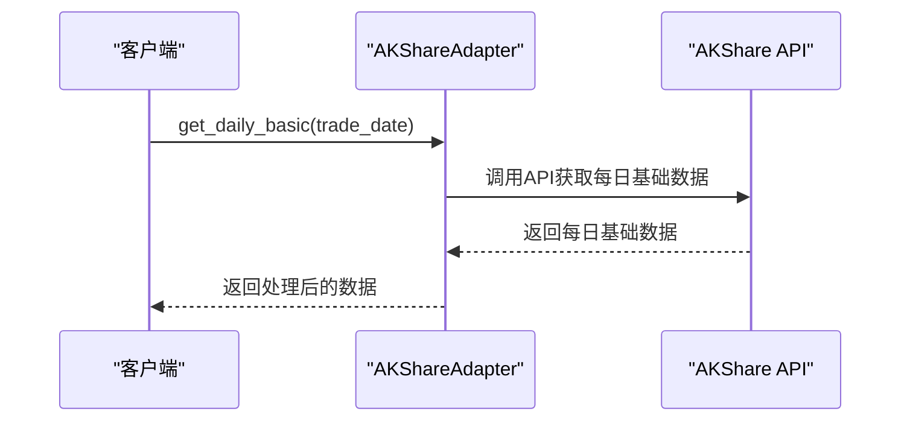
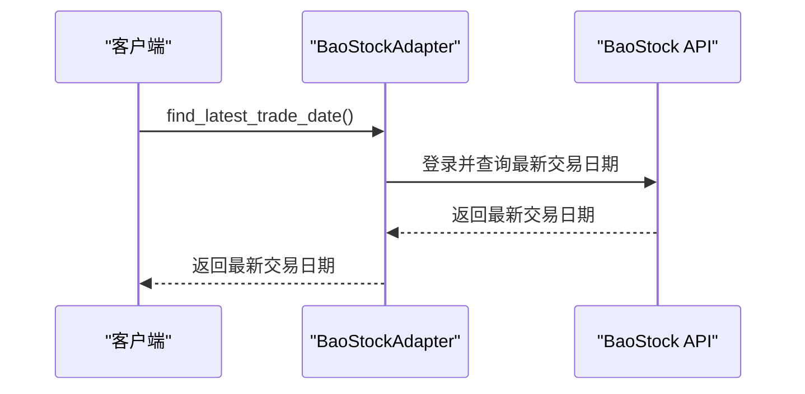
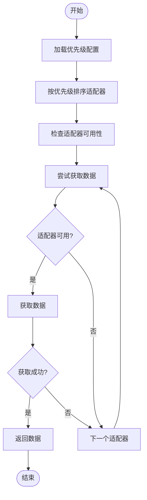
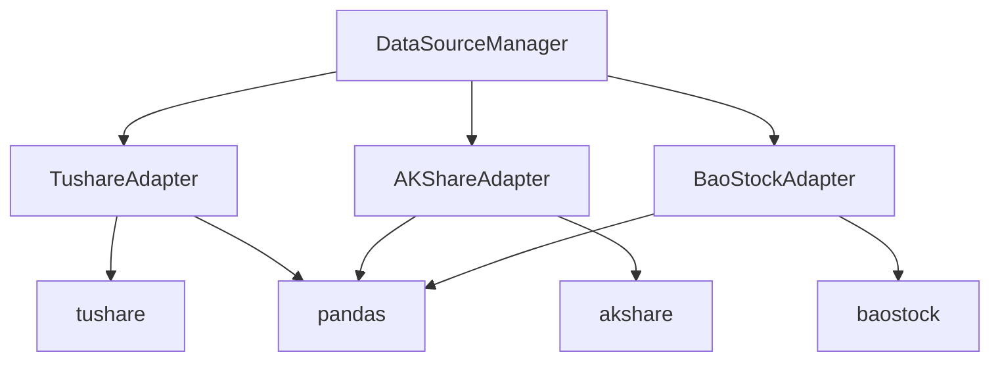

# 数据获取工具

<cite>
**本文档引用文件**   
- [data_sources.py](file://app/services/data_sources/base.py)
- [manager.py](file://app/services/data_sources/manager.py)
- [tushare_adapter.py](file://app/services/data_sources/tushare_adapter.py)
- [akshare_adapter.py](file://app/services/data_sources/akshare_adapter.py)
- [baostock_adapter.py](file://app/services/data_sources/baostock_adapter.py)
- [data_consistency_checker.py](file://app/services/data_sources/data_consistency_checker.py)
- [data_sources.py](file://tradingagents/constants/data_sources.py)
</cite>

## 目录
1. [引言](#引言)
2. [项目结构](#项目结构)
3. [核心组件](#核心组件)
4. [架构概述](#架构概述)
5. [详细组件分析](#详细组件分析)
6. [依赖分析](#依赖分析)
7. [性能考虑](#性能考虑)
8. [故障排除指南](#故障排除指南)
9. [结论](#结论)

## 引言
本文档详细描述了数据获取工具的设计与实现，重点介绍如何通过统一的数据源管理器集成Tushare、AkShare、YFinance等第三方数据提供商。文档涵盖了数据获取工具的抽象基类设计、具体实现和调用流程，解释了数据标准化过程，包括字段映射、数据清洗和异常处理机制。同时提供了各数据源的配置参数、认证方式和API调用限制，以及数据缓存策略和失效机制，还有在数据源不可用时的降级处理方案。

## 项目结构
数据获取工具主要位于`app/services/data_sources/`目录下，包含适配器基类、具体适配器实现和数据源管理器。`tradingagents/constants/data_sources.py`文件定义了所有支持的数据源及其元信息。数据源管理器负责协调多个适配器，基于优先级排序，并提供fallback获取能力。

**图源**
- [base.py](file://app/services/data_sources/base.py)
- [manager.py](file://app/services/data_sources/manager.py)
- [data_sources.py](file://tradingagents/constants/data_sources.py)

## 核心组件
数据获取工具的核心组件包括数据源适配器基类、具体适配器实现和数据源管理器。适配器基类定义了所有数据源适配器必须实现的接口，具体适配器实现了与特定数据源的交互逻辑，数据源管理器负责协调多个适配器，提供统一的数据获取接口。

**节源**
- [base.py](file://app/services/data_sources/base.py)
- [manager.py](file://app/services/data_sources/manager.py)

## 架构概述
数据获取工具采用分层架构设计，上层是数据源管理器，负责协调多个适配器；中层是具体的数据源适配器，实现与特定数据源的交互；底层是第三方数据提供商的API。这种设计使得系统具有良好的扩展性和灵活性，可以轻松添加新的数据源。

**图源**
- [manager.py](file://app/services/data_sources/manager.py)
- [tushare_adapter.py](file://app/services/data_sources/tushare_adapter.py)
- [akshare_adapter.py](file://app/services/data_sources/akshare_adapter.py)
- [baostock_adapter.py](file://app/services/data_sources/baostock_adapter.py)

## 详细组件分析
### 数据源适配器基类分析
数据源适配器基类定义了所有数据源适配器必须实现的接口，包括获取股票列表、获取每日基础财务数据、查找最新交易日期等。

**图源**
- [base.py](file://app/services/data_sources/base.py)

### Tushare适配器分析
Tushare适配器实现了与Tushare数据源的交互，包括获取股票列表、获取每日基础财务数据、获取实时行情等。

**图源**
- [tushare_adapter.py](file://app/services/data_sources/tushare_adapter.py)

### AKShare适配器分析
AKShare适配器实现了与AKShare数据源的交互，包括获取股票列表、获取每日基础财务数据、获取实时行情等。

**图源**
- [akshare_adapter.py](file://app/services/data_sources/akshare_adapter.py)

### BaoStock适配器分析
BaoStock适配器实现了与BaoStock数据源的交互，包括获取股票列表、获取每日基础财务数据等。

**图源**
- [baostock_adapter.py](file://app/services/data_sources/baostock_adapter.py)

### 数据源管理器分析
数据源管理器负责协调多个适配器，基于优先级排序，并提供fallback获取能力。

**图源**
- [manager.py](file://app/services/data_sources/manager.py)

## 依赖分析
数据获取工具依赖于多个第三方库，包括pandas用于数据处理，akshare、baostock和tushare用于访问不同的数据源。数据源管理器依赖于所有具体的数据源适配器，而每个适配器又依赖于相应的第三方库。

**图源**
- [manager.py](file://app/services/data_sources/manager.py)
- [tushare_adapter.py](file://app/services/data_sources/tushare_adapter.py)
- [akshare_adapter.py](file://app/services/data_sources/akshare_adapter.py)
- [baostock_adapter.py](file://app/services/data_sources/baostock_adapter.py)

## 性能考虑
数据获取工具在设计时考虑了性能因素，通过优先级排序和fallback机制，确保在主数据源不可用时能够快速切换到备用数据源。此外，数据源管理器会缓存适配器的可用性状态，避免频繁的健康检查。

## 故障排除指南
当数据获取出现问题时，首先检查数据源的可用性，然后查看日志文件中的错误信息。如果某个数据源频繁失败，可以考虑调整其优先级或暂时禁用。

**节源**
- [manager.py](file://app/services/data_sources/manager.py)
- [tushare_adapter.py](file://app/services/data_sources/tushare_adapter.py)
- [akshare_adapter.py](file://app/services/data_sources/akshare_adapter.py)
- [baostock_adapter.py](file://app/services/data_sources/baostock_adapter.py)

## 结论
数据获取工具通过统一的数据源管理器集成了多个第三方数据提供商，提供了灵活、可靠的数据获取能力。通过抽象基类设计和具体的适配器实现，系统具有良好的扩展性，可以轻松添加新的数据源。数据标准化过程确保了从不同数据源获取的数据具有一致的格式，便于后续处理和分析。