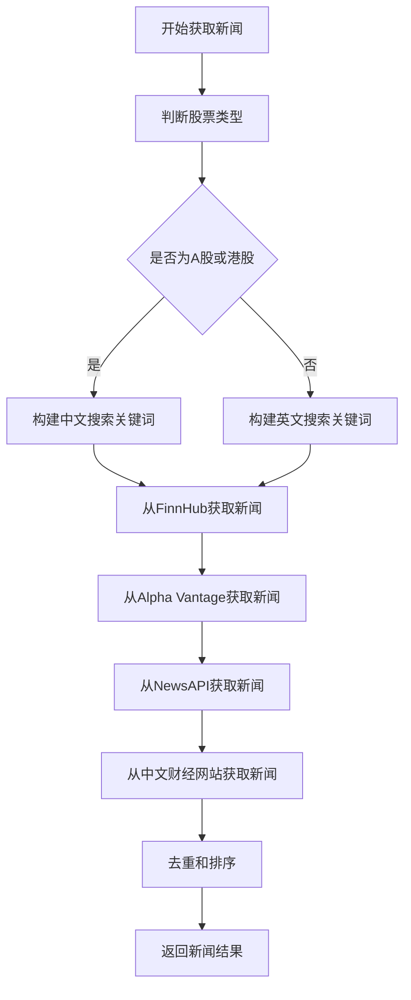
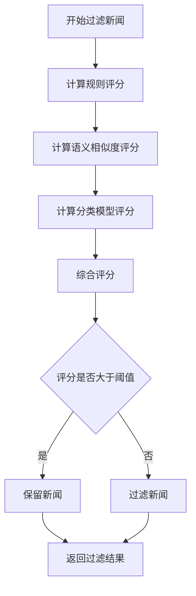
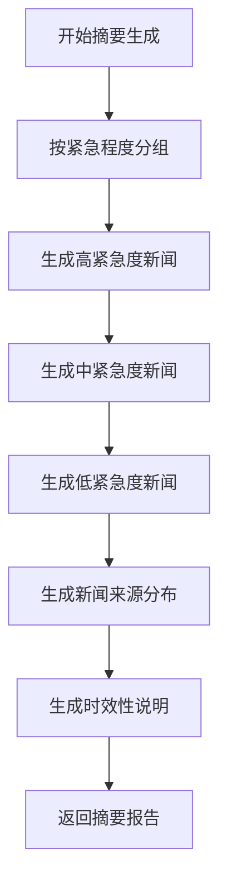
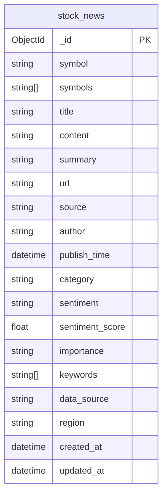
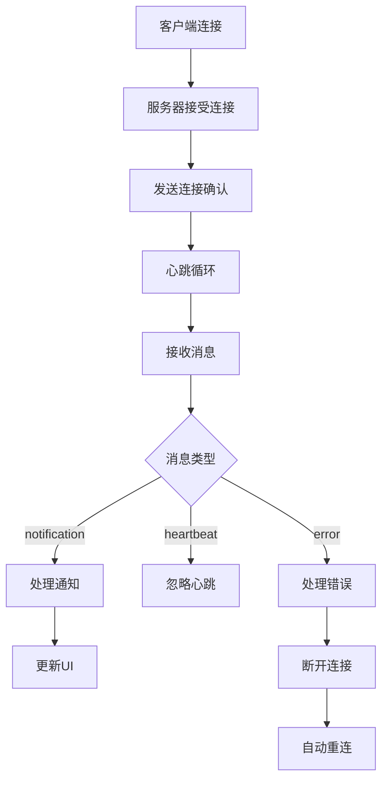

# 新闻集成工具

<cite>
**本文档引用的文件**  
- [realtime_news.py](file://tradingagents/dataflows/news/realtime_news.py)
- [__init__.py](file://tradingagents/dataflows/news/__init__.py)
- [google_news.py](file://tradingagents/dataflows/news/google_news.py)
- [chinese_finance.py](file://tradingagents/dataflows/news/chinese_finance.py)
- [news_data_service.py](file://app/services/news_data_service.py)
- [news_data.py](file://app/routers/news_data.py)
- [news_filter.py](file://tradingagents/utils/news_filter.py)
- [enhanced_news_filter.py](file://tradingagents/utils/enhanced_news_filter.py)
- [news_data_sync_service.py](file://app/worker/news_data_sync_service.py)
- [websocket_notifications.py](file://app/routers/websocket_notifications.py)
- [notifications_service.py](file://app/services/notifications_service.py)
- [README.md](file://docs/guides/news_data_system/README.md)
</cite>

## 目录
1. [引言](#引言)
2. [新闻获取流程](#新闻获取流程)
3. [新闻过滤与去重](#新闻过滤与去重)
4. [新闻摘要与情感分析](#新闻摘要与情感分析)
5. [新闻数据存储与检索](#新闻数据存储与检索)
6. [实时新闻推送](#实时新闻推送)
7. [配置与安全策略](#配置与安全策略)
8. [市场分析应用案例](#市场分析应用案例)
9. [结论](#结论)

## 引言

新闻集成工具是TradingAgents-CN系统的核心组件，旨在聚合来自Google News、中文财经网站等多源新闻数据，为投资决策提供全面、实时的信息支持。该工具通过统一的新闻获取接口，整合了多种数据源，实现了新闻的自动化获取、过滤、去重、摘要生成和情感分析。系统采用三层架构设计，包括RESTful API层、业务服务层和数据提供层，确保了高可用性和可扩展性。新闻数据存储在MongoDB中，支持高性能查询和全文搜索。此外，系统还实现了基于WebSocket的实时新闻推送功能，确保用户能够及时获取重要信息。

**Section sources**
- [README.md](file://docs/guides/news_data_system/README.md#L1-L380)

## 新闻获取流程

新闻获取流程是新闻集成工具的核心功能，通过统一的新闻工具聚合来自多个数据源的新闻数据。系统支持Google News、FinnHub、Alpha Vantage、NewsAPI以及中文财经网站如东方财富、财联社等。新闻获取的优先级为专业API > 新闻API > 搜索引擎，确保获取到最相关和高质量的新闻。

对于A股和港股，系统优先使用中文关键词进行搜索，例如A股使用股票代码、"股票"、"公司"、"财报"等关键词，港股使用股票代码和"港股"关键词。对于美股，则使用英文关键词如"stock news"。系统通过`RealtimeNewsAggregator`类实现新闻聚合，该类支持多种数据源的并行获取，提高了数据获取的效率和可靠性。

**Diagram sources**
- [realtime_news.py](file://tradingagents/dataflows/news/realtime_news.py#L37-L800)
- [__init__.py](file://tradingagents/dataflows/news/__init__.py#L1-L64)

**Section sources**
- [realtime_news.py](file://tradingagents/dataflows/news/realtime_news.py#L37-L800)
- [__init__.py](file://tradingagents/dataflows/news/__init__.py#L1-L64)

## 新闻过滤与去重

新闻过滤与去重是确保新闻质量的关键步骤。系统通过`NewsRelevanceFilter`类实现基于规则的新闻相关性过滤，该类根据股票代码和公司名称计算新闻的相关性评分。评分规则包括直接提及公司名称、股票代码、强相关关键词（如"停牌"、"复牌"）等，同时对排除关键词（如"ETF"、"指数基金"）进行减分处理。

去重机制通过`_deduplicate_news`方法实现，该方法基于新闻标题和URL进行去重，确保每条新闻的唯一性。系统还支持增强过滤功能，通过`EnhancedNewsFilter`类集成语义相似度和本地分类模型，进一步提高过滤的准确性。

**Diagram sources**
- [news_filter.py](file://tradingagents/utils/news_filter.py#L14-L202)
- [enhanced_news_filter.py](file://tradingagents/utils/enhanced_news_filter.py#L18-L302)

**Section sources**
- [news_filter.py](file://tradingagents/utils/news_filter.py#L14-L202)
- [enhanced_news_filter.py](file://tradingagents/utils/enhanced_news_filter.py#L18-L302)

## 新闻摘要与情感分析

新闻摘要与情感分析是新闻集成工具的重要功能，通过自动化处理提高新闻的可读性和分析价值。系统使用`_analyze_sentiment`方法进行情感分析，该方法基于关键词匹配计算新闻的情绪得分。正面关键词包括"利好"、"上涨"、"增长"等，负面关键词包括"利空"、"下跌"、"亏损"等。情绪得分用于评估新闻对市场的影响。

摘要生成通过`format_news_report`方法实现，该方法按紧急程度分组新闻，并生成结构化的报告。报告包括高紧急度、中紧急度和低紧急度新闻，以及新闻来源分布和时效性说明。系统还支持自定义分析算法，用户可以扩展情绪分析词典、优化重要性评估规则和添加新的分类标准。

**Diagram sources**
- [realtime_news.py](file://tradingagents/dataflows/news/realtime_news.py#L608-L679)
- [chinese_finance.py](file://tradingagents/dataflows/news/chinese_finance.py#L172-L236)

**Section sources**
- [realtime_news.py](file://tradingagents/dataflows/news/realtime_news.py#L608-L679)
- [chinese_finance.py](file://tradingagents/dataflows/news/chinese_finance.py#L172-L236)

## 新闻数据存储与检索

新闻数据存储与检索是新闻集成工具的基础功能，确保新闻数据的高效管理和访问。系统使用MongoDB作为数据存储，`stock_news`集合设计了15个优化索引，支持毫秒级查询。索引包括唯一约束（URL+标题+发布时间）、股票代码、发布时间、复合索引（股票代码+发布时间）和全文搜索索引。

新闻数据服务通过`NewsDataService`类提供统一的存储和查询接口。`save_news_data`方法用于保存新闻数据，支持批量操作和去重。`query_news`方法用于查询新闻数据，支持多种查询条件如股票代码、时间范围、新闻类别、情绪分析等。系统还支持高级查询和全文搜索，用户可以通过API接口灵活获取所需新闻。

**Diagram sources**
- [news_data_service.py](file://app/services/news_data_service.py#L78-L134)
- [README.md](file://docs/guides/news_data_system/README.md#L78-L119)

**Section sources**
- [news_data_service.py](file://app/services/news_data_service.py#L78-L134)
- [README.md](file://docs/guides/news_data_system/README.md#L78-L119)

## 实时新闻推送

实时新闻推送是新闻集成工具的关键特性，通过WebSocket实现低延迟的消息传递。系统使用`ConnectionManager`类管理WebSocket连接，支持双向通信和心跳机制。通知服务优先使用WebSocket发送通知，失败时降级到Redis PubSub，确保向后兼容性。

前端通过`useWebSocketStore`实现WebSocket连接，支持自动重连和消息处理。连接统计接口`/api/ws/stats`提供连接状态监控，帮助管理员了解系统运行情况。Nginx配置确保WebSocket支持，包括HTTP/1.1协议、Upgrade头和长连接超时设置。

**Diagram sources**
- [websocket_notifications.py](file://app/routers/websocket_notifications.py#L57-L77)
- [notifications_service.py](file://app/services/notifications_service.py#L63-L67)
- [websocket_notifications.md](file://docs/guides/websocket_notifications.md#L24-L48)

**Section sources**
- [websocket_notifications.py](file://app/routers/websocket_notifications.py#L57-L77)
- [notifications_service.py](file://app/services/notifications_service.py#L63-L67)
- [websocket_notifications.md](file://docs/guides/websocket_notifications.md#L24-L48)

## 配置与安全策略

配置与安全策略是确保新闻集成工具稳定运行的重要保障。系统通过环境变量配置数据源API密钥，如`TUSHARE_TOKEN`、`AKSHARE_TIMEOUT`等。数据源优先级配置确保优先使用高质量数据源，如AKShare优先于Tushare。

内容安全策略通过关键词过滤和排除规则实现，防止低质量或无关新闻的干扰。系统还支持自定义分析算法，用户可以根据需要扩展情绪分析词典、优化重要性评估规则和添加新的分类标准。日志级别设置为INFO、WARNING和ERROR，帮助监控系统运行状态和故障排除。

**Section sources**
- [README.md](file://docs/guides/news_data_system/README.md#L281-L305)

## 市场分析应用案例

在市场分析中，新闻集成工具能够有效利用新闻信息进行投资决策。例如，通过查询特定股票的新闻，分析师可以快速了解公司的最新动态，如业绩公告、重大事项等。情感分析结果帮助评估市场情绪，指导买卖决策。实时新闻推送确保投资者及时获取重要信息，避免信息滞后带来的风险。

实际案例中，招商银行（600036）的新闻分析显示，第三季度财报发布后，正面新闻占比显著增加，市场情绪由中性转为积极。通过新闻过滤功能，系统有效去除了与招商银行相关的ETF基金新闻，提高了新闻质量。摘要报告提供了高紧急度新闻的详细信息，帮助分析师快速掌握关键信息。

**Section sources**
- [demo_news_filtering.py](file://examples/demo_news_filtering.py#L13-L230)

## 结论

新闻集成工具通过聚合多源新闻数据，实现了新闻的自动化获取、过滤、去重、摘要生成和情感分析。系统采用三层架构设计，确保了高可用性和可扩展性。新闻数据存储在MongoDB中，支持高性能查询和全文搜索。实时新闻推送功能通过WebSocket实现，确保用户能够及时获取重要信息。配置与安全策略保障了系统的稳定运行。在市场分析中，该工具能够有效利用新闻信息，提高投资决策的准确性和及时性。