# LLM适配器扩展

<cite>
**本文档引用文件**   
- [openai_compatible_base.py](file://tradingagents/llm_adapters/openai_compatible_base.py)
- [deepseek_adapter.py](file://tradingagents/llm_adapters/deepseek_adapter.py)
- [google_openai_adapter.py](file://tradingagents/llm_adapters/google_openai_adapter.py)
- [dashscope_openai_adapter.py](file://tradingagents/llm_adapters/dashscope_openai_adapter.py)
- [api_key_utils.py](file://app/utils/api_key_utils.py)
- [deepseek-config.md](file://docs/configuration/deepseek-config.md)
- [google-ai-setup.md](file://docs/configuration/google-ai-setup.md)
</cite>

## 目录
1. [引言](#引言)
2. [核心架构与基类设计](#核心架构与基类设计)
3. [认证机制实现](#认证机制实现)
4. [请求与响应格式转换](#请求与响应格式转换)
5. [流式输出处理](#流式输出处理)
6. [错误码映射与重试策略](#错误码映射与重试策略)
7. [工具调用差异处理](#工具调用差异处理)
8. [适配器实现模板](#适配器实现模板)
9. [单元测试与验证](#单元测试与验证)
10. [性能监控集成](#性能监控集成)
11. [配置系统注册与功能验证](#配置系统注册与功能验证)
12. [结论](#结论)

## 引言
本文档旨在为开发者提供详细的LLM适配器扩展指南，指导如何基于`openai_compatible_base.py`基类为系统集成新的大语言模型提供商。文档涵盖认证机制、请求/响应格式转换、流式输出处理、错误码映射、重试策略的实现细节，并以DeepSeek和Google适配器作为参考案例，深入解析不同提供商的工具调用（Tool Calling）差异。同时提供完整的代码模板、单元测试建议和性能监控集成方法，以及如何在配置系统中注册新适配器并进行功能验证的完整流程。

## 核心架构与基类设计
系统采用基于`OpenAICompatibleBase`的适配器模式，为所有支持OpenAI接口的LLM提供商提供统一的基础实现。该基类继承自`ChatOpenAI`，通过参数化配置支持不同提供商的API密钥环境变量名、基础URL等差异化设置。基类设计中包含了元信息缓存机制，通过`object.__setattr__`将提供商名称和模型别名作为私有属性存储，避免Pydantic字段限制导致的属性丢失问题。

基类通过工厂函数`create_openai_compatible_llm`统一创建适配器实例，支持动态选择提供商和模型。该设计模式实现了高度的可扩展性，新提供商只需继承基类并实现特定初始化逻辑即可无缝集成。系统通过`OPENAI_COMPATIBLE_PROVIDERS`字典集中管理所有支持的提供商配置，包括适配器类、基础URL、API密钥环境变量和模型能力等元数据。

```mermaid
classDiagram
class OpenAICompatibleBase {
-_provider_name : str
-_model_name_alias : str
+provider_name : Optional[str]
+__init__(provider_name : str, model : str, api_key_env_var : str, base_url : str, api_key : Optional[str], temperature : float, max_tokens : Optional[int], **kwargs)
+_generate(messages : List[BaseMessage], stop : Optional[List[str]], run_manager : Optional[CallbackManagerForLLMRun], **kwargs) ChatResult
+_track_token_usage(result : ChatResult, kwargs : Dict, start_time : float)
}
class ChatDeepSeekOpenAI {
+__init__(model : str, api_key : Optional[str], temperature : float, max_tokens : Optional[int], **kwargs)
}
class ChatDashScopeOpenAIUnified {
+__init__(model : str, api_key : Optional[str], temperature : float, max_tokens : Optional[int], **kwargs)
}
class ChatQianfanOpenAI {
+__init__(model : str, api_key : Optional[str], temperature : float, max_tokens : Optional[int], **kwargs)
+_estimate_tokens(text : str) int
+_truncate_messages(messages : List[BaseMessage], max_tokens : int) List[BaseMessage]
+_generate(messages : List[BaseMessage], stop : Optional[List[str]], run_manager : Optional[CallbackManagerForLLMRun], **kwargs) ChatResult
}
class ChatZhipuOpenAI {
+__init__(model : str, api_key : Optional[str], base_url : Optional[str], temperature : float, max_tokens : Optional[int], **kwargs)
+_estimate_tokens(text : str) int
}
class ChatCustomOpenAI {
+__init__(model : str, api_key : Optional[str], base_url : Optional[str], temperature : float, max_tokens : Optional[int], **kwargs)
}
OpenAICompatibleBase <|-- ChatDeepSeekOpenAI
OpenAICompatibleBase <|-- ChatDashScopeOpenAIUnified
OpenAICompatibleBase <|-- ChatQianfanOpenAI
OpenAICompatibleBase <|-- ChatZhipuOpenAI
OpenAICompatibleBase <|-- ChatCustomOpenAI
class OPENAI_COMPATIBLE_PROVIDERS {
+adapter_class : Type[OpenAICompatibleBase]
+base_url : str
+api_key_env : str
+models : Dict[str, Dict[str, Any]]
}
OpenAICompatibleBase ..> OPENAI_COMPATIBLE_PROVIDERS : "使用配置"
```

**Diagram sources**
- [openai_compatible_base.py](file://tradingagents/llm_adapters/openai_compatible_base.py#L32-L554)

**Section sources**
- [openai_compatible_base.py](file://tradingagents/llm_adapters/openai_compatible_base.py#L32-L554)

## 认证机制实现
系统的认证机制设计遵循安全性和灵活性原则，支持多种API密钥来源和验证策略。适配器优先使用通过数据库配置传入的API密钥，若未提供则从环境变量中读取。系统通过`app.utils.api_key_utils.is_valid_api_key`函数对API密钥进行严格验证，确保其有效性。

API密钥的有效性判断规则包括：密钥不能为空；长度必须大于10个字符；不能是占位符（前缀为`your_`或`your-`）；不能是占位符（后缀为`_here`或`-here`）；不能是截断的密钥（包含`...`）。这些规则有效防止了因配置错误导致的认证失败。对于特定提供商如千帆（Qianfan），系统还实现了额外的格式验证，要求API密钥必须以`bce-v3/`开头。

**Diagram sources**
- [openai_compatible_base.py](file://tradingagents/llm_adapters/openai_compatible_base.py#L74-L110)
- [app/utils/api_key_utils.py](file://app/utils/api_key_utils.py#L11-L53)

**Section sources**
- [openai_compatible_base.py](file://tradingagents/llm_adapters/openai_compatible_base.py#L74-L110)
- [app/utils/api_key_utils.py](file://app/utils/api_key_utils.py#L11-L53)

## 请求与响应格式转换
系统通过适配器模式实现了不同LLM提供商的请求与响应格式转换。对于OpenAI兼容的提供商，系统直接使用LangChain的`ChatOpenAI`类，通过设置`base_url`和`api_key`参数实现API兼容性。对于非标准API的提供商，系统通过重写`_generate`方法实现格式转换。

以Google AI为例，其适配器`ChatGoogleOpenAI`继承自`ChatGoogleGenerativeAI`，通过重写`_generate`方法优化工具调用和内容格式处理。适配器在调用父类生成方法后，对返回结果进行二次处理，确保消息内容格式符合系统期望。对于千帆（Qianfan）等需要特殊处理的提供商，系统实现了输入token截断逻辑，通过`_truncate_messages`方法确保输入长度不超过模型限制。

**Diagram sources**
- [google_openai_adapter.py](file://tradingagents/llm_adapters/google_openai_adapter.py#L159-L184)
- [openai_compatible_base.py](file://tradingagents/llm_adapters/openai_compatible_base.py#L311-L341)

**Section sources**
- [google_openai_adapter.py](file://tradingagents/llm_adapters/google_openai_adapter.py#L159-L184)
- [openai_compatible_base.py](file://tradingagents/llm_adapters/openai_compatible_base.py#L311-L341)

## 流式输出处理
系统通过LangChain的流式API支持实时输出处理。适配器继承的基类支持`stream_mode`参数，允许客户端选择不同的流式模式。系统默认使用`"values"`模式，返回完整的状态更新；也可选择`"updates"`模式，返回节点级别的增量更新。

流式输出的处理逻辑在`tradingagents/graph/trading_graph.py`中实现，通过`_send_progress_update`方法将进度更新发送给回调函数。状态累积逻辑确保最终状态包含所有字段，即使在`"updates"`模式下也能正确重建完整状态。这种设计既保证了向后兼容性，又提供了按需启用高级功能的灵活性。

**Diagram sources**
- [trading_graph.py](file://tradingagents/graph/trading_graph.py#L372-L402)
- [propagation.py](file://tradingagents/graph/propagation.py)

**Section sources**
- [trading_graph.py](file://tradingagents/graph/trading_graph.py#L372-L402)
- [propagation.py](file://tradingagents/graph/propagation.py)

## 错误码映射与重试策略
系统实现了完善的错误码映射和重试策略，确保在各种异常情况下仍能提供稳定的服务。适配器在`_generate`方法中捕获异常，并根据错误类型返回包含错误信息的标准化结果，而不是直接抛出异常。例如，Google AI适配器会检测`API_KEY_INVALID`、`Connection`等错误，并返回相应的错误内容。

重试策略在前端和后端分别实现。前端使用Axios的重试机制，对网络错误和超时错误进行重试，最大重试次数由`retryCount`参数控制。后端通过`test_no_infinite_retry.py`等测试脚本验证降级机制，确保不存在无限重试问题。系统还实现了超时处理器，防止测试因无限循环而挂起。

**Diagram sources**
- [google_openai_adapter.py](file://tradingagents/llm_adapters/google_openai_adapter.py#L185-L203)
- [request.ts](file://frontend/src/api/request.ts#L421-L458)

**Section sources**
- [google_openai_adapter.py](file://tradingagents/llm_adapters/google_openai_adapter.py#L185-L203)
- [request.ts](file://frontend/src/api/request.ts#L421-L458)

## 工具调用差异处理
不同LLM提供商在工具调用（Tool Calling）实现上存在显著差异，系统通过适配器模式有效处理这些差异。DeepSeek和阿里百炼（DashScope）等提供商原生支持OpenAI的Function Calling格式，适配器可直接使用标准接口。而Google AI的工具调用返回格式与系统期望不匹配，需要特殊处理。

Google AI适配器通过重写`_generate`方法，在调用父类生成方法后对返回结果进行优化。适配器检查消息内容是否为新闻内容，若是则通过`_enhance_news_content`方法增强内容格式，添加发布时间、新闻标题和文章来源等必要信息。这种后处理机制确保了不同提供商的输出格式一致性。

**Diagram sources**
- [google_openai_adapter.py](file://tradingagents/llm_adapters/google_openai_adapter.py#L204-L259)
- [deepseek_adapter.py](file://tradingagents/llm_adapters/deepseek_adapter.py)

**Section sources**
- [google_openai_adapter.py](file://tradingagents/llm_adapters/google_openai_adapter.py#L204-L259)
- [deepseek_adapter.py](file://tradingagents/llm_adapters/deepseek_adapter.py)

## 适配器实现模板
基于系统架构，新LLM提供商的适配器实现可遵循以下模板。首先继承`OpenAICompatibleBase`基类，然后在`__init__`方法中设置提供商特定的参数，如API密钥环境变量名和基础URL。对于需要特殊处理的提供商，可重写`_generate`方法实现自定义逻辑。

**Diagram sources**
- [openai_compatible_base.py](file://tradingagents/llm_adapters/openai_compatible_base.py)
- [deepseek_adapter.py](file://tradingagents/llm_adapters/deepseek_adapter.py)

**Section sources**
- [openai_compatible_base.py](file://tradingagents/llm_adapters/openai_compatible_base.py)
- [deepseek_adapter.py](file://tradingagents/llm_adapters/deepseek_adapter.py)

## 单元测试与验证
系统提供了完善的单元测试框架，确保新适配器的功能正确性。每个适配器都应实现连接测试和功能调用测试。连接测试验证API密钥的有效性和网络连接的稳定性，功能调用测试验证工具调用等高级功能的正确性。

测试脚本应覆盖各种边界情况，包括无效API密钥、网络超时、模型不支持等功能。系统通过`test_api_key_validation.py`等脚本验证API密钥验证逻辑的正确性，确保各种占位符模式都能被正确识别。测试结果应包含详细的日志信息，便于调试和问题定位。

**Section sources**
- [test_google_openai_connection.py](file://scripts/test_google_openai_connection.py)
- [test_api_key_validation.py](file://scripts/test_api_key_validation.py)

## 性能监控集成
系统通过`token_tracker`模块实现性能监控集成，记录每次LLM调用的token使用量和成本。适配器在`_generate`方法中调用`_track_token_usage`方法，从响应中提取token使用信息并记录到`token_tracker`。若无法从响应中获取token使用量，则通过估算方法进行估算。

性能监控数据可用于分析系统使用模式、优化成本和识别性能瓶颈。系统通过统一日志管理器的`log_token_usage`方法记录token使用量，确保日志格式的一致性。监控数据还可用于生成使用报告，帮助用户了解其AI资源消耗情况。

**Section sources**
- [openai_compatible_base.py](file://tradingagents/llm_adapters/openai_compatible_base.py#L177-L194)
- [deepseek_adapter.py](file://tradingagents/llm_adapters/deepseek_adapter.py#L148-L185)

## 配置系统注册与功能验证
新适配器需在配置系统中注册才能被系统识别和使用。注册过程包括在Web界面中添加提供商信息，或在`.env`文件中配置环境变量。系统通过`config_service.py`管理提供商配置，支持通过API动态启用或禁用提供商。

功能验证应遵循以下步骤：首先检查API密钥配置是否正确；然后运行连接测试脚本验证基本连接；最后运行功能调用测试验证高级功能。系统提供了`validate_api_keys.py`等脚本批量验证所有API密钥的有效性，确保配置的正确性。

**Section sources**
- [config_service.py](file://app/services/config_service.py#L2997-L3030)
- [validate_api_keys.py](file://scripts/validate_api_keys.py)

## 结论
本文档详细介绍了基于`openai_compatible_base.py`基类的LLM适配器扩展方法。通过适配器模式，系统实现了对多种LLM提供商的灵活支持，同时保持了代码的可维护性和可扩展性。文档涵盖了认证机制、请求/响应格式转换、流式输出处理、错误码映射、重试策略和工具调用差异处理等关键方面的实现细节，并提供了DeepSeek和Google适配器作为参考案例。开发者可遵循本文档的指导，轻松为系统集成新的大语言模型提供商，扩展系统的AI能力。