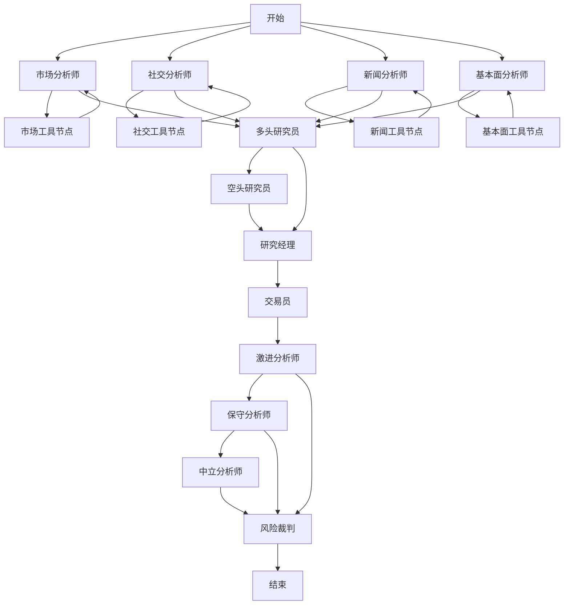
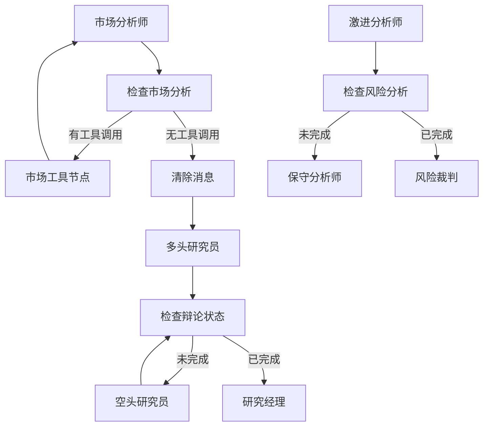
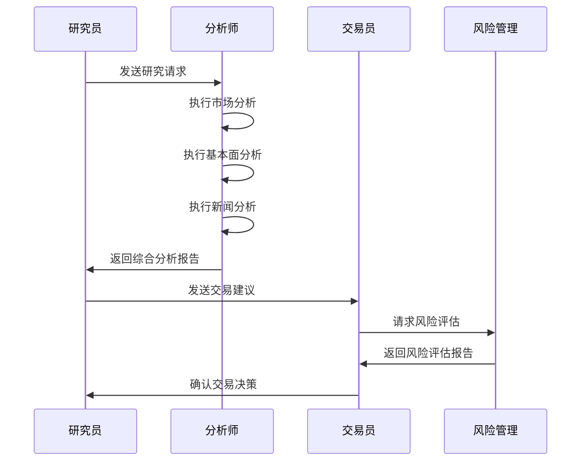

# 图结构定制

<cite>
**本文档引用的文件**   
- [trading_graph.py](file://tradingagents/graph/trading_graph.py)
- [setup.py](file://tradingagents/graph/setup.py)
- [conditional_logic.py](file://tradingagents/graph/conditional_logic.py)
- [agent_utils.py](file://tradingagents/agents/utils/agent_utils.py)
- [propagation.py](file://tradingagents/graph/propagation.py)
- [signal_processing.py](file://tradingagents/graph/signal_processing.py)
- [reflection.py](file://tradingagents/graph/reflection.py)
</cite>

## 目录
1. [引言](#引言)
2. [图结构核心组件](#图结构核心组件)
3. [节点定义与边连接机制](#节点定义与边连接机制)
4. [信号传播与条件逻辑](#信号传播与条件逻辑)
5. [自定义分析流程配置](#自定义分析流程配置)
6. [复杂分析工作流构建](#复杂分析工作流构建)
7. [图结构验证与调试](#图结构验证与调试)
8. [性能优化与最佳实践](#性能优化与最佳实践)

## 引言
本文档详细阐述了多智能体决策图系统的图结构定制方法。系统基于LangGraph框架构建，通过`trading_graph.py`中的`TradingAgentsGraph`类协调多个智能体的工作流程。图结构由`setup.py`中的`GraphSetup`类负责配置，支持灵活的节点定义、边连接和信号传播机制。通过`agent_utils.py`中的工具调用机制确保智能体间的数据一致性，并通过`conditional_logic.py`实现复杂的条件判断逻辑。

## 图结构核心组件

系统图结构由多个核心组件构成，包括节点定义、边连接、状态传播和信号处理等机制。`TradingAgentsGraph`类作为主协调器，初始化所有必要的组件并构建完整的决策流程。`GraphSetup`类负责具体的图结构配置，`Propagator`类处理状态初始化和传播，`SignalProcessor`类负责信号处理，`Reflector`类处理决策反思。

**Section sources**
- [trading_graph.py](file://tradingagents/graph/trading_graph.py#L193-L800)
- [setup.py](file://tradingagents/graph/setup.py#L19-L254)
- [propagation.py](file://tradingagents/graph/propagation.py#L15-L69)
- [signal_processing.py](file://tradingagents/graph/signal_processing.py#L11-L337)
- [reflection.py](file://tradingagents/graph/reflection.py#L11-L126)

## 节点定义与边连接机制

图结构中的节点定义和边连接机制是系统灵活性的基础。节点通过`GraphSetup`类的`setup_graph`方法创建，支持多种分析师类型（市场、社交、新闻、基本面）的动态组合。



**Diagram sources**
- [setup.py](file://tradingagents/graph/setup.py#L51-L254)
- [conditional_logic.py](file://tradingagents/graph/conditional_logic.py#L18-L243)

**Section sources**
- [setup.py](file://tradingagents/graph/setup.py#L51-L254)
- [conditional_logic.py](file://tradingagents/graph/conditional_logic.py#L18-L243)

## 信号传播与条件逻辑

信号传播机制通过`conditional_logic.py`中的`ConditionalLogic`类实现，该类定义了图中各个节点的条件判断逻辑。每个分析师节点都有对应的条件判断方法，如`should_continue_market`、`should_continue_social`等，这些方法决定了是否需要调用工具节点或继续到下一个节点。



**Diagram sources**
- [conditional_logic.py](file://tradingagents/graph/conditional_logic.py#L18-L243)
- [setup.py](file://tradingagents/graph/setup.py#L181-L254)

**Section sources**
- [conditional_logic.py](file://tradingagents/graph/conditional_logic.py#L18-L243)
- [setup.py](file://tradingagents/graph/setup.py#L181-L254)

## 自定义分析流程配置

通过`setup.py`中的`GraphSetup`类可以配置自定义的分析流程。`setup_graph`方法接受`selected_analysts`参数，允许用户选择需要包含的分析师类型，从而构建不同的分析工作流。

```python
def setup_graph(self, selected_analysts=["market", "social", "news", "fundamentals"]):
    """设置和编译代理工作流图。
    
    Args:
        selected_analysts (list): 要包含的分析师类型列表。选项包括：
            - "market": 市场分析师
            - "social": 社交媒体分析师  
            - "news": 新闻分析师
            - "fundamentals": 基本面分析师
    """
```

**Section sources**
- [setup.py](file://tradingagents/graph/setup.py#L51-L254)

## 复杂分析工作流构建

系统支持构建复杂的分析工作流，如研究员-分析师-交易员协作链。这种工作流通过多个节点的串联和条件判断实现，确保分析过程的完整性和逻辑性。



**Diagram sources**
- [setup.py](file://tradingagents/graph/setup.py#L140-L158)
- [trading_graph.py](file://tradingagents/graph/trading_graph.py#L193-L800)

**Section sources**
- [setup.py](file://tradingagents/graph/setup.py#L140-L158)
- [trading_graph.py](file://tradingagents/graph/trading_graph.py#L193-L800)

## 图结构验证与调试

系统提供了完善的图结构验证和调试机制。通过日志系统可以追踪每个节点的执行状态和条件判断结果，帮助开发者快速定位和解决问题。

```python
def should_continue_market(self, state: AgentState):
    """确定市场分析是否应继续。"""
    messages = state["messages"]
    last_message = messages[-1]
    
    # 死循环修复: 添加工具调用次数检查
    tool_call_count = state.get("market_tool_call_count", 0)
    max_tool_calls = 3
    
    # 检查是否已经有市场分析报告
    market_report = state.get("market_report", "")
    
    logger.info(f"🔀 [条件判断] should_continue_market")
    logger.info(f"🔀 [条件判断] - 消息数量: {len(messages)}")
    logger.info(f"🔀 [条件判断] - 报告长度: {len(market_report)}")
    logger.info(f"🔧 [死循环修复] - 工具调用次数: {tool_call_count}/{max_tool_calls}")
```

**Section sources**
- [conditional_logic.py](file://tradingagents/graph/conditional_logic.py#L18-L62)
- [trading_graph.py](file://tradingagents/graph/trading_graph.py#L779-L786)

## 性能优化与最佳实践

为了确保系统的高性能和稳定性，建议遵循以下最佳实践：

1. **状态最小化**: 只在状态中保存必要的信息，避免状态过大影响性能。
2. **节点单一职责**: 每个节点只负责一个特定的任务，确保节点的可维护性和可测试性。
3. **错误处理**: 每个节点都应该有适当的错误处理机制，确保系统在异常情况下能够优雅地处理。
4. **日志记录**: 通过详细的日志记录，可以快速定位和解决问题，提高系统的可维护性。

**Section sources**
- [trading_graph.py](file://tradingagents/graph/trading_graph.py#L774-L776)
- [setup.py](file://tradingagents/graph/setup.py#L250-L253)
- [conditional_logic.py](file://tradingagents/graph/conditional_logic.py#L18-L243)