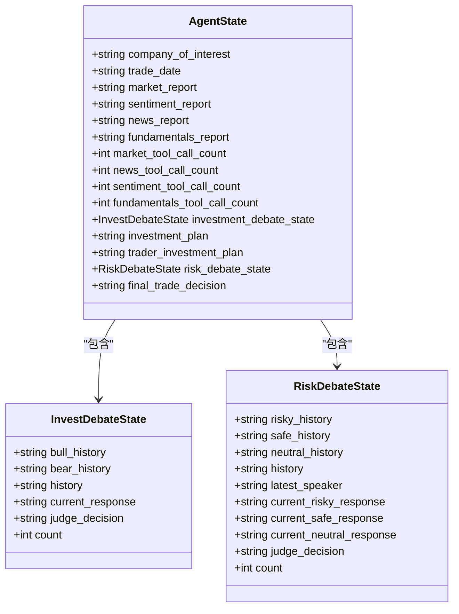
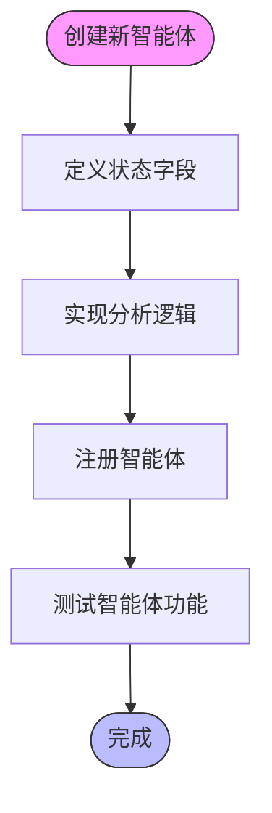
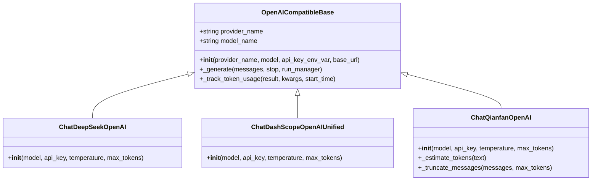
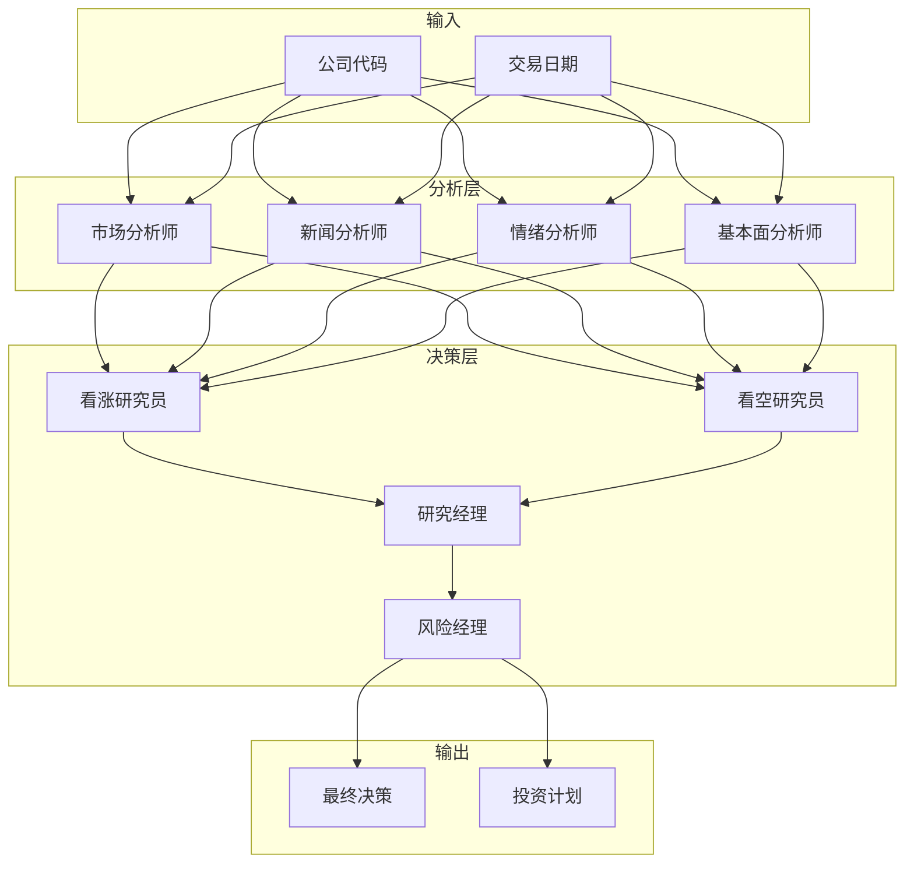
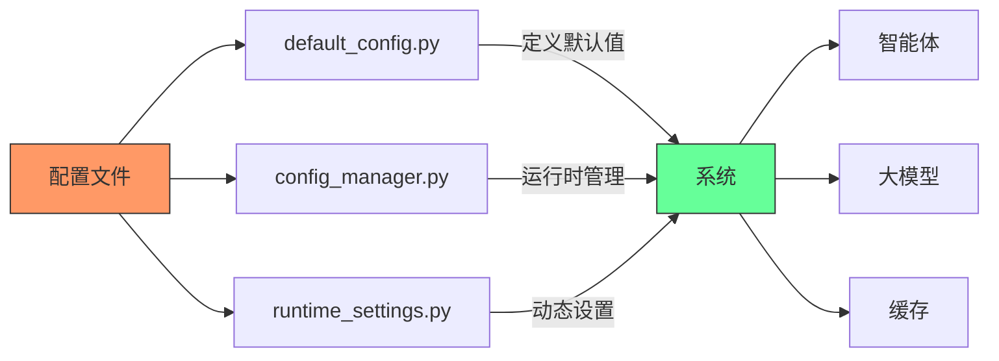

# 扩展开发指南

<cite>
**本文档引用的文件**   
- [fundamentals_analyst.py](file://tradingagents/agents/analysts/fundamentals_analyst.py)
- [agent_states.py](file://tradingagents/agents/utils/agent_states.py)
- [memory.py](file://tradingagents/agents/utils/memory.py)
- [trading_graph.py](file://tradingagents/graph/trading_graph.py)
- [openai_compatible_base.py](file://tradingagents/llm_adapters/openai_compatible_base.py)
- [deepseek_adapter.py](file://tradingagents/llm_adapters/deepseek_adapter.py)
- [default_config.py](file://tradingagents/default_config.py)
- [config_manager.py](file://tradingagents/config/config_manager.py)
</cite>

## 目录
1. [智能体基类设计模式](#智能体基类设计模式)
2. [扩展新智能体类型](#扩展新智能体类型)
3. [LLM适配器扩展](#llm适配器扩展)
4. [交易图集成](#交易图集成)
5. [配置文件修改](#配置文件修改)
6. [最佳实践与常见问题](#最佳实践与常见问题)

## 智能体基类设计模式

智能体系统采用基于状态机的架构设计，所有智能体都遵循统一的设计模式。核心组件包括状态管理、工具调用和分析逻辑。

**图源**
- [agent_states.py](file://tradingagents/agents/utils/agent_states.py#L1-L87)

**节源**
- [agent_states.py](file://tradingagents/agents/utils/agent_states.py#L1-L87)

## 扩展新智能体类型

要创建新的智能体类型，需要遵循以下步骤：

1. **定义智能体状态**：在`AgentState`中添加新的状态字段
2. **实现分析逻辑**：创建新的分析器文件
3. **注册智能体**：在`__init__.py`中导出

**节源**
- [fundamentals_analyst.py](file://tradingagents/agents/analysts/fundamentals_analyst.py#L1-L689)

## LLM适配器扩展

扩展新的大模型提供商需要实现适配器基类，支持OpenAI兼容接口。

**图源**
- [openai_compatible_base.py](file://tradingagents/llm_adapters/openai_compatible_base.py#L32-L554)
- [deepseek_adapter.py](file://tradingagents/llm_adapters/deepseek_adapter.py#L31-L293)

**节源**
- [openai_compatible_base.py](file://tradingagents/llm_adapters/openai_compatible_base.py#L32-L554)
- [deepseek_adapter.py](file://tradingagents/llm_adapters/deepseek_adapter.py#L31-L293)

## 交易图集成

新智能体需要集成到现有的交易图中，通过图节点连接实现数据流。

**图源**
- [trading_graph.py](file://tradingagents/graph/trading_graph.py#L193-L800)

**节源**
- [trading_graph.py](file://tradingagents/graph/trading_graph.py#L193-L800)

## 配置文件修改

扩展功能需要相应修改配置文件，确保系统正确加载新组件。

**节源**
- [default_config.py](file://tradingagents/default_config.py#L1-L28)
- [config_manager.py](file://tradingagents/config/config_manager.py)

## 最佳实践与常见问题

### 最佳实践
1. **状态管理**：使用统一的状态模式管理智能体状态
2. **工具调用**：实现工具调用计数器防止死循环
3. **错误处理**：添加详细的日志记录和错误处理
4. **性能优化**：使用缓存机制减少重复计算

### 常见问题解决方案
1. **工具调用失败**：检查API密钥和网络连接
2. **状态不一致**：确保状态转换的原子性
3. **性能瓶颈**：优化数据查询和缓存策略
4. **集成问题**：验证接口兼容性和数据格式

**节源**
- [memory.py](file://tradingagents/agents/utils/memory.py#L1-L702)