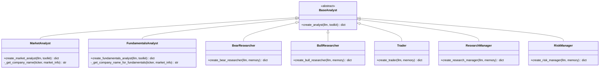
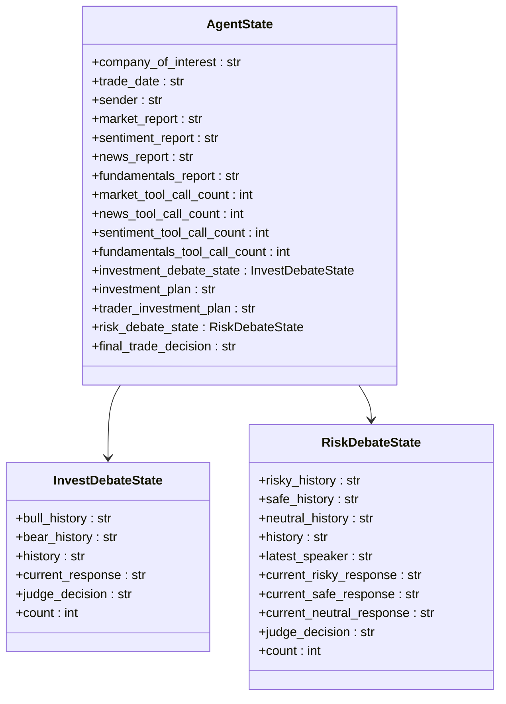
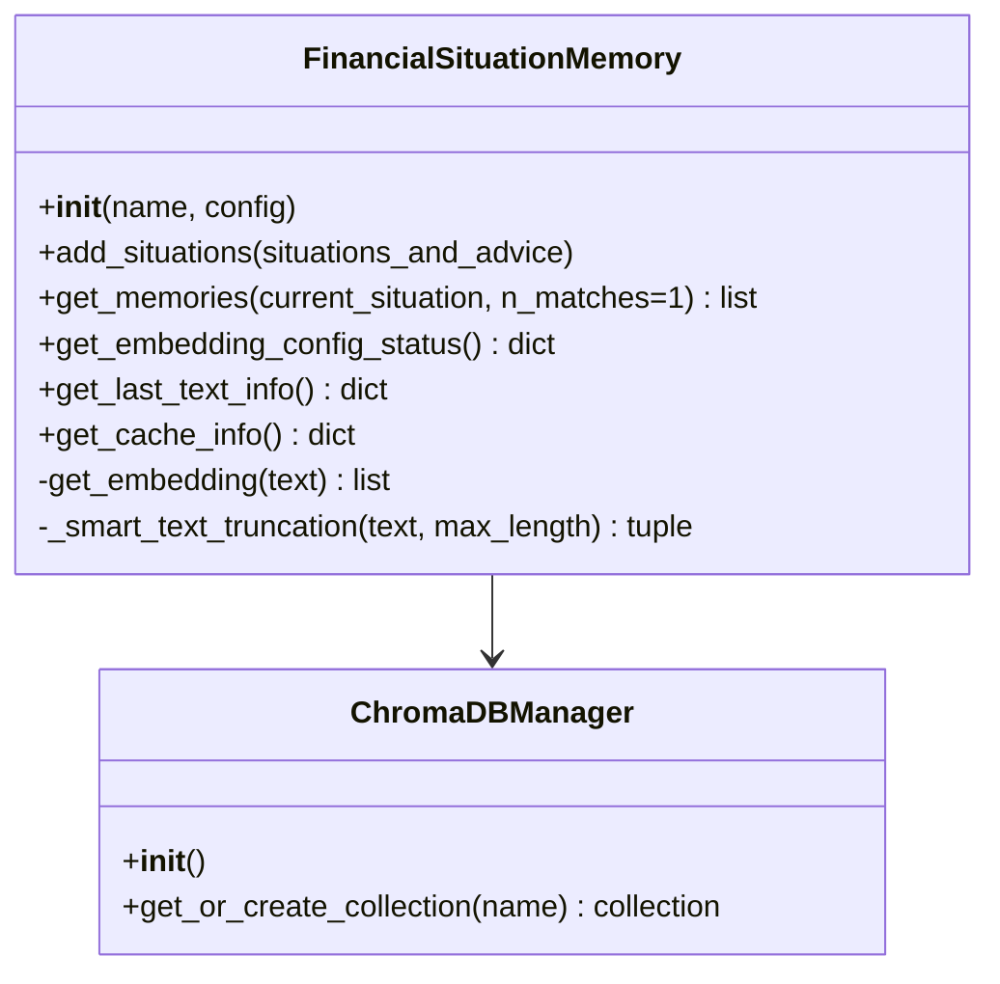
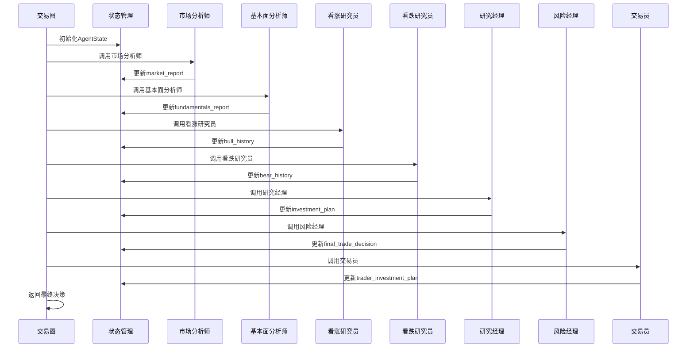
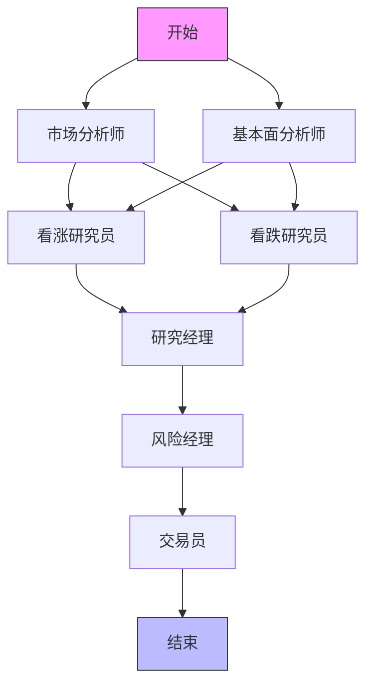
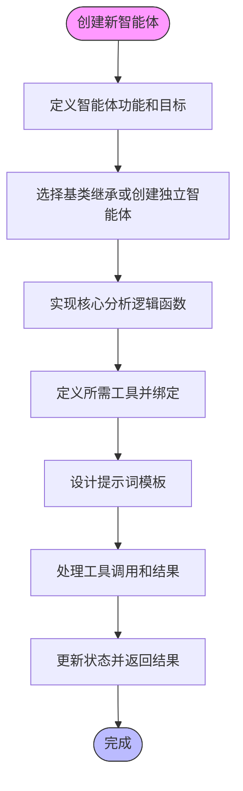
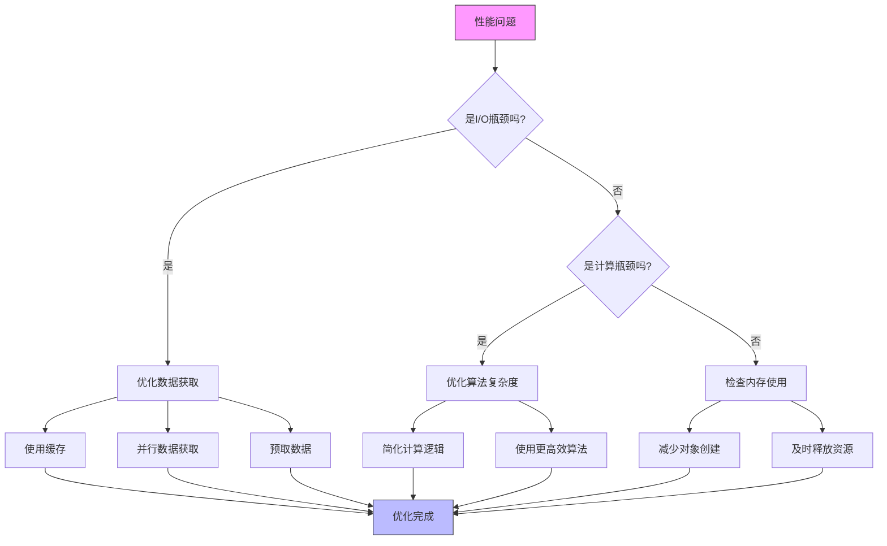

# 智能体扩展

<cite>
**本文档引用的文件**   
- [agent_utils.py](file://tradingagents/agents/utils/agent_utils.py)
- [memory.py](file://tradingagents/agents/utils/memory.py)
- [agent_states.py](file://tradingagents/agents/utils/agent_states.py)
- [market_analyst.py](file://tradingagents/agents/analysts/market_analyst.py)
- [fundamentals_analyst.py](file://tradingagents/agents/analysts/fundamentals_analyst.py)
- [research_manager.py](file://tradingagents/agents/managers/research_manager.py)
- [risk_manager.py](file://tradingagents/agents/managers/risk_manager.py)
- [bear_researcher.py](file://tradingagents/agents/researchers/bear_researcher.py)
- [bull_researcher.py](file://tradingagents/agents/researchers/bull_researcher.py)
- [trader.py](file://tradingagents/agents/trader/trader.py)
- [default_config.py](file://tradingagents/default_config.py)
- [trading_graph.py](file://tradingagents/graph/trading_graph.py)
</cite>

## 目录
1. [智能体架构与继承关系](#智能体架构与继承关系)
2. [智能体状态管理](#智能体状态管理)
3. [上下文记忆集成](#上下文记忆集成)
4. [工具绑定与交易图接入](#工具绑定与交易图接入)
5. [执行优先级与依赖关系](#执行优先级与依赖关系)
6. [自定义分析流程实现](#自定义分析流程实现)
7. [调试技巧与性能优化](#调试技巧与性能优化)

## 智能体架构与继承关系

智能体系统采用模块化设计，通过继承基类和组合工具来定义新的分析逻辑。核心智能体包括市场分析师、基本面分析师、看涨/看跌研究员、交易员等，它们都遵循统一的架构模式。

所有智能体都通过`create_*_analyst`函数工厂模式创建，接收LLM和工具包作为参数，返回一个处理函数节点。这种设计实现了智能体的可配置性和可扩展性。例如，市场分析师`create_market_analyst`和基本面分析师`create_fundamentals_analyst`都遵循相同的创建模式，但使用不同的工具和提示词。

**图源**
- [market_analyst.py](file://tradingagents/agents/analysts/market_analyst.py)
- [fundamentals_analyst.py](file://tradingagents/agents/analysts/fundamentals_analyst.py)
- [bear_researcher.py](file://tradingagents/agents/researchers/bear_researcher.py)
- [bull_researcher.py](file://tradingagents/agents/researchers/bull_researcher.py)
- [trader.py](file://tradingagents/agents/trader/trader.py)
- [research_manager.py](file://tradingagents/agents/managers/research_manager.py)
- [risk_manager.py](file://tradingagents/agents/managers/risk_manager.py)

**节源**
- [market_analyst.py](file://tradingagents/agents/analysts/market_analyst.py)
- [fundamentals_analyst.py](file://tradingagents/agents/analysts/fundamentals_analyst.py)

## 智能体状态管理

系统使用`AgentState`类来管理智能体的状态，该类继承自`MessagesState`并扩展了特定的分析字段。状态管理是智能体协作的核心，确保了信息在不同智能体之间的正确传递。

`AgentState`包含了多个关键字段：
- `company_of_interest`: 当前分析的公司
- `trade_date`: 交易日期
- `sender`: 发送消息的智能体
- `market_report`: 市场分析师的报告
- `sentiment_report`: 社交媒体分析师的报告
- `news_report`: 新闻分析师的报告
- `fundamentals_report`: 基本面分析师的报告
- `investment_debate_state`: 投资辩论状态
- `risk_debate_state`: 风险评估辩论状态

此外，系统还实现了防死循环机制，通过`*_tool_call_count`字段来跟踪每个智能体的工具调用次数，防止无限循环调用。

**图源**
- [agent_states.py](file://tradingagents/agents/utils/agent_states.py)

**节源**
- [agent_states.py](file://tradingagents/agents/utils/agent_states.py)

## 上下文记忆集成

系统通过`FinancialSituationMemory`类实现上下文记忆功能，利用ChromaDB作为向量数据库存储和检索历史记忆。记忆系统支持多种LLM提供商，包括OpenAI、DashScope、Qianfan、DeepSeek、Google等。

记忆系统的关键特性包括：
- **多提供商支持**: 根据配置的LLM提供商选择相应的嵌入模型
- **降级机制**: 当主要嵌入服务不可用时，自动降级到备用方案
- **长度检查**: 支持配置最大嵌入内容长度，避免超出LLM上下文限制
- **智能截断**: 在必要时智能截断文本，保持语义完整性

**图源**
- [memory.py](file://tradingagents/agents/utils/memory.py)

**节源**
- [memory.py](file://tradingagents/agents/utils/memory.py)

## 工具绑定与交易图接入

智能体通过工具包（Toolkit）绑定各种分析工具，这些工具通过`@tool`装饰器定义，可以被LLM调用。系统使用`trading_graph.py`来组织智能体的执行流程，形成一个完整的交易分析图。

工具绑定的关键步骤：
1. 创建工具包实例
2. 将需要的工具添加到工具包
3. 在智能体创建时传递工具包
4. 在提示词中声明可用工具

交易图的构建流程：
1. 初始化状态图
2. 添加各个智能体节点
3. 定义节点之间的连接关系
4. 设置条件逻辑决定执行路径
5. 启动图的执行

**图源**
- [trading_graph.py](file://tradingagents/graph/trading_graph.py)
- [market_analyst.py](file://tradingagents/agents/analysts/market_analyst.py)
- [fundamentals_analyst.py](file://tradingagents/agents/analysts/fundamentals_analyst.py)
- [bull_researcher.py](file://tradingagents/agents/researchers/bull_researcher.py)
- [bear_researcher.py](file://tradingagents/agents/researchers/bear_researcher.py)
- [research_manager.py](file://tradingagents/agents/managers/research_manager.py)
- [risk_manager.py](file://tradingagents/agents/managers/risk_manager.py)
- [trader.py](file://tradingagents/agents/trader/trader.py)

**节源**
- [trading_graph.py](file://tradingagents/graph/trading_graph.py)

## 执行优先级与依赖关系

系统通过图的连接顺序和条件逻辑来管理智能体的执行优先级和依赖关系。执行流程遵循严格的顺序，确保前置条件满足后才执行后续步骤。

执行优先级规则：
1. 数据收集类智能体（市场分析师、基本面分析师）优先执行
2. 分析类智能体（看涨/看跌研究员）在数据收集完成后执行
3. 决策类智能体（研究经理、风险经理）在分析完成后执行
4. 执行类智能体（交易员）在所有决策完成后执行

依赖关系通过状态字段来管理，例如`market_report`和`fundamentals_report`是看涨/看跌研究员的输入依赖。

**图源**
- [trading_graph.py](file://tradingagents/graph/trading_graph.py)

**节源**
- [trading_graph.py](file://tradingagents/graph/trading_graph.py)

## 自定义分析流程实现

开发者可以通过继承现有智能体或创建新的智能体来实现自定义分析流程。以下是创建新型智能体的完整示例：

**图源**
- [agent_utils.py](file://tradingagents/agents/utils/agent_utils.py)

**节源**
- [agent_utils.py](file://tradingagents/agents/utils/agent_utils.py)

## 调试技巧与性能优化

### 调试技巧
1. **日志追踪**: 使用`get_logger`获取智能体专用日志记录器
2. **状态检查**: 在关键节点打印状态信息
3. **工具调用监控**: 跟踪工具调用次数防止死循环
4. **提示词调试**: 打印完整的提示词内容进行分析

### 性能优化
1. **缓存机制**: 启用向量缓存避免重复计算
2. **并行执行**: 对独立的智能体任务进行并行处理
3. **数据预取**: 提前获取可能需要的数据
4. **降级策略**: 在主要服务不可用时快速切换到备用方案

**图源**
- [agent_utils.py](file://tradingagents/agents/utils/agent_utils.py)
- [memory.py](file://tradingagents/agents/utils/memory.py)

**节源**
- [agent_utils.py](file://tradingagents/agents/utils/agent_utils.py)
- [memory.py](file://tradingagents/agents/utils/memory.py)