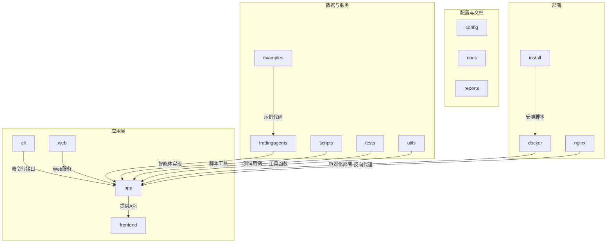
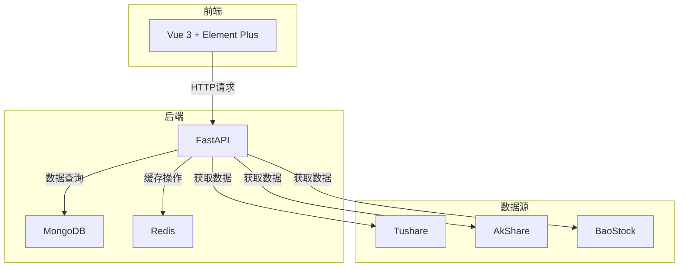
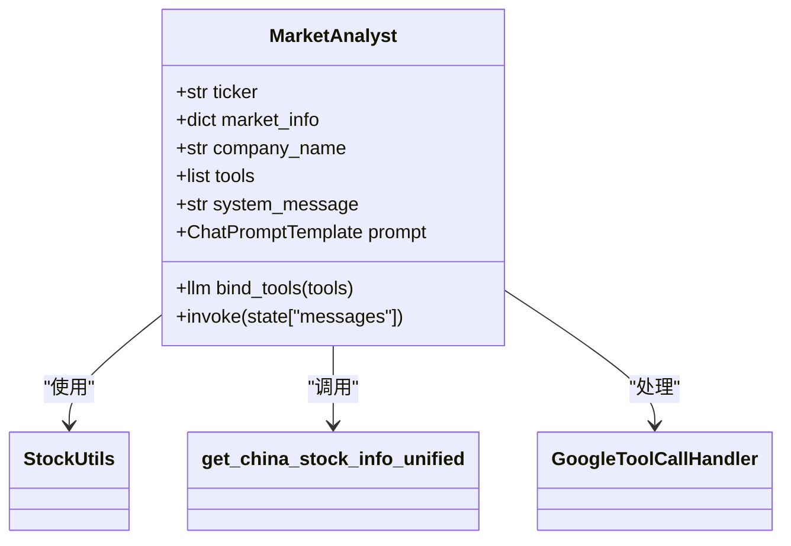
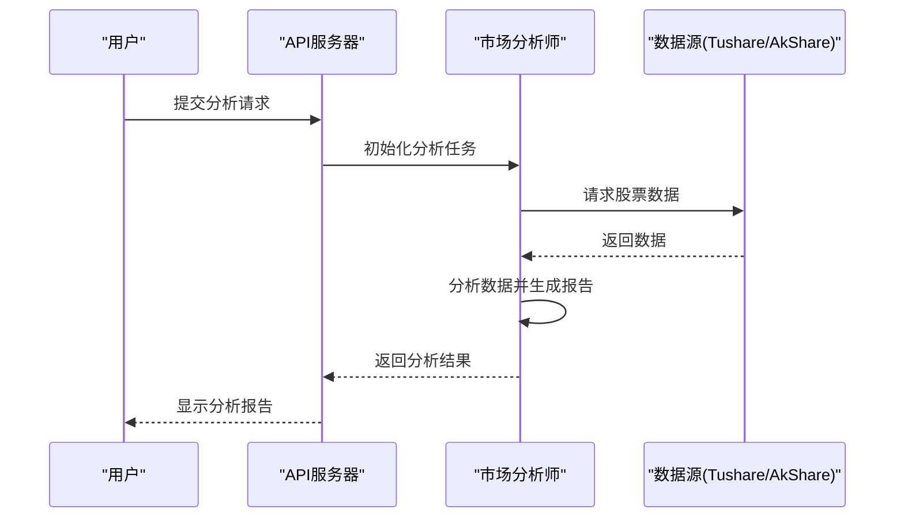
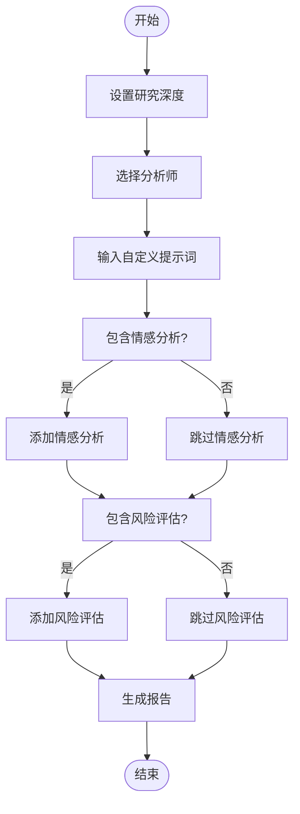
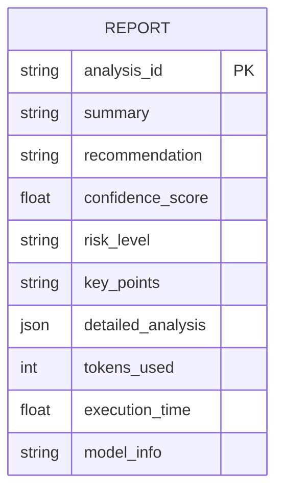
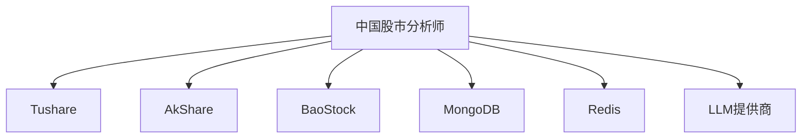

# 中国股市分析师

<cite>
**本文档引用的文件**   
- [china_market_analyst.py](file://tradingagents/agents/analysts/china_market_analyst.py)
- [market_analyst.py](file://tradingagents/agents/analysts/market_analyst.py)
- [analysis_service.py](file://app/services/analysis_service.py)
- [analysis.py](file://app/routers/analysis.py)
- [analysis.py](file://app/models/analysis.py)
- [tushare_demo.py](file://examples/tushare_demo.py)
</cite>

## 目录
1. [引言](#引言)
2. [项目结构](#项目结构)
3. [核心组件](#核心组件)
4. [架构概述](#架构概述)
5. [详细组件分析](#详细组件分析)
6. [依赖分析](#依赖分析)
7. [性能考虑](#性能考虑)
8. [故障排除指南](#故障排除指南)
9. [结论](#结论)
10. [附录](#附录)（如有必要）

## 引言
中国股市分析师是一个专门针对A股市场分析的智能体，它结合宏观经济、行业趋势和市场情绪进行综合判断。该智能体利用Tushare、AkShare等数据源，通过一系列分析方法来提供深入的市场洞察。本文档旨在详细描述其专业领域和职责，解释其如何与其他智能体协作，并展示其实现细节。

## 项目结构
本项目采用模块化设计，主要分为以下几个部分：`app`、`cli`、`config`、`docker`、`docs`、`examples`、`frontend`、`install`、`nginx`、`reports`、`scripts`、`tests`、`tradingagents`、`utils` 和 `web`。每个目录都有特定的功能，如`app`包含核心应用逻辑，`tradingagents`则包含了各种智能体的实现。



**图源**
- [project_structure](file://project_structure)

**节源**
- [project_structure](file://project_structure)

## 核心组件

中国股市分析师的核心组件包括市场分析师、基本面分析师、新闻分析师和社会媒体分析师。这些组件协同工作，以提供全面的市场分析。

**节源**
- [china_market_analyst.py](file://tradingagents/agents/analysts/china_market_analyst.py)
- [market_analyst.py](file://tradingagents/agents/analysts/market_analyst.py)

## 架构概述

系统架构基于FastAPI构建后端服务，Vue 3作为前端框架，MongoDB和Redis用于数据存储和缓存。整个系统支持多LLM提供商集成，能够进行批量分析和智能股票筛选。



**图源**
- [README.md](file://README.md#L27-L39)

**节源**
- [README.md](file://README.md#L27-L39)

## 详细组件分析

### 市场分析师分析
市场分析师负责技术面分析，使用通达信数据进行精确的技术指标分析。它还结合中国会计准则和财报特点进行基本面分析。

#### 类图


**图源**
- [market_analyst.py](file://tradingagents/agents/analysts/market_analyst.py)

#### 序列图


**图源**
- [analysis_service.py](file://app/services/analysis_service.py)
- [analysis.py](file://app/routers/analysis.py)

### 输入参数配置
输入参数配置包括研究深度、选择的分析师、自定义提示词等。这些参数允许用户根据需要定制分析过程。



**图源**
- [analysis.py](file://app/models/analysis.py#L33-L54)

**节源**
- [analysis.py](file://app/models/analysis.py#L33-L54)

### 输出报告结构
输出报告包含摘要、推荐、置信度评分、风险等级、关键点和详细分析等内容。报告格式遵循Markdown标准，便于阅读和导出。



**图源**
- [analysis.py](file://app/models/analysis.py#L56-L70)

**节源**
- [analysis.py](file://app/models/analysis.py#L56-L70)

## 依赖分析

系统依赖于多个外部库和服务，包括Tushare、AkShare、BaoStock等数据源，以及MongoDB和Redis数据库。此外，还需要配置LLM提供商以支持多模型分析。



**图源**
- [tushare_demo.py](file://examples/tushare_demo.py)
- [akshare_demo.py](file://examples/akshare_demo.py)

**节源**
- [tushare_demo.py](file://examples/tushare_demo.py)
- [akshare_demo.py](file://examples/akshare_demo.py)

## 性能考虑

为了提高性能，系统采用了缓存机制，利用Redis存储频繁访问的数据。同时，通过异步处理和批量操作减少API调用次数，从而降低延迟。

**节源**
- [analysis_service.py](file://app/services/analysis_service.py)
- [tushare_demo.py](file://examples/tushare_demo.py)

## 故障排除指南

当遇到问题时，可以检查日志文件、确认数据源连接状态、验证API密钥有效性，并确保所有依赖项已正确安装。

**节源**
- [README.md](file://README.md#L300-L308)
- [troubleshooting.md](file://docs/troubleshooting/troubleshooting_guide.md)

## 结论

中国股市分析师是一个功能强大的智能体，它能够结合多种数据源和分析方法，为用户提供深入的市场洞察。通过合理的架构设计和高效的性能优化，该系统能够在复杂的市场环境中提供可靠的支持。

## 附录

### 示例代码
以下是一个简单的示例代码，展示了如何使用Tushare获取股票数据：

```python
from tradingagents.dataflows.tushare_adapter import get_tushare_adapter

adapter = get_tushare_adapter()
stock_data = adapter.get_stock_data("000001", "2023-01-01", "2023-12-31")
print(stock_data)
```

**节源**
- [tushare_demo.py](file://examples/tushare_demo.py)