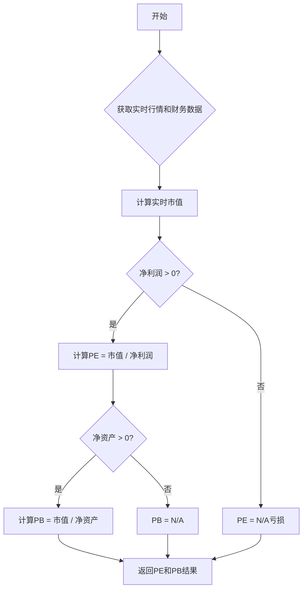
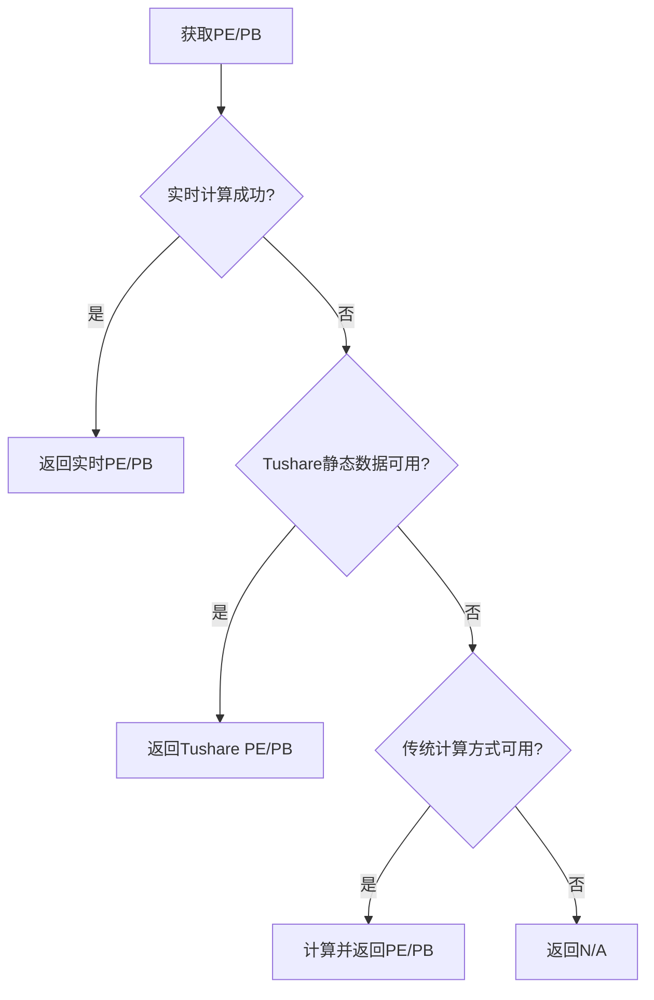
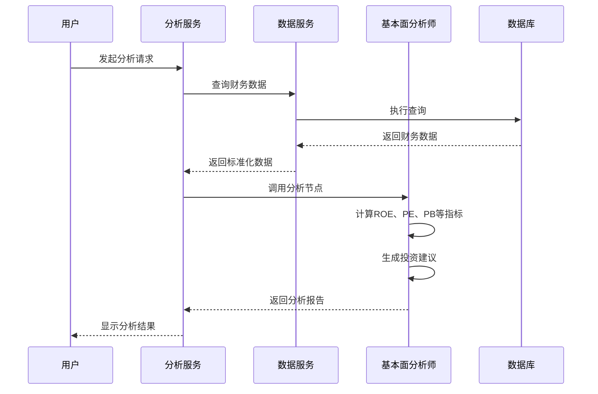

# 基本面分析师

<cite>
**本文档引用的文件**   
- [fundamentals_analyst.py](file://tradingagents/agents/analysts/fundamentals_analyst.py)
- [optimized_china_data.py](file://tradingagents/dataflows/optimized_china_data.py)
- [financial_data_service.py](file://app/services/financial_data_service.py)
- [realtime_metrics.py](file://tradingagents/dataflows/realtime_metrics.py)
- [simple_analysis_service.py](file://app/services/simple_analysis_service.py)
</cite>

## 目录
1. [引言](#引言)
2. [核心能力与专业领域](#核心能力与专业领域)
3. [财务数据处理流程](#财务数据处理流程)
4. [关键财务指标计算](#关键财务指标计算)
5. [估值模型与选择逻辑](#估值模型与选择逻辑)
6. [与数据服务层的交互](#与数据服务层的交互)
7. [分析流程代码示例](#分析流程代码示例)
8. [协作模式](#协作模式)
9. [结论](#结论)

## 引言
基本面分析师是系统中的核心智能体之一，专注于企业财务分析和估值建模。该智能体通过调用统一的数据工具，获取并分析企业的财务报表数据，计算关键财务指标（如ROE、PE、PB），进行跨期比较，并生成专业的投资分析报告。本文档详细阐述了其专业能力、数据处理流程、估值模型选择逻辑以及与其他智能体的协作模式。

## 核心能力与专业领域
基本面分析师的核心能力在于对企业财务状况的深度剖析和价值评估。它能够：
- 处理和分析企业的资产负债表、利润表和现金流量表等财务报表数据。
- 计算并解读关键财务指标，如净资产收益率（ROE）、市盈率（PE）、市净率（PB）等。
- 进行跨期财务数据比较，评估企业的成长性和财务健康状况。
- 结合行业特点和市场环境，进行综合性的投资价值评估。
- 生成包含投资建议的专业分析报告。

**Section sources**
- [fundamentals_analyst.py](file://tradingagents/agents/analysts/fundamentals_analyst.py#L98-L689)

## 财务数据处理流程
基本面分析师的财务数据处理流程包括数据获取、质量验证和预处理三个主要环节。

### 数据获取
分析师通过调用`get_stock_fundamentals_unified`统一工具来获取数据。该工具能够自动识别股票类型（A股、港股、美股），并从相应的数据源（如Tushare、AKShare）获取最新的财务数据和实时行情。

### 质量验证
在获取数据后，系统会对数据进行严格的质量验证。例如，`realtime_metrics.py`文件中的`validate_pe_pb`函数会检查PE和PB指标是否在合理范围内（PE在-100到1000之间，PB在0.1到100之间），以排除异常或错误的数据。

### 预处理
获取的原始财务数据会经过标准化处理。`financial_data_service.py`中的`_standardize_financial_data`方法负责将来自不同数据源（Tushare、AKShare、BaoStock）的数据转换为统一的格式，确保数据的一致性和可比性。

**Section sources**
- [fundamentals_analyst.py](file://tradingagents/agents/analysts/fundamentals_analyst.py#L160-L164)
- [realtime_metrics.py](file://tradingagents/dataflows/realtime_metrics.py#L299-L320)
- [financial_data_service.py](file://app/services/financial_data_service.py#L289-L317)

## 关键财务指标计算
基本面分析师能够计算多种关键财务指标，用于评估企业的盈利能力、估值水平和财务健康状况。

### ROE（净资产收益率）
ROE是衡量企业盈利能力的核心指标。计算公式为：`ROE = (净利润 / 净资产) * 100%`。在代码中，当净资产和净利润均大于0时，系统会计算并格式化ROE值，否则标记为"N/A"。

### PE（市盈率）与PB（市净率）
PE和PB是评估企业估值水平的重要指标。
- **PE计算**：`PE = 市值 / 净利润`。系统优先使用实时计算的动态PE，若失败则降级到Tushare提供的静态PE。
- **PB计算**：`PB = 市值 / 净资产`。同样，系统会尝试使用实时数据计算，失败后使用静态数据。

**Diagram sources**
- [optimized_china_data.py](file://tradingagents/dataflows/optimized_china_data.py#L1798-L1829)
- [realtime_metrics.py](file://tradingagents/dataflows/realtime_metrics.py#L274-L292)

**Section sources**
- [optimized_china_data.py](file://tradingagents/dataflows/optimized_china_data.py#L1798-L1829)
- [realtime_metrics.py](file://tradingagents/dataflows/realtime_metrics.py#L274-L292)

## 估值模型与选择逻辑
基本面分析师采用多层回退策略来确保估值的准确性和可靠性。

### 实时计算优先
系统优先使用实时计算的动态估值模型。该模型结合`market_quotes`的实时股价和`stock_basic_info`中的财务数据，计算出反映当前市场情况的PE和PB值。

### 智能降级策略
当实时计算失败时，系统会自动降级到备用方案：
1. **第一层降级**：使用Tushare提供的静态PE/PB数据。
2. **第二层降级**：如果静态数据也不可用，则使用传统计算方式，如股价除以每股收益（EPS）来计算PE。

这种多层策略确保了在各种数据缺失或异常情况下，系统仍能返回有效的估值信息。

**Diagram sources**
- [realtime_metrics.py](file://tradingagents/dataflows/realtime_metrics.py#L323-L438)
- [blog/2025-10-28-realtime-pe-pb-calculation-with-fallback-strategy.md](file://docs/blog/2025-10-28-realtime-pe-pb-calculation-with-fallback-strategy.md#L194-L229)

**Section sources**
- [realtime_metrics.py](file://tradingagents/dataflows/realtime_metrics.py#L323-L438)

## 与数据服务层的交互
基本面分析师通过统一的工具接口与数据服务层进行交互，实现了数据获取的解耦和灵活性。

### 统一工具接口
分析师不直接与具体的数据源（如Tushare、AKShare）交互，而是调用`get_stock_fundamentals_unified`这一统一工具。该工具内部负责识别股票类型并路由到正确的数据源，简化了分析师的逻辑。

### 数据服务层
`financial_data_service.py`提供了对财务数据的统一管理服务，包括数据的存储、查询和统计。分析师通过该服务层获取标准化的财务数据，确保了数据质量和一致性。

**Section sources**
- [fundamentals_analyst.py](file://tradingagents/agents/analysts/fundamentals_analyst.py#L160-L164)
- [financial_data_service.py](file://app/services/financial_data_service.py#L17-L35)

## 分析流程代码示例
以下代码示例展示了基本面分析师的分析流程，包括财务数据获取、质量验证、指标计算和投资建议生成。

**Diagram sources**
- [simple_analysis_service.py](file://app/services/simple_analysis_service.py#L730-L800)
- [fundamentals_analyst.py](file://tradingagents/agents/analysts/fundamentals_analyst.py#L98-L689)

**Section sources**
- [simple_analysis_service.py](file://app/services/simple_analysis_service.py#L730-L800)

## 协作模式
基本面分析师与其他智能体（如市场分析师、风险经理）协同工作，提供全面的投资决策支持。

### 与市场分析师的协作
市场分析师负责技术面分析，提供股价走势、技术指标等信息。基本面分析师将这些信息与自身的财务分析结果结合，形成更全面的评估。

### 与风险经理的协作
风险经理负责识别和评估投资风险。基本面分析师会参考风险经理的评估结果，在投资建议中加入风险提示，帮助用户做出更稳健的投资决策。

**Section sources**
- [fundamentals_analyst.py](file://tradingagents/agents/analysts/fundamentals_analyst.py#L100-L689)

## 结论
基本面分析师是一个功能强大且设计精巧的智能体，它通过自动化和智能化的方式处理复杂的财务分析任务。其核心优势在于：
- **统一的数据接口**：简化了与多数据源的交互。
- **严谨的计算逻辑**：确保了财务指标的准确性。
- **智能的降级策略**：提高了系统的鲁棒性。
- **紧密的协作模式**：与其他智能体共同构建了完整的投资分析体系。

该智能体不仅能够提供专业的财务分析，还能生成清晰、可操作的投资建议，是系统中不可或缺的核心组件。