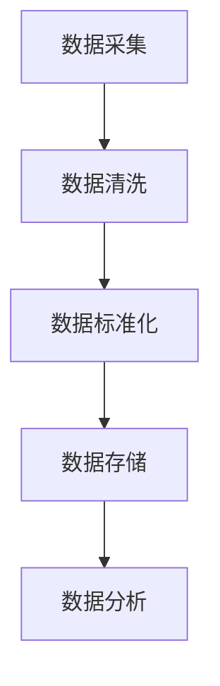
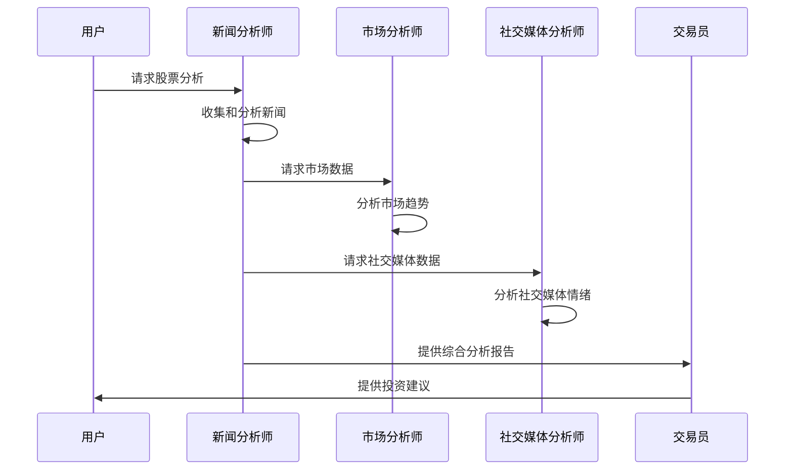
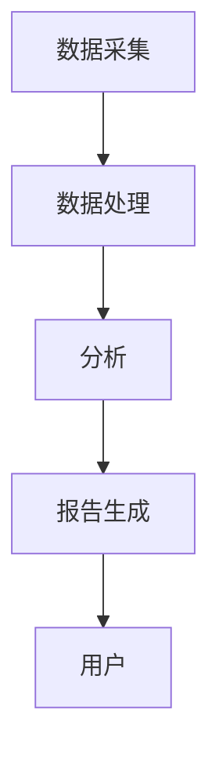

# 新闻分析师

<cite>
**本文档引用的文件**   
- [news_analyst.py](file://tradingagents/agents/analysts/news_analyst.py)
- [unified_news_tool.py](file://tradingagents/tools/unified_news_tool.py)
- [realtime_news.py](file://tradingagents/dataflows/news/realtime_news.py)
- [news_data_service.py](file://app/services/news_data_service.py)
- [news_data.py](file://app/routers/news_data.py)
- [news_data_sync_service.py](file://app/worker/news_data_sync_service.py)
- [analysis_runner.py](file://web/utils/analysis_runner.py)
</cite>

## 目录
1. [引言](#引言)
2. [核心功能概述](#核心功能概述)
3. [数据采集与处理](#数据采集与处理)
4. [新闻重要性评估机制](#新闻重要性评估机制)
5. [事件分类体系](#事件分类体系)
6. [股价影响预测模型](#股价影响预测模型)
7. [协同工作机制](#协同工作机制)
8. [代码流程示例](#代码流程示例)
9. [系统架构](#系统架构)
10. [结论](#结论)

## 引言
新闻分析师是本系统中的关键智能体，专注于财经新闻处理和事件影响分析。该智能体能够从多个数据源（如新闻API、社交媒体）收集信息，进行文本分析和情感判断。通过先进的算法和技术，新闻分析师能够评估新闻的重要性，对事件进行分类，并预测其对股价的潜在影响。本文档将详细介绍新闻分析师的专业能力、工作流程和协同机制。

## 核心功能概述
新闻分析师的核心功能包括：
- 从多个数据源收集财经新闻和社交媒体信息
- 进行文本分析和情感判断
- 评估新闻的重要性
- 对事件进行分类
- 预测事件对股价的潜在影响
- 与其他智能体（如市场分析师、社交媒体分析师）协同工作

## 数据采集与处理
新闻分析师通过多种渠道采集数据，包括新闻API、社交媒体平台和财经网站。采集到的数据经过清洗、标准化和存储，以便后续分析。

### 数据源
- **新闻API**：包括FinnHub、Alpha Vantage、NewsAPI等
- **社交媒体**：包括微博、抖音等主流社媒平台
- **财经网站**：包括东方财富、财联社等

### 数据处理流程


**Diagram sources**
- [realtime_news.py](file://tradingagents/dataflows/news/realtime_news.py#L40-L800)
- [news_data_service.py](file://app/services/news_data_service.py#L1-L767)

**Section sources**
- [realtime_news.py](file://tradingagents/dataflows/news/realtime_news.py#L40-L800)
- [news_data_service.py](file://app/services/news_data_service.py#L1-L767)

## 新闻重要性评估机制
新闻分析师通过关键词匹配和规则引擎评估新闻的重要性。重要性分为高、中、低三个等级。

### 评估规则
- **高重要性**：包含“重大”、“紧急”、“突发”、“年报”、“业绩”、“重组”、“收购”等关键词
- **中重要性**：包含“公告”、“通知”、“变更”、“调整”、“计划”等关键词
- **低重要性**：其他新闻

```python
def _assess_importance(self, title: str) -> str:
    """评估重要性"""
    title_lower = title.lower()
    
    high_importance_words = ["重大", "紧急", "突发", "年报", "业绩", "重组", "收购"]
    medium_importance_words = ["公告", "通知", "变更", "调整", "计划"]
    
    if any(word in title_lower for word in high_importance_words):
        return "high"
    elif any(word in title_lower for word in medium_importance_words):
        return "medium"
    else:
        return "low"
```

**Section sources**
- [news_data_sync_service.py](file://app/worker/news_data_sync_service.py#L389-L401)

## 事件分类体系
新闻分析师通过关键词匹配对新闻进行分类。分类包括公司公告、政策新闻、市场新闻、研报和一般新闻。

### 分类规则
- **公司公告**：包含“年报”、“季报”、“业绩”、“财报”、“公告”等关键词
- **政策新闻**：包含“政策”、“央行”、“监管”、“法规”等关键词
- **市场新闻**：包含“市场”、“行情”、“指数”、“板块”等关键词
- **研报**：包含“研报”、“分析”、“评级”、“推荐”等关键词
- **一般新闻**：其他新闻

```python
def _classify_news_category(self, title: str) -> str:
    """分类新闻类别"""
    title_lower = title.lower()
    
    if any(word in title_lower for word in ["年报", "季报", "业绩", "财报", "公告"]):
        return "company_announcement"
    elif any(word in title_lower for word in ["政策", "央行", "监管", "法规"]):
        return "policy_news"
    elif any(word in title_lower for word in ["市场", "行情", "指数", "板块"]):
        return "market_news"
    elif any(word in title_lower for word in ["研报", "分析", "评级", "推荐"]):
        return "research_report"
    else:
        return "general"
```

**Section sources**
- [news_data_sync_service.py](file://app/worker/news_data_sync_service.py#L357-L370)

## 股价影响预测模型
新闻分析师通过情感分析和相关性评分预测事件对股价的潜在影响。情感分析基于正面和负面关键词的匹配，相关性评分基于股票代码和公司名称的匹配。

### 情感分析
```python
def _analyze_sentiment(self, text: str) -> str:
    """分析情绪"""
    text_lower = text.lower()
    
    positive_words = ["增长", "上涨", "利好", "盈利", "成功", "突破", "创新", "优秀"]
    negative_words = ["下跌", "亏损", "风险", "问题", "困难", "下滑", "减少", "警告"]
    
    positive_count = sum(1 for word in positive_words if word in text_lower)
    negative_count = sum(1 for word in negative_words if word in text_lower)
    
    if positive_count > negative_count:
        return "positive"
    elif negative_count > positive_count:
        return "negative"
    else:
        return "neutral"
```

### 相关性评分
```python
def _calculate_relevance(self, title: str, ticker: str) -> float:
    """计算新闻相关性分数"""
    text = title.lower()
    ticker_lower = ticker.lower()

    # 基础相关性 - 股票代码直接出现在标题中
    if ticker_lower in text:
        return 1.0

    # 公司名称匹配
    company_names = {
        'aapl': ['apple', 'iphone', 'ipad', 'mac'],
        'tsla': ['tesla', 'elon musk', 'electric vehicle'],
        'nvda': ['nvidia', 'gpu', 'ai chip'],
        'msft': ['microsoft', 'windows', 'azure'],
        'googl': ['google', 'alphabet', 'search']
    }

    # 检查公司相关关键词
    if ticker_lower in company_names:
        for name in company_names[ticker_lower]:
            if name in text:
                return 0.8

    # 提取股票代码的纯数字部分（适用于中国股票）
    pure_code = ''.join(filter(str.isdigit, ticker))
    if pure_code and pure_code in text:
        return 0.9

    return 0.3  # 默认相关性
```

**Section sources**
- [news_data_sync_service.py](file://app/worker/news_data_sync_service.py#L372-L387)
- [realtime_news.py](file://tradingagents/dataflows/news/realtime_news.py#L536-L569)

## 协同工作机制
新闻分析师与其他智能体（如市场分析师、社交媒体分析师）协同工作，共同完成股票分析任务。

### 协同流程


**Diagram sources**
- [analysis_runner.py](file://web/utils/analysis_runner.py#L886-L914)
- [news_analyst.py](file://tradingagents/agents/analysts/news_analyst.py#L1-L410)

**Section sources**
- [analysis_runner.py](file://web/utils/analysis_runner.py#L886-L914)
- [news_analyst.py](file://tradingagents/agents/analysts/news_analyst.py#L1-L410)

## 代码流程示例
以下是一个完整的代码示例，展示新闻分析师从新闻抓取、内容解析到影响评估的完整流程。

```python
from tradingagents.agents.analysts.news_analyst import create_news_analyst
from tradingagents.tools.unified_news_tool import create_unified_news_tool
from tradingagents.dataflows.news.realtime_news import RealtimeNewsAggregator

# 创建新闻分析师
llm = ...  # 大语言模型实例
toolkit = ...  # 工具包实例
news_analyst = create_news_analyst(llm, toolkit)

# 创建统一新闻工具
unified_news_tool = create_unified_news_tool(toolkit)

# 获取实时新闻
aggregator = RealtimeNewsAggregator()
news_items = aggregator.get_realtime_stock_news("AAPL", hours_back=6, max_news=10)

# 分析新闻
state = {
    "trade_date": "2025-07-16",
    "company_of_interest": "AAPL",
    "messages": []
}
result = news_analyst(state)

# 输出分析结果
print(result["news_report"])
```

**Section sources**
- [news_analyst.py](file://tradingagents/agents/analysts/news_analyst.py#L1-L410)
- [unified_news_tool.py](file://tradingagents/tools/unified_news_tool.py#L1-L588)
- [realtime_news.py](file://tradingagents/dataflows/news/realtime_news.py#L1-L800)

## 系统架构
新闻分析师的系统架构包括数据采集、数据处理、分析和报告生成四个主要模块。



**Diagram sources**
- [news_data.py](file://app/routers/news_data.py#L1-L513)
- [news_data_service.py](file://app/services/news_data_service.py#L1-L767)

**Section sources**
- [news_data.py](file://app/routers/news_data.py#L1-L513)
- [news_data_service.py](file://app/services/news_data_service.py#L1-L767)

## 结论
新闻分析师通过多源数据采集、文本分析、情感判断和重要性评估，能够全面分析财经新闻和事件对股价的潜在影响。通过与其他智能体的协同工作，新闻分析师为用户提供全面的投资建议。本文档详细介绍了新闻分析师的专业能力、工作流程和协同机制，为用户提供了深入的理解和使用指南。