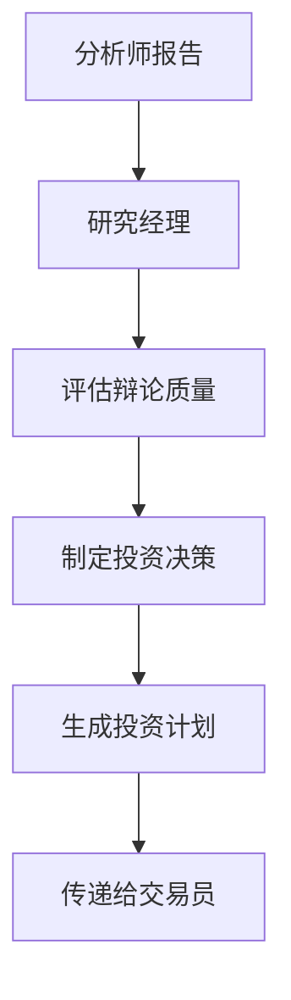
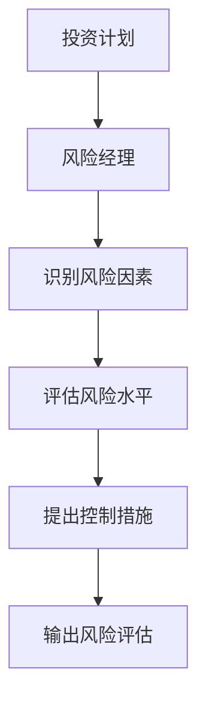
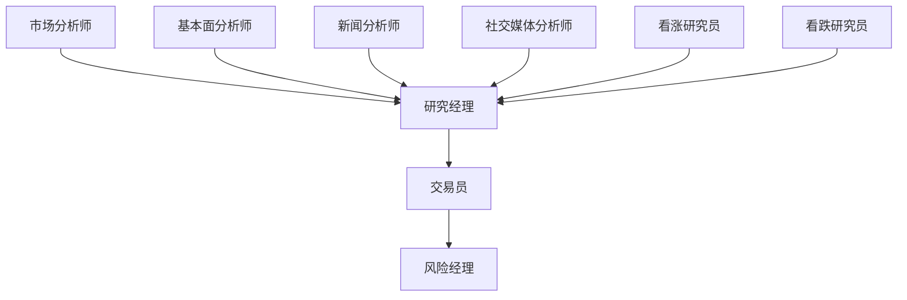

# 智能体角色与职责

<cite>
**本文档引用的文件**   
- [analysts.md](file://docs/agents/v0.1.13/analysts.md)
- [managers.md](file://docs/agents/v0.1.13/managers.md)
- [researchers.md](file://docs/agents/v0.1.13/researchers.md)
- [risk-management.md](file://docs/agents/v0.1.13/risk-management.md)
- [trader.md](file://docs/agents/v0.1.13/trader.md)
- [agent_states.py](file://tradingagents/agents/utils/agent_states.py)
- [fundamentals_analyst.py](file://tradingagents/agents/analysts/fundamentals_analyst.py)
- [market_analyst.py](file://tradingagents/agents/analysts/market_analyst.py)
- [news_analyst.py](file://tradingagents/agents/analysts/news_analyst.py)
- [social_media_analyst.py](file://tradingagents/agents/analysts/social_media_analyst.py)
- [research_manager.py](file://tradingagents/agents/managers/research_manager.py)
- [risk_manager.py](file://tradingagents/agents/managers/risk_manager.py)
- [bull_researcher.py](file://tradingagents/agents/researchers/bull_researcher.py)
- [bear_researcher.py](file://tradingagents/agents/researchers/bear_researcher.py)
- [conservative_debator.py](file://tradingagents/agents/risk_mgmt/conservative_debator.py)
- [trader.py](file://tradingagents/agents/trader/trader.py)
</cite>

## 目录
1. [智能体系统概述](#智能体系统概述)
2. [专业分析师角色](#专业分析师角色)
3. [研究经理的协调作用](#研究经理的协调作用)
4. [风险经理的评估作用](#风险经理的评估作用)
5. [智能体状态管理机制](#智能体状态管理机制)
6. [智能体输入输出数据格式](#智能体输入输出数据格式)
7. [智能体间依赖关系](#智能体间依赖关系)
8. [职责分工表](#职责分工表)

## 智能体系统概述

智能体系统是 TradingAgents 框架的核心，通过多智能体协作完成从数据收集到投资决策的完整流程。系统采用分层架构，由专业分析师、研究员、研究经理、交易员和风险经理等不同角色的智能体组成，每个智能体都有明确的职责和专业领域。

系统通过 `AgentState` 对象在智能体之间传递信息和状态，确保数据的完整性和一致性。整个决策流程分为四个主要阶段：数据收集与分析、研究辩论、决策制定和风险管理。这种结构化的协作方式确保了投资决策的全面性和客观性。

**Section sources**
- [analysts.md](file://docs/agents/v0.1.13/analysts.md)
- [managers.md](file://docs/agents/v0.1.13/managers.md)
- [agent_states.py](file://tradingagents/agents/utils/agent_states.py)

## 专业分析师角色

专业分析师团队负责从不同维度对股票进行专业分析，为后续的研究和决策提供基础数据支持。团队由市场分析师、基本面分析师、新闻分析师和社交媒体分析师组成，每个分析师都专注于特定的分析领域。

### 市场分析师

市场分析师专注于技术指标和价格趋势分析，其核心职责包括：
- 进行技术指标分析（如RSI、MACD、布林带等）
- 识别价格趋势和图表模式
- 分析支撑位和阻力位
- 生成交易信号

市场分析师通过 `market_report` 字段向系统输出分析结果，为投资决策提供技术面支持。

**Section sources**
- [analysts.md](file://docs/agents/v0.1.13/analysts.md#85-市场分析师-market-analyst)
- [market_analyst.py](file://tradingagents/agents/analysts/market_analyst.py)

### 基本面分析师

基本面分析师专注于公司财务数据和基本面指标分析，其核心职责包括：
- 分析公司财务报表和关键财务指标
- 评估公司估值和财务健康状况
- 提供基于财务数据的投资建议
- 支持A股、港股、美股等多市场分析

基本面分析师通过 `fundamentals_report` 字段向系统输出分析结果，为投资决策提供价值投资依据。

**Section sources**
- [analysts.md](file://docs/agents/v0.1.13/analysts.md#44-基本面分析师-fundamentals-analyst)
- [fundamentals_analyst.py](file://tradingagents/agents/analysts/fundamentals_analyst.py)

### 新闻分析师

新闻分析师专注于新闻事件和宏观环境分析，其核心职责包括：
- 分析新闻事件对股价的影响
- 解读宏观经济数据和政策变化
- 评估行业动态和竞争格局
- 识别潜在的催化因素和风险事件

新闻分析师通过 `news_report` 字段向系统输出分析结果，为投资决策提供外部环境视角。

**Section sources**
- [analysts.md](file://docs/agents/v0.1.13/analysts.md#101-新闻分析师-news-analyst)
- [news_analyst.py](file://tradingagents/agents/analysts/news_analyst.py)

### 社交媒体分析师

社交媒体分析师专注于投资者情绪和舆论趋势分析，其核心职责包括：
- 分析社交媒体上的投资者情绪
- 监测市场舆论和热点话题
- 评估市场情绪对股价的影响
- 识别潜在的市场情绪转折点

社交媒体分析师通过 `sentiment_report` 字段向系统输出分析结果，为投资决策提供市场情绪视角。

**Section sources**
- [analysts.md](file://docs/agents/v0.1.13/analysts.md#122-社交媒体分析师-social-media-analyst)
- [social_media_analyst.py](file://tradingagents/agents/analysts/social_media_analyst.py)

## 研究经理的协调作用

研究经理作为投资组合经理和辩论主持人，在智能体系统中扮演着关键的协调者角色。其主要职责是调度各分析师的工作，整合分析结果，并基于辩论结果做出明确的投资决策。

### 工作流程

研究经理的工作流程包括：
1. **信息收集**：收集各专业分析师的分析报告，包括基本面报告、市场分析报告、新闻分析报告和情绪分析报告。
2. **辩论评估**：评估看涨和看跌研究员的辩论质量和论证强度，识别关键投资观点和风险因素。
3. **决策制定**：基于综合分析做出明确的投资决策（买入/卖出/持有），并制定详细的投资计划和执行策略。
4. **计划输出**：生成包含目标价格、时间框架和风险控制措施的详细投资计划。

### 协调机制

研究经理通过 `investment_plan` 字段向系统输出投资计划，该计划包含了对投资组合的详细指导。研究经理还负责维护 `investment_debate_state` 状态，跟踪辩论的进展和结果。



**Diagram sources **
- [managers.md](file://docs/agents/v0.1.13/managers.md#48-研究经理-research-manager)
- [research_manager.py](file://tradingagents/agents/managers/research_manager.py)

**Section sources**
- [managers.md](file://docs/agents/v0.1.13/managers.md#48-研究经理-research-manager)
- [research_manager.py](file://tradingagents/agents/managers/research_manager.py)

## 风险经理的评估作用

风险经理在投资决策过程中扮演着重要的评估和控制角色，其主要职责是监控整体风险敞口，评估投资决策的风险水平，并提供风险管理建议。

### 风险评估维度

风险经理从多个维度评估投资风险：
- **市场风险**：评估系统性风险、行业周期风险和公司特定风险
- **流动性风险**：分析市场流动性和资金流动性
- **信用风险**：评估财务风险和运营风险
- **估值风险**：分析估值方法风险和市场估值风险

### 风险管理流程

风险经理的工作流程包括：
1. **风险识别**：识别投资决策中的潜在风险因素
2. **风险评估**：量化风险水平，评估最坏情况下的损失
3. **控制建议**：提出风险控制措施和替代方案
4. **应急预案**：制定风险事件应对预案

风险经理通过 `risk_debate_state` 状态跟踪风险管理辩论的进展，并通过 `final_trade_decision` 字段输出最终的风险评估结果。



**Diagram sources **
- [managers.md](file://docs/agents/v0.1.13/managers.md#196-风险经理-risk-manager)
- [risk_manager.py](file://tradingagents/agents/managers/risk_manager.py)

**Section sources**
- [managers.md](file://docs/agents/v0.1.13/managers.md#196-风险经理-risk-manager)
- [risk_manager.py](file://tradingagents/agents/managers/risk_manager.py)

## 智能体状态管理机制

智能体系统通过 `AgentState` 类实现统一的状态管理，确保各智能体之间的信息传递和状态同步。`AgentState` 继承自 LangGraph 的 `MessagesState`，包含了整个决策流程所需的所有状态信息。

### 状态结构

`AgentState` 的主要字段包括：
- **基础信息**：`company_of_interest`（目标公司股票代码）和 `trade_date`（交易日期）
- **分析师报告**：`market_report`、`sentiment_report`、`news_report` 和 `fundamentals_report`
- **研究和决策**：`investment_debate_state`、`investment_plan` 和 `trader_investment_plan`
- **风险管理**：`risk_debate_state` 和 `final_trade_decision`

### 状态流转

智能体系统通过状态流转实现协作：
1. **初始状态**：系统初始化 `AgentState`，设置目标公司和交易日期
2. **分析中状态**：各专业分析师依次更新相应的报告字段
3. **辩论状态**：研究员团队更新 `investment_debate_state`
4. **决策状态**：研究经理生成 `investment_plan`
5. **完成状态**：风险经理输出 `final_trade_decision`


**Diagram sources **
- [agent_states.py](file://tradingagents/agents/utils/agent_states.py)
- [agent-architecture.md](file://docs/architecture/v0.1.13/agent-architecture.md#78-agentstate-核心状态类)

**Section sources**
- [agent_states.py](file://tradingagents/agents/utils/agent_states.py)
- [agent-architecture.md](file://docs/architecture/v0.1.13/agent-architecture.md#78-agentstate-核心状态类)

## 智能体输入输出数据格式

智能体系统通过标准化的输入输出格式实现各智能体之间的数据交换。每个智能体都有明确的输入要求和输出规范。

### 输入数据格式

各智能体的输入数据主要包括：
- **基础信息**：`company_of_interest`（股票代码）和 `trade_date`（交易日期）
- **分析报告**：来自其他智能体的分析结果，如 `market_report`、`fundamentals_report` 等
- **状态信息**：当前的辩论状态和决策状态

### 输出数据格式

各智能体的输出数据格式如下：

#### 分析师输出
```python
{
    "market_report": "市场分析报告内容",
    "sentiment_report": "情绪分析报告内容", 
    "news_report": "新闻分析报告内容",
    "fundamentals_report": "基本面分析报告内容"
}
```

#### 研究经理输出
```python
{
    "investment_plan": "详细的投资计划",
    "investment_debate_state": {
        "bull_history": "看涨方辩论历史",
        "bear_history": "看跌方辩论历史", 
        "judge_decision": "最终决策"
    }
}
```

#### 交易员输出
```python
{
    "trader_investment_plan": "交易员投资计划",
    "messages": [LLM消息列表]
}
```

#### 风险经理输出
```python
{
    "final_trade_decision": "最终交易决策",
    "risk_debate_state": {
        "risky_history": "激进方辩论历史",
        "safe_history": "保守方辩论历史",
        "judge_decision": "风险评估决策"
    }
}
```

**Section sources**
- [analysts.md](file://docs/agents/v0.1.13/analysts.md#29-智能体状态管理)
- [managers.md](file://docs/agents/v0.1.13/managers.md#29-智能体状态管理)
- [researchers.md](file://docs/agents/v0.1.13/researchers.md#29-智能体状态管理)
- [risk-management.md](file://docs/agents/v0.1.13/risk-management.md#29-智能体状态管理)
- [trader.md](file://docs/agents/v0.1.13/trader.md#29-智能体状态管理)

## 智能体间依赖关系

智能体系统中的各智能体存在明确的依赖关系，形成了一个有序的协作网络。这种依赖关系确保了决策流程的逻辑性和完整性。

### 依赖关系图



### 依赖关系说明

- **专业分析师 → 研究经理**：研究经理依赖各专业分析师提供的分析报告来做出投资决策
- **研究经理 → 交易员**：交易员依赖研究经理生成的投资计划来制定具体的交易策略
- **交易员 → 风险经理**：风险经理依赖交易员的投资计划来评估和控制风险
- **研究员 → 研究经理**：研究经理依赖研究员团队的辩论结果来完善投资决策

这种依赖关系形成了一个从数据收集到风险控制的完整决策链条，确保了投资决策的质量和安全性。

**Diagram sources **
- [analysts.md](file://docs/agents/v0.1.13/analysts.md#222-分析执行阶段)
- [researchers.md](file://docs/agents/v0.1.13/researchers.md#137-辩论流程)

**Section sources**
- [analysts.md](file://docs/agents/v0.1.13/analysts.md#222-分析执行阶段)
- [researchers.md](file://docs/agents/v0.1.13/researchers.md#137-辩论流程)

## 职责分工表

| 智能体角色 | 专业领域 | 分析重点 | 输出结果 | 依赖关系 |
| :--- | :--- | :--- | :--- | :--- |
| **市场分析师** | 技术分析 | 价格趋势、技术指标、交易信号 | `market_report` | 依赖股票代码和交易日期 |
| **基本面分析师** | 财务分析 | 财务数据、估值指标、财务健康 | `fundamentals_report` | 依赖股票代码和交易日期 |
| **新闻分析师** | 宏观分析 | 新闻事件、政策变化、行业动态 | `news_report` | 依赖股票代码和交易日期 |
| **社交媒体分析师** | 情绪分析 | 投资者情绪、舆论趋势、热点话题 | `sentiment_report` | 依赖股票代码和交易日期 |
| **看涨研究员** | 机会识别 | 增长潜力、估值优势、催化因素 | `bull_argument` | 依赖各分析师报告 |
| **看跌研究员** | 风险识别 | 风险因素、估值风险、财务问题 | `bear_argument` | 依赖各分析师报告 |
| **研究经理** | 决策协调 | 综合评估、投资决策、执行计划 | `investment_plan` | 依赖研究员辩论结果 |
| **交易员** | 交易执行 | 目标价位、置信度、风险评分 | `trader_investment_plan` | 依赖投资计划 |
| **风险经理** | 风险评估 | 风险识别、控制措施、应急预案 | `final_trade_decision` | 依赖交易员计划 |

**Section sources**
- [analysts.md](file://docs/agents/v0.1.13/analysts.md)
- [researchers.md](file://docs/agents/v0.1.13/researchers.md)
- [managers.md](file://docs/agents/v0.1.13/managers.md)
- [risk-management.md](file://docs/agents/v0.1.13/risk-management.md)
- [trader.md](file://docs/agents/v0.1.13/trader.md)